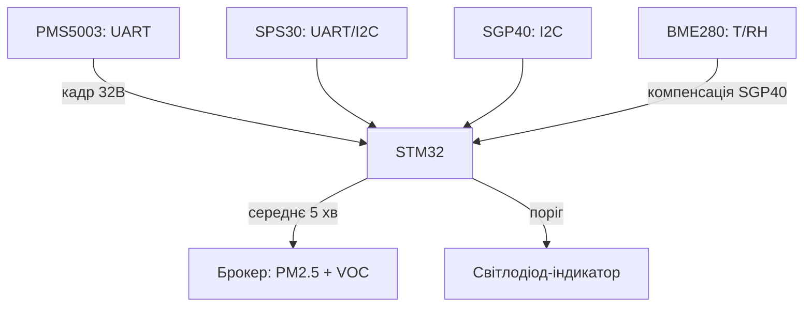

# STM32 і якість повітря - пил PMS5003/SPS30 та VOC SGP40

![[assets/img/stm32-air-quality-scheme.png|600]]
*Рис. Лазерний лічильник пилу PMS5003 по UART плюс цифрові SPS30/SGP40 по I2C - повний пост якості повітря.*

> [!tip] Що це за нота
> Рідкісний, але затребуваний клас сенсорів: PM2.5/PM10 і VOC-індекс - те, чого немає в базових BME/MQ-наборах. Три перевірені модулі з різними інтерфейсами. База: [[10-Sensori/07-CO2-SCD-MHZ|CO2-датчики]], [[10-Sensori/08-Light-BH-TSL|світло]], [[04-Shini/01-UART|UART-шина STM32]].

## 1. Мета

Побудувати домашній пост моніторингу повітря на STM32:

- PM1.0/PM2.5/PM10 у мкг/м3 - PMS5003 або SPS30;
- VOC-індекс і сирий етанол/водень - SGP40;
- пороги ВООЗ: PM2.5 > 15 мкг/м3 (річна норма) - алерт;
- усереднення 5 хвилин, відправка по [[12-Moduli-zvyazku/06-WiFi-ESP-AT|WiFi-модему]].

| Датчик | Що міряє | Інтерфейс | Ціна/складність |
| --- | --- | --- | --- |
| PMS5003 | PM1/2.5/10, частинки 0.3-10 мкм | UART 9600, кадр 32 байти | дешевий, вентилятор |
| SPS30 | PM1/2.5/4/10, bins 0.3-10 мкм | UART або I2C | точніший, автопочистка |
| SGP40 | VOC-індекс 0-500, RH/T-компенсація | I2C 0x59 | потребує SHT-даних |

## 2. Архітектура



SGP40 без температури/вологості бреше: алгоритм компенсації вимагає RH/T з BME280 кожен цикл. PMS5003 і SPS30 самодостатні.

## 3. PMS5003: лазерний лічильник

- кадр: `42 4D` + довжина + 12 значень PM + резерв + контрольна сума;
- пасивний режим: `42 4D E1 00 00 01 70 3F` - спить, читаємо командою;
- активний режим - вентилятор крутиться постійно, ресурс ~8000 годин;
- для домашнього поста: будити раз на 5 хвилин, перші 30 с дані викидати (прогрів потоку);
- контрольна сума - сума всіх байтів, перевіряємо завжди.

## 4. SPS30: bins і автопочистка

- UART-протокол SHDLC або простий UART, або I2C 0x69;
- старт вимірювання, потім читаємо measured values: mass PM1/2.5/4/10 + number bins;
- автопочистка вентилятором раз на тиждень - плануємо командою;
- точність вище за PMS5003, ціна теж;
- sleep-команда між циклами - немає зносу вентилятора.

## 5. Робочий код HAL

```c
int pms_read(uint16_t *pm25, uint16_t *pm10) {
  uint8_t f[32];
  if (HAL_UART_Receive(&huart2, f, 32, 2000) != HAL_OK) return -1;
  if (f[0] != 0x42 || f[1] != 0x4D) return -2;
  uint16_t sum = 0;
  for (int i = 0; i < 30; i++) sum += f[i];
  if (((sum >> 8) != f[30]) || ((sum & 0xFF) != f[31])) return -3;
  *pm25 = (f[12] << 8) | f[13];
  *pm10 = (f[14] << 8) | f[15];
  return 0;
}

int sgp_measure(uint16_t rh_ticks, uint16_t t_ticks, uint16_t *voc) {
  uint8_t cmd[8] = {0x26, 0x0F, 0, 0, 0, 0, 0, 0};
  cmd[2] = rh_ticks >> 8; cmd[3] = rh_ticks & 0xFF;
  cmd[5] = t_ticks >> 8; cmd[6] = t_ticks & 0xFF;
  cmd[4] = sgp_crc(cmd+2, 2); cmd[7] = sgp_crc(cmd+5, 2);
  HAL_I2C_Master_Transmit(&hi2c1, 0xB2, cmd, 8, 100);
  HAL_Delay(30);
  uint8_t out[3];
  HAL_I2C_Master_Receive(&hi2c1, 0xB2, out, 3, 100);
  if (out[2] != sgp_crc(out, 2)) return -1;
  *voc = (out[0] << 8) | out[1];
  return 0;
}
```

CRC-8 SGP40: поліном 0x31, init 0xFF - пишемо `sgp_crc` окремо:

```c
uint8_t sgp_crc(uint8_t *data, uint8_t len) {
  uint8_t crc = 0xFF;
  for (uint8_t i = 0; i < len; i++) {
    crc ^= data[i];
    for (uint8_t b = 0; b < 8; b++) {
      crc = (crc & 0x80) ? (crc << 1) ^ 0x31 : crc << 1;
    }
  }
  return crc;
}
```

Тіки для SGP40: відносна вологість у тіках = RH% × 65535 / 100, температура = (T + 45) × 65535 / 175. Рахуємо з BME280 кожен цикл.

## 6. Інтерпретація даних

| PM2.5, мкг/м3 | Рівень | Дія |
| --- | --- | --- |
| 0-12 | добре | нічого |
| 12-35 | помірно | провітрити |
| 35-55 | чутливим погано | фільтр/очищувач |
| 55+ | погано | алерт, закрити вікна |

VOC-індекс SGP40: 100 - середнє чисте повітря, <100 чистіше, >100 гірше, шкала 0-500. Це відносний індекс, не ppm - пояснюємо в інтерфейсі.

## 7. Розміщення і потік

- забір повітря PMS/SPS - назовні або біля вікна, не над плитою;
- SGP40 - всередині кімнати, подалі від кухні і спиртовмісних засобів;
- корпус з жалюзі, датчики вертикально (вентилятор PMS дме вгору);
- перші 24 години - прогін (burn-in), дані не публікуємо;
- звірка: два однакові датчики поруч тиждень, розбіжність PM2.5 до 20 % - норма хобі-класу.

## 8. Типові помилки

| Симптом | Причина | Лікування |
| --- | --- | --- |
| PMS шле нулі | модуль у пасивному режимі | команда читання або активний режим |
| Контрольна сума не сходиться | зсув кадру після рестарту | шукати заголовок 42 4D, ресинхронізація |
| SGP40 завжди 100 | немає RH/T-компенсації | підключити BME280, слати тіки щосекунди |
| PM2.5 стрибає в 10 разів | вентилятор забився пилом | автопочистка SPS30, продувка PMS |
| Дані «пиляють» вночі | волога/туман рахується як PM | фільтр вологості: RH > 85 % - позначати дані сумнівними |
| I2C вісить після SGP40 | clock-stretching на повільній шині | 100 кГц, підтяжки 4.7 кОм, таймаути HAL |

## 9. Суміжні ноти

- [[10-Sensori/07-CO2-SCD-MHZ|CO2-датчики]] - другий стовп якості повітря.
- [[10-Sensori/02-BME280-SHT3x|BME280 і вологість]] - компенсація для SGP40.
- [[10-Sensori/10-MQ-Gas|газові MQ-датчики]] - дешева альтернатива VOC.
- [[04-Shini/03-I2C|шина I2C]] - адреси, підтяжки, clock-stretching.
- [[16-Proekti/01-Meteostantsiya|метеостанція]] - куди вбудувати пост.

## Офіційні джерела

- [PMS5003/7003 (AQICN Sensor Guide)](https://www.aqicn.org/sensor/pms5003-7003/) - формат кадру, контрольна сума.
- [SPS30 (Sensirion)](https://sensirion.com/products/catalog/SPS30/) - bins, автопочистка, SHDLC.
- [SGP40 (Sensirion)](https://sensirion.com/products/catalog/SGP40/) - VOC-індекс, компенсація RH/T.
- [arduino-sps (Sensirion, GitHub)](https://github.com/Sensirion/arduino-sps) - еталонна математика драйвера.
