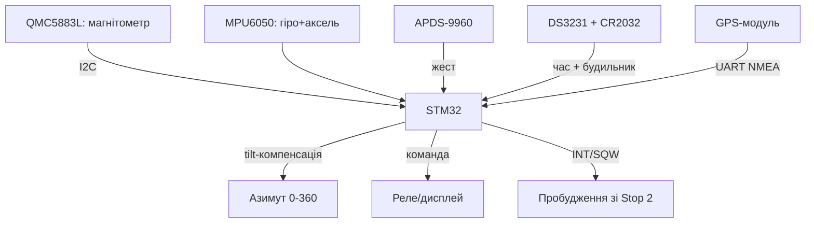

# STM32 і рідкісні сенсори - магнітометр QMC5883L, жести APDS-9960, RTC DS3231

![[assets/img/stm32-mag-gesture-rtc-scheme.png|600]]
*Рис. Рідкісна трійця: QMC5883L дає азимут, APDS-9960 читає жести, DS3231 тримає час з батарейкою.*

> [!tip] Що це за нота
> Сенсори, які шукають довго: цифровий компас для робота і дрона, безконтактні жести для панелі, точний час для логера. Плюс зв'язка з гіроскопом/акселерометром у 9-DOF. База: [[10-Sensori/03-MPU6050-IMU|гіроскоп і акселерометр]], [[12-Moduli-zvyazku/03-GPS-GSM|GPS-модулі]], [[10-Sensori/11-Encoder|енкодери]].

## 1. Мета

Дати STM32 три рідкісні виміри з готовими модулями:

- азимут 0-360° з нахиловою компенсацією - QMC5883L + акселерометр;
- жести вгору/вниз/вліво/вправо і колір - APDS-9960;
- час ±2 ppm з батарейкою CR2032 - DS3231;
- разом з MPU6050 і GPS - повна навігаційна зв'язка 9-DOF + координати.

| Сенсор | Шина/адреса | Що видає |
| --- | --- | --- |
| QMC5883L | I2C 0x0D | X/Y/Z магнітного поля, 16 біт |
| APDS-9960 | I2C 0x39 | жести, RGB, proximity, ALS |
| DS3231 | I2C 0x68 | час, 2 будильники, температура |
| MPU6050 (є) | I2C 0x68/0x69 | гіроскоп + акселерометр |
| GPS NEO (є) | UART | координати, PPS |

Увага: MPU6050 (AD0=HIGH) і DS3231 обидва сідають на 0x68 - розводимо AD0 в LOW (0x68) а DS3231 лишаємо, або навпаки. Конфлікт адрес вирішуємо до пайки.

## 2. Архітектура



Азимут без компенсації нахилу бреше до 30°: беремо крен/тангаж з акселерометра і повертаємо вектор поля. Жести - для керування без дотику (чисті руки в майстерні).

## 3. QMC5883L: цифровий компас

- діапазон ±8 Гаусс, 16 біт, до 200 Гц;
- режими: standby → continuous, oversampling 512;
- калібрування hard-iron: крутимо плату вісімкою 30 с, знімаємо зсуви min/max по осях;
- soft-iron (масштаб еліпса) - для хобі вистачає hard-iron;
- формула азимута: `atan2(-Y, X)` після компенсації, далі магнітне схилення місцевості;
- тримати подалі від моторів і сталевих гвинтів - або виносити на щоглі.

## 4. APDS-9960: жести, колір, близькість

- жестовий рушій: 4 фотодіоди U/D/L/R, переривання по жесту;
- чутливість і час вікна - регістри GPENTH/GEXTH, підбираємо під відстань 5-20 см;
- RGB + ALS - колір об'єкта і освітленість для підсвітки;
- proximity - будити дисплей підходом руки;
- скло над сенсором - тільки прозоре в ІЧ, тоноване вбиває жести.

## 5. Робочий код HAL

```c
float qmc_heading_deg(int16_t mx, int16_t my, float roll, float pitch) {
  float x = mx * cosf(pitch) + my * sinf(roll) * sinf(pitch);
  float y = my * cosf(roll);
  float h = atan2f(-y, x) * 57.2958f;
  if (h < 0) h += 360.0f;
  return h + MAG_DECL_DEG;
}

uint8_t apds_read_gesture(void) {
  uint8_t reg = 0xFC;
  uint8_t g = 0;
  HAL_I2C_Master_Transmit(&hi2c1, 0x72, &reg, 1, 50);
  HAL_I2C_Master_Receive(&hi2c1, 0x72, &g, 1, 50);
  return g;
}

void ds3231_get_time(uint8_t *h, uint8_t *m, uint8_t *s) {
  uint8_t reg = 0x00, b[3];
  HAL_I2C_Master_Transmit(&hi2c1, 0xD0, &reg, 1, 50);
  HAL_I2C_Master_Receive(&hi2c1, 0xD0, b, 3, 50);
  *s = (b[0] >> 4) * 10 + (b[0] & 0x0F);
  *m = (b[1] >> 4) * 10 + (b[1] & 0x0F);
  *h = ((b[2] >> 4) & 0x03) * 10 + (b[2] & 0x0F);
}
```

DS3231 зберігає час у BCD - розпаковуємо старшу/молодшу тетради. Будильник Alarm1 - на секунду, ведемо INT/SQW на EXTI для пробудження.

## 6. Зв'язка 9-DOF + GPS

- акселерометр дає крен/тангаж у статиці, гіроскоп - швидкі повороти, магнітометр - абсолютний курс;
- комплементарний фільтр: кут = 0.98 × (кут + гіро×dt) + 0.02 × аксель;
- GPS дає координати і швидкість, PPS - точну секунду для RTC-підстройки;
- для дрона ця зв'язка живе в [[16-Proekti/06-Drone-FC|польотному контролері]];
- логування: час DS3231 + координати + курс - повний трек без телефона.

## 7. Калібрування компаса

| Крок | Дія | Критерій |
| --- | --- | --- |
| 1 | Вісімка платою 30 с, пишемо min/max | розкид по X/Y більше 200 одиниць |
| 2 | Зсув = (max+min)/2, віднімаємо | центр хмари в нулі |
| 3 | Перевірка: 4 сторони світу | помилка до 5° |
| 4 | Магнітне схилення місцевості | додаємо константу (Київ ~+7°) |
| 5 | Перевірка біля мотора | винести модуль, якщо зсув > 10° |
| 6 | Звірка з GPS-курсом у русі | розбіжність до 8° - норма |
| 7 | Повтор раз на пів року | магніти поруч розмагнічують зсув |

> [!warning] Залізо поруч із компасом
> Гвинти, мотори і динаміки - джерела hard-iron зсуву. Калібруємо у фінальному корпусі: будь-яка перестановка потребує нової вісімки.

## 7.1 Швидка перевірка зв'язки на столі

- QMC5883L: крутимо плату, X/Y малюють коло в плоттері - живе.
- APDS-9960: ведемо долонею на 10 см, лічильник жестів росте.
- DS3231: знімаємо живлення на хвилину, час не скинувся - батарейка ок.
- Усе разом: азимут + жест «вправо» + мітка часу в одному пакеті MQTT.

## 8. Типові помилки

| Симптом | Причина | Лікування |
| --- | --- | --- |
| QMC5883L не відповідає | адреса 0x0D vs 0x1A у клонів | сканер I2C, спробувати обидві |
| Азимут пливе при нахилі | немає tilt-компенсації | додати крен/тангаж з акселерометра |
| APDS-9960 бачить фантоми | ІЧ-засвітлення від ламп | знизити чутливість, шторка, темне скло |
| Жести спрацьовують самі | proximity-поріг низький | підняти поріг, вікно жесту 100-200 мс |
| DS3231 скидається | сіла CR2032 або немає батарейки | замінити, перевірити 3V на BAT-пині |
| Конфлікт 0x68 на шині | MPU6050 і DS3231 разом | AD0 MPU в LOW (0x68) або HIGH (0x69) |

## 9. Суміжні ноти

- [[10-Sensori/03-MPU6050-IMU|гіроскоп і акселерометр]] - друга половина 9-DOF.
- [[12-Moduli-zvyazku/03-GPS-GSM|GPS-модулі]] - координати і PPS.
- [[10-Sensori/08-Light-BH-TSL|датчики світла]] - ALS-частина APDS.
- [[07-Timeri-Son/02-LPTIM-RTC-WDT|LPTIM, RTC, WDT]] - вбудований RTC проти DS3231.
- [[16-Proekti/06-Drone-FC|польотний контролер]] - де живе вся зв'язка.

## Офіційні джерела

- [Triple-axis Magnetometer QMC5883L (SparkFun)](https://www.sparkfun.com/products/17470) - регістри, режими, калібрування.
- [APDS-9960 Breakout (Adafruit)](https://www.adafruit.com/product/3595) - жести, RGB, proximity.
- [DS3231 Precision RTC (Adafruit)](https://www.adafruit.com/product/3013) - BCD, будильники, батарейка.
- [Adafruit APDS9960 (Adafruit, GitHub)](https://github.com/adafruit/Adafruit_APDS9960) - еталонний драйвер жестів.
- [NEO-6 series (u-blox)](https://www.u-blox.com/en/product/neo-6-series) - GPS-модулі для навігаційної зв'язки, NMEA, PPS.
