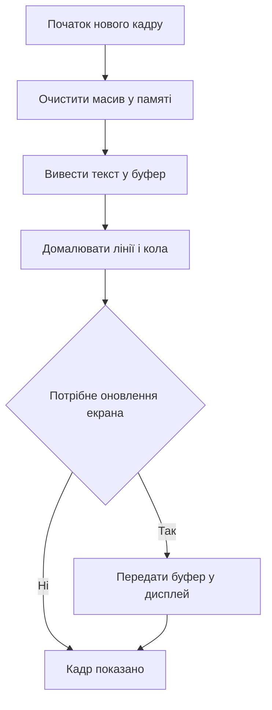

# OLED SSD1306 - текст і графіка по I2C

![[assets/img/stm32-oled-ssd1306-scheme.png|600]]
*Рис. Підключення дисплея OLED до контролера через шину даних і живлення.*

> [!tip] Призначення ноти
> Дати повний мінімум для виведення тексту і графіки на малий екран без зовнішньої памяті кадрів.

## 1. Призначення

Малий монохромний екран на контролері SSD1306 - стандарт для налагодження і індикації. Роздільна здатність типово 128 на 64 точки. Підключення через шину даних або через швидкий послідовний канал. Живлення логіки 3.3 В. Вбудований генератор високої напруги для органічних світлодіодів. Контраст керується програмно. Яскравість достатня для приміщень. Для вулиці потрібен захисний козирок. Ресурс обмежений вигоранням пікселів. Статичні картинки залишають слід. Динамічний інтерфейс живе довше.

## 2. Пам'ять GDDRAM і сторінки

Контролер має власну пам'ять кадрів на 1 КБ. Екран поділений на вісім сторінок по вісім рядків. Кожен байт керує вертикальним стовпчиком з восьми точок. Молодший біт верхній. Координата по горизонталі від нуля до 127. Координата по вертикалі від нуля до 63. Номер сторінки від нуля до семи. Адресація буває горизонтальна і посторінкова. Для тексту зручна посторінкова. Для графіки зручна горизонтальна. Після запису вказівник рухається сам. Повний кадр передається одним пакетом.

| Параметр | Значення | Пояснення |
| --- | --- | --- |
| Роздільна здатність | 128 на 64 точки | Стандартний модуль |
| Пам'ять кадрів | 1024 байти | Вісім сторінок по 128 байтів |
| Сторінка | 8 рядків пікселів | Нуль це верх екрана |
| Байт даних | 8 вертикальних точок | Молодший біт угорі |
| Адресація | Горизонтальна і посторінкова | Налаштовується командою |
| Живлення логіки | 3.3 В | Сумісне з контролером |
| Адреса на шині | 0x3C або 0x3D | Залежить від виводу вибору |

## 3. Шина даних проти швидкого каналу

Шина даних потребує два дроти і підтяжки. Швидкість до 400 кГц стандартна. Повний кадр займає близько 20 мс. Цього досить для тексту і повільних меню. Швидкий канал потребує чотири дроти плюс лінія вибору і лінія даних команд. Швидкість у рази вища. Кадр оновлюється за кілька мілісекунд. Підходить для анімації і графіків. Вибір залежить від вільних виводів і задач.

| Ознака | Шина даних | Швидкий канал |
| --- | --- | --- |
| Дроти | Два плюс живлення | Пять плюс живлення |
| Швидкість кадру | Близько 50 кадрів немає | До сотні кадрів реально |
| Навантаження шин | Помірне | Високе але коротке |
| Вільні виводи | Економить виводи | Потребує більше виводів |
| Анімація | Слабка | Добра |
| Рекомендація | Текст і меню | Графіки і індикатори |

## 4. Буфер кадру в памяті контролера

Оперативна пам'ять контролера обмежена. Буфер на 1 КБ займає значну частку малих чипів. У чипі з 20 КБ це пять відсотків. У чипі з 4 КБ це чверть памяті. Тому інколи малюють без буфера прямим записом. Але буфер спрощує шрифти і накладання. Малювання йде в масив у памяті. Потім масив цілком передається в екран. Подвійна буферизація не потрібна. Достатньо одного масиву і прапорця оновлення.

| Підхід | Пам'ять | Швидкість | Коли брати |
| --- | --- | --- | --- |
| Повний буфер 1 КБ | 1024 байти | Швидке малювання | Текст плюс графіка разом |
| Без буфера | Нуль | Повільне позиціонування | Дуже малий чип |
| Часткове оновлення | 128 байтів | Середня | Один рядок статусу |
| Два буфери | 2048 байтів | Без мерехтіння | Анімація без розривів |

```text
Карта памяті екрана 128 на 64:
  Сторінка 0 : рядки пікселів 00..07 | байти 000..127
  Сторінка 1 : рядки пікселів 08..15 | байти 128..255
  Сторінка 2 : рядки пікселів 16..23 | байти 256..383
  Сторінка 3 : рядки пікселів 24..31 | байти 384..511
  Сторінка 4 : рядки пікселів 32..39 | байти 512..639
  Сторінка 5 : рядки пікселів 40..47 | байти 640..767
  Сторінка 6 : рядки пікселів 48..55 | байти 768..895
  Сторінка 7 : рядки пікселів 56..63 | байти 896..1023
  Байт = 8 точок вертикально, молодший біт угорі
  Курсор сторінки рухається автоматично після байта
  Режими адресації: горизонтальний або посторінковий
```

## 5. Шрифти і графічні примітиви

Шрифт 5 на 7 плюс один проміжок дає 6 точок на символ. Рядок вміщує 21 символ. Екран вміщує 8 рядків таким шрифтом. Шрифт 3 на 5 дає більше символів але гірше читається. Кирилиця потребує власної таблиці. Латиниця є у всіх бібліотеках. Лінії малюють алгоритмом Брезенгема. Кола малюють симетрією восьми точок. Прямокутники це чотири лінії або заливка. Інверсія дає курсор і виділення.

| Елемент | Розмір | Застосування |
| --- | --- | --- |
| Шрифт малий | 3 на 5 точок | Службові рядки |
| Шрифт базовий | 5 на 7 точок | Основний текст |
| Шрифт великий | 11 на 18 точок | Заголовки і цифри |
| Лінія | Довільна | Сітки і осі графіків |
| Коло | Радіус у точках | Іконки і шкали |
| Заливка | Прямокутна область | Прогрес і фон |

## 6. Швидкість оновлення і яскравість

Повна передача кадру по шині даних триває близько 20 мс. Реально виходить 30 кадрів за секунду для тексту. Графіки оновлюють частково для економії часу. Яскравість задається командою контрасту. Максимальна яскравість прискорює вигорання. Середнє значення подовжує ресурс. Сон екрана вимикає генерацію напруги. Пробудження миттєве. Регулювання живлення окремо від контрасту не потрібне.

| Налаштування | Діапазон | Порада |
| --- | --- | --- |
| Контраст | 0..255 | Тримати 160..200 для кімнати |
| Мультиплекс | 63 для висоти 64 | Не змінювати без потреби |
| Зсув екрана | 0..63 | Нуль для стандартного модуля |
| Інверсія | Так або ні | Для курсору і аварій |
| Сон | Вимкнено або увімкнено | Вимикати при простої |
| Прокрутка | Апаратна | Для бігучого рядка |

## 7. Вигорання і ресурс

Органічні світлодіоди деградують від струму і часу. Статичні символи темніють нерівномірно. Через рік безперервної роботи видно тінь меню. Захист простий. Гасіть екран у простої. Зменшуйте яскравість. Рухайте заставку. Уникайте білого поля на весь екран. Чорний фон живе довше. Білий текст на чорному оптимальний. Контраст середній подвоює ресурс порівняно з максимумом.

## 8. Мінімальний драйвер на HAL

```c
#include "main.h"
#include "i2c.h"
#include <string.h>

#define OLED_ADDR   (0x3C << 1)
#define OLED_W      128
#define OLED_H      64
#define OLED_PAGES  8

static uint8_t oled_buf[1024];
extern I2C_HandleTypeDef hi2c1;

static void oled_cmd(uint8_t cmd)
{
  uint8_t d[2] = {0x00, cmd};
  HAL_I2C_Master_Transmit(&hi2c1, OLED_ADDR, d, 2, 100);
}

void oled_init(void)
{
  HAL_Delay(100);
  oled_cmd(0xAE);
  oled_cmd(0xD5); oled_cmd(0x80);
  oled_cmd(0xA8); oled_cmd(0x3F);
  oled_cmd(0xD3); oled_cmd(0x00);
  oled_cmd(0x40);
  oled_cmd(0x8D); oled_cmd(0x14);
  oled_cmd(0x20); oled_cmd(0x00);
  oled_cmd(0xA1);
  oled_cmd(0xC8);
  oled_cmd(0xDA); oled_cmd(0x12);
  oled_cmd(0x81); oled_cmd(0xCF);
  oled_cmd(0xD9); oled_cmd(0xF1);
  oled_cmd(0xDB); oled_cmd(0x40);
  oled_cmd(0xA4);
  oled_cmd(0xA6);
  oled_cmd(0xAF);
  memset(oled_buf, 0, sizeof(oled_buf));
}

void oled_setpos(uint8_t page, uint8_t col)
{
  oled_cmd((uint8_t)(0xB0 + page));
  oled_cmd((uint8_t)(0x00 + (col & 0x0F)));
  oled_cmd((uint8_t)(0x10 + (col >> 4)));
}

void oled_update(void)
{
  for (uint8_t p = 0; p < OLED_PAGES; p++)
  {
    oled_setpos(p, 0);
    uint8_t head = 0x40;
    HAL_I2C_Mem_Write(&hi2c1, OLED_ADDR, head,
      I2C_MEMADD_SIZE_8BIT, &oled_buf[p * 128], 128, 200);
  }
}

void oled_pixel(uint8_t x, uint8_t y, uint8_t on)
{
  if (x >= OLED_W || y >= OLED_H) return;
  uint16_t idx = (y / 8) * 128 + x;
  if (on) oled_buf[idx] |= (uint8_t)(1 << (y % 8));
  else    oled_buf[idx] &= (uint8_t)~(1 << (y % 8));
}

void oled_clear(void)
{
  memset(oled_buf, 0, sizeof(oled_buf));
  oled_update();
}
```

## 9. Послідовність виведення кадру



## Типові помилки

| # | Помилка | Чому погано | Як правильно |
| --- | --- | --- | --- |
| 1 | Немає підтяжок на шині даних | Лінії висять і обмін зривається | Два резистори 4.7 кОм до живлення |
| 2 | Неправильна адреса 0x78 замість 0x3C | Драйвер мовчить без відповіді | Зсув на біт читання дає 0x78 у восьми бітах |
| 3 | Малювання повз межі буфера | Псується сусідня пам'ять | Перевіряти координати у функції точки |
| 4 | Максимальний контраст завжди | Екран вигорає за місяці | Тримати середнє значення і сон |
| 5 | Оновлення кожного циклу без потреби | Шина зайнята і гальмує задачі | Прапорець змін і часткове оновлення |
| 6 | Кирилиця без своєї таблиці | Замість букв сміття | Додати таблицю гліфів і кодування |

## Офіційні джерела

- [SSD1306 datasheet (Solomon Systech)](https://www.adafruit.com/datasheets/SSD1306_1.0.pdf) - пам'ять кадрів, команди, сторінки і живлення.
- [STM32 I2C HAL manual (ST)](https://www.st.com/en/embedded-software/stm32cube-mcu-packages.html) - передача по шині, памяті і таймаути.

## Див. також

- [[Home]]
- [[04-Shini/03-I2C|шина I2C]]
- [[04-Shini/02-SPI|шина SPI]]
- [[09-Proshivka/02-HAL-LL|шари HAL і LL]]
- [[11-Vivid/02-TFT-LCD|кольоровий дисплей]]
- [[11-Vivid/03-Servo-Rele-MOSFET-WS2812|силові виходи і стрічки]]
