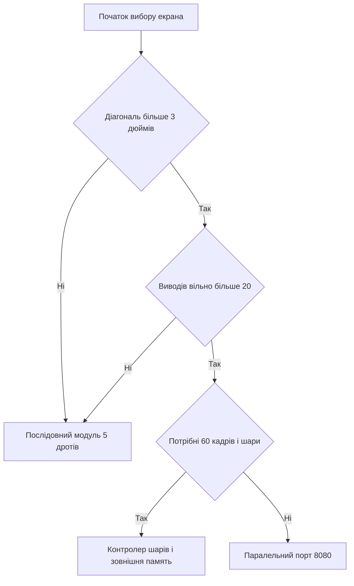

# TFT-дисплеї - SPI, FSMC і LTDC

![[assets/img/stm32-tft-lcd-scheme.png|600]]
*Рис. Варіанти підключення кольорової матриці до контролера і живлення підсвітки.*

> [!tip] Призначення ноти
> Показати три сходинки швидкості кольорового екрана від простого послідовного каналу до повного контролера шарів.

## 1. Призначення

Кольорова матриця потрібна там де важливі графіки і меню з іконками. Діагоналі від одного до семи дюймів. Роздільна здатність від 128 на 160 до 800 на 480. Глибина кольору типово 16 біт. Формат 565 дає швидкість і малу пам'ять. Контролери матриць ST7735 і ILI9341 масові і дешеві. Паралельна шина дає більше кадрів. Контролер шарів дає апаратні шари і прозорість. Вибір залежить від задач і вільних виводів. Живлення підсвітки окреме через ключ.

## 2. Контролери ST7735 і ILI9341

Обидва контролери розуміють послідовний канал і паралельний порт. Лінія вибору даних і команд вирішує що передаємо. Низький рівень означає команду. Високий рівень означає дані. Скидання окремим виводом при старті. Початковий скрипт налаштовує гаму і вікно. Без скрипта екран білий або смугастий. Швидкість послідовного каналу до десятків мегагерц. Кадр 320 на 240 у форматі 565 важить 150 КБ.

| Параметр | ST7735 | ILI9341 |
| --- | --- | --- |
| Діагональ типова | 1.8 дюйма | 2.4 і 2.8 дюйма |
| Точки | 128 на 160 | 240 на 320 |
| Інтерфейс | Послідовний і паралельний | Послідовний і паралельний |
| Глибина кольору | 12 і 16 біт | 16 і 18 біт |
| Кадр у памяті | Близько 40 КБ | Близько 150 КБ |
| Ціна модуля | Найнижча | Середня |
| Застосування | Датчики і годинники | Пульти і меню |

## 3. Послідовний канал плюс лінія вибору

Послідовний канал передає команди і дані одним потоком. Лінія вибору перемикається перед кожним пакетом. Передача кадру йде частинами по рядках. Прямий вивід без памяті гальмує програму. Канал з прямим доступом звільняє процесор. Процесор готує наступний рядок поки йде передача. Частота 20 МГц дає близько 10 кадрів для ILI9341. Для тексту і повільних шкал цього досить. Для відео потрібна паралельна шина.

| Сигнал | Вивід контролера | Призначення |
| --- | --- | --- |
| Такти | Тактовий вихід | Синхронізація бітів |
| Дані вихід | Вихід даних | Потік команд і пікселів |
| Вибір | Будь-який вихід | Кадр активний низьким рівнем |
| Дані команди | Будь-який вихід | Команда або дані |
| Скидання | Будь-який вихід | Апаратне скидання матриці |
| Підсвітка | ШІМ вихід | Яскравість через ключ |

```text
Звязки послідовного модуля ILI9341:
  Живлення логіки ......... 3.3 В від плати
  Земля ................... спільна з платою
  Вибір ................... PA4, активний низький
  Дані команди ............. PA6, нуль команда, одиниця дані
  Скидання ................. PA7, імпульс низького рівня
  Такти .................... PB3, до 20 МГц практично
  Дані ..................... PB5, молодший біт молодший
  Підсвітка ................ PA8 через ключ, ШІМ 1 кГц
  Сенсор окремо ............ чотири дроти того ж каналу
```

## 4. Прямий доступ і вивід кадру

Прямий доступ передає масив у канал без участі ядра. Режим памяті до периферії. Розмір даних півслова для формату 565. Інкремент памяті увімкнено. Переривання по завершенню перемикає буфер. Подвійний буфер прибирає розриви. Один буфер малюється поки інший передається. Пам'ять для двох кадрів ILI9341 це 300 КБ. Стільки є лише у старших чипів. Тому частіше передають смугами по 20 рядків. Смуга важить 15 КБ і доступна всім.

| Режим | Пам'ять смуги | Швидкість | Складність |
| --- | --- | --- | --- |
| Без прямого доступу | Нуль | Найнижча | Мінімальна |
| Смуга 20 рядків | 15 КБ | Середня | Помірна |
| Повний кадр | 150 КБ | Висока | Потрібен великий чип |
| Два кадри | 300 КБ | Без розривів | Тільки старші чипи |

## 5. Паралельний порт 8080 через FSMC

Паралельна шина 8080 має 8 або 16 ліній даних. Сигнали запису і читання окремі. Вибір матриці окремий. Лінія даних команд це молодший біт адреси. Контролер памяті відображає матрицю як дві адреси. Одна адреса для команд. Інша адреса для даних. Запис у пам'ять стає записом у матрицю. Швидкість у рази вища за послідовний канал. Ціна більше виводів і складніша плата. Для F1 і F4 це класичний шлях до швидкого меню.

| Сигнал 8080 | Лінія памяті | Пояснення |
| --- | --- | --- |
| Дані 0..15 | Лінії даних | Шина пікселів і команд |
| Вибір | Вибір банку | Активність матриці |
| Запис | Сигнал запису | Строб запису байта |
| Читання | Сигнал читання | Читання статусу матриці |
| Дані команди | Молодший біт адреси | Нуль команда, одиниця дані |
| Скидання | Вихід загального призначення | Стартовий імпульс |

## 6. Контролер шарів і зовнішня пам'ять

Контролер шарів формує синхронізацію для великої матриці. Сигнали рядкової і кадрової синхронізації. Такт пікселів до десятків мегагерц. Два шари з прозорістю і кольоровим ключем. Фон і меню без копіювання. Кадр зберігається у зовнішній динамічній памяті. Обсяг від 8 до 32 МБ. Шина даних 16 або 32 біти. На чипах F4 і H7 це шлях до 800 на 480. На малих чипах контролера шарів немає. Тоді лишаються послідовний канал і паралельна шина.

| Ознака | Послідовний канал | Паралельна шина | Контролер шарів |
| --- | --- | --- | --- |
| Виводи | Пять | Близько двадцяти | Близько тридцяти |
| Кадри ILI9341 | Близько 10 | Близько 30 | Не потрібен контролер матриці |
| Велика матриця | Ні | Важко | Так до 800 на 480 |
| Пам'ять кадру | У матриці | У матриці | Зовнішня динамічна |
| Ціна рішення | Найнижча | Середня | Найвища |
| Складність плати | Мінімальна | Середня | Чотиришарова бажана |

## 7. Сенсорний контролер XPT2046

Резистивний сенсор має чотири дроти. Контролер XPT2046 опитує координати по тому ж послідовному каналу. Окремий вибір для сенсора. Переривання дотику окремим виводом. Опитування у перериванні або періодично. Калібрування трьома точками по кутах. Фільтр середнім з пяти вимірів прибирає шум. Ємнісні матриці мають свій контролер по шині даних. Там готові координати і жести.

## 8. Порівняння швидкості ціни і виводів

| Варіант | Ціна модуля | Виводи | Кадри 320 на 240 | Ресурс програми |
| --- | --- | --- | --- | --- |
| ST7735 послідовний | Найнижча | Пять | Близько 30 | Малий |
| ILI9341 послідовний | Низька | Пять | Близько 10 | Середній |
| ILI9341 прямий доступ | Низька | Пять | Близько 20 | Середній плюс буфер |
| ILI9341 паралельний | Середня | Двадцять | Близько 30 | Середній |
| Матриця на контролері шарів | Висока | Тридцять | Шістдесят | Великий плюс пам'ять |

## 9. Код HAL для послідовної матриці

```c
#include "main.h"
#include "spi.h"

extern SPI_HandleTypeDef hspi1;
#define LCD_CS_GPIO   GPIOA
#define LCD_CS_PIN    GPIO_PIN_4
#define LCD_DC_GPIO   GPIOA
#define LCD_DC_PIN    GPIO_PIN_6
#define LCD_RST_GPIO  GPIOA
#define LCD_RST_PIN   GPIO_PIN_7

static void lcd_cs(uint8_t v)
{
  HAL_GPIO_WritePin(LCD_CS_GPIO, LCD_CS_PIN, v ? GPIO_PIN_SET : GPIO_PIN_RESET);
}

static void lcd_dc(uint8_t v)
{
  HAL_GPIO_WritePin(LCD_DC_GPIO, LCD_DC_PIN, v ? GPIO_PIN_SET : GPIO_PIN_RESET);
}

static void lcd_cmd(uint8_t c)
{
  lcd_dc(0); lcd_cs(0);
  HAL_SPI_Transmit(&hspi1, &c, 1, 100);
  lcd_cs(1);
}

static void lcd_data(uint8_t *p, uint16_t n)
{
  lcd_dc(1); lcd_cs(0);
  HAL_SPI_Transmit(&hspi1, p, n, 500);
  lcd_cs(1);
}

void lcd_reset(void)
{
  HAL_GPIO_WritePin(LCD_RST_GPIO, LCD_RST_PIN, GPIO_PIN_RESET);
  HAL_Delay(20);
  HAL_GPIO_WritePin(LCD_RST_GPIO, LCD_RST_PIN, GPIO_PIN_SET);
  HAL_Delay(120);
}

void lcd_window(uint16_t x0, uint16_t y0, uint16_t x1, uint16_t y1)
{
  uint8_t b[4];
  lcd_cmd(0x2A);
  b[0] = (uint8_t)(x0 >> 8); b[1] = (uint8_t)x0;
  b[2] = (uint8_t)(x1 >> 8); b[3] = (uint8_t)x1;
  lcd_data(b, 4);
  lcd_cmd(0x2B);
  b[0] = (uint8_t)(y0 >> 8); b[1] = (uint8_t)y0;
  b[2] = (uint8_t)(y1 >> 8); b[3] = (uint8_t)y1;
  lcd_data(b, 4);
  lcd_cmd(0x2C);
}

void lcd_fill(uint16_t color, uint32_t count)
{
  uint8_t b[64];
  for (uint8_t i = 0; i < 32; i++)
  {
    b[2 * i] = (uint8_t)(color >> 8);
    b[2 * i + 1] = (uint8_t)color;
  }
  lcd_dc(1); lcd_cs(0);
  while (count)
  {
    uint16_t chunk = (count > 32) ? 32 : (uint16_t)count;
    HAL_SPI_Transmit(&hspi1, b, (uint16_t)(chunk * 2), 500);
    count -= chunk;
  }
  lcd_cs(1);
}
```

## 10. Вибір шляху підключення



## Типові помилки

| # | Помилка | Чому погано | Як правильно |
| --- | --- | --- | --- |
| 1 | Лінія вибору не перемикається | Команди йдуть як дані і навпаки | Окремий вивід і чітка послідовність |
| 2 | Немає початкового скрипта | Білий екран або смуги | Ініціалізація гами вікон і виходу зі сну |
| 3 | Повний кадр у малому чипі | Не вистачає памяті і стек падає | Передача смугами по 20 рядків |
| 4 | Підсвітка безпосередньо від виводу | Струм перевищує межу і пін гріється | Ключ на транзисторі і ШІМ яскравості |
| 5 | Читання матриці без затримок | Невірний статус і зависання | Паузи читання за описом контролера |
| 6 | Довгі дроти на високій частоті | Спотворення тактів і биті пікселі | Короткі дроти і нижча швидкість |

## Офіційні джерела

- [ILI9341 datasheet (Ilitek)](https://www.adafruit.com/datasheets/ILI9341.pdf) - команди, вікна, глибина кольору і скидання.
- [STM32 LTDC application note (ST)](https://www.st.com/en/microcontrollers-microprocessors/stm32f429.html) - шари, синхронізація і зовнішня пам'ять.

## Див. також

- [[Home]]
- [[04-Shini/02-SPI|шина SPI]]
- [[07-Timeri-Son/01-GPTIM-ADTIM|таймери і ШІМ]]
- [[02-Zhivlennya/01-Lancjugi-zhivlennya|ланцюги живлення плати]]
- [[11-Vivid/01-OLED-SSD1306|екран OLED]]
- [[11-Vivid/03-Servo-Rele-MOSFET-WS2812|силові виходи і стрічки]]
