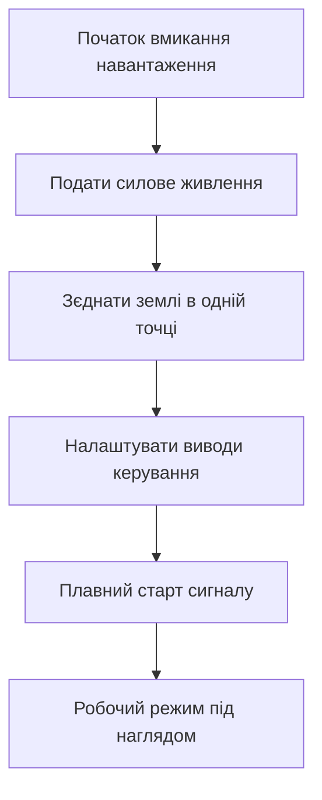

# Серво, реле і WS2812 - силові виходи

![[assets/img/stm32-servo-rele-ws-scheme.png|600]]
*Рис. Силові виходи контролера до приводів реле ключів і стрічок з окремим живленням.*

> [!tip] Призначення ноти
> Зібрати разом силові виходи які новачки плутають і спалюють через пряме підключення до виводів.

## 1. Призначення

Виводи контролера дають одиниці міліампер. Приводи потребують сотні міліампер і ампери. Між ними завжди ключ або драйвер. Сервопривод просить сигнал керування і окреме живлення. Реле просить транзистор і захисний діод. Потужне навантаження просить польовий ключ логічного рівня. Адресна стрічка просить точні часові імпульси і потужний блок живлення. Спільна земля обов'язкова для всіх варіантів. Роздільне живлення рятує від просідань і перезапусків.

## 2. Сервопривод і ШІМ 50 Гц

Стандартне серво чекає період 20 мс. Тривалість імпульсу від 1 до 2 мс. Середина 1.5 мс це нейтраль. Крайні 1 і 2 мс це мінус і плюс 90 градусів. Точність ходу залежить від стабільності таймера. Живлення серво 5 В окремо від плати. Струм у русі сотні міліампер. Струм заклиненого ротора понад ампер. Сигнальна земля спільна з платою. Перший рух плавний від нейтралі.

| Параметр | Значення | Пояснення |
| --- | --- | --- |
| Період | 20 мс | Частота 50 Гц |
| Мінімум | 1 мс | Крайне ліве положення |
| Нейтраль | 1.5 мс | Середнє положення вала |
| Максимум | 2 мс | Крайне праве положення |
| Живлення | 5 В окремо | Не від плати контролера |
| Струм руху | 200..600 мА | Залежить від розміру |
| Керування | Логічний сигнал | Земля спільна |

## 3. Розрахунок таймера під серво

Такт таймера ділимо прескалером до 1 МГц. Тоді одна мікросекунда один тік. Період 20000 тіків дає 20 мс. Порівняння 1000 дає 1 мс. Порівняння 1500 дає нейтраль. Порівняння 2000 дає 2 мс. Крок одна мікросекунда дає плавність. Джиттер менше кількох мікросекунд непомітний. Зміна порівняння без зупинки таймера безпечна. Для кількох серво один таймер з чотирма каналами.

| Крок | Дія | Приклад |
| --- | --- | --- |
| 1 | Виставити прескалер до 1 МГц | Тактування 84 МГц ділити на 84 |
| 2 | Період 19999 плюс нуль | Разом 20000 тіків |
| 3 | Порівняння 1000..2000 | Положення вала |
| 4 | Пуск каналу ШІМ | Вихід на серво |
| 5 | Плавна зміна порівняння | Крок 10 мкс за цикл |

```text
Налаштування таймера під серво:
  Такт шини .............. 84 МГц
  Прескалер ............... 83 (ділення на 84)
  Тік таймера ............. 1 мкс
  Період ARR .............. 19999 (20 мс разом)
  Порівняння CCR мінімум .. 1000 (1 мс, мінус 90)
  Порівняння CCR нейтраль . 1500 (1.5 мс, центр)
  Порівняння CCR максимум . 2000 (2 мс, плюс 90)
  Канал ................... ШІМ прямий, полярність висока
  Живлення серво .......... 5 В окремий блок, земля спільна
```

## 4. Реле через транзистор і діод

Котушка реле це індуктивність. Струм котушки 5 В типово 70 мА. Вивід контролера такий струм не тягне. Транзистор увімкнює котушку до землі. Резистор у базі обмежує струм керування. Захисний діод гасить зворотний викид. Без діода викид пробиває транзистор. Діод ставиться паралельно котушці зворотно. Катод до живлення котушки. Анод до колектора транзистора. Контакти реле комутують навантаження окремо. Керуюча і силова землі зєднуються в одній точці.

| Елемент | Номінал | Призначення |
| --- | --- | --- |
| Транзистор | NPN середньої потужності | Ключ котушки до землі |
| Резистор бази | 1 кОм | Струм бази близько 2 мА |
| Діод | Швидкий кремнієвий | Гасіння викиду котушки |
| Реле 5 В | Котушка близько 70 мА | Контакти під навантаження |
| Живлення котушки | 5 В окремо | Не з виводу контролера |
| Розв'язка | Оптопара за бажанням | Для індуктивних навантажень |

## 5. Польові ключі логічного рівня

Польовий транзистор з логічним керуванням відкривається від 3.3 В. Опір відкритого каналу одиниці міліом. Нагрівання мале при амперах струму. Затвор має ємність і просить резистор. Послідовний резистор 100 Ом прибирає дзвін. Стяжка 10 кОм до землі тримає закритим при скиданні. Навантаження вмикається до живлення через стік. Витік через слабкий драйвер повільний. Для швидкого ШІМ потрібен драйвер затвора. Індуктивне навантаження знову просить діод.

| Навантаження | Ключ | Зауваження |
| --- | --- | --- |
| Стрічка 12 В | N-канал логічний | ШІМ яскравості можливий |
| Мотор постійний | N-канал плюс діод | Реверс потребує міст |
| Нагрівник | N-канал з радіатором | Розрахунок потужності втрат |
| Клапан | N-канал плюс діод | Захист від викиду |
| Лампа розжарення | N-канал з запасом | Пусковий струм у рази більший |

## 6. Стрічка WS2812 і точні імпульси

Кожен світлодіод має свій драйвер. Протокол однодротовий з кодуванням часом. Нуль це короткий високий і довгий низький. Одиниця навпаки. Період біта 1.25 мкс. Скидання довгий низький понад 50 мкс. Порядок кольорів зелений червоний синій. Живлення 5 В окремим блоком. Струм білого на повну близько 60 мА на діод. Сто діодів просять 6 А. Тонкі доріжки плавляться. Живлення підводять з обох кінців і посередині.

| Параметр | Значення | Пояснення |
| --- | --- | --- |
| Біт нуль | 0.4 мкс високий | Допуск сотні наносекунд |
| Біт одиниця | 0.8 мкс високий | Допуск сотні наносекунд |
| Період | 1.25 мкс | Тривалість одного біта |
| Скидання | Понад 50 мкс низький | Кінець кадру стрічки |
| Порядок | Зелений червоний синій | Не класичний порядок |
| Струм діода | До 60 мА білий | Розрахунок блока живлення |
| Конденсатор | 1000 мкФ на вводі | Згладжування піків |

```text
Живлення стрічки окремим блоком:
  Блок 5 В 10 А ........... плюс до початку і кінця стрічки
  Земля блока ............. до землі плати обовязково
  Конденсатор 1000 мкФ .... між плюсом і землею на вводі
  Резистор 330 Ом ......... у лінії даних біля першого діода
  Дані .................... з виводу через резистор
  Запобіжник .............. у плюс стрічки на номінал блока
  Довжина ................. інжекція живлення кожні 2 метри
```

## 7. Біти як байти через канал з прямим доступом

Точні імпульси формують каналом у режимі передачі. Біт стрічки кодують байтом каналу. Швидкість каналу 6.4 Мбіт дає 0.156 мкс на біт. Байт 11100000 дає довгий високий для одиниці. Байт 11000000 дає короткий високий для нуля. Прямий доступ передає масив без ядра. Таймер або канал працює без переривань на біт. Переривання лише в кінці кадру. Метод стабільний навіть з перериваннями системи. Бітова частота тримається апаратурою.

## 8. Код HAL для серво реле і стрічки

```c
#include "main.h"
#include "tim.h"
#include "spi.h"

extern TIM_HandleTypeDef htim3;
extern SPI_HandleTypeDef hspi2;

#define RELAY_GPIO GPIOA
#define RELAY_PIN  GPIO_PIN_5
#define WS_COUNT   24
#define WS_BUF_LEN (WS_COUNT * 24)

static uint8_t ws_spi_buf[WS_BUF_LEN];

void servo_init(void)
{
  HAL_TIM_PWM_Start(&htim3, TIM_CHANNEL_1);
}

void servo_angle(int8_t deg)
{
  if (deg < -90) deg = -90;
  if (deg > 90) deg = 90;
  uint16_t ccr = (uint16_t)(1500 + deg * 500 / 90);
  __HAL_TIM_SET_COMPARE(&htim3, TIM_CHANNEL_1, ccr);
}

void relay_set(uint8_t on)
{
  HAL_GPIO_WritePin(RELAY_GPIO, RELAY_PIN,
    on ? GPIO_PIN_SET : GPIO_PIN_RESET);
}

static void ws_add_byte(uint16_t pos, uint8_t v)
{
  for (uint8_t i = 0; i < 8; i++)
  {
    uint8_t bit = (uint8_t)((v >> (7 - i)) & 0x01);
    ws_spi_buf[pos + i] = bit ? 0xE0 : 0xC0;
  }
}

void ws_show(uint8_t r, uint8_t g, uint8_t b)
{
  uint16_t p = 0;
  for (uint8_t n = 0; n < WS_COUNT; n++)
  {
    ws_add_byte(p, g); p += 8;
    ws_add_byte(p, r); p += 8;
    ws_add_byte(p, b); p += 8;
  }
  HAL_SPI_Transmit_DMA(&hspi2, ws_spi_buf, WS_BUF_LEN);
  HAL_Delay(1);
}
```

## 9. Послідовність вмикання силових вузлів



## Типові помилки

| # | Помилка | Чому погано | Як правильно |
| --- | --- | --- | --- |
| 1 | Серво живиться від плати | Просідання і перезапуски контролера | Окремий блок 5 В і спільна земля |
| 2 | Реле без діода | Викид пробиває транзистор | Діод паралельно котушці зворотно |
| 3 | Реле безпосередньо від виводу | Струм котушки палить пін | Транзисторний ключ і резистор бази |
| 4 | Польовик не логічний | Відкривається частково і гріється | Ключ з керуванням від 3.3 В |
| 5 | Стрічка на тонких дротах | Падіння напруги і червоний хвіст | Товсті дроти і інжекція кожні 2 метри |
| 6 | Дані стрічки без резистора | Відбиття і мерехтіння першого діода | Резистор 330 Ом біля входу даних |

## Офіційні джерела

- [STM32 TIM PWM manual (ST)](https://www.st.com/en/microcontrollers-microprocessors/stm32f4-series.html) - канали таймерів, порівняння і частота ШІМ.
- [WS2812B datasheet (Worldsemi)](https://cdn-shop.adafruit.com/datasheets/WS2812B.pdf) - часові діаграми, струми і порядок кольорів.

## Див. також

- [[Home]]
- [[07-Timeri-Son/01-GPTIM-ADTIM|таймери і ШІМ]]
- [[02-Zhivlennya/01-Lancjugi-zhivlennya|ланцюги живлення плати]]
- [[11-Vivid/01-OLED-SSD1306|екран OLED]]
- [[11-Vivid/02-TFT-LCD|кольоровий дисплей]]
