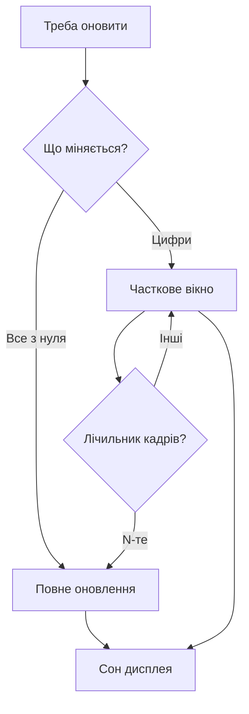

# E-paper - дисплеї-чорнила по SPI

![[assets/img/stm32-epaper-scheme.png|600]]
*Рис. Чорнила не поспішають: повне оновлення проти привидів.*

> [!tip] Призначення ноти
> Навчити виводити на e-paper: повне і часткове оновлення, температура, сон між кадрами.

## 1. Призначення

Електронні чорнила тримають картинку без живлення роками і читаються на сонці. Ціна - секунди оновлення і привиди від часткових перемальовок. Для цінників, табличок і вуличних табло краще немає.

## Повне проти часткового

| Режим | Час | Якість | Коли |
| --- | --- | --- | --- |
| Повне (full) | Секунди | Ідеально, без привидів | Рідкі кадри, цінник |
| Часткове (partial) | Десятки мс | Привиди накопичуються | Годинник, цифри |
| Правило | Кожне N-не часткове - одне повне! | Чистить привидів | N з даташита |

## Послідовність виводу

| Крок | Дія |
| --- | --- |
| 1 | Розбудити дисплей, дочекатись busy |
| 2 | Залити кадр у RAM дисплея по SPI |
| 3 | Команда оновлення |
| 4 | Чекати busy до кінця! |
| 5 | Приспати назад у глибокий сон |

```c
// Скелет виводу кадру:
EPD_Wake();
EPD_SendFrame(fb, sizeof(fb));  // DMA бажано
EPD_Refresh(PARTIAL);
while (EPD_Busy());             // не чіпати під час!
EPD_Sleep();
```

## Mermaid: вибір режиму оновлення



## Температура і LUT

| Тема | Практика |
| --- | --- |
| Холод гальмує | Час оновлення росте, контраст падає |
| LUT-таблиці | Хвилі напруги з даташита під температуру! |
| Вбудований сенсор | Деякі модулі міряють самі |
| Вулиця взимку | Повне оновлення і запас часу |

## Живлення: спати по-справжньому

| Тема | Практика |
| --- | --- |
| Deep sleep дисплея | Мікроампери між кадрами |
| Живлення драйвера | Вимикати ключем, якщо дисплей не спить сам |
| Батарея на роки | Кадр раз на годину - маяк-цінник |

## Типові помилки

| # | Помилка | Чому погано | Як правильно |
| --- | --- | --- | --- |
| 1 | Тільки часткові оновлення | Привиди зїдають картинку | Періодичне повне! |
| 2 | Не чекати busy | Кадр рваний | Чекати прапорець завжди |
| 3 | LUT не ті | Бліда картинка | Таблиці під температуру |
| 4 | Дисплей не спить | Міліампери в простої | Deep sleep між кадрами |
| 5 | Мороз без запасу | Не встигає оновитись | Повне + довше чекати |
| 6 | SPI максимум | Глюки на шлейфі | Помірна швидкість |
| 7 | Кадр у RAM чипа цілком | Не влазить на малих | Смугами через DMA |

## Триколірні: червоний повільний

| Тема | Практика |
| --- | --- |
| Два проходи | Чорний кадр, потім червоний |
| Час подвійний | Закладати в цикл оновлення |
| Частковий червоний | Тільки на тих, що вміють! |
| Дизайн | Червоним - акценти, не текст цілком |

## Шлейф і монтаж

| Правило | Пояснення |
| --- | --- |
| Шлейф не перегинати | Тріщина - смуги назавжди |
| Розєм з фіксатором | Відходить від вібрації |
| Дисплей на прокладці | Скло тріскається від гвинтів |

## Офіційні джерела

- [E-paper driver guides (Waveshare)](https://www.waveshare.com/wiki/Main_Page) - послідовності, LUT, приклади.
- [SSD1675 datasheet (Solomon)](https://www.solomon-systech.com/en/product/ssd1675a/) - команди, таймінги.

## Вибір модуля: розмір і колір

| Діагональ | Роздільність | Для чого |
| --- | --- | --- |
| 1.54 дюйма | 200x200 | Мітка, бейдж |
| 2.9 дюйма | 296x128 | Цінник, датчик |
| 4.2 дюйма | 400x300 | Табличка, розклад |
| 7.5 дюйма | 800x480 | Вуличне табло |

| Колір | Нюанс |
| --- | --- |
| Чорно-білий | Швидше, дешевше |
| Триколірний | Червоний довго оновлюється! |

## Шрифти і графіка: економія памяті

| Тема | Практика |
| --- | --- |
| Шрифт цілком | Не влазить у малі чипи |
| Тільки потрібні гліфи | Цифри і кілька літер |
| RLE-стиснення | Картинки тиснути, розпаковувати смугами |
| Кадр у флеші | Статика лежить готовою, не малюється |

## Кейс: цінник на батареї

| Параметр | Значення |
| --- | --- |
| Оновлення | Раз на добу з сервера |
| Живлення | CR2450 на роки |
| Цикл | Прокинувся, забрав ціну, намалював, заснув |
| Запас | Повне оновлення раз на тиждень проти привидів |

## Див. також

- [[Home]]
- [[11-Vivid/01-OLED-SSD1306|екран OLED]]
- [[11-Vivid/02-TFT-LCD|кольоровий дисплей]]
- [[04-Shini/02-SPI|шина обміну]]
- [[07-Timeri-Son/03-Sleep-Stop-Standby|режими сну]]
