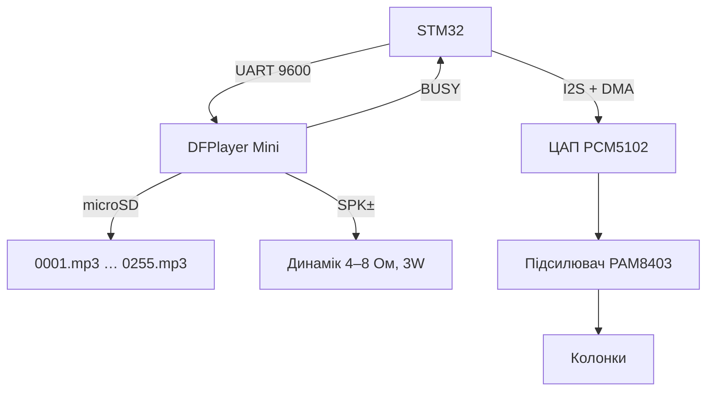

# STM32 і звук - DFPlayer Mini, I2S-ЦАП та голосові підказки

![[assets/img/stm32-audio-dfplayer-scheme.png|600]]
*Рис. DFPlayer грає MP3 з microSD по командах UART, I2S-тракт - для якісного звуку через зовнішній ЦАП.*

> [!tip] Що це за нота
> Звук на STM32 двома шляхами: DFPlayer Mini (MP3 з картки, керування 5 командами) і I2S (потік в ЦАП для музики/синтезу). Перший закриває 90 % задач: дверний дзвінок, сигналізація, голосовий асистент станції. База: [[04-Shini/01-UART|UART-шина STM32]], [[11-Vivid/03-Servo-Rele-MOSFET-WS2812|силова периферія]].

## 1. Мета

Дати STM32 голос і музику мінімальними зусиллями:

- DFPlayer Mini: MP3/WAV з microSD, гучність, еквалайзер, busy-сигнал;
- керування - UART 9600, відповіді парсимо як AT;
- I2S: вивід PCM в ЦАП (PCM5102/MAX98357) для якісного звуку;
- сценарії: озвучка вимірів, тривоги, дверний дзвінок з RFID.

| Шлях | Якість | Складність | Коли брати |
| --- | --- | --- | --- |
| DFPlayer Mini | MP3 192 кбіт/с, моно/стерео 3W | 5 команд | озвучка, алерти, дзвінок |
| I2S + ЦАП | 16-24 біт, 44.1 кГц | DMA-потік, буфери | музика, синтез, TTS-потік |
| ШІМ + фільтр | телефонна | 1 пін + RC | біпер з мелодіями |

## 2. Архітектура



DFPlayer має вбудований підсилювач 3W - динамік безпосередньо. Для кімнатного звуку - I2S-гілка з окремим підсилювачем.

## 3. Апаратна частина

| Пін STM32 | DFPlayer Mini | Примітка |
| --- | --- | --- |
| TX (PA9) | RX | через резистор 1 кОм (модуль 3.3V-толерантний, але перестрахуємось) |
| RX (PA10) | TX | безпосередньо |
| 5V 1A | VCC | окремий стабілізатор, піки підсилювача! |
| GND | GND | спільна, товста |
| PB5 | BUSY | LOW = грає, ведемо на вхід з перериванням |
| - | SPK+, SPK− | динамік 4-8 Ом, без спільної землі на SPK−! |

> [!warning] SPK− не земля
> Мінус динаміка DFPlayer - мостовий вихід, садити на GND заборонено: згорить підсилювач. Для лінійного виходу є окремі DAC_R/DAC_L + GND.

Картка: FAT16/FAT32 до 32 ГБ, файли `0001.mp3` в корені або папки `01/001.mp3`. Імена - строго 4 цифри.

## 4. Протокол DFPlayer

Кадр 10 байт: `7E FF 06 CMD 00 HB LB SUM_H SUM_L EF`. Контрольна сума - інверсія суми байтів + 1.

| Команда | Байти | Дія |
| --- | --- | --- |
| 0x03 | номер треку | грати N-й файл |
| 0x06 | 0-30 | гучність |
| 0x0E | номер папки | грати папку (рекламна вставка!) |
| 0x16 | - | стоп |
| 0x42 | - | запит статусу |
| 0x4C | - | кількість файлів |

Фішка папок: команда 0x0E перериває поточний трек вставкою і повертається - ідеально для «увага, двері відчинено» поверх фонової музики.

## 5. Робочий код HAL

```c
void df_cmd(uint8_t cmd, uint16_t param) {
  uint8_t f[10] = {0x7E, 0xFF, 0x06, cmd, 0x00,
                   param >> 8, param & 0xFF, 0, 0, 0xEF};
  uint16_t sum = 0;
  for (int i = 1; i < 7; i++) sum += f[i];
  sum = 0xFFFF - sum + 1;
  f[7] = sum >> 8; f[8] = sum & 0xFF;
  HAL_UART_Transmit(&huart1, f, 10, 100);
}

void df_play(uint16_t n) { df_cmd(0x03, n); }
void df_volume(uint8_t v) { if (v > 30) v = 30; df_cmd(0x06, v); }
void df_advert(uint8_t folder) { df_cmd(0x0E, folder); }

uint8_t df_is_busy(void) {
  return HAL_GPIO_ReadPin(GPIOB, GPIO_PIN_5) == GPIO_PIN_RESET;
}

void announce(uint16_t track) {
  while (df_is_busy()) { HAL_Delay(50); }
  df_play(track);
}
```

BUSY читаємо перед кожним запуском - інакше треки накладаються. Довгі оголошення ріжемо на файли по 5-10 с.

## 6. I2S-гілка для якісного звуку

- STM32 як I2S-master: MCK, SCK, WS, SD - конфіг через CubeMX за 5 хвилин;
- потік PCM 16 біт / 44.1 кГц ганяємо DMA подвійним буфером (див. [[04-Shini/07-DMA-DeepDive|глибокий DMA]]);
- ЦАП PCM5102 або MAX98357 (I2S-підсилювач 3W безпосередньо на динамік);
- джерело семплів: WAV з SD-карти ([[04-Shini/06-SDMMC-QUADSPI|SDMMC]]) або синтез у коді;
- гучність - цифровим множенням семплів, без потенціометра в тракті.

## 7. Сценарії озвучки

| Подія | Файли | Логіка |
| --- | --- | --- |
| Старт системи | 0001.mp3 «Система готова» | один раз при boot |
| Поріг датчика | 0002.mp3 + номер зони | рекламна вставка 0x0E |
| RFID доступ | 0003.mp3 «Доступ дозволено» | за подією з [[10-Sensori/09-RFID-RC522 | RFID-зчитувача]] |
| Кожна година | TTS-файли часу | генеруємо на ПК, кладемо 0100-0123 |
| Тривога | цикл 0010.mp3 | поки BUSY-цикл активний |

TTS українською генеруємо офлайн на ПК (Piper/RHVoice) і заливаємо MP3 - ніякого онлайну на платі.

## 8. Типові помилки

| Симптом | Причина | Лікування |
| --- | --- | --- |
| Мовчить, BUSY не падає | файли не 0001.mp3 або картка exFAT | FAT32, імена 4 цифри, картка до 32 ГБ |
| Хрипить на піках | слабке 5V живлення підсилювача | окремий стабілізатор 1 А, конденсатор 1000 мкФ |
| Грає не той трек | нумерація з 0 vs з 1 | команда 0x03 рахує з 1, перевірити порядок копіювання |
| UART без відповідей | швидкість не 9600 | DFPlayer фіксовано 9600 8N1 |
| SPK− на землі - дим | мостовий вихід замкнули | тільки диференційно на динамік, для лінії - DAC_R/L |
| Треки накладаються | немає очікування BUSY | `announce()` з циклом перед кожним пуском |

## 9. Суміжні ноти

- [[10-Sensori/09-RFID-RC522|RFID-зчитувач]] - дверний дзвінок з доступом.
- [[04-Shini/07-DMA-DeepDive|глибокий DMA]] - I2S-потік без участі CPU.
- [[04-Shini/06-SDMMC-QUADSPI|SDMMC і QuadSPI]] - звідки брати WAV.
- [[11-Vivid/03-Servo-Rele-MOSFET-WS2812|силова периферія]] - реле дзвінка.
- [[02-Zhivlennya/03-Power-Design|розрахунок живлення STM32]] - піки підсилювача.

## Офіційні джерела

- [DFPlayer Mini SKU DFR0299 (DFRobot Wiki)](https://wiki.dfrobot.com/DFPlayer_Mini_SKU_DFR0299) - протокол, команди, імена файлів.
- [DFRobotDFPlayerMini (DFRobot, GitHub)](https://github.com/DFRobot/DFRobotDFPlayerMini) - еталонна бібліотека команд.
- [I2S bus specification (Wikipedia)](https://en.wikipedia.org/wiki/I%C2%B2S) - формат кадру, ролі master/slave.
- [PCM5102 (Texas Instruments)](https://www.ti.com/product/PCM5102) - I2S-ЦАП для якісної гілки.
