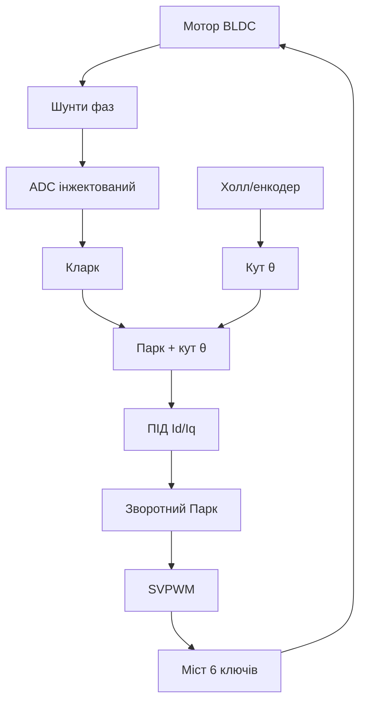

# STM32 FOC-керування BLDC - Кларк/Парк, SVPWM і датчики

![[assets/img/stm32-foc-bldc-scheme.png|600]]
*Рис. FOC-ланцюг: струми фаз → Кларк → Парк → ПІД → зворотний Парк → SVPWM → міст.*

> [!tip] Що це за нота
> Векторне керування замість трапеції: тиша, момент на нулі, ККД. Математика + код + залізо драйвера. База: [[07-Timeri-Son/01-GPTIM-ADTIM|таймери STM32]], [[10-Sensori/11-Encoder|енкодери]], [[11-Vivid/06-Stepper-TMC|крокові драйвери]].

## 1. Мета

Запустити BLDC векторно на STM32:

- перетворення Кларк (3→2 фази) і Парк (обертові d/q);
- SVPWM: як народжуються 3 синусоїди з DC-шини;
- ПІД-контури струму (швидкі) і швидкості (повільний);
- датчики: Холл/енкодер для кута ротора;
- бездатчиковий старт (BEMF) - оглядово.

| Етап | Вхід → вихід | Частота |
| --- | --- | --- |
| Вимір струмів | Ia, Ib (шунти) | 20 кГц |
| Кларк | Ia,Ib → Iα,Iβ | 20 кГц |
| Парк | Iα,Iβ,θ → Id,Iq | 20 кГц |
| ПІД Id/Iq | помилка → Vd,Vq | 20 кГц |
| Зворотний Парк | Vd,Vq,θ → Vα,Vβ | 20 кГц |
| SVPWM | Vα,Vβ → 6 ключів | 20 кГц ШІМ |

## 2. Архітектура



Петля струму - в перериванні ADC (20 кГц), петля швидкості - в таймері 1 кГц, задатчик - зверху.

## 3. Розпіновка вузла (F4, ADV-TIM1)

| Сигнал | Пін STM32 | Примітка |
| --- | --- | --- |
| UH/UL, VH/VL, WH/WL | PA8-PA10 + PB13-PB15 | комплементарні з dead-time! |
| Шунти Ia/Ib | PA0/PA1 (ADC) | інжектований тригер від TIM1 |
| Холл H1/H2/H3 | PB6-PB8 | підтяжки, фільтр |
| Енкодер A/B | PA15/PB3 (TIM2 remap) | режим encoder, не конфліктує з шунтами |
| DC-шина sense | PA4 | перенапруга/гальмування |
| UART-лог | PA9/PA10 | телеметрія |

Dead-time 1-2 мкс обов'язковий: без нього наскрізний струм вбиває міст. Break-вхід - аварійний стоп залізом.

## 4. Кларк і Парк коротко

- Кларк: `Iα = Ia`, `Iβ = (Ia + 2Ib)/√3` (третя фаза зайва);
- Парк: проєкція на ротор, що крутиться: `Id = Iα·cosθ + Iβ·sinθ`, `Iq = −Iα·sinθ + Iβ·cosθ`;
- керуємо Id (=0, без намагнічування) і Iq (=момент);
- зворотний Парк - назад у нерухомі координати;
- SVPWM - 8 векторів моста, duty з Vα/Vβ.

## 5. Робочий код (C, HAL)

```c
typedef struct { float id, iq; float vd, vq; float theta; } foc_t;
static foc_t F;

void foc_step(float ia, float ib, float iq_ref) {
  const float S3 = 1.7320508f;
  float ialpha = ia;
  float ibeta = (ia + 2.0f * ib) / S3;
  float c = cosf(F.theta), s = sinf(F.theta);
  float id = ialpha * c + ibeta * s;
  float iq = -ialpha * s + ibeta * c;
  float ed = 0.0f - id, eq = iq_ref - iq;
  static float id_i = 0, iq_i = 0;
  id_i += ed * 0.001f; iq_i += eq * 0.001f;
  F.vd = ed * 2.0f + id_i;
  F.vq = eq * 2.0f + iq_i;
  float va = F.vd * c - F.vq * s;
  float vb = F.vd * s + F.vq * c;
  svpwm_set(va, vb);
}

void TIM1_UP_IRQHandler(void) {
  float ia = adc_injected(0), ib = adc_injected(1);
  foc_step(ia, ib, speed_pi());
  F.theta += 0.001f;
  HAL_TIM_IRQHandler(&htim1);
}
```

ПІД тут спрощений (P+I без D і анти-віндапа для читабельності); бойовий - з насиченням інтегратора і feedforward.

## 6. Робочий код (MicroPython)

```python
# MicroPython: FOC-регулятор верхнього рівня (струмова петля — на C-драйвері)
import math
import time
from machine import Pin, PWM, ADC

pwm_u = PWM(Pin(8), freq=20000)
hall = [Pin(6, Pin.IN), Pin(7, Pin.IN), Pin(8, Pin.IN)]
throttle = ADC(Pin(0))
theta = 0.0
iq_ref = 0.0

def hall_to_theta():
    s = (hall[0].value() << 2) | (hall[1].value() << 1) | hall[2].value()
    table = {5: 0.0, 1: 1.047, 3: 2.094, 2: 3.142, 6: 4.189, 4: 5.236}
    return table.get(s, theta)

while True:
    theta = hall_to_theta()
    want = throttle.read_u16() / 65535.0
    iq_ref += (want - iq_ref) * 0.05
    va = math.cos(theta) * iq_ref
    pwm_u.duty_u16(int(32768 + va * 30000))
    time.sleep(0.001)
```

Чесно: струмова петля 20 кГц на MicroPython не тягнеться - тут задатчик моменту і комутація, швидкий контур лишаємо C-драйверу (SimpleFOC-стиль).

## 7. Датчики кута

- Холл: 6 секторів, грубо але безвідмовно;
- енкодер ABI: тисячі імпульсів, точно;
- резолвер: для авто/промисловості (окремий чип);
- бездатчиковий: BEMF zero-crossing на середніх обертах;
- старт без датчика - open-loop розгін до швидкості захоплення.

## 8. Типові помилки

| Симптом | Причина | Лікування |
| --- | --- | --- |
| Міст гріється/дим | немає dead-time | 1-2 мкс, break-вхід |
| Мотор тремтить на місці | неправильний порядок фаз/Холла | комбінації 6 дротів, калібрування |
| Зрив на високих | запізнення кута | компенсація затримки виміру |
| ПІД осцилює | великі Kp | зменшити, додати анти-віндап |
| Шум у струмах | довгі шунтові доріжки | Кельвін, RC-фільтр, усереднення |
| Не стартує з навантаженням | мало Iq на старті | буст стартового струму |

## 9. Швидка шпаргалка FOC

- Id=0, Iq=момент - вся філософія;
- dead-time святий;
- струмова петля 20 кГц в IRQ;
- калібрування фаз/датчика першим;
- починати з open-loop.

## 10. Суміжні ноти

- [[07-Timeri-Son/01-GPTIM-ADTIM|таймери STM32]] - ШІМ і тригери ADC.
- [[10-Sensori/11-Encoder|енкодери]] - датчики кута.
- [[11-Vivid/06-Stepper-TMC|крокові драйвери]] - молодші брати.
- [[06-Analog/05-Shunt-OPAMP|шунт і підсилювач]] - вимір струмів.
- [[Home|головна карта]] - повна навігація.

## Офіційні джерела

- [Field Oriented Control (SimpleFOC)](https://docs.simplefoc.com/bldcmotor) - теорія і практика FOC.
- [Arduino-FOC (SimpleFOC, GitHub)](https://github.com/simplefoc/Arduino-FOC) - еталонна реалізація петель.
- [STM32F4 (ST)](https://www.st.com/en/mcus-mpus/stm32f4.html) - ADV-таймери і ADC.
