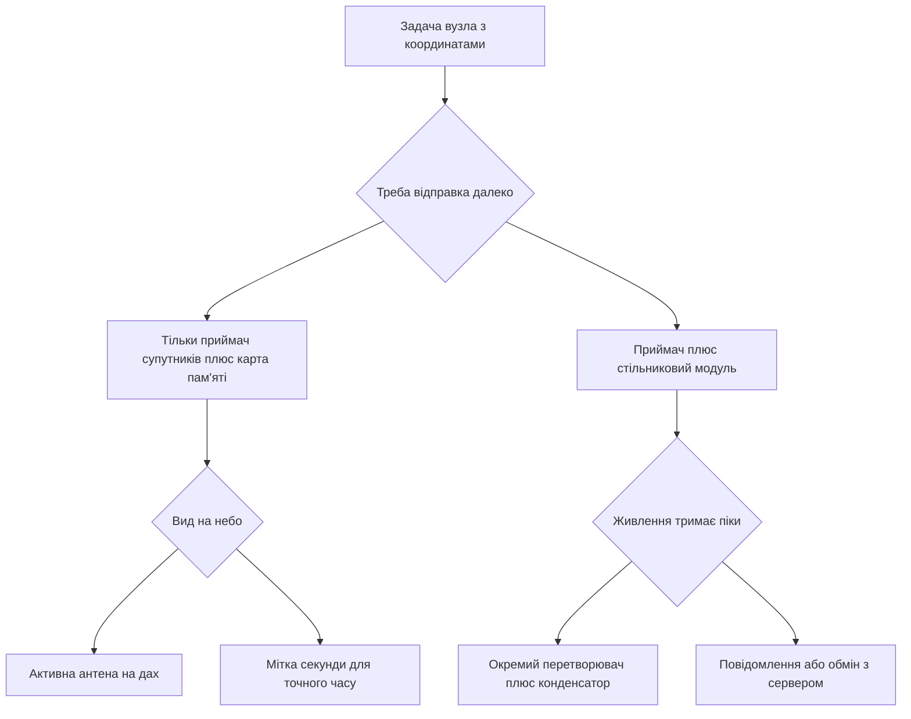

# GPS і GSM - координати і стільниковий зв'язок

![[assets/img/stm32-gps-gsm-scheme.png|600]]
*Рис. Схема GPS і GSM: антена з видом на небо, послідовний порт, PPS-мітка часу і резерв живлення.*

> [!tip] Призначення ноти
> Закрити питання координат і зв'язку разом: як читати речення приймача супутників і як керувати стільниковим модулем командами через той же послідовний порт.

## 1. Призначення

Приймач супутників дає координати, висоту, швидкість і точний час без мережі. Стільниковий модуль дає дзвінок, повідомлення, передачу даних і доступ до мережі через команди керування. Разом вони закривають трекер, метеостанцію з відправкою і охоронний вузол.

Обидва модулі говорять через послідовний порт з логікою 3.3 В. Швидкість приймача супутників зазвичай 9600, стільникового модуля 115200 з автоматичним визначенням. Прийом роблять через прямий доступ до пам'яті з перериванням простою лінії, щоб не втрачати байти.

Точний час беруть з імпульсу секундної мітки. Живлення стільникового модуля вимагає запасу струму через короткі піки передачі. Антена приймача супутників вимагає відкритого неба.

## 2. Речення приймача супутників

| Речення | Повна назва | Що містить | Навіщо дивитись |
| --- | --- | --- | --- |
| GGA | Дані фіксації | Час, широта, довгота, якість, супутники, висота | Головне речення для координат |
| RMC | Мінімум навігації | Час, дата, статус, координати, швидкість, курс | Час плюс рух одним рядком |
| GSA | Склад сузір'я | Режим, номери супутників, точність | Чому точність погана |
| GSV | Супутники в зоні | Кількість, висота, азимут, рівень | Куди направити антену |
| VTG | Курс і швидкість | Істинний курс, швидкість у вузлах | Для трекера руху |
| GLL | Координати прості | Широта, довгота, час | Короткий варіант без висоти |
| TXT | Текстове | Повідомлення приймача | Діагностика запуску |

Приклад рядка:

```text
Приклад потоку з приймача на 9600:
  $GPGGA,123519,4807.038,N,01131.000,E,1,08,0.9,545.4,M,46.9,M,,*47
  $GPRMC,123519,A,4807.038,N,01131.000,E,022.4,084.4,230394,003.1,W*6A
  Розбір полів GGA:
    Час ............ 12:35:19 всесвітній час
    Широта ......... 48 градусів 07.038 хвилин північ
    Довгота ........ 11 градусів 31.000 хвилин схід
    Якість ......... 1 означає автономна фіксація
    Супутники ...... 08 штук у розрахунку
    Висота ......... 545 метрів над рівнем моря
```

## 3. Прийом через прямий доступ і простій лінії

| Крок | Дія | Пояснення |
| --- | --- | --- |
| 1 | Налаштувати порт на 9600 | Стандарт більшості приймачів з коробки |
| 2 | Увімкнути кільцевий буфер | 256 або 512 байтів під рядки |
| 3 | Увімкнути переривання простою | Кінець пакета без таймерів |
| 4 | Копіювати рядок до символу нового рядка | Один рядок один розбір |
| 5 | Перевірити контрольну суму | Символ зірочка і два знаки |
| 6 | Розбирати тільки GGA і RMC | Решту ігнорувати для економії |

```text
Зв'язки плати і модулів:
  STM32                GPS-модуль (9600)
  ----------------     -----------------
  PA9  -------------> RX
  PA10 <------------- TX
  PB1  <------------- PPS (секундна мітка)
  3V3  -------------- VCC
  GND  -------------- GND

  STM32                GSM-модуль (115200)
  ----------------     -----------------
  PC10 -------------> RXD
  PC11 <------------- TXD
  PC12 -------------> PWRKEY (імпульс 1 с)
  PA0  <------------- STATUS
  4V   -------------- VBAT (окремий перетворювач!)
  GND  -------------- GND (спільна земля товстим дротом)
```

## 4. PPS-сигнал і точний час

Секундна мітка це короткий імпульс на початку кожної секунди. Фронт прив'язаний до супутникового часу з точністю десятки наносекунд. Контролер ловить фронт зовнішнім перериванням і звіряє внутрішній годинник.

| Сигнал | Параметр | Значення |
| --- | --- | --- |
| Полярність | Наростання | Переривання по фронту |
| Тривалість | 100 мс | Вистачає для захоплення таймером |
| Точність фронту | Десятки наносекунд | Краще за мережевий час |
| Використання | Корекція годинника | Раз на секунду |
| Резерв | Батарейка приймача | Зберігає альманах |

## 5. Антена і холодний старт

| Режим старту | Що пам'ятає | Час фіксації | Коли буває |
| --- | --- | --- | --- |
| Холодний | Нічого | До 12 хвилин | Перше ввімкнення або далеке перевезення |
| Теплий | Альманах і час | До 2 хвилин | Доба без живлення з батарейкою |
| Гарячий | Все свіже | До 30 секунд | Коротка перерва живлення |
| Повторний | Ефемериди живі | Кілька секунд | Вихід з тіні дерев |

Антена мусить бачити небо. Вікно дає слабкий сигнал через скло з напиленням. Металевий дах глушить повністю. Активна антена з підсиленням допомагає в місті, але вимагає живлення через коаксіал.

## 6. Стільниковий модуль і команди керування

| Команда | Призначення | Відповідь |
| --- | --- | --- |
| AT | Перевірка зв'язку | OK |
| ATI | Назва модуля | Версія прошивки |
| AT+CSQ | Рівень сигналу | Два числа якості |
| AT+CREG? | Реєстрація в мережі | Статус і сотня |
| ATD+380971234567; | Голосовий дзвінок | OK і гудки |
| ATH | Покласти слухавку | OK |
| AT+CMGF=1 | Текстовий режим повідомлень | OK |
| AT+CMGS="+380971234567" | Відправка повідомлення | Запит тексту і OK |
| AT+CGATT=1 | Приєднання до пакетних даних | OK |
| AT+HTTPINIT | Старт служби обміну | OK |
| AT+HTTPPARA="URL","<http://srv/data>" | Адреса сервера | OK |

```text
Типова сесія обміну з мережею:
  1. AT .................... перевірка, чекаємо OK
  2. AT+CSQ ................ рівень більше 10 для стабільності
  3. AT+CREG? .............. статус 0,1 означає в мережі
  4. AT+CGATT=1 ............ приєднання до пакетних даних
  5. AT+HTTPINIT ........... старт служби
  6. AT+HTTPPARA ........... адреса і тіло запиту
  7. AT+HTTPACTION=1 ....... відправка, чекаємо код 200
  8. AT+HTTPTERM ........... завершення служби
```

## 7. Живлення стільникового модуля

| Параметр | Значення | Пояснення |
| --- | --- | --- |
| Номінальна напруга | 3.8 В | Діапазон 3.4-4.4 В |
| Пік струму | До 2 А | Короткі імпульси передачі |
| Середній струм | 200-400 мА | Залежить від сигналу |
| Конденсатор | 1000 мкФ поруч | Тримає провали |
| Дроти живлення | Товсті і короткі | Тонкі дають просідання |
| Джерело | Окремий перетворювач | Слабкий стабілізатор плати не тягне |

Слабкий стабілізатор дає перезапуск у момент передачі. Симптом це циклічне миготіння статусу і втрата реєстрації. Лікується окремим перетворювачем на 2 А і великим конденсатором біля контактів живлення.

## 8. Код: розбір речень через порт

```c
#include <string.h>
#include <stdlib.h>

#define NMEA_BUF 256

typedef struct {
  double lat;
  double lon;
  int fix;
  int sats;
  char time[12];
} gps_data_t;

static uint8_t nmea_hex(char c)
{
  if (c >= '0' && c <= '9') return (uint8_t)(c - '0');
  if (c >= 'A' && c <= 'F') return (uint8_t)(c - 'A' + 10);
  if (c >= 'a' && c <= 'f') return (uint8_t)(c - 'a' + 10);
  return 0;
}

int nmea_crc_ok(const char *line)
{
  const char *star = strchr(line, '*');
  uint8_t crc = 0;
  const char *p;
  uint8_t got;
  if (line[0] != '$' || star == NULL) return 0;
  for (p = line + 1; p < star; p++) crc ^= (uint8_t)(*p);
  got = (uint8_t)((nmea_hex(star[1]) << 4) | nmea_hex(star[2]));
  return crc == got;
}

static double nmea_deg(const char *f)
{
  double v = atof(f);
  int d = (int)(v / 100.0);
  double m = v - d * 100.0;
  return d + m / 60.0;
}

int nmea_gga(const char *line, gps_data_t *out)
{
  char copy[NMEA_BUF];
  char *t;
  strncpy(copy, line, sizeof(copy) - 1);
  copy[sizeof(copy) - 1] = 0;
  if (strstr(copy, "GGA") == NULL) return 0;
  if (!nmea_crc_ok(line)) return 0;
  t = strtok(copy, ",");
  t = strtok(NULL, ",");
  if (t) strncpy(out->time, t, sizeof(out->time) - 1);
  t = strtok(NULL, ",");
  out->lat = t ? nmea_deg(t) : 0;
  t = strtok(NULL, ",");
  if (t && t[0] == 'S') out->lat = -out->lat;
  t = strtok(NULL, ",");
  out->lon = t ? nmea_deg(t) : 0;
  t = strtok(NULL, ",");
  if (t && t[0] == 'W') out->lon = -out->lon;
  t = strtok(NULL, ",");
  out->fix = t ? atoi(t) : 0;
  t = strtok(NULL, ",");
  out->sats = t ? atoi(t) : 0;
  return out->fix > 0;
}
```

## 9. Код: обгортка команд керування

```c
#include <string.h>
#include <stdio.h>

extern UART_HandleTypeDef huart3;

static int at_send(const char *cmd, char *ans, uint32_t timeout)
{
  uint16_t len = 0;
  memset(ans, 0, 512);
  HAL_UART_Transmit(&huart3, (uint8_t *)cmd, strlen(cmd), 1000);
  HAL_UART_Transmit(&huart3, (uint8_t *)"\r\n", 2, 100);
  HAL_UART_Receive(&huart3, (uint8_t *)ans, 511, timeout);
  return strstr(ans, "OK") != NULL;
}

int gsm_call(const char *number)
{
  char cmd[48];
  char ans[512];
  snprintf(cmd, sizeof(cmd), "ATD%s;", number);
  return at_send(cmd, ans, 5000);
}

int gsm_sms(const char *number, const char *text)
{
  char cmd[48];
  char ans[512];
  snprintf(cmd, sizeof(cmd), "AT+CMGS=\"%s\"", number);
  HAL_UART_Transmit(&huart3, (uint8_t *)cmd, strlen(cmd), 1000);
  HAL_UART_Transmit(&huart3, (uint8_t *)"\r", 1, 100);
  HAL_Delay(300);
  HAL_UART_Transmit(&huart3, (uint8_t *)text, strlen(text), 1000);
  HAL_UART_Transmit(&huart3, (uint8_t *)"\x1A", 1, 100);
  HAL_UART_Receive(&huart3, (uint8_t *)ans, 511, 8000);
  return strstr(ans, "+CMGS") != NULL;
}

int gsm_signal(void)
{
  char ans[512];
  int rssi = 99;
  if (!at_send("AT+CSQ", ans, 2000)) return -1;
  sscanf(ans, "%*[^:]: %d", &rssi);
  return rssi;
}
```

## 10. Mermaid: вибір шляху даних



## 11. Налагодження в полі

| Крок | Перевірка | Очікування |
| --- | --- | --- |
| 1 | Порт приймача на 9600 | Рядки з доларом щосекунди |
| 2 | Контрольна сума | Більшість рядків валідні |
| 3 | Кількість супутників | 4 мінімум для фіксації |
| 4 | Команда перевірки модуля | Відповідь OK |
| 5 | Рівень сигналу | Значення 10 і вище |
| 6 | Напруга під передачею | Без провалів нижче 3.4 В |

## Типові помилки

| # | Помилка | Чому погано | Як правильно |
| --- | --- | --- | --- |
| 1 | Розбір без перевірки суми | Битий рядок дає стрибок координат | Спочатку перевірка зірочки, потім розбір |
| 2 | Читання байтів у циклі без буфера | Втрата символів на високій швидкості | Прямий доступ з перериванням простою |
| 3 | Тест приймача у кімнаті | Сигнал не проходить через бетон | Вікно або дах з видом на небо |
| 4 | Живлення модуля від плати | Піки 2 А саджають шину і перезапуск | Окремий перетворювач і конденсатор 1000 мкФ |
| 5 | Відправка повідомлення без реєстрації | Модуль мовчить або дає помилку | Спочатку статус реєстрації і рівень сигналу |
| 6 | Спільна земля тонким дротом | Плаваючий потенціал і збої обміну | Товста коротка земля і поруч конденсатор |

## Офіційні джерела

- [Опис повідомлень приймача u-blox (u-blox)](https://www.u-blox.com/en/docs/UBX-13003221) - формати GGA і RMC з прикладами.
- [Набір команд SIM800 (SIMCom)](https://www.simcom.com/product/sim800c.html) - дзвінки, повідомлення і передача даних.
- [Модулі Quectel M95 та MC60 (Quectel)](https://www.quectel.com/product/m95) - живлення, піки струму і керування.

## Див. також

- [[Home]]
- [[04-Shini/01-UART|послідовний порт UART]]
- [[02-Zhivlennya/02-Batareyne-zhivlennya|батарейне живлення вузлів]]
- [[14-Devboards/03-Nucleo|плати Nucleo]]
- [[14-Devboards/01-Blue-Pill|плата Blue Pill]]
