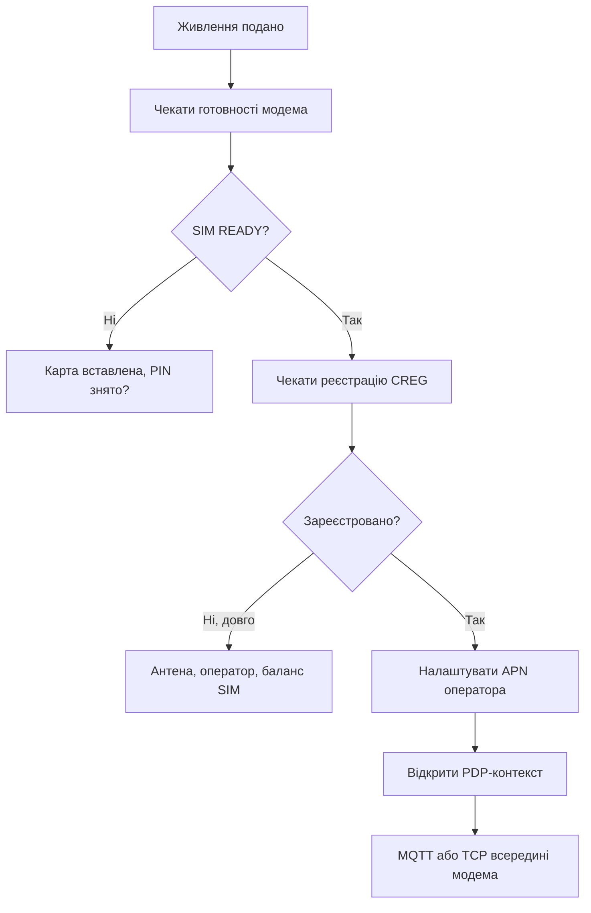

# SIM7600 - LTE Cat-1 модем з AT-командами

![[assets/img/stm32-sim7600-scheme.png|600]]
*Рис. Вузол онлайн: живлення, AT-діалог, дані в хмару.*

> [!tip] Призначення ноти
> Підняти стільниковий звязок: живлення без просадок, надійний AT-діалог, дані в хмару двома шляхами.

## 1. Призначення

SIM7600 дає LTE Cat-1 там, де немає WiFi і Ethernet: поле, траса, дах. Модем розуміє AT-команди по UART, всередині вміє TCP, MQTT і навіть GNSS. STM32 лише веде діалог і годує даними. Ціна - живлення з піками 2 А і терпіння в AT-таймаутах.

## 2. Живлення: піки вирішують все

| Вимога | Значення |
| --- | --- |
| Напруга | 3.4-4.2 В, типово 3.8-4.0 В! |
| Піки TX | До 2 А в імпульсі |
| Bulk | 100+ мкФ тантал біля модуля |
| Дроти | Короткі товсті, ніяких Dupont-локшин |

| Симптом | Причина | Рішення |
| --- | --- | --- |
| Ребут при реєстрації | Просадка на піку | Bulk, БЖ з запасом |
| Працює від USB, мовчить від батареї | Внутрішній опір | Свіжа банка, короткі дроти |
| Гріється LDO | Перепад і струм | Окремий buck на 4 В |

## 3. UART-діалог: параметри

| Параметр | Значення |
| --- | --- |
| Швидкість | 115200 за замовчуванням |
| Керування потоком | RTS/CTS бажано на трафіку! |
| Рядки | CRLF в обидва боки |
| Ехо | Вимкнути після дебагу (ATE0) |

## 4. AT-обгортка: каркас коду

```c
// Послати команду, дочекатись відповіді з таймаутом:
int at_cmd(const char *cmd, const char *expect, int timeout_ms)
{
  uart_flush();
  uart_send(cmd); uart_send("\r\n");
  return wait_for(expect, timeout_ms);  // 0 = OK
}

// Старт мережі покроково:
at_cmd("AT", "OK", 1000);
at_cmd("AT+CPIN?", "READY", 5000);     // SIM-карта!
at_cmd("AT+CREG?", "+CREG: 0,1", 60000); // реєстрація довга!
```

| Правило | Пояснення |
| --- | --- |
| Кожна команда з таймаутом | Модем іноді думає хвилину! |
| Парсити коди, не ехо | Відповідь шукати, ехо ігнорувати |
| Повтори з паузою | Не спамити - експоненційна пауза |
| Лог усього діалогу | Без логу дебаг сліпий |

## Mermaid: вихід в мережу



## 5. Два шляхи даних у хмару

| Шлях | Як | Коли |
| --- | --- | --- |
| AT + зовнішній стек | PPP або raw через UART | Повний контроль, складно |
| Вбудований TCP/MQTT | AT-команди модема | Просто, RAM чипа ціла! |

| Команда | Дія |
| --- | --- |
| Контекст і APN | Підключення до оператора |
| Відкриття TCP | Сокет всередині модема |
| MQTT-конфіг | Брокер, логін, топіки |
| Публікація | Дані йдуть без стеку на чипі! |

## 6. GNSS у тому самому модулі

| Тема | Практика |
| --- | --- |
| Антена окрема | Активна з живленням через модуль! |
| Холодний старт | Хвилини під відкритим небом |
| A-GPS | Ефимериди через мережу - старт секунди |
| NMEA | Ті ж речення, парсер спільний |

## 7. Енергоспоживання і сон

| Режим | Струм |
| --- | --- |
| Активна передача | Піки 2 А |
| Idle зареєстрований | Десятки мА |
| Сон модема | Одиниці мА |
| Вимикання піном | Мікроампери, але реєстрація заново! |

```text
Стратегія батареї:
  прокинувся -> увімкнув модем -> дочекався -> відправив -> вимкнув;
  сесія рідше, пачка більша;
  eDRX/PSM якщо оператор дає.
```

## 8. SIM-карта і оператор: практика

| Тема | Практика |
| --- | --- |
| Формат | Nano з перехідником криво стає - краще рідна! |
| PIN | Зняти до встановлення |
| APN | Точний рядок оператора, інакше немає даних |
| Баланс і тариф | M2M-тариф без голосу дешевше |
| Роумінг | Уточнити для прикордонних вузлів |

## Типові помилки

| # | Помилка | Чому погано | Як правильно |
| --- | --- | --- | --- |
| 1 | Тонкі дроти живлення | Ребут на реєстрації | Короткі товсті + bulk! |
| 2 | Без таймаутів в AT | Висне на першій паузі | Таймаут кожній команді |
| 3 | Спам повторами | Модем тоне | Експоненційна пауза |
| 4 | PIN не знято | CREG ніколи | Зняти PIN заздалегідь |
| 5 | APN навмання | Контекст не встає | Точний APN оператора |
| 6 | Антени переплутано | Немає мережі і GPS | LTE і GNSS окремо! |
| 7 | Трафік без ліміту | Рахунок | Рідше, пачками, стиснення |

## Офіційні джерела

- [SIM7600 AT Manual (SIMCom)](https://www.simcom.com/product/SIM7600X.html) - команди, таймінги, коди.
- [SIM7600 Hardware Design (SIMCom)](https://www.simcom.com/product/SIM7600X.html) - живлення, антени, SIM.

## Див. також

- [[Home]]
- [[12-Moduli-zvyazku/03-GPS-GSM|супутники і стільниковий зв'язок]]
- [[15-Protokoli/04-MQTT|протокол телеметрії]]
- [[02-Zhivlennya/02-Batareyne-zhivlennya|батарейне живлення]]
- [[04-Shini/01-UART|послідовний порт]]
- [[16-Proekti/02-GPS-treker|трекер координат]]
