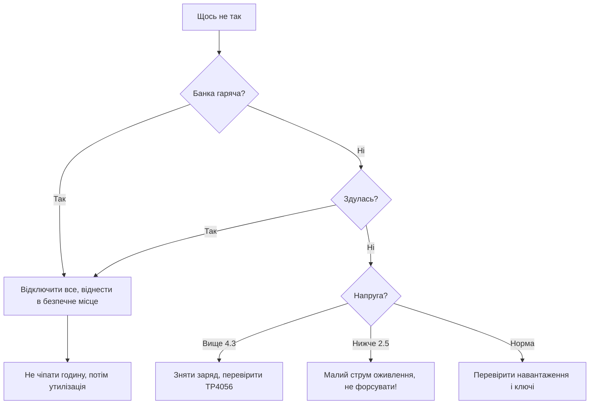

# Заряд і захист батареї - TP4056, DW01 і безпека

![[assets/img/stm32-charger-protect-scheme.png|600]]
*Рис. Ланцюжок безпеки: заряд, контроль, запобіжник.*

> [!tip] Призначення ноти
> Навчити заряджати Li-Ion безпечно: правильний струм, захист зборки і що робити при аварії.

## 1. Призначення

Літій дає щільність енергії, але не прощає помилок: перезаряд - здуття, коротке - пожежа. Звязка TP4056 (заряд) + DW01 (захист) закриває базу за копійки. Розуміння фаз заряду і порогів захисту відрізняє виріб від петарди.

## Фази заряду CC і CV

| Фаза | Умова | Струм |
| --- | --- | --- |
| Pre-charge | Напруга нижче 3 В | Малий струм оживлення |
| CC (постійний струм) | Основний набір | Задається резистором! |
| CV (постійна напруга) | Близько 4.2 В | Струм падає сам |
| Кінець | Струм нижче порога | Заряд завершено, LED гасне |

```text
Струм TP4056 резистором PROG:
  більший резистор — менший струм;
  1.2 кОм дає близько 1 А;
  для малої банки став менше, інакше перегрів.
```

## DW01: сторож зборки

| Захист | Поріг | Дія |
| --- | --- | --- |
| Перезаряд | Близько 4.3 В | Вимкає зарядний ключ |
| Перерозряд | Близько 2.4 В | Вимкає навантаження |
| Коротке | Струм через ключі | Вимкає все миттєво |
| Повернення | Зняти навантаження | Захист відпускає сам |

## Звязка з MOSFET-ключами

| Елемент | Роль |
| --- | --- |
| Два N-MOSFET спинами | Ключі заряду і розряду окремо |
| DW01 керує затворами | Відкриває і закриває за порогами |
| FS8205 готова пара | Два ключі в одному корпусі |

```text
Типова плата захисту:
  банка -> ключі -> DW01 міряє;
  заряд приходить через ті самі ключі;
  спрацював захист — ланцюг розірвано.
```

## Mermaid: що робити при аварії



## Термоконтроль

| Тема | Практика |
| --- | --- |
| NTC на банці | Зупинка заряду при перегріві |
| Діапазон заряду | Заряджати тільки в теплі, не на морозі! |
| Розміщення | Датчик на самій банці, не поруч |
| Саморобний контроль | АЦП чипа читає NTC - бекап до заліза |

## Запобіжник: остання лінія

| Тип | Коли |
| --- | --- |
| PTC самовідновлюваний | Малі струми, зручно |
| Плавкий | Силові кола, надійно |
| Немає | Тільки якщо захист DW01 гарантований |

## Живлення вузла від Li-Ion

| Вузол | Схема |
| --- | --- |
| Сплячий датчик | Банка -> LDO з малим Iq |
| Активний з піками | Банка -> buck-boost |
| Заряд від USB | USB -> TP4056 -> банка -> вузол |
| Розподіл навантажень | Радіо і цифра окремими гілками |

## Типові помилки

| # | Помилка | Чому погано | Як правильно |
| --- | --- | --- | --- |
| 1 | Струм 1 А в малу банку | Перегрів і деградація | Струм під ємність банки! |
| 2 | Немає захисту DW01 | Коротке - пожежа | Плата захисту завжди |
| 3 | Заряд на морозі | Металізація літію | Тільки в теплі! |
| 4 | Форсування глибокого розряду | Банка не оживає | Малий струм, терпіння |
| 5 | Здуту банку в роботу | Прорив і займання | Тільки утилізація |
| 6 | Загальний GND повз ключі | Захист не бачить струм | Все через ключі захисту! |
| 7 | Зберігання повним | Старіння прискорене | Зберігати наполовину зарядженим |

## Офіційні джерела

- [TP4056 datasheet (Top Power)](https://dlnmh9ip6v2uc.cloudfront.net/datasheets/Prototyping/TP4056.pdf) - фази, струм, NTC.
- [DW01 datasheet (Fortune)](https://www.ic-fortune.com/upload/Download/DW01-DS-English-V1.4.pdf) - пороги захисту.

## Вибір банки під вузол

| Параметр | Правило |
| --- | --- |
| Ємність | Бюджет сну і активу з запасом 30 відсотків |
| Струм віддачі | Піки радіо 2 А - банка має віддати! |
| Формат | 18650 для ємності, плоскі для габаритів |
| З захистом чи без | Без - тільки зі своєю платою DW01! |

```text
Перевірка банки при покупці:
  зважити: легка підробка відчувається одразу;
  заміряти ємність тестером на малому струмі;
  перевірити внутрішній опір — великий означає старість.
```

## Зберігання і утилізація

| Тема | Практика |
| --- | --- |
| Довге зберігання | Половина заряду, прохолода |
| Мертві банки | Не в смітник - у пункт прийому! |
| Пошкоджена | Пісок або сільський розчин, потім утилізація |
| Транспортування | Клеми ізольовані, коротке виключене |

## Сонячна підзарядка: нюанси

| Тема | Практика |
| --- | --- |
| Панель через діод | Нічний розряд назад виключено |
| MPPT для потужних | Дешевий ШІМ-контролер для малих |
| Хмара і тінь | Розрахунок на найгірший тиждень! |
| Суперконденсатор буфером | Піки радіо без просідання банки |

```text
Баланс енергії:
  споживання доби проти генерації найгіршого дня;
  запас батареї на 5 похмурих днів;
  інакше вузол мовчить саме взимку.
```

## Тест захисту: перевірка спрацьовування

| Тест | Як |
| --- | --- |
| Коротке на виході | Через амперметр, миттєве вимкення |
| Перезаряд | Лабораторний БЖ замість банки, повільно вгору |
| Перерозряд | Розряд до порога, перевірити вимкення |

## Див. також

- [[Home]]
- [[13-Moduli-zhivlennya-rivniv/01-Buck-Boost|імпульсні перетворювачі]]
- [[13-Moduli-zhivlennya-rivniv/02-Level-Shift|узгодження рівнів]]
- [[02-Zhivlennya/02-Batareyne-zhivlennya|батарейне живлення]]
- [[02-Zhivlennya/01-Lancjugi-zhivlennya|ланцюги живлення]]
