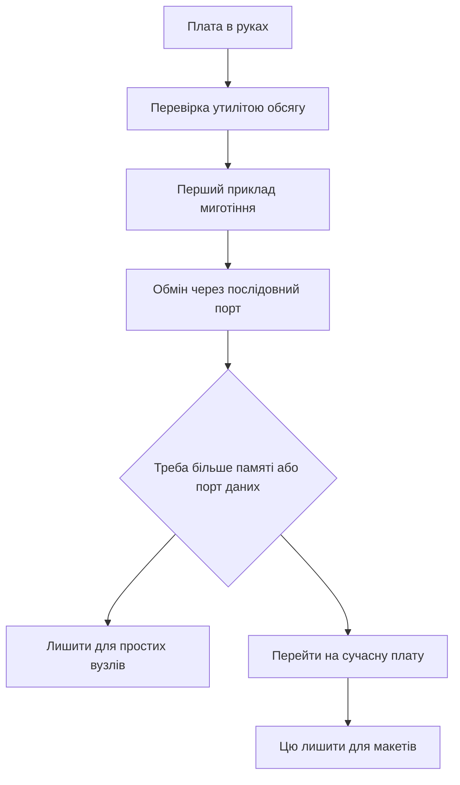

# Blue Pill - карта плати і межі

![[assets/img/stm32-bluepill-board-scheme.png|600]]
*Рис. Карта Blue Pill: контролер, світлодіод, перемички режимів і слабкий стабілізатор.*

> [!tip] Призначення ноти
> Дати карту найдешевшої плати: де світлодіод і кнопки, як шити без даних через роз'єм живлення і коли плати вже мало.

## 1. Призначення

Плата дає мінімум для старту: контролер, кварц, кнопки скидання і режимів, гребінки під дроти. Ціна кілька доларів робить її витратною для макетів. Тони прикладів під цей контролер скорочують пошук.

Плата вчить базовим речам: тактування від кварца, миготіння світлодіодом, обмін через послідовний порт, прошивка через налагоджувач. Обмеження вчать читати документацію: роз'єм живлення без даних, малий обсяг пам'яті, слабкий стабілізатор.

Для серйозних задач беруть сучасні плати з запасом пам'яті і вбудованим налагоджувачем. Ця лишається для навчання і простих вузлів.

## 2. Що на платі

| Елемент | Де | Нотатка |
| --- | --- | --- |
| Контролер | Середня щільність, 64 КБ за маркуванням | Часто 128 КБ фактично, перевіряти утилітою |
| Світлодіод | Лінія PC13, активний нуль | Горить при нулі на виводі |
| Кнопка скидання | Поруч з краєм | Короткий імпульс скидання |
| Перемичка режимів | BOOT0 між нулем і одиницею | Одиниця веде в заводський завантажувач |
| Роз'єм живлення | Тільки живлення | Даних немає, це пастка новачків |
| Стабілізатор | Слабкий, близько 100 мА | Радіо і мотори живити окремо |
| Кварц | 8 МГц | Точна частота для обміну |
| Гребінки | Два ряди по 20 | Крок стандартний для макетів |

```text
Карта плати вид зверху:
  +----------------------------------+
  |  [USB живлення]   [Кнопка RESET] |
  |                                  |
  |  BOOT0 [=]  BOOT1 (запаяно в 0)  |
  |                                  |
  |  Контролер LQFP48 по центру      |
  |  Кварц 8 МГц поруч               |
  |                                  |
  |  PC13 -- LED (активний нуль)      |
  |  PA9  -- TX1  PA10 -- RX1        |
  |  PA13 -- SWDIO PA14 -- SWCLK     |
  |  3V3 -- стабілізатор -- 5V вхід  |
  +----------------------------------+
  Лівий ряд:  GND 3V3 5V ... PB...   |
  Правий ряд: GND 3V3 ... PA...      |
```

## 3. Контролер детально

| Параметр | Значення | Пояснення |
| --- | --- | --- |
| Ядро | 32-бітне, 72 МГц | Без апаратної коми |
| Пам'ять програм | 64 КБ за паспортом | Перевірка часто показує 128 КБ |
| Оперативна | 20 КБ | Вистачає для навчання |
| Напруга | 2.0-3.6 В | Піни частково толерантні до 5 В |
| Таймери | Три загальні плюс просунутий | ШІМ і захоплення з коробки |
| Інтерфейси | 3×USART, 2×I2C, 2×SPI (+ CAN у Connectivity Line) | Шина CAN у старших корпусах |
| АЦП | Дванадцять біт, десять каналів | Один модуль з перемиканням |
| Унікальний номер | 96 біт | Для прив'язки прошивки |

## 4. Клони і перевірка

| Ознака клона | Як бачити | Що робити |
| --- | --- | --- |
| Інше маркування лазером | Блідий друк або помилки | Не довіряти напису |
| Менший обсяг | Прошивка не влазить | Утиліта покаже реальний розмір |
| Кривий стабілізатор | Гріється і просідає | Живити від зовнішнього джерела |
| Немає кварца 32 кГц | Порожні пятаки під годинник | Годинник реального часу пливе |
| Світлодіод на іншій лінії | Приклад не блимає | Шукати схему конкретного продавця |

```text
Перевірка утилітою перед роботою:
  1. Підключи налагоджувач: SWDIO, SWCLK, GND, 3V3.
  2. Запусти st-info --probe
  3. Дивись рядки flash і sram
  4. Якщо flash 131072 -- пощастило, вдвічі більше
  5. Запиши номер на стікері плати
```

## 5. Живлення і межі стабілізатора

Плата їсть від роз'єму живлення або від виводу 5 В. Вбудований стабілізатор слабкий і гріється вже при яскравому світлодіоді і двох датчиках. Радіомодулі з піками споживання саджають шину.

| Джерело | Напруга | Струм | Коли брати |
| --- | --- | --- | --- |
| Роз'єм живлення | 5 В | До 500 мА від порту | Навчання без периферії |
| Вивід 5 В | 5 В | Залежить від блока | Окремий блок для макетів |
| Вивід 3.3 В вхід | 3.3 В | Обхід стабілізатора | Точне лабораторне джерело |
| Налагоджувач | 3.3 В | Близько 100 мА | Тільки прошивка без навантаження |

## 6. Режими завантаження

| BOOT0 | Стан | Режим | Як шити |
| --- | --- | --- | --- |
| 0 | Робота | Старт з пам'яті програм | Налагоджувач через дроти |
| 1 | Завантажувач | Заводський порт | Послідовний порт через перетворювач |

Послідовність для заводського завантажувача: перемичку в одиницю, натисни скидання, залий файл утилітою, перемичку назад в нуль, натисни скидання. Забута перемичка в одиниці це класика питань чому плата не стартує.

## 7. Прошивка трьома шляхами

| Шлях | Що треба | Швидкість |
| --- | --- | --- |
| Налагоджувач | Чотири дроти і програматор | Швидко і з налагодженням |
| Послідовний порт | Перетворювач рівнів і утиліта | Повільно, але без програматора |
| Вбудований налагоджувач іншої плати | Перемички з плати з дебагером | Зручно, коли програматора немає |

```c
#include "stm32f1xx_hal.h"

int main(void)
{
  HAL_Init();
  __HAL_RCC_GPIOC_CLK_ENABLE();
  GPIO_InitTypeDef g = {0};
  g.Pin = GPIO_PIN_13;
  g.Mode = GPIO_MODE_OUTPUT_PP;
  g.Pull = GPIO_NOPULL;
  g.Speed = GPIO_SPEED_FREQ_LOW;
  HAL_GPIO_Init(GPIOC, &g);
  while (1)
  {
    HAL_GPIO_TogglePin(GPIOC, GPIO_PIN_13);
    HAL_Delay(500);
  }
}
```

Код вище це перший приклад: налагоджувач заливає, світлодіод блимає двічі на секунду. Активний нуль означає запис нуля запалює, одиниці гасить.

```c
#include "stm32f1xx_hal.h"

extern UART_HandleTypeDef huart1;

void bluepill_hello(void)
{
  const char *msg = "Blue Pill живий\r\n";
  HAL_UART_Transmit(&huart1, (uint8_t *)msg, 17, 500);
}

void bluepill_button_poll(void)
{
  if (HAL_GPIO_ReadPin(GPIOA, GPIO_PIN_0) == GPIO_PIN_RESET)
  {
    HAL_GPIO_TogglePin(GPIOC, GPIO_PIN_13);
    HAL_Delay(200);
  }
}
```

## 8. Кварц і тактування

| Джерело | Частота | Точність |
| --- | --- | --- |
| Внутрішній 8 МГц | 8 МГц | Пливе з температурою |
| Зовнішній кварц | 8 МГц | Точний для обміну |
| Множник частоти | До 72 МГц | Максимум ядра |
| Годинник 32 кГц | Опція | Часто не запаяний |

Налаштування через графічний конфігуратор: зовнішній кварц, множник на максимум, дільники шин за паспортом. Перевірка миготіння з секундоміром показує помилку тактування.

## 9. Mermaid: що робити з платою



## 10. Коли плати мало

| Задача | Чому не тягне | Куди рухатись |
| --- | --- | --- |
| Порт даних через роз'єм | Там тільки живлення | Плата з даними через роз'єм |
| Обробка звуку | Мало пам'яті і немає коми | Продуктивна родина з запасом |
| Бездротовий зв'язок | Слабке живлення | Плата з потужним стабілізатором |
| Точний годинник | Немає кварца 32 кГц | Плата з годинниковим кварцом |
| Налагодження з коробки | Треба зовнішній програматор | Плата з вбудованим дебагером |

## Типові помилки

| # | Помилка | Чому погано | Як правильно |
| --- | --- | --- | --- |
| 1 | Прошивка через роз'єм живлення | Там немає ліній даних | Налагоджувач або послідовний порт |
| 2 | Перемичка лишилась в одиниці | Плата завжди в завантажувачі | Повернути в нуль і скинути |
| 3 | Живлення радіо від плати | Просідання і перезапуски | Окреме джерело зі спільною землею |
| 4 | Довіра маркуванню пам'яті | Клон з іншим обсягом | Перевірка утилітою перед проєктом |
| 5 | 5 В на нетолерантний вхід | Пробій піна | Таблиця толерантності в паспорті |
| 6 | Світлодіод шукають одиницею | Він активним нулем | Нуль запалює, одиниця гасить |

## Офіційні джерела

- [Контролер середньої щільності (ST)](https://www.st.com/en/microcontrollers-microprocessors/stm32f103c8.html) - паспорт, пам'ять і піни.
- [Заводський завантажувач для кожного чипа (ST)](https://www.st.com/resource/en/application_note/an2606-stm32-microcontroller-system-memory-boot-mode-stmicroelectronics.pdf) - режими і порти прошивки.
- [Утиліти програматора з відкритим кодом (GitHub)](https://github.com/stlink-org/stlink) - перевірка обсягу і заливка.

## Див. також

- [[Home]]
- [[01-Hardware/01-F0-F1-Classic|класика F0 і F1]]
- [[09-Proshivka/03-ST-Link-Proshivka|прошивка через ST-Link]]
- [[14-Devboards/02-Black-Pill|плата Black Pill]]
- [[00-Start/04-Devkit-plati|огляд плат]]
