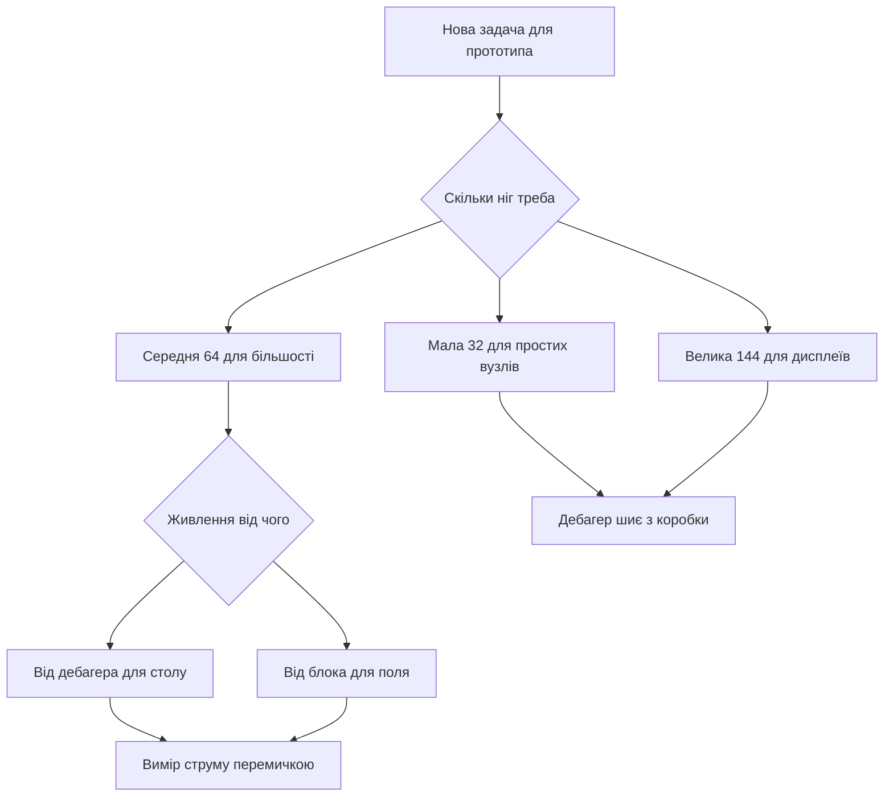

# Nucleo - плати з дебагером з коробки

![[assets/img/stm32-nucleo-board-scheme.png|600]]
*Рис. Плата Nucleo: вбудований дебагер, гребінки розширення і перемички живлення.*

> [!tip] Призначення ноти
> Пояснити чому ця лінійка головна для старту: дебагер вже на платі, віртуальний порт з коробки і сумісність з модулями розширення.

## 1. Призначення

Лінійка закриває навчання і прототипи без купівлі програматора. Вбудований дебагер шиє свій контролер і зовнішні плати через дроти. Віртуальний порт дає консоль тим самим кабелем.

Три розміри дають вибір: маленька для компактних вузлів, середня для більшості задач, велика для процесорів з багатьма пінами. Сумісність з модулями розширення відкриває доступ до готових щитів.

Вимірювання струму через перемичку вчить оцінювати споживання. Гребінки з signals контролера дають доступ до всіх інтерфейсів.

## 2. Лінійка трьох розмірів

| Формат | Контролер приклад | Пінів | Коли брати |
| --- | --- | --- | --- |
| Мала 32 | F031, F042, G431 | 32 | Компактні вузли і навчання базове |
| Середня 64 | F103, F401, G474, L476 | 64 | Універсальна для більшості проєктів |
| Велика 144 | F429, F746, H743 | 144 | Дисплеї, мережа і запас інтерфейсів |

```text
Компонування середньої плати:
  +------------------------------------------+
  | [USB дебагер]  [Кнопка RESET чорна]      |
  | [Кнопка USER синя] [LED зелений LD2]     |
  |                                          |
  |  Контролер по центру                     |
  |  Кварц і кнопка користувача поруч        |
  |                                          |
  |  Морфо-гребінки ліва і права             |
  |  Гребінки під щити зверху і знизу        |
  |  Перемичка виміру струму IDD             |
  +------------------------------------------+
```

## 3. Вбудований дебагер

| Можливість | Як працює | Навіщо |
| --- | --- | --- |
| Прошивка свого | Через кабель з коробки | Старт без покупок |
| Прошивка зовнішньої | Вихідні сигнали на гребінці | Шиє прості плати поруч |
| Віртуальний порт | Міст до послідовного порту | Консоль без перетворювача |
| Оновлення | Окрема утиліта прошивки | Лікує старі версії |
| Живлення | Від роз'єму дебагера | Живить слабкі макети |

Дебагер шиє і зовнішні плати: зняти перемички, підключити три дроти сигналів і землю. Це рятує коли проста плата без дебагера лежить поруч.

## 4. Перемички живлення

| Позначення | Призначення | Положення |
| --- | --- | --- |
| JP5 | Вимір струму | Знята для амперметра |
| U5V | Живлення від дебагера | Замкнута за замовчуванням |
| E5V | Зовнішні 5 В | Замкнута при блоці живлення |
| VIN | Вхід 7-12 В | Через стабілізатор плати |

Типова помилка це живлення з двох джерел одночасно. Правило одне джерело для однієї плати. Вимір струму це зняти перемичку і в розрив увімкнути амперметр.

```text
Варіанти живлення однієї плати:
  Від дебагера ........ U5V замкнута, E5V розімкнута
  Від блока 5V ........ E5V замкнута, кабель дебагера тільки дані
  Від VIN 7-12V ....... VIN вхід, перемички за схемою плати
  Вимір струму ........ JP5 знята, амперметр у розрив
```

## 5. Гребінки розширення

| Гребінка | Що виведено | Сумісність |
| --- | --- | --- |
| Морфо ліва | Живлення і аналогові | Всі сигнали контролера |
| Морфо права | Цифрові і інтерфейси | Прямий доступ без щитів |
| Щити зверху | Живлення 5 В і 3.3 В | Модулі розширення |
| Щити знизу | Послідовний і двопровідний | Датчики готовими пакетами |

Сумісність з щитами дає дисплей, мережу і мотори без паяння. Морфо-гребінки дають чисті сигнали для осцилографа і логічного аналізатора.

## 6. Вибір плати під задачу

| Задача | Яку брати | Чому |
| --- | --- | --- |
| Навчання базове | Мала 32 з простим чипом | Дешево і вистачає |
| Універсальна | Середня 64 з запасом | Більшість прикладів саме під неї |
| Дисплей і графіка | Велика 144 з контролером дисплея | Шина і пам'ять для кадрів |
| Низьке споживання | Варіант з літерою L | Режими сну і вимір струму |
| Звук і мотори | Варіант з F4 або G4 | Швидкість і точні таймери |
| Мережа дротова | Велика з мережевим інтерфейсом | Фізичний рівень на платі |

## 7. Перший проєкт крок за кроком

```text
Старт за десять хвилин:
  1. Постав перемичку живлення U5V.
  2. З'єднай кабелем роз'єм дебагера і комп'ютер.
  3. Відкрий графічний конфігуратор і вибери свою плату.
  4. Увімкни тактування від кварца і зелений світлодіод.
  5. Згенеруй код і натисни збірку.
  6. Натисни прошивку і дивись миготіння.
  7. Відкрий термінал віртуального порту для повідомлень.
```

```c
#include "stm32f4xx_hal.h"

extern UART_HandleTypeDef huart2;

void nucleo_hello(void)
{
  const char *msg = "Nucleo жива\r\n";
  HAL_UART_Transmit(&huart2, (uint8_t *)msg, 14, 500);
}

int main(void)
{
  HAL_Init();
  SystemClock_Config();
  MX_GPIO_Init();
  MX_USART2_UART_Init();
  nucleo_hello();
  while (1)
  {
    HAL_GPIO_TogglePin(GPIOA, GPIO_PIN_5);
    HAL_Delay(500);
  }
}
```

Зелений світлодіод на більшості плат висить на лінії PA5. Кнопка користувача на PC13 дає вхід для пауз і меню.

```c
#include "stm32f4xx_hal.h"

int nucleo_button_pressed(void)
{
  return HAL_GPIO_ReadPin(GPIOC, GPIO_PIN_13) == GPIO_PIN_RESET;
}

void nucleo_wait_button(void)
{
  while (!nucleo_button_pressed())
  {
    HAL_Delay(20);
  }
  HAL_Delay(50);
}
```

## 8. Вимірювання струму через перемичку

| Крок | Дія | Очікування |
| --- | --- | --- |
| 1 | Зняти перемичку виміру | Розрив шини живлення |
| 2 | Амперметр у розрив | Межа міліампер |
| 3 | Прошивка з циклами сну | Струм падає в паузах |
| 4 | Запис трьох значень | Робота, сон, простій |

Вимір вчить бачити ціну мегагерців: зниження частоти вдвічі ріже споживання помітно. Режими сну дають мікроампери між вимірами.

## 9. Mermaid: вибір плати



## 10. Зовнішня прошивка через дебагер

```text
Шиємо просту плату дебагером цієї:
  Дебагер Nucleo       Проста плата
  ----------------     ----------------
  SWCLK -------------- SWCLK
  SWDIO -------------- SWDIO
  GND ---------------- GND
  3V3 ---------------- 3V3 (якщо слабка)
  Крок: зняти перемички дебагера на цій платі!
```

## Типові помилки

| # | Помилка | Чому погано | Як правильно |
| --- | --- | --- | --- |
| 1 | Два джерела живлення разом | Зустрічні стабілізатори гріються | Одне джерело і правильні перемички |
| 2 | Стара прошивка дебагера | Обриви і невідомий пристрій | Оновити утилітою перед роботою |
| 3 | Щит з 5 В логікою | Перевантаження входів | Дільники або перетворювачі рівнів |
| 4 | Вимір струму без розриву | Амперметр паралельно дає коротке | Тільки в розрив знятої перемички |
| 5 | Плутанина номерів гребінок | Дзеркальні назви сигналів | Звіряти схему саме своєї ревізії |
| 6 | Консоль не бачить порт | Забутий міст дебагера | Перевірити порт після підключення кабеля |

## Офіційні джерела

- [Керівництво плат середнього формату (ST)](https://www.st.com/resource/en/user_manual/um1724-stm32-nucleo64-boards-mb1136-stmicroelectronics.pdf) - перемички, живлення і дебагер.
- [Керівництво малих плат (ST)](https://www.st.com/resource/en/user_manual/um1956-stm32-nucleo32-boards-based-on-32pin-stm32-mcus-stmicroelectronics.pdf) - компактний формат і межі.
- [Оновлення прошивки дебагера (ST)](https://www.st.com/en/development-tools/stsw-link007.html) - утиліта оновлення і драйвери.

## Див. також

- [[Home]]
- [[00-Start/04-Devkit-plati|огляд плат]]
- [[09-Proshivka/01-CubeIDE-CubeMX|налаштування CubeMX]]
- [[09-Proshivka/03-ST-Link-Proshivka|прошивка через ST-Link]]
- [[14-Devboards/01-Blue-Pill|плата Blue Pill]]
