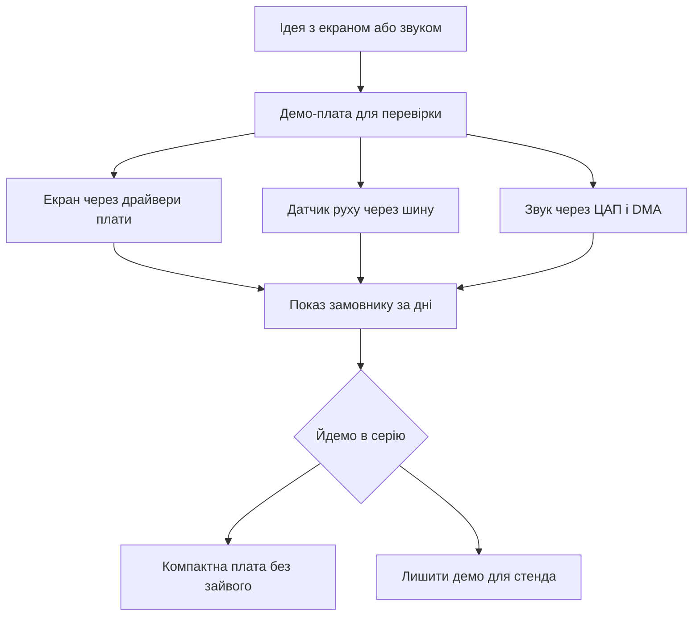

# Discovery - демо-плати з периферією

![[assets/img/stm32-discovery-board-scheme.png|600]]
*Рис. Плата Discovery: дисплей, датчики руху, звуковий тракт і кнопки введення.*

> [!tip] Призначення ноти
> Показати коли брати демо-плату замість універсальної: потрібен екран, звук або датчики з коробки для швидкої перевірки ідеї.

## 1. Призначення

Демо-плата це вітрина можливостей контролера: дисплей, датчики руху, мікрофони, звуковий тракт і кнопки вже розпаяні. Ідея перевіряється без макетних дротів і пошуку модулів.

Заводська прошивка одразу показує графіку, звук і сенсори в дії. Пакет драйверів плати дає прості виклики для екрана і звуку. Приклади виробника розкривають кожен вузол окремо.

Для серії плата завелика і дорога, але для прототипа економить тижні. Після перевірки ідеї проєкт переносять на компактну плату.

## 2. Що є на платі

| Вузол | Приклад | Навіщо |
| --- | --- | --- |
| Дисплей | Кольоровий з сенсором | Графіка і меню без модулів |
| Датчик руху | Акселерометр і гіроскоп | Жести і нахил |
| Мікрофони | Цифрові з інтерфейсом | Голос і рівень шуму |
| Звуковий тракт | ЦАП і підсилювач | Мелодії і сигнали |
| Кнопки | Скидання і користувача | Введення без дротів |
| Дебагер | Вбудований з віртуальним портом | Прошивка з коробки |
| Пам'ять | Зовнішня флеш для кадрів | Картинки і шрифти |

```text
Компонування демо-плати:
  +------------------------------------------+
  | [USB дебагер]  [USB користувача]        |
  |                                          |
  |  +------------------------------------+  |
  |  |   Дисплей кольоровий з сенсором  |  |
  |  +------------------------------------+  |
  |                                          |
  |  Контролер + зовнішня флеш поруч         |
  |  Датчик руху + мікрофони з краю          |
  |  ЦАП звук + кнопки знизу                 |
  |  Гребінки розширення по боках            |
  +------------------------------------------+
```

## 3. Популярні варіанти

| Плата | Контролер | Екран | Фішка |
| --- | --- | --- | --- |
| F4 класика | F407 або F429 | Кольоровий | Дешева і тони прикладів |
| F7 швидка | F746 або F769 | Великий з сенсором | Швидка графіка і кеш |
| H7 флагман | H743 або H747 | Висока роздільність | Запас для складних інтерфейсів |
| L4 економна | L476 | Малий | Низьке споживання з екраном |

Вибір залежить від задачі: звук тягне навіть класика, плавна графіка просить швидку, складна логіка з мережею просить флагман.

## 4. Заводська прошивка

| Крок | Дія | Результат |
| --- | --- | --- |
| 1 | Живлення від кабелю | Екран світиться меню |
| 2 | Гортання сенсором | Сторінки демо |
| 3 | Нахил плати | Кулька або стрілка рухається |
| 4 | Кнопка користувача | Зміна режиму |
| 5 | Підключення навушників | Звукові приклади |

Демо варто зберегти окремим файлом перед своєю прошивкою. Злитий образ дозволяє повернути вітрину для показу. Утиліта зчитує образ через дебагер.

## 5. Пакет драйверів плати

| Виклик | Що робить | Коли зручно |
| --- | --- | --- |
| Ініціалізація екрана | Налаштовує шину і підсвітку | Старт графіки одним рядком |
| Очищення екрана | Заливка кольором | Новий кадр меню |
| Вивід тексту | Шрифт на координати | Підписи і значення |
| Малювання кола | Примітив для індикаторів | Стрілки і шкали |
| Старт звуку | Налаштовує ЦАП і DMA | Мелодії без тріску |
| Читання датчика | Опитує рух через шину | Жести кожні 20 мс |

Драйвери плати лежать окремо від рівня абстракції контролера. Вони знають адреси мікросхем і розводку саме цієї плати. Перенос на свою плату вимагає своїх адрес і пінів.

```text
Шари коду для демо-плати:
  Твій код (меню, гра, виміри)
  -----------------------------
  Драйвери плати (екран, звук, датчики)
  -----------------------------
  Рівень абстракції (шина, таймер, DMA)
  -----------------------------
  Залізо контролера
```

## 6. Коли брати замість універсальної

| Задача | Чому демо краще | Межа |
| --- | --- | --- |
| Перевірка меню за день | Екран і сенсор вже є | Потім робити компактно |
| Датчик руху в керуванні | Калібрований вузол на платі | Точність побутова |
| Звукові сигнали | Тракт з підсилювачем | Гучність для столу |
| Навчання графіці | Приклади з кадрами | Пам'ять під великі картинки |
| Показ замовнику | Красива вітрина | Ціна для серії зависока |

Універсальна плата дешевша і гнучкіша для серії. Демо виграє швидкістю старту: розпакував, увімкнув, бачиш результат.

## 7. Код: екран через драйвери

```c
#include "stm32f429i_discovery_lcd.h"

void demo_lcd_start(void)
{
  BSP_LCD_Init();
  BSP_LCD_LayerDefaultInit(1, LCD_FRAME_BUFFER);
  BSP_LCD_SelectLayer(1);
  BSP_LCD_Clear(LCD_COLOR_DARKBLUE);
  BSP_LCD_SetFont(&LCD_DEFAULT_FONT);
  BSP_LCD_SetTextColor(LCD_COLOR_WHITE);
  BSP_LCD_DisplayStringAtLine(2, (uint8_t *)"Discovery жива");
}

void demo_lcd_value(int line, int value)
{
  char buf[24];
  sprintf(buf, "Значення: %d", value);
  BSP_LCD_DisplayStringAtLine(line, (uint8_t *)buf);
}

void demo_lcd_circle(uint16_t x, uint16_t y, uint16_t r)
{
  BSP_LCD_SetTextColor(LCD_COLOR_YELLOW);
  BSP_LCD_DrawCircle(x, y, r);
}
```

Буфер кадру лежить у зовнішній пам'яті для великих роздільностей. Шар дозволяє малювати меню окремо від фону. Шрифти тримають кирилицю частково, перевіряти таблицею символів.

```c
#include "stm32f429i_discovery_gyroscope.h"
#include "stm32f429i_discovery_audio.h"

void demo_motion_start(void)
{
  BSP_GYRO_Init();
}

void demo_motion_poll(float *gx, float *gy, float *gz)
{
  BSP_GYRO_GetXYZ(gx, gy, gz);
}

void demo_beep(void)
{
  BSP_AUDIO_OUT_Init(OUTPUT_DEVICE_HEADPHONE, 70, 44100);
  BSP_AUDIO_OUT_Play((uint16_t *)tone_buf, TONE_LEN);
  HAL_Delay(200);
  BSP_AUDIO_OUT_Stop(CODEC_PDWN_SW);
}
```

Опитування датчика кожні 20 мс дає плавні жести. Звук через прямий доступ не вантажить ядро. Гучність 70 це голосно для навушників, починати з меншої.

## 8. Mermaid: від ідеї до серії



## 9. Живлення і споживання

| Режим | Споживання | Пояснення |
| --- | --- | --- |
| Демо з підсвіткою | Сотні міліампер | Екран їсть найбільше |
| Звук на динамік | Піки вище середнього | Підсилювач просить струму |
| Сон з екраном вимк | Міліампери | Датчики можна приспати |
| Живлення | Від роз'єму | Блок для стабільної картинки |

Для батарейного вузла екран гасять між показами. Підсвітку керують широтно-імпульсною модуляцією для економії.

## Типові помилки

| # | Помилка | Чому погано | Як правильно |
| --- | --- | --- | --- |
| 1 | Драйвери від іншої ревізії | Інші адреси і екран білий | Брати пакет саме під свою плату |
| 2 | Кадр у внутрішній пам'яті | Не влазить і падає | Буфер у зовнішній пам'яті |
| 3 | Опитування датчика в циклі без пауз | Шина забита, графіка гальмує | Таймер кожні 20 мс |
| 4 | Гучність на максимум одразу | Спотворення і переляк | Починати з малої і додавати |
| 5 | Перенос коду на свою плату без змін | Адреси і піни інші | Переписати рівень плати під свою схему |
| 6 | Стерта заводська прошивка | Немає що показати швидко | Злити образ перед своєю заливкою |

## Офіційні джерела

- [Демо-плата з контролером F429 (ST)](https://www.st.com/en/evaluation-tools/32f429idiscovery.html) - схема, дисплей і приклади.
- [Пакет драйверів для демо-плат (ST)](https://www.st.com/en/embedded-software/stm32cubef4.html) - драйвери екрана, звуку і датчиків.
- [Керівництво швидкого старту демо (ST)](https://www.st.com/resource/en/user_manual/um1670-discovery-kit-with-stm32f429zi-mcu-stmicroelectronics.pdf) - перше ввімкнення і режими.

## Див. також

- [[Home]]
- [[14-Devboards/03-Nucleo|плати Nucleo]]
- [[01-Hardware/02-F3-F4|продуктивні F3 і F4]]
- [[04-Shini/02-SPI|шина SPI]]
- [[00-Start/04-Devkit-plati|огляд плат]]
