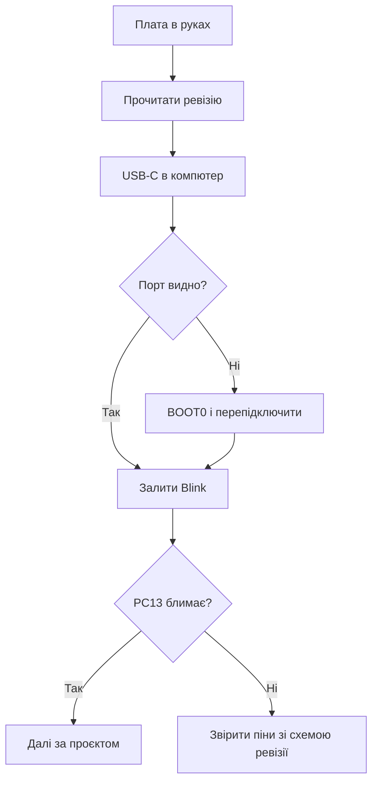

# WeAct-плати - міні-модулі з USB-C

![[assets/img/stm32-weact-board-scheme.png|600]]
*Рис. Мінімум розміру, максимум зручності: USB-C, кнопки, документація.*

> [!tip] Призначення ноти
> Навчити вибирати і шити WeAct-плати: моделі, ревізії, USB-режими і приклади.

## 1. Призначення

WeAct Studio робить акуратні міні-плати: Black Pill, MiniF4, Mini Debugger окремо. USB-C з даними, кнопки NRST і BOOT0 на платі, схеми у відкритому доступі. Для прототипів це крок угору від безіменних клонів: відома розводка і живі приклади.

## 2. Модельний ряд: що брати

| Плата | Чип | Особливість | Для чого |
| --- | --- | --- | --- |
| Black Pill F401 | F401CC | USB-C, FPU | Універсальний прототип |
| Black Pill F411 | F411CE | Більше памяті | USB-девайси, звук |
| MiniF4 F401 | F401CC | Компактна | Вбудовані вузли |
| Mini Debugger | - | ST-Link клон | Прошивка голих плат |

## 3. Ревізії: перевіряй перед купівлею

| Тема | Практика |
| --- | --- |
| Номер ревізії | На шовкографії плати! |
| Зміни між ревізіями | Кварц, LDO, розводка USB |
| Приклади під ревізію | Код зі старої може не зійтись пінами |
| Відгуки | Свіжі партії перевіряти першою |

## 4. USB-C: дані, а не тільки живлення

| Режим | Як увімкнути |
| --- | --- |
| CDC VCP | Прошивка з USB-стеком |
| DFU прошивка | BOOT0 при підключенні! |
| Живлення | USB-C дає більше струму |

```text
Перша DFU-прошивка без ST-Link:
  затиснути BOOT0, підключити USB;
  залити через DfuSe або dfu-util;
  відпустити, натиснути NRST.
```

## Mermaid: старт з WeAct



## 5. Приклади WeAct: де брати

| Джерело | Що всередині |
| --- | --- |
| GitHub WeAct | Приклади під кожну плату |
| Схеми плат | PDF з розводкою |
| Заводські демо | USB, дисплей, SD |

## 6. WeAct проти безіменних клонів

| Критерій | WeAct | Клон |
| --- | --- | --- |
| Схема | Відкрита | Вгадай сам |
| USB-C | З даними | Часто тільки живлення |
| Кварц | Нормальний | Буває перемарковано |
| Ціна | Трохи дорожче | Дешевше |

## Типові помилки

| # | Помилка | Чому погано | Як правильно |
| --- | --- | --- | --- |
| 1 | Ревізію не подивились | Піни не зійшлись | Читати шовкографію! |
| 2 | Старий приклад | Інша розводка | Приклад під свою ревізію |
| 3 | DFU без BOOT0 | Порта немає | Кнопка при підключенні |
| 4 | Живлення моторів з плати | LDO вмирає | Окремий БЖ! |
| 5 | Дешевий кабель USB-C | Тільки живлення | Кабель з даними |
| 6 | NRST не виведено в коді | Немає скидання | Кнопка на платі є |
| 7 | Клон замість WeAct | Сюрпризи з кварцом | Перевіряти st-info |

## Зберігання і ESD: дрібниці з ціною

| Правило | Пояснення |
| --- | --- |
| Антистатичний пакет | Гола плата без нього вбивається взимку |
| Не класти на метал | Коротке знизу |
| USB-C гніздо берегти | Механічно найслабше місце |

## Офіційні джерела

- [WeAct GitHub (WeAct Studio)](https://github.com/WeActStudio) - приклади, схеми, прошивки.
- [MiniF4 product page (WeAct)](https://github.com/WeActStudio/MiniF4-STM32F4x1) - розводка і демо.

## Mini Debugger: прошивка голих плат

| Тема | Практика |
| --- | --- |
| Підключення | SWDIO, SWCLK, GND, NRST до своєї плати |
| Живлення цілі | Краще окреме, не від дебагера! |
| CubeProgrammer | Бачить як звичайний ST-Link |
| Оновлення прошивки | Дебагер сам шиється через USB |

## Живлення периферії з плати: межі

| Споживач | Можна? |
| --- | --- |
| Датчики міліамперні | Так, з 3.3 В плати |
| Дисплей маленький | Так, з запасом |
| Реле і мотори | Ні! Окремий БЖ |
| ESP-модуль поруч | Ні, піки WiFi вбивають LDO |

```text
Правило струму:
  сума споживачів менше половини LDO;
  гріється палець — вже забагато;
  реле і мотори завжди окремо.
```

## WeAct проти Nucleo: коли що

| Задача | Вибір |
| --- | --- |
| Навчання з дебагом | Nucleo, все з коробки |
| Компактний вузол | WeAct міні |
| Своя плата потім | WeAct як референс розводки |
| Вимір струму | Тільки Nucleo з IDD! |

## Див. також

- [[Home]]
- [[14-Devboards/02-Black-Pill|плата Black Pill]]
- [[14-Devboards/01-Blue-Pill|плата Blue Pill]]
- [[14-Devboards/03-Nucleo|плати Nucleo]]
- [[04-Shini/05-USB|порт USB]]
- [[09-Proshivka/03-ST-Link-Proshivka|прошивка через ST-Link]]
