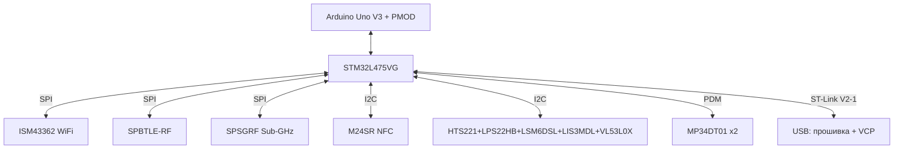
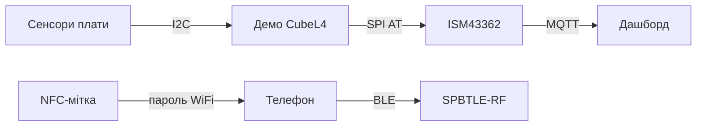

# STM32 IoT-вузол B-L475E-IOT01A - BLE, Sub-GHz, NFC і сенсори на борту

![[assets/img/stm32-iot-discovery-scheme.png|600]]
*Рис. B-L475E-IOT01A: L475 + WiFi/BLE/Sub-GHz/NFC і повний набір сенсорів - готовий IoT-вузол з коробки.*

> [!tip] Що це за нота
> Одна плата замість макетки з десятком модулів: тут уже розпаяні WiFi, BLE, Sub-GHz, NFC і шість сенсорів. Ідеальна відповідь на питання «з чого почати STM32+хмара». База: [[14-Devboards/04-Discovery|лінійка Discovery]], [[01-Hardware/05-L0-L4-U5|родини L0/L4/U5]].

## 1. Мета

Показати плату як готовий IoT-вузол без паяння:

- що вже на борту і за що відповідає кожен чип;
- як прошити демо WiFi/BLE за 15 хвилин;
- куди підключати свої датчики (Arduino-роз'єм, PMOD);
- скільки живе від батарейки в різних режимах.

| Блок | Чип на платі | Навіщо |
| --- | --- | --- |
| MCU | STM32L475VG, M4 80 МГц, 1 МБ flash | ядро вузла |
| WiFi | Inventek ISM43362-M3G-L44 | хмара по SPI |
| BLE | SPBTLE-RF (BlueNRG) | телефон, маячки |
| Sub-GHz | SPSGRF-868/915 | дальній радіоканал |
| NFC | M24SR, друкована антена | спарювання дотиком |
| Сенсори | HTS221, LPS22HB, LSM6DSL, LIS3MDL, VL53L0X, MP34DT01 ×2 | клімат, рух, дальність, звук |

## 2. Архітектура плати



ST-Link V2-1 на платі - прошивка по USB без зовнішнього програматора, плюс віртуальний COM-порт для логів.

## 3. Перший запуск

- драйвери ST-Link, STM32CubeProgrammer або прямо з CubeIDE;
- приклад `B-L475E-IOT01A/Demonstration` зі STM32CubeL4 - WiFi + датчики + хмара;
- WiFi-креденшали - через VCP-термінал командами демо;
- BLE-демо - маячок + сервіси, видно в nRF Connect;
- NFC - запис WiFi-пароля в тег, телефон читає дотиком.

## 4. Сенсори на борту детально

| Сенсор | Що міряє | Шина |
| --- | --- | --- |
| HTS221 | вологість + температура | I2C |
| LPS22HB | тиск 260-1260 гПа | I2C |
| LSM6DSL | акселерометр + гіроскоп | I2C/SPI, переривання руху |
| LIS3MDL | магнітометр 3 осі | I2C |
| VL53L0X | дальність ToF | I2C 0x29 |
| MP34DT01 ×2 | звук, PDM | DFSDM/SAI |

Це готовий набір для метеостанції з компасом і детектором руху - див. [[16-Proekti/01-Meteostantsiya|метеостанцію]] і [[10-Sensori/14-Mag-Gesture-RTC|магнітометри]].

## 5. Робочий код HAL

Читання HTS221 (типовий I2C-сенсор плати):

```c
float hts_read_temp(void) {
  uint8_t reg = 0x2A | 0x80;
  uint8_t b[2];
  HAL_I2C_Master_Transmit(&hi2c2, 0xBE, &reg, 1, 50);
  HAL_I2C_Master_Receive(&hi2c2, 0xBE, b, 2, 50);
  int16_t raw = (b[1] << 8) | b[0];
  return 42.5f + raw / 480.0f;
}

void iot_sensors_poll(float *t, float *h, float *p) {
  *t = hts_read_temp();
  *h = hts_read_humi();
  *p = lps_read_press() / 100.0f;
}
```

Адреса HTS221 - 0x5F (зсунута 0xBE/0xBF), автоінкремент - біт 0x80 в адресі регістра. Калібрувальні коефіцієнти лежать в OTP самого HTS221 - читаємо один раз при старті.

## 6. Живлення і енергоспоживання

| Режим | Струм | Час від 2×AA (2000 мАг) |
| --- | --- | --- |
| Run 80 МГц + WiFi TX | ~120 мА | години (демо) |
| Run + BLE реклама | ~15 мА | ~5 діб |
| Stop 2 + RTC | ~2 мкА + сенсори | місяці |
| Будильник руху LSM6DSL | переривання | роки в очікуванні |

Для батарейного вузла: Stop 2 між вимірами, WiFi - раз на годину пакетом, BLE-реклама - рідко. Деталі: [[07-Timeri-Son/03-Sleep-Stop-Standby|режими сну]].

## 6.1 Хмара за 15 хвилин: шлях даних



Порядок: прошиваємо демо, правимо SSID/пароль у `wifi_config.h`, дивимось телеметрію у VCP-терміналі, лише потім правимо під себе. BLE-маячок видно одразу після старту - перевірка одним поглядом у nRF Connect.

## 7. Розширення

- Arduino Uno V3 - шилди реле, дисплеїв, моторів;
- PMOD - модулі Digilent (BT, дисплей, датчики);
- власні датчики - вільні I2C/SPI/UART на гребінках;
- Sub-GHz антена - U.FL роз'єм, не забути антену (див. [[05-Radio/03-Antena-50ohm|узгодження антен]]).

## 8. Типові помилки

| Симптом | Причина | Лікування |
| --- | --- | --- |
| ST-Link не бачить плату | перемички живлення ST-Link | JP: U5V, драйвер ST-Link переустановити |
| WiFi не конектиться | 5 ГГц мережа (модуль лише 2.4) | точка 2.4 ГГц, WPA2, без спецсимволів у паролі |
| I2C сенсори мовчать | шина зайнята NFC або швидкість | 100 кГц для старту, сканер адрес |
| BLE не рекламується | демо без ініціалізації BlueNRG | приклад BLE_Beacon зі CubeL4 |
| Жере батарею | WiFi не спить | Stop 2 + вимикання ISM43362 між сесіями |
| NFC не читається | антена закрита металом корпусу | пластиковий корпус, мітка догори |

## 9. Суміжні ноти

- [[14-Devboards/04-Discovery|лінійка Discovery]] - огляд усіх плат.
- [[14-Devboards/03-Nucleo|лінійка Nucleo]] - альтернатива без радіо.
- [[01-Hardware/05-L0-L4-U5|родини L0/L4/U5]] - low-power лінійка.
- [[10-Sensori/14-Mag-Gesture-RTC|магнітометри і RTC]] - сенсори плати детально.
- [[16-Proekti/01-Meteostantsiya|метеостанція]] - перший проєкт на платі.

## Офіційні джерела

- [B-L475E-IOT01A (STMicroelectronics)](https://www.st.com/en/evaluation-tools/b-l475e-iot01a.html) - характеристики, схеми, Gerber.
- [Disco L475 IoT1 (Zephyr)](https://docs.zephyrproject.org/latest/boards/st/disco_l475_iot1/doc/index.html) - підтримка Zephyr, мапа пінів.
- [STM32CubeL4 (STMicroelectronics, GitHub)](https://github.com/STMicroelectronics/STM32CubeL4) - HAL, демо B-L475E-IOT01A.
