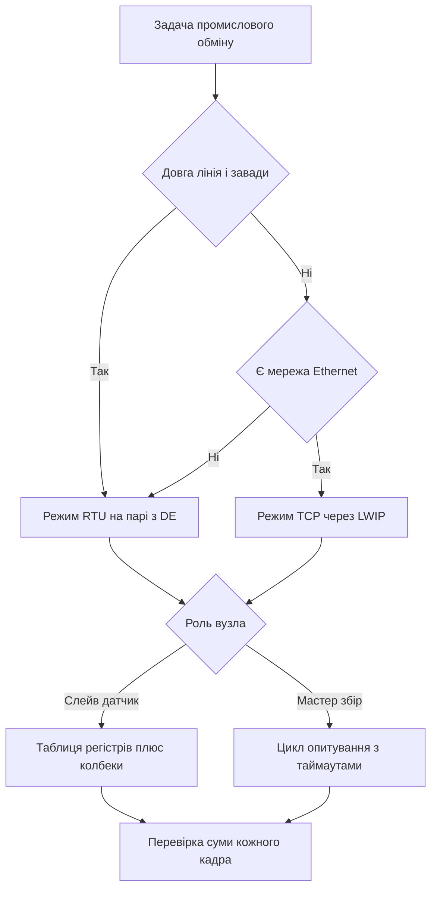

# Modbus RTU і TCP - регістри і CRC

![[assets/img/stm32-modbus-scheme.png|600]]
*Рис. Схема Modbus на STM32: слейв на парі, мастер опитування, перехід у TCP через мережу.*

> [!tip] Призначення ноти
> Дати робочу карту промислового обміну: як влаштований кадр, як рахувати суму, як розкласти регістри, як тримати паузу і як підняти слейв на контролері.

## 1. Призначення

Modbus лишається головною мовою промислової автоматики: лічильники енергії, перетворювачі частоти, датчики температури, контролери вентиляції. Один мастер опитує десятки слейвів на спільній парі або через мережу. Протокол простий, тому живе десятиліттями.

На STM32 типовий вузол це слейв на парі через прийомопередавач або мастер що збирає дані з лічильників. Детальніше про фізичний рівень дивись [[04-Shini/01-UART|послідовний порт UART]] і [[12-Moduli-zvyazku/02-RS485-CAN-Ethernet|дротові мережі]]. Перехід у мережу дає режим TCP через стек LWIP без зміни логіки регістрів.

## 2. Кадр RTU і поле контрольної суми

Кадр RTU це щільний потік байт без роздільників. Межі кадрів задає лише пауза на лінії. Кожен байт шлється як 8N1 або 8E1.

| Поле | Довжина | Зміст |
| --- | --- | --- |
| Адреса | 1 байт | Номер слейва від 1 до 247, нуль означає широкомовну розсилку |
| Функція | 1 байт | Код операції, наприклад читання або запис |
| Дані | Змінна | Адреса регістра, кількість, значення |
| Контрольна сума | 2 байти | Сума CRC16, молодший байт першим |

```text
Кадр запиту читання:
  Адреса ............ 0x01, слейв номер один
  Функція ........... 0x03, читання регістрів зберігання
  Початкова адреса .. 0x00 0x00, перший регістр карти
  Кількість ......... 0x00 0x02, прочитати два регістри
  Сума .............. 0xC4 0x0B, приклад суми для цього запиту
  Пауза до і після .. тиша довжиною у паузу між кадрами
```

| Властивість суми | Пояснення |
| --- | --- |
| Поліном | 0xA001, зворотний запис відомого полінома |
| Початок | 0xFFFF, стартове значення регістра суми |
| Порядок | Молодший байт суми шлється першим |
| Перевірка | Незбіг означає битий кадр, відповіді немає |

```text
Алгоритм суми крок за кроком:
  1. Завантаж регістр значенням FFFF
  2. Для кожного байта зроби XOR з молодшим байтом регістра
  3. Вісім разів зсунь вправо, якщо був перенос додай поліном
  4. Повтори для всіх байт кадру без поля суми
  5. Готовий результат допиши молодшим байтом уперед
```

## 3. Функції читання і запису

Чотирьох функцій вистачає для більшості задач. Решта кодів потрібна для діагностики і подій.

| Код | Назва | Що робить |
| --- | --- | --- |
| 03 | Читання регістрів зберігання | Читає групу слів для уставок і стану |
| 04 | Читання вхідних регістрів | Читає виміри без права запису |
| 06 | Запис одного регістра | Пише одне слово за вказаною адресою |
| 16 | Запис групи регістрів | Пише кілька слів одним кадром |

```text
Приклади обміну:
  03 .......... мастер просить два слова, слейв повертає чотири байти даних
  04 .......... мастер читає температуру і напругу як вхідні слова
  06 .......... мастер пише уставку у одне слово, слейв повторює кадр у відповідь
  16 .......... мастер пише блок уставок, слейв підтверджує адресу і кількість
  Помилка ..... слейв повертає код плюс 0x80 і номер винятку
```

| Виняток | Номер | Коли повертати |
| --- | --- | --- |
| Заборонена функція | 01 | Код не підтримується вузлом |
| Заборонена адреса | 02 | Адреса поза картою регістрів |
| Заборонене значення | 03 | Кількість або значення поза межами |
| Відмова слейва | 04 | Внутрішня помилка обробки |

## 4. Карта регістрів вузла

Карта це договір між мастером і слейвом. Без паперової карти обидва боки розуміють дані по різному.

| Адреса | Тип | Зміст | Доступ |
| --- | --- | --- | --- |
| 0x0000 | Зберігання | Уставна температура у десятих градуса | Читання і запис |
| 0x0001 | Зберігання | Режим роботи вентилятора | Читання і запис |
| 0x0002 | Зберігання | Гістерезис у десятих градуса | Читання і запис |
| 0x0010 | Вхідний | Фактична температура у десятих градуса | Тільки читання |
| 0x0011 | Вхідний | Напруга живлення у мілівольтах | Тільки читання |
| 0x0020 | Вхідний | Лічильник помилок обміну | Тільки читання |
| 0x0030 | Зберігання | Адреса вузла на лінії | Читання і запис |

| Правило карти | Пояснення |
| --- | --- |
| Нумерація з нуля | Адреса у кадрі завжди на один менша за номер у документації |
| Масштаб величин | Десяткові значення шлють як цілі у десятих або сотих |
| Резерв | Залишити запас адрес під нові параметри |
| Версія | Окреме слово з версією карти для перевірки мастером |

```text
Фрагмент карти для паспорта виробу:
  Слово 0x0000 ...... уставка, діапазон від 50 до 300, означає від 5 до 30 градусів
  Слово 0x0010 ...... вимір, від мінус 400 до 850, означає температуру датчика
  Слово 0x0020 ...... діагностика, росте на кожному битму кадрі
  Слово 0x00F0 ...... версія карти, мастер звіряє перед опитуванням
```

## 5. Пауза між кадрами і керування напрямом

Межі кадрів тримаються паузою у 3.5 символу. Символ це старт плюс дані плюс парність плюс стоп. На 9600 пауза становить близько 4 мс, на 115200 менше мілісекунди.

| Швидкість | Час символу 11 біт | Пауза 3.5 символу |
| --- | --- | --- |
| 9600 | Близько 1.15 мс | Близько 4.0 мс |
| 19200 | Близько 0.57 мс | Близько 2.0 мс |
| 115200 | Близько 0.10 мс | Близько 0.35 мс |

Пара півдуплексна, тому напрям задає пін DE драйвера. Контролер вміє керувати цим піном апаратно без участі програми.

```text
Вузол на парі:
  TX контролера ---> DI драйвера пари
  RX контролера <--- RO драйвера пари
  DE контролера ---> DE і RE драйвера разом
  A і B ---> вита пара з термінатором 120 Ом на кінцях лінії
  Пауза ---> тиша на лінії означає межу кадру
```

| Параметр | Зміст | Типове значення |
| --- | --- | --- |
| Полярність DE | Активний високий рівень на час передачі | Високий під час кадра |
| Затримка до кадра | Пауза від підняття DE до першого біта | Один або два символи |
| Затримка після кадра | Пауза від останнього біта до зняття DE | Один або два символи |
| Термінатор | Резистор між A і B на кінцях шини | 120 Ом |
| Зміщення | Підтяжка простою на ведучому вузлі | Пара резисторів по 680 Ом |

## 6. Modbus TCP і заголовок MBAP

Режим TCP ховає паузи всередину потоку. Межі задає довжина у заголовку, тому таймаути лінії не потрібні.

| Поле заголовка | Довжина | Зміст |
| --- | --- | --- |
| Ідентифікатор | 2 байти | Номер транзакції для пари запит відповідь |
| Протокол | 2 байти | Завжди нуль для Modbus |
| Довжина | 2 байти | Кількість байт далі включно з адресою вузла |
| Адреса вузла | 1 байт | Номер слейва за шлюзом або 255 при прямому з'єднанні |

```text
Порівняння режимів:
  RTU ........... адреса 1 байт, функція, дані, сума, межі паузою
  TCP ........... заголовок 7 байт, адреса, функція, дані, без суми
  Сума у TCP .... не потрібна, цілісність дає контрольна сума мережі
  Шлюз .......... перекладає TCP у RTU і чекає паузу на парі
```

| Відмінність | RTU на парі | TCP у мережі |
| --- | --- | --- |
| Межі кадра | Пауза 3.5 символу | Поле довжини у заголовку |
| Сума | CRC16 обов'язкова | Не використовується |
| Адресація | Номер на парі | Адреса мережі плюс номер вузла |
| Стек | Драйвер порту | Стек LWIP і сокет |
| Швидкість | Кілобіти за секунду | Мегабіти за секунду |

## 7. Слейв на контролері

Слейв тримає таблицю регістрів у памяті і відповідає на запити мастера. Логіка ділиться на прийом кадра, перевірку суми, виклик обробника, формування відповіді.

| Елемент | Реалізація | Нотатка |
| --- | --- | --- |
| Буфер прийому | Кільце DMA плюс прапор простою лінії | Кадр готовий коли лінія замовкла |
| Перевірка | Адреса своя, сума зійшлась | Чужий кадр мовчки ігнорується |
| Таблиця | Масив слів у RAM з дзеркалом уставок | Запис у таблицю одразу зберігається |
| Колбек | Функція на запис уставок | Перевіряє межі і пише у незалежну пам'ять |
| Відповідь | Той же формат з підрахованою сумою | Помилка дає кадр винятку |

```text
Цикл слейва:
  Чекати кадр з DMA ---> перевірити адресу і суму
    Чужий кадр ---> мовчати, відповіді нема
    Свій кадр ---> розібрати функцію
      Читання ---> віддати слова з таблиці
      Запис ---> перевірити межі, записати, гукнути колбек
      Помилка ---> повернути код винятку
```

## 8. Мастер опитування

Мастер по черзі питає вузли і збирає відповіді у загальну таблицю. Важливі таймаути і лічильник помилок на кожен вузол.

| Крок мастера | Дія |
| --- | --- |
| 1 | Сформувати кадр читання з адресою вузла |
| 2 | Увімкнути передавач і дочекатись кінця передачі |
| 3 | Перемкнутись на прийом і запустити таймер відповіді |
| 4 | Прийняти відповідь і перевірити суму |
| 5 | Перекласти слова у структуру даних вузла |
| 6 | При таймауті збільшити лічильник і йти далі |

```text
Розклад опитування трьох вузлів:
  Вузол 1 ....... читання 03, два слова стану, таймаут 100 мс
  Вузол 2 ....... читання 04, два слова вимірів, таймаут 100 мс
  Вузол 3 ....... запис 06 при зміні уставок, інакше пропуск
  Пауза ......... коротка тиша між транзакціями для стабільності
```

## 9. HAL код слейва на порту з DE

Приклад тримає прийом через DMA з перериванням простою. Передача йде з апаратним керуванням DE.

```c
UART_HandleTypeDef huart2;
#define MODBUS_ADDR 1
#define REG_COUNT 64
uint16_t modbus_regs[REG_COUNT];
uint8_t modbus_rx[256];
uint8_t modbus_tx[256];

uint16_t modbus_crc16(const uint8_t *buf, uint16_t len)
{
    uint16_t crc = 0xFFFF;
    for (uint16_t i = 0; i < len; i++)
    {
        crc ^= buf[i];
        for (uint8_t b = 0; b < 8; b++)
        {
            if (crc & 0x0001)
            {
                crc >>= 1;
                crc ^= 0xA001;
            }
            else
            {
                crc >>= 1;
            }
        }
    }
    return crc;
}

void modbus_slave_init(void)
{
    huart2.Instance = USART2;
    huart2.Init.BaudRate = 9600;
    huart2.Init.WordLength = UART_WORDLENGTH_8B;
    huart2.Init.StopBits = UART_STOPBITS_1;
    huart2.Init.Parity = UART_PARITY_NONE;
    huart2.Init.Mode = UART_MODE_TX_RX;
    HAL_UART_Init(&huart2);
    HAL_RS485Ex_Init(&huart2, UART_DE_POLARITY_HIGH, 16, 16);
    HAL_UART_Receive_DMA(&huart2, modbus_rx, sizeof(modbus_rx));
}

void modbus_send(uint16_t len)
{
    uint16_t crc = modbus_crc16(modbus_tx, len);
    modbus_tx[len] = (uint8_t)(crc & 0xFF);
    modbus_tx[len + 1] = (uint8_t)(crc >> 8);
    HAL_UART_Transmit(&huart2, modbus_tx, len + 2, 100);
}
```

```c
void modbus_on_write(uint16_t addr, uint16_t value)
{
    if (addr == 0x0000)
    {
        if (value < 50)
        {
            value = 50;
        }
        if (value > 300)
        {
            value = 300;
        }
        modbus_regs[addr] = value;
    }
    else
    {
        modbus_regs[addr] = value;
    }
}

int modbus_handle(uint8_t *req, uint16_t req_len)
{
    if (req_len < 4)
    {
        return 0;
    }
    if (req[0] != MODBUS_ADDR && req[0] != 0)
    {
        return 0;
    }
    return 1;
}
```

## Mermaid: вибір режиму обміну



## Типові помилки

| # | Помилка | Чому погано | Як правильно |
| --- | --- | --- | --- |
| 1 | Немає паузи між кадрами | Кадри злипаються, сума не сходиться | Тримати тишу 3.5 символу, на 9600 близько 4 мс |
| 2 | DE знімають до кінця передачі | Хвіст кадра обрізається на парі | Чекати прапор кінця передачі і тримати затримку після кадра |
| 3 | Плутають номер регістра і адресу | Зсув на один дає чужі дані | Віднімати один від номера з паспорта при формуванні кадра |
| 4 | Ігнорують порядок байт суми | Слейв мовчить, мастер чекає дарма | Молодший байт суми першим, перевірити на відомому кадрі |
| 5 | Слейв відповідає на чужу адресу | Колізії на парі, биті відповіді | Відповідати лише на свою адресу, широкомовну не підтверджувати |
| 6 | Немає термінатора на кінцях | Відбиття дають помилки на швидкості | Поставити 120 Ом на обох кінцях лінії |
| 7 | Пишуть у регістри без перевірки меж | Уставки ламають логіку виробу | Перевіряти діапазон у колбеку запису і повертати виняток 03 |

## Офіційні джерела

- [Modbus RTU specification (Modbus Org)](https://www.modbus.org/specs.php) - кадри, функції, винятки, контрольна сума.
- [USART у RM0008 для STM32F1 (ST)](https://www.st.com/resource/en/reference_manual/rm0008-stm32f101xx-stm32f102xx-stm32f103xx-stm32f105xx-and-stm32f107xx-advanced-armbased-32bit-mcus-stmicroelectronics.pdf) - бодрейт, парність, керування DE.
- [STM32 Ethernet LWIP manual (ST)](https://www.st.com/en/embedded-software/stm32cubef4.html) - стек мережі для режиму TCP.

## Див. також

- [[Home]]
- [[04-Shini/01-UART|послідовний порт UART]]
- [[12-Moduli-zvyazku/02-RS485-CAN-Ethernet|дротові мережі]]
- [[04-Shini/05-USB|порт USB]]
- [[15-Protokoli/02-DFU-Bootloader|оновлення прошивки]]
- [[15-Protokoli/03-Bezpeka|захист виробу]]
