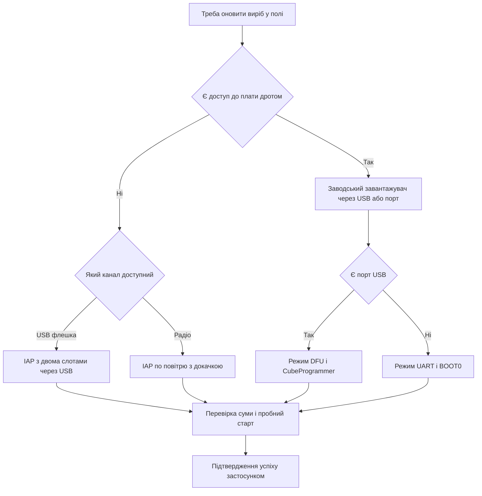

# DFU і IAP - оновлення прошивки в полі

![[assets/img/stm32-dfu-bootloader-scheme.png|600]]
*Рис. Схема оновлення в полі: заводський завантажувач, DFU через USB, власний IAP з двома слотами.*

> [!tip] Призначення ноти
> Показати повний шлях оновлення без програматора: коли вистачає заводського завантажувача, як працює DFU, як написати свій IAP з безпечним відкатом.

## 1. Призначення

Виріб у полі треба оновлювати без розбору корпусу: флешка через USB, пакет через порт, образ по повітрю. Заводський завантажувач рятує на старті, власний IAP дає гнучкість під свій канал. Два слоти і золотий образ рятують від цегли при обриві живлення.

Процес оновлення завжди впирається у фізичний канал. Огляд портів дивись [[04-Shini/05-USB|порт USB]] і [[04-Shini/01-UART|послідовний порт UART]]. Радіооновлення для бездротових чипів описане через [[01-Hardware/06-WB-WL|бездротові чипи]]. Аварійний шлях лишається через [[09-Proshivka/03-ST-Link-Proshivka|прошивка через ST-Link]].

## 2. Заводський завантажувач і документ AN2606

У системній памяті кожного чипа лежить код ST. Він стартує при правильній комбінації BOOT і вміє писати флеш через один з інтерфейсів. Документ AN2606 містить таблицю по кожному партномеру.

| Чип | UART | USB DFU | CAN | I2C і SPI |
| --- | --- | --- | --- | --- |
| F103C8 | UART1 | Немає | Немає | Немає |
| F072C8 | UART1 | USB device | Немає | I2C і SPI |
| G030F6 | UART1 | Немає | Немає | I2C і SPI |
| G474RE | UART1 | USB device | FDCAN | I2C і SPI |
| H563ZI | UART1 | USB DFU | FDCAN | I2C і SPI |
| WB55CG | UART1 | USB DFU | Немає | I2C і SPI |

```text
Вхід у заводський режим:
  1. BOOT0 у високий рівень, скинути плату кнопкою скидання
  2. Плата мовчить у робочій прошивці і слухає інтерфейси
  3. Програматор шле кадр синхронізації на швидкості порту
  4. Після відповіді починається запис і перевірка образу
  5. BOOT0 назад у низький рівень, скидання, старт з флеші
```

| Крок | Дія | Нотатка |
| --- | --- | --- |
| 1 | Знайти свій партномер у AN2606 | Дивитись стовпці інтерфейсів і номери пінів |
| 2 | Підтягнути BOOT0 і скинути | На платах Nucleo це перемички на гребінці |
| 3 | Підключити USB або перетворювач порту | Для UART потрібен спільний нуль |
| 4 | Залити образ через CubeProgrammer | Програма сама перевірить запис |
| 5 | Повернути BOOT0 і перезапустити | Інакше плата знову стане у завантажувач |

## 3. DFU через USB

DFU це стандартний клас USB для прошивки. Плата виглядає як пристрій DFU, драйвер ставить пакет DfuSe або CubeProgrammer. Швидкість на порядок вища за порт.

| Елемент DFU | Зміст |
| --- | --- |
| Дескриптор | Плата заявляє клас DFU з альтернативними налаштуваннями під флеш |
| Блок | Дані ріжуться на блоки по 1 або 2 Кбайт |
| Стирання | Сектор стирається перед записом блока |
| Перевірка | Після запису читається назад і звіряється |
| Відєднання | Команда виходу запускає робочу прошивку |

```text
Сеанс DFU крок за кроком:
  ПК бачить пристрій у режимі DFU ---> список секторів флеші
  Вибрати файл образу ---> стерти потрібні сектори
  Записати блоки ---> дочекатись підтвердження кожного
  Перевірити ---> залишити DFU і запустити застосунок
```

| Перевага | Пояснення |
| --- | --- |
| Швидкість | Повна швидкість шини дає секунди замість хвилин |
| Живлення | Та сама лінія живить плату під час запису |
| Без перетворювача | Не потрібен міст порту на платі |
| Інструмент | Один CubeProgrammer закриває USB, UART і ST-Link |

| Вимога плати | Пояснення |
| --- | --- |
| Розєм USB з даними | Зарядні гнізда без даних не підійдуть |
| Підтяжки ліній | Дивитись рекомендації по топології USB |
| Кварц або калібрування | Точна частота для стабільного з'єднання |
| Кнопка входу | BOOT0 плюс скидання для першого заходу |

## 4. Власний IAP завантажувач і регістр VTOR

Власний IAP це маленька прошивка на початку флеші. Вона вирішує стартувати старий образ, прийняти новий або відкотитись. Застосунок лежить вище зі зсувом вектора.

| Область флеші | Адреса умовно | Зміст |
| --- | --- | --- |
| IAP | Початок флеші | Прийом образу, перевірка, вибір слота |
| Слот основний | Середина флеші | Робочий образ застосунку |
| Слот резервний | Далі у флеші | Попередній образ для відкату |
| Службова | Кінець флеші | Прапорці спроб, лічильник стартів, версії |

```text
Карта памяті з IAP:
  0x0800 0000 ..... IAP, таблиця векторів IAP, старт завжди сюди
  0x0800 8000 ..... застосунок, своя таблиця векторів зі зсувом
  0x0801 0000 ..... резервна копія для відкату при невдалому старті
  Службова ....... прапорець новий образ, лічильник вдалих стартів
```

| Крок стрибка | Дія |
| --- | --- |
| 1 | Заборонити переривання і зупинити таймери |
| 2 | Зняти прапорці периферії і погасити DMA |
| 3 | Поставити VTOR на початок застосунку |
| 4 | Завантажити вказівник стека з першого слова образу |
| 5 | Стрибнути на адресу скидання з другого слова образу |

## 5. Два слоти і золотий образ

Один слот це ризик цегли. Обрив живлення посеред стирання лишає плату без коду. Два слоти тримають робочу копію до останнього.

| Стратегія | Як працює | Коли брати |
| --- | --- | --- |
| Один слот | Пише поверх робочого образу | Тільки стенд з програматором поруч |
| Два слоти | Пише у вільний, перемикається прапорцем | Поле без доступу до плати |
| Золотий образ | Заводський мінімум у окремому секторі | Відкат коли обидва слоти биті |

```text
Оновлення з відкатом:
  Працює слот А ---> приймаємо образ у слот Б
  Перевірка суми слота Б ---> ставимо прапорець пробний старт Б
  Старт Б ---> застосунок підтверджує успіх записом у службову
  Нема підтвердження ---> IAP повертає старт на слот А
  Лічильник невдач ---> після трьох провалів старт золотого образу
```

| Прапорець | Значення |
| --- | --- |
| Активний слот | Який образ стартує за замовчуванням |
| Пробний старт | Наступний старт тестовий, чекаємо підтвердження |
| Успіх | Застосунок живий і взяв керування |
| Лічильник провалів | Скільки разів новий образ не підтвердився |

## 6. Контрольна сума і підпис образу

Сума ловить биті байти, підпис ловить чужий код. Для домашнього виробу досить суми, для серії потрібен підпис.

| Метод | Що ловить | Ціна |
| --- | --- | --- |
| CRC32 образу | Випадкові помилки каналу і памяті | Кілька рядків коду |
| Хеш SHA256 | Навмисні і випадкові зміни | Більше памяті і часу |
| Підпис | Чужий образ з правильним хешем | Ключі і захищене сховище |

```text
Формат образу з хвостом:
  Заголовок ....... магічне слово, версія, довжина, адреса старту
  Тіло ............ код застосунку як є
  Хвіст ........... сума всього образу і версія карти параметрів
  IAP перевіряє .. магію, довжину, суму, потім ставить прапорець
```

```c
uint32_t image_crc32(const uint8_t *buf, uint32_t len);

int image_check(const uint8_t *base, uint32_t len, uint32_t expect)
{
    uint32_t got = image_crc32(base, len);
    if (got != expect)
    {
        return 0;
    }
    if (base[0] == 0xFF && base[1] == 0xFF)
    {
        return 0;
    }
    return 1;
}
```

| Правило | Пояснення |
| --- | --- |
| Версія тільки вперед | Старий образ не повинен затирати новий без дозволу |
| Довжина у межах слота | Вихід за сектор псує сусідній образ |
| Магія на початку | Чужий смітник у слоті відхиляється одразу |
| Бекап прапорців | Службову область дублювати з запасною копією |

## 7. Оновлення радіостеків WB і WL

Бездротові чипи мають два поверхи: застосунок і прошивка радіоядра. Радіоядро оновлюється окремим образом FUS. Порядок порушення цегли.

| Елемент | Роль |
| --- | --- |
| FUS | Службова прошивка що вміє писати радіоядро |
| Стек | Прошивка радіоядра під протокол |
| Застосунок | Користувацький код поверх стека |

```text
Порядок оновлення бездротового чипа:
  1. Перевірити версію FUS і стека через штатну команду
  2. Спочатку оновити FUS якщо таблиця сумісності вимагає
  3. Потім залити стек потрібної версії
  4. В кінці залити застосунок під цей стек
  Порушення порядку дає несумісність і мовчання радіо
```

| Помилка стеку | Симптом |
| --- | --- |
| Старий FUS | Новий стек відхиляється |
| Чужий стек | Застосунок стартує але ефір мовчить |
| Обрив живлення | Радіоядро недорписане, потрібен повтор через дріт |

## 8. HAL код стрибка у застосунок

Приклад показує безпечний стрибок з IAP у застосунок зі зсувом вектора.

```c
#define APP_ADDR 0x08008000U

typedef void (*app_entry_t)(void);

void iap_jump_to_app(void)
{
    uint32_t stack = *(volatile uint32_t *)APP_ADDR;
    uint32_t reset = *(volatile uint32_t *)(APP_ADDR + 4U);
    if ((stack & 0x2FFE0000U) != 0x20000000U)
    {
        return;
    }
    __disable_irq();
    HAL_SuspendTick();
    for (int i = 0; i < 8; i++)
    {
        NVIC->ICER[i] = 0xFFFFFFFFU;
        NVIC->ICPR[i] = 0xFFFFFFFFU;
    }
    SysTick->CTRL = 0U;
    SCB->VTOR = APP_ADDR;
    __set_MSP(stack);
    __enable_irq();
    ((app_entry_t)reset)();
}
```

```c
void iap_try_update(void)
{
    if (image_check((const uint8_t *)0x08010000U, 96000U, 0x12345678U) == 0)
    {
        return;
    }
    iap_jump_to_app();
}

void app_confirm_ok(void)
{
    uint32_t *flag = (uint32_t *)0x0807F800U;
    HAL_FLASH_Unlock();
    HAL_FLASH_Program(FLASH_TYPEPROGRAM_WORD, (uint32_t)flag, 0xA11CEU);
    HAL_FLASH_Lock();
}
```

```text
Перевірка IAP на столі:
  Залий IAP з адресою застосунку ---> залий застосунок зі зсувом лінкера
  Перевір стрибок без образу ---> IAP лишається і чекає, це норма
  Залий образ у вільний слот ---> перевір суму і прапорець пробного старту
  Імітуй битий образ ---> IAP повертається на робочий слот
  Висмикни живлення під час запису ---> після вмикання стартує старий слот
```

## Mermaid: вибір шляху оновлення



## Типові помилки

| # | Помилка | Чому погано | Як правильно |
| --- | --- | --- | --- |
| 1 | BOOT0 лишили у одиниці | Плата завжди стартує у заводський режим | Повернути BOOT0 у нуль після запису |
| 2 | Застосунок зібраний без зсуву | Вектори перекривають IAP, стрибок падає | Прописати адресу застосунку у лінкер скрипті |
| 3 | VTOR не переставлений | Переривання ведуть у таблицю IAP | Ставити VTOR на початок застосунку перед стрибком |
| 4 | Пишуть поверх активного слота | Обрив живлення дає цеглу | Писати у вільний слот і перемикати прапорцем |
| 5 | Без перевірки суми | Битий образ стартує і висить | Рахувати CRC і звіряти з хвостом образу |
| 6 | FUS і стек оновили не по черзі | Радіо мовчить при живому застосунку | Дотримуватись порядку FUS потім стек потім застосунок |
| 7 | Немає підтвердження старту | Битий образ крутиться вічно | Застосунок пише успіх, інакше IAP відкочується |

## Офіційні джерела

- [Заводський завантажувач для кожного чипа (ST)](https://www.st.com/resource/en/application_note/an2606-stm32-microcontroller-system-memory-boot-mode-stmicroelectronics.pdf) - таблиця режимів по партномерах.
- [STM32CubeProgrammer (ST)](https://www.st.com/en/development-tools/stm32cubeprog.html) - запис через DFU, порт і налагоджувач.
- [STM32WB55CG datasheet (ST)](https://www.st.com/en/microcontrollers-microprocessors/stm32wb55cg.html) - пам'ять, радіоядро, порядок оновлення FUS.

## Див. також

- [[Home]]
- [[04-Shini/05-USB|порт USB]]
- [[09-Proshivka/03-ST-Link-Proshivka|прошивка через ST-Link]]
- [[01-Hardware/06-WB-WL|бездротові чипи]]
- [[15-Protokoli/01-Modbus|промисловий протокол Modbus]]
- [[15-Protokoli/03-Bezpeka|захист виробу]]
