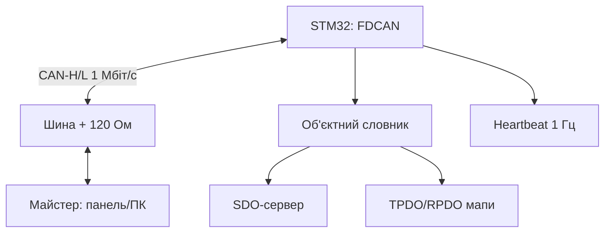

# STM32 CANopen - об'єктний словник, SDO/PDO і CiA-301

![[assets/img/stm32-canopen-scheme.png|600]]
*Рис. CANopen-вузол: FDCAN-шина 1 Мбіт/с, об'єктний словник, SDO-сервер, TPDO за подією.*

> [!tip] Що це за нота
> Промисловий CAN наступного рівня після сирого CAN: адресація вузлів, стандартизовані дані, конфігурація без перепрошивки. Стек CANopenNode + FDCAN. База: [[04-Shini/04-FDCAN|шина FDCAN]], [[12-Moduli-zvyazku/02-RS485-CAN-Ethernet|RS485/CAN/Ethernet]].

## 1. Мета

Підняти CANopen-слейв на STM32:

- об'єктний словник (OD): що це і мінімальний набір;
- SDO: читання/запис параметрів (expedited/segmented);
- PDO: циклічні дані з мапуванням;
- NMT: pre-op/op/stop, heartbeat продюсер;
- EDS-файл для конфігураторів.

| Сервіс | COB-ID (NodeID=5) | Призначення |
| --- | --- | --- |
| NMT | 0x000 | керування станом |
| SYNC | 0x080 | синхронізація |
| EMCY | 0x085 | аварії |
| TPDO1 | 0x185 | швидкі дані |
| RPDO1 | 0x205 | команди |
| SDO rx/tx | 0x605/0x585 | параметри |
| Heartbeat | 0x705 | «я живий» |

## 2. Архітектура



Швидкість єдина на шині (125K/500K/1M). Термінатори 120 Ом на кінцях - як у звичайному CAN.

## 3. Розпіновка вузла (F4/F7)

| Сигнал | Пін STM32 | Примітка |
| --- | --- | --- |
| CAN_TX | PA12/PB9 | до трансивера |
| CAN_RX | PA11/PB8 | від трансивера |
| TJA1050 VCC | 5V | трансивер 5V! |
| TJA1050 STB | GND | high-speed режим |
| NodeID-перемички | PB0-PB3 | ID 1-15 без перепрошивки |
| CAN-H/L | кручена пара | 120 Ом на кінцях |

Трансивер живиться 5V, логіка толерантна до 3.3V. Ізоляція ADuM - для щитів.

## 4. Об'єктний словник мінімум

- 0x1000: тип пристрою (читать);
- 0x1001: регістр помилок;
- 0x1005: COB-ID SYNC;
- 0x1017: період heartbeat (мс);
- 0x1018: identity (vendor/product/rev/serial);
- 0x1A00+: TPDO мапи; 0x1600+: RPDO мапи;
- 0x2000+: виробничі параметри (наші дані);
- EDS-файл генеруємо з того ж опису.

## 5. Робочий код (C, HAL + CANopenNode)

```c
#include "CANopen.h"

#define NODE_ID 5
#define BITRATE 1000

CO_Data *od;

void app_main(void) {
  od = CO_OD_create();
  CO_config_t cfg = {.nodeId = NODE_ID, .bitrate = BITRATE};
  CO_init(od, &cfg);
  CO_NMT_setState(od, CO_NMT_PREOP);
  uint32_t hb = 0;
  while (1) {
    CO_process(od);
    if (HAL_GetTick() - hb > 100) {
      hb = HAL_GetTick();
      CO_HB_producer(od);
      CO_TPDO_send(od, 0);
    }
  }
}

void CO_TPDO_send(CO_Data *od, int n) {
  uint8_t d[8];
  int16_t temp = read_temp_dc();
  d[0] = temp & 0xFF; d[1] = temp >> 8;
  FDCAN_Tx(0x185, d, 2);
}
```

CANopenNode - каркас: OD описуємо скриптом, колбеки дописуємо. NMT-команди майстра переводять pre-op↔op.

## 6. Робочий код (MicroPython)

```python
# MicroPython: CANopen-монітор через MCP2515-SPI (навчальний сніфер)
import struct
import time
from machine import Pin, SPI

spi = SPI(1, baudrate=10000000, sck=Pin(10), mosi=Pin(11), miso=Pin(12))
cs = Pin(13, Pin.OUT, value=1)
NODE = 5

def cob(function, node):
    return (function << 7) | node

def send_nmt(cmd):
    # NMT: COB 0x000, дані [команда, node]
    frame = struct.pack('>HBB', 0x000, cmd, NODE)
    cs.value(0)
    spi.write(frame)
    cs.value(1)

def heartbeat_listener():
    # TPDO1 0x185: читаємо 2 байти температури
    cs.value(0)
    raw = spi.read(4)
    cs.value(1)
    temp = struct.unpack('>h', bytes(raw[:2]))[0] / 10.0
    return temp

send_nmt(0x01)
while True:
    print('temp', heartbeat_listener())
    time.sleep(1)
```

Чесно: повний стек на MicroPython - навчальний; бойовий - C + CANopenNode. Сніфер вище годиться для налагодження шини.

## 7. NMT і heartbeat

- стани: Init → Pre-op ↔ Op, Stop - окремо;
- майстер шле `01 05` (старт вузла 5);
- heartbeat кожні 100-1000 мс: байт стану;
- guarding - застарілий, використовуємо heartbeat;
- boot-up повідомлення `00` - вузол прокинувся.

## 8. Типові помилки

| Симптом | Причина | Лікування |
| --- | --- | --- |
| Майстер не бачить вузол | не той NodeID/бітрейт | перемички ID, єдина швидкість |
| SDO timeout | вузол у Stop або EDS не той | NMT-старт, звірити словник |
| PDO не приходять | мапування/період не налаштовані | SDO-запис мап + зберегти |
| Bus-off | КЗ/термінатори/швидкість | 120 Ом, продзвонка, осцилограф |
| Heartbeat пропав | вузол завис | WDT + boot-up моніторинг |
| Два вузли з одним ID | перемички однакові | унікальний ID, сканування LSS |

## 9. Швидка шпаргалка CANopen

- ID перемичками, швидкість єдина;
- heartbeat завжди увімкнений;
- мапи PDO - через SDO і зберегти;
- EDS - з того ж опису OD;
- термінатори на кінцях шини.

## 10. Суміжні ноти

- [[04-Shini/04-FDCAN|шина FDCAN]] - залізний рівень.
- [[15-Protokoli/01-Modbus|протокол Modbus]] - молодший брат.
- [[12-Moduli-zvyazku/02-RS485-CAN-Ethernet|RS485/CAN/Ethernet]] - трансивери.
- [[09-Proshivka/06-FreeRTOS|операційна RTOS]] - задачі стеку.
- [[Home|головна карта]] - повна навігація.

## Офіційні джерела

- [CANopen (CAN in Automation)](https://www.can-cia.org/can-knowledge/canopen/) - CiA-301, сервіси, профілі.
- [CANopenNode (GitHub)](https://github.com/CANopenNode/CANopenNode) - відкритий стек, приклади.
- [STM32F4 (ST)](https://www.st.com/en/mcus-mpus/stm32f4.html) - bxCAN/FDCAN периферія.
