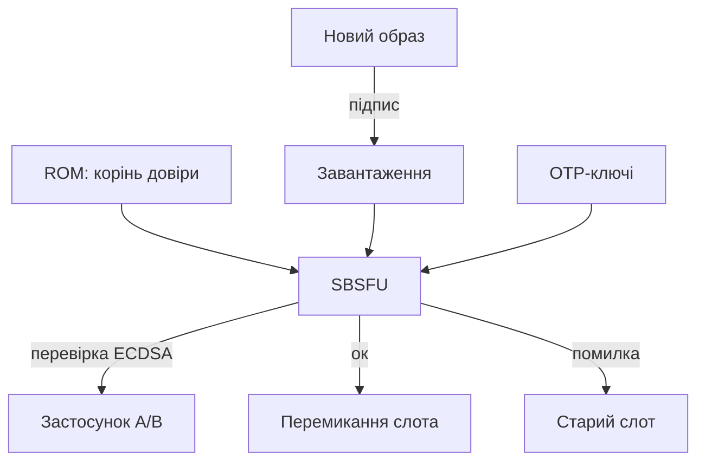

# STM32 Secure Boot - довірений старт, SBSFU і оновлення

![[assets/img/stm32-secure-boot-scheme.png|600]]
*Рис. Ланцюг довіри: ROM → SBSFU → перевірка підпису → застосунок; оновлення лише підписані.*

> [!tip] Що це за нота
> Продакшн-безпека: ніхто не підмінить прошивку і не відкотить на діряву. SBSFU + TrustZone + захист від відкату. База: [[15-Protokoli/03-Bezpeka|безпека STM32]], [[01-Hardware/10-U5-Deep|серія U5]].

## 1. Мета

Закрити життєвий цикл прошивки:

- ланцюг довіри від ROM до застосунку;
- підпис образів (ECDSA) і перевірка при старті;
- OTA-оновлення з відкатом при невдачі;
- rollback-захист: назад на стару - заборонено;
- секрети: де лежать ключі.

| Етап | Хто перевіряє | Що |
| --- | --- | --- |
| ROM | залізо | SBSFU за OTP-ключем |
| SBSFU | завантажувач | підпис застосунку |
| Застосунок | - | працює |
| OTA | SBSFU | підпис нового образу |

## 2. Архітектура



Два слоти A/B: новий пишеться в неактивний, перемикання - після перевірки. Невдача - лишаємось на старому.

## 3. Розпіновка безпеки (що замкнути)

| Міра | Де | Примітка |
| --- | --- | --- |
| RDP рівень 2 | option bytes | debug закритий назавжди! |
| OTP-ключі | OTP-зона | запис один раз |
| Write-protect SBSFU | option bytes | завантажувач не переписати |
| Тампер-піни | PC13 та інші | стирання секретів при розтині |
| DBG в продакшн | вимкити | ST-Link не підключити |

RDP 2 - безповоротний: спочатку відладь все на RDP 0/1, потім закривай. Помилка тут - цеглина.

## 4. Ключі і підписи

- пара ECDSA: приватний - у сейфі/HSM, публічний - в OTP;
- підписуємо образ + версію + nonce;
- монотонний лічильник версій - серце rollback-захисту;
- ключі розробки ≠ ключі продакшн (різні OTP-профілі);
- витік ключа розробки - відкликати і перевипустити партію;

## 5. Робочий код (C, перевірка образу)

```c
#include "crypto.h"

int image_verify(const uint8_t *img, size_t len,
                 const uint8_t *sig, const uint8_t *pubkey) {
  uint8_t hash[32];
  sha256(img, len, hash);
  if (ecdsa_verify(pubkey, hash, sig) != 0) {
    return -1;
  }
  uint32_t ver = image_version(img);
  if (ver <= stored_version()) {
    return -2;
  }
  return 0;
}

void boot_flow(void) {
  if (image_verify(active_image(), active_len(),
                   active_sig(), otp_pubkey()) == 0) {
    jump_to_app();
  }
  rollback_to_previous();
}
```

Перевірка хеша + підпису + версії - три умови, не одна. Пропуск будь-якої - діра.

## 6. Робочий код (MicroPython)

```python
# MicroPython: перевірка цілісності конфігів (не boot — політика!)
import hashlib
import json
import time

EXPECTED = {}

def snapshot(path):
    h = hashlib.sha256()
    with open(path, 'rb') as f:
        while True:
            b = f.read(1024)
            if not b:
                break
            h.update(b)
    return h.hexdigest()

def policy_check(files):
    bad = []
    for f in files:
        digest = snapshot(f)
        if EXPECTED.get(f) and EXPECTED[f] != digest:
            bad.append(f)
    return bad

EXPECTED['/flash/config.json'] = snapshot('/flash/config.json')
while True:
    bad = policy_check(list(EXPECTED))
    if bad:
        print('TAMPER:', bad)
    time.sleep(3600)
```

Чесно: secure boot - справа ROM/SBSFU, не скрипта. Скрипт вище - детектор підміни конфігів уже запущеної системи.

## 7. OTA-процедура

- образ + маніфест (версія, розмір, хеш, підпис);
- завантаження в неактивний слот з докачкою;
- перевірка → перемикання → тестовий boot;
- watchdog підтверджує успіх, інакше - назад;
- журнал оновлень для аудиту.

## 8. Типові помилки

| Симптом | Причина | Лікування |
| --- | --- | --- |
| Не стартує після підпису | не той ключ/версія менша | звірити ключі і лічильник |
| RDP 2 передчасно | закрили налагодження рано | спочатку все відлагодити! |
| OTA цеглить партію | немає відкату | A/B-слоти + watchdog |
| Ключ у репозиторії | витік | HSM/сейф, відкликання |
| Тампер спрацьовує сам | плаваючий пін | підтяжка + фільтр |
| Старий образ прийнято | немає rollback-захисту | монотонний лічильник |

## 9. Швидка шпаргалка безпеки

- ключі в сейфі, не в git;
- RDP 2 - останнім кроком;
- A/B-слоти + відкат;
- версія тільки вперед;
- тампер-піни підтягнути.

## 10. Суміжні ноти

- [[15-Protokoli/03-Bezpeka|безпека STM32]] - база захисту.
- [[01-Hardware/10-U5-Deep|серія U5]] - TrustZone-залізо.
- [[15-Protokoli/02-DFU-Bootloader|DFU-завантажувач]] - механіка оновлення.
- [[15-Protokoli/04-MQTT|протокол MQTT]] - доставка OTA.
- [[Home|головна карта]] - повна навігація.

## Офіційні джерела

- [STM32CubeU5 (STMicroelectronics, GitHub)](https://github.com/STMicroelectronics/STM32CubeU5) - SBSFU-приклади, TrustZone.
- [STM32F4 (ST)](https://www.st.com/en/mcus-mpus/stm32f4.html) - option bytes, RDP.
- [MQTT Specification (OASIS)](https://mqtt.org/mqtt-specification/) - транспорт OTA.
