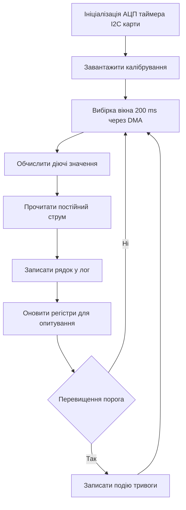

# Енергомонітор - струм, напруга і лог

![[assets/img/stm32-energy-monitor-scheme.png|600]]
*Рис. Облік енергії: вимірювання струму і напруги обчислення потужності лог на карту та вивід даних.*

> [!tip] Призначення ноти
> Зібрати прилад обліку енергії: як міряти постійний і змінний струм як рахувати діючі значення та як писати лог без втрат.

## 1. Призначення

Енергомонітор показує скільки споживає навантаження: струм напруга потужність та енергія за добу. Його ставлять у щит на сонячну станцію або на стенд випробувань. Дані пишуться на карту пам'яті а назовні віддаються по промисловому протоколу.

Постійний струм міряють шунтом або спеціалізованим датчиком а змінний струм міряють трансформатором струму або шунтом з розв'язкою. Напругу міряють дільником з захистом. Точність залежить від калібрування а не лише від розрядності перетворювача.

Основи вимірювального датчика дивись у матеріалі про [[10-Sensori/04-INA219-HX711|струм і вага]] а карти і зовнішню пам'ять у матеріалі про [[04-Shini/06-SDMMC-QUADSPI|карти і зовнішня флеш]].

## 2. Датчики струму

| Варіант | Діапазон | Плюси | Мінуси |
| --- | --- | --- | --- |
| Шунт плюс підсилювач | До 30 A | Дешево точно для постійного струму | Нагрів потрібна калібрування |
| INA219 по I2C | До 3 A | Готовий струм напруга потужність | Малий діапазон без зовнішнього шунта |
| Трансформатор струму | До 100 A | Гальванічна розв'язка для мережі | Тільки змінний струм потрібне зміщення |
| Датчик на ефекті Холла | До 50 A | Розв'язка міряє постійний і змінний | Дрейф нуля потрібне обнулення |

Для мережі 220 V обов'язкова розв'язка. Трансформатор струму ставлять у розрив фази а електроніку живлять через ізольований перетворювач. Шунт у мережі без розв'язки це небезпечно для життя і для приладів.

```text
Варіанти вимірювання:
  DC навантаження:
    батарея + --> шунт --> навантаження --> батарея -
                   | INA219 по I2C
                   +--> STM32
  AC мережа через трансформатор:
    фаза --> ТТ --> навантаження
               вторинна --> burden резистор --> зміщення 1.65V --> ADC
    нумерація: burden підібрати під повну шкалу ADC
```

## 3. Діючі значення в АЦП

Миттєві відліки нічого не кажуть про нагрів. Для змінного струму рахують діюче значення за вікном в один або кілька періодів мережі. Формула проста а реалізація вимагає рівномірної вибірки.

| Крок | Дія |
| --- | --- |
| Зсув нуля | Відняти середнє або рівень зміщення |
| Квадрат | Кожен відлік піднести до квадрата |
| Середнє | Усереднити за 200 ms тобто десять періодів |
| Корінь | Взяти квадратний корінь це і є діюче значення |
| Потужність | Помножити діючі струм і напругу з урахуванням зсуву фаз |

Частоту вибірки беруть 4 kHz або 8 kHz щоб встигати за гармоніками. Запуск АЦП роблять від таймера а дані забирають через DMA без участі ядра. Про шари драйверів читай у матеріалі про [[09-Proshivka/02-HAL-LL|шари HAL і LL]].

```text
Ланцюг вибірки:
  таймер 8 kHz --> тригер ADC1 + ADC2
  ADC1: струм (PA0)  ADC2: напруга (PA1)
  DMA: два кільцеві буфери по 1600 точок
  ядро: раз на 200 ms рахує RMS і потужність
  калібрування: коефіцієнти у флеш + CRC
```

## 4. INA219 для постійного струму

| Регістр | Значення | Пояснення |
| --- | --- | --- |
| Конфігурація | 32 V 12 біт усереднення 32 | Точність важливіша за швидкість |
| Калібрування | За формулою під шунт 0.1 Ohm | Записати після скидання |
| Шунт | Напруга шунта | Пропорційна струму |
| Шина | Напруга навантаження | Для потужності і діагностики |
| Потужність | Внутрішній добуток | Можна читати готовою |

Датчик підключають по I2C з підтяжками 4.7 kOhm. Адресу вибирають перемичками. Шунт ставлять у мінус або у плюс залежно від допустимої синфазної напруги. Доріжки до шунта роблять короткими і симетричними.

## 5. Логування на карту FATFS

| Питання | Рішення |
| --- | --- |
| Файлова система | FATFS з буфером 512 байт |
| Формат | CSV з міткою часу: час струм напруга потужність |
| Період | Раз на секунду для огляду раз на хвилину для архіву |
| Надійність | Скидання буфера раз на хвилину або при тривозі |
| Живлення | Конденсатор щоб встигнути закрити файл при пропаданні |

Карту не можна виймати під час запису. Для індикації ставлять світлодіод запису. Ім'я файла формують з дати від годинника реального часу. Переповнення карти обробляють видаленням найстаріших файлів.

Про карти читай у нотатці про [[04-Shini/06-SDMMC-QUADSPI|карти і зовнішня флеш]] а про промисловий вивід у нотатці про [[15-Protokoli/01-Modbus|промисловий протокол Modbus]].

## 6. HAL код вимірювального циклу

```c
#include "stm32f4xx_hal.h"
#include <math.h>
#include <stdio.h>

ADC_HandleTypeDef hadc1;
ADC_HandleTypeDef hadc2;
I2C_HandleTypeDef hi2c1;
TIM_HandleTypeDef htim3;

#define ADC_LEN 1600
uint16_t adc_i_buf[ADC_LEN];
uint16_t adc_v_buf[ADC_LEN];

float cal_i_gain = 0.0125f;
float cal_v_gain = 0.145f;
float cal_i_off = 2048.0f;
float cal_v_off = 2048.0f;

static float CalcRms(uint16_t *buf, int len, float off)
{
  double acc = 0.0;
  for (int k = 0; k < len; k++)
  {
    double d = (double)buf[k] - off;
    acc += d * d;
  }
  return (float)sqrt(acc / len);
}

static void MeasureAc(float *irms, float *vrms, float *pwr)
{
  float i_raw = CalcRms(adc_i_buf, ADC_LEN, cal_i_off);
  float v_raw = CalcRms(adc_v_buf, ADC_LEN, cal_v_off);
  *irms = i_raw * cal_i_gain;
  *vrms = v_raw * cal_v_gain;
  *pwr = (*irms) * (*vrms) * 0.95f;
}

#define INA219_ADDR 0x40

static float INA219_ReadCurrent(void)
{
  uint8_t reg = 0x04;
  uint8_t data[2] = {0};
  HAL_I2C_Master_Transmit(&hi2c1, INA219_ADDR << 1, &reg, 1, 100);
  HAL_I2C_Master_Receive(&hi2c1, INA219_ADDR << 1, data, 2, 100);
  int16_t raw = (int16_t)((data[0] << 8) | data[1]);
  return raw * 0.001f;
}

void Energy_Task(void)
{
  float irms = 0.0f;
  float vrms = 0.0f;
  float pwr = 0.0f;
  char line[96];

  HAL_TIM_Base_Start(&htim3);
  HAL_ADC_Start_DMA(&hadc1, (uint32_t *)adc_i_buf, ADC_LEN);
  HAL_Delay(250);
  HAL_ADC_Stop_DMA(&hadc1);

  MeasureAc(&irms, &vrms, &pwr);

  float idc = INA219_ReadCurrent();

  snprintf(line, sizeof(line), "%lu,%.3f,%.1f,%.1f,%.3f\r\n",
    (unsigned long)HAL_GetTick(), irms, vrms, pwr, idc);
  Log_Append(line);
  Modbus_SetRegs(irms, vrms, pwr, idc);
}
```

Буфери для DMA вирівнюють у пам'яті та оголошують як змінні з ознакою доступу для DMA. Обчислення роблять у головному циклі а не у перериванні щоб не зривати вибірку.

## 7. Логіка роботи у схемі



## 8. Калібрування і перевірка

| Крок | Дія |
| --- | --- |
| Нуль струму | Вимкити навантаження записати зсув |
| Еталон струму | Лабораторний блок 1 A підібрати коефіцієнт |
| Еталон напруги | Мультиметр на клемах підібрати дільник |
| Перевірка потужності | Лампа відомої потужності звірити покази |
| Збереження | Записати коефіцієнти у флеш з контрольною сумою |

Без калібрування похибка сягає десяти відсотків через розкид резисторів. Калібрують кожен екземпляр окремо. Про прилади для калібрування дивись у нотатці про [[17-Lab/01-Priladi|вимірювальні прилади]].

## Типові помилки

| # | Помилка | Чому погано | Як правильно |
| --- | --- | --- | --- |
| 1 | Шунт у фазі мережі без розв'язки | Смертельна небезпека і згорілий осцилограф | Трансформатор струму та ізольоване живлення |
| 2 | Вибірка без прив'язки до часу | Плаваюче вікно і стрибки показів | Тригер від таймера та DMA |
| 3 | Обчислення у перериванні АЦП | Пропуски відліків спотворений корінь | Рахувати у головному циклі за готовим вікном |
| 4 | Запис на карту кожну вибірку | Карта зношується файл рветься | Буфер 512 байт і запис раз на секунду |
| 5 | Немає калібрування | Похибка резисторів дає хибні кіловати | Калібрувати нуль і коефіцієнт кожного вузла |
| 6 | Земля шунта з розривом | Наведення і зсув нуля гуляє | Зірка землі короткий симетричний підвід |

## Офіційні джерела

- [INA219 datasheet Texas Instruments](https://www.ti.com/product/INA219) - регістри калібрування розрахунок шунта.
- [AN2834 STM32 ADC accuracy ST](https://www.st.com/resource/en/application_note/an2834-how-to-get-the-best-adc-accuracy-in-stm32-microcontrollers--stmicroelectronics.pdf) - точність АЦП калібрування розводка.

## Див. також

- [[Home]]
- [[10-Sensori/04-INA219-HX711|струм і вага]]
- [[04-Shini/06-SDMMC-QUADSPI|карти і зовнішня флеш]]
- [[15-Protokoli/01-Modbus|промисловий протокол Modbus]]
- [[09-Proshivka/02-HAL-LL|шари HAL і LL]]
- [[16-Proekti/01-Meteostantsiya|погодний вузол]]
- [[17-Lab/01-Priladi|вимірювальні прилади]]
