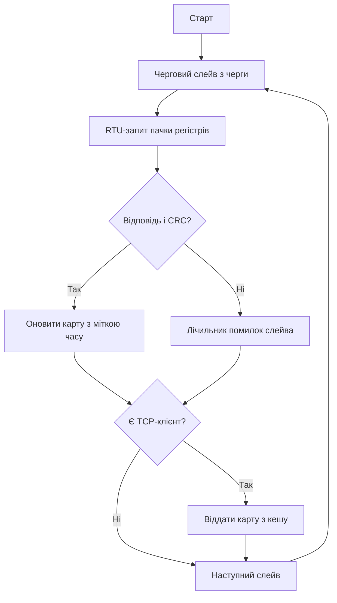

# Modbus-шлюз - міст RTU в TCP

![[assets/img/stm32-modbus-gateway-scheme.png|600]]
*Рис. Міст між поверхами: RTU знизу, TCP наверх, карта посередині.*

> [!tip] Призначення ноти
> Навчити зєднувати цехові пристрої з мережею: опитування RTU, кеш регістрів, віддача по TCP.

## 1. Призначення

Цех говорить RTU по RS485, офіс - TCP по Ethernet. Шлюз опитує пристрої внизу, тримає свіжу карту регістрів і віддає її наверх. Без шлюзу кожен SCADA-клієнт смикає повільну шину сам і всі чекають.

## Архітектура шлюзу

| Шар | Роль |
| --- | --- |
| RTU-майстер | Опитує пристрої по черзі |
| Карта регістрів | Свіжі значення з мітками часу |
| TCP-сервер | Віддає карту клієнтам |
| Діагностика | Лічильники помилок шини |

```text
Потік даних:
  пристрій -> RTU-читання -> карта -> TCP-відповідь.
  Клієнт ніколи не чекає повільну шину безпосередньо!
```

## Карта регістрів: єдина правда

| Тема | Практика |
| --- | --- |
| Адресація | Слейв, функція, регістр - плоска таблиця |
| Вік даних | Мітка часу кожного читання |
| Прострочення | Старе значення маркується, не видається за свіже! |
| Блокування | Читання пачками, не по одному регістру |

## Черга опитування

| Правило | Пояснення |
| --- | --- |
| Коло по пристроях | Кожен слейв у свою чергу |
| Помилка не зупиняє | Пропустив - іди далі, повернешся колом |
| Пріоритет аварійним | Важливі - частіше в колі |
| Пауза між кадрами | 3.5 символи тиші за стандартом! |

## Mermaid: цикл шлюзу



## TCP-сервер на LWIP

| Тема | Практика |
| --- | --- |
| MBAP-заголовок | Транзакція, протокол, довжина |
| Кілька клієнтів | Кожен читає карту, шину не чіпає |
| Таймаути | Завислий клієнт вимкається |
| Навантаження | Карта в RAM - відповіді миттєві |

## Діагностика шини

| Лічильник | Дія при рості |
| --- | --- |
| CRC-помилки | Перевірити термінацію і землю |
| Таймаути слейва | Живлення пристрою, адреса, швидкість |
| Повтори запитів | Шум на лінії, екранування |
| Паузи кола | Забагато пристроїв - ділити шину |

## Типові помилки

| # | Помилка | Чому погано | Як правильно |
| --- | --- | --- | --- |
| 1 | Клієнт читає шину безпосередньо | Всі чекають повільну лінію | Тільки через карту-кеш |
| 2 | Старе видають за свіже | SCADA бреше | Мітка часу і прапорець давності |
| 3 | Немає пауз між кадрами | Колізії на шині | 3.5 символи тиші! |
| 4 | Один повільний гальмує коло | Всі дані старіють | Таймаут короткий, пропуск |
| 5 | Немає термінації | Відбиття і CRC-помилки | 120 Ом на кінцях |
| 6 | TCP без таймаутів | Завислі сокети | Закривати мовчазних |
| 7 | Діагностика не ведеться | Сліпий шлюз | Лічильники і лог з першого дня |

## Пусконалагодження: порядок

| Номер | Дія |
| --- | --- |
| 1 | Один слейв на столі: читання вручну |
| 2 | Вся шина: коло опитування без помилок |
| 3 | TCP: карта віддається клієнту |
| 4 | Обрив слейва: коло не зупиняється |
| 5 | Доба роботи: лічильники чисті |

## Офіційні джерела

- [Modbus TCP Specification (Modbus.org)](https://www.modbus.org/specs.php) - MBAP, функції, коди.
- [LWIP Documentation (Savannah)](https://www.nongnu.org/lwip/) - TCP-сервер на мікроконтролері.

## Код опитування: скелет слейва

```c
// Читання пачки регістрів одного слейва:
int poll_slave(uint8_t addr, uint16_t start, uint16_t n, uint16_t *out)
{
  build_request(addr, 0x03, start, n);   // функція читання
  uart_de_tx();                          // напрям передачі
  HAL_UART_Transmit(&huart1, req, len, 100);
  uart_de_rx();                          // напрям прийому
  if (HAL_UART_Receive(&huart1, resp, len, 200) != HAL_OK)
    return GW_ERR_TIMEOUT;
  if (!crc_ok(resp, len))
    return GW_ERR_CRC;
  unpack_regs(resp, out, n);
  return GW_OK;
}
```

## Резервування: два шлюзи на цех

| Тема | Практика |
| --- | --- |
| Активний і гарячий резерв | Другий слухає першого |
| Heartbeat між ними | Пропав - резерв бере шину |
| Одна карта | Синхронізація кешу при перемиканні |
| Ручний режим | Перемикач на шафі для аварії |

## Див. також

- [[Home]]
- [[15-Protokoli/01-Modbus|промисловий протокол]]
- [[12-Moduli-zvyazku/02-RS485-CAN-Ethernet|дротові мережі]]
- [[16-Proekti/03-Energomonitor|облік енергії]]
- [[04-Shini/01-UART|послідовний порт]]
