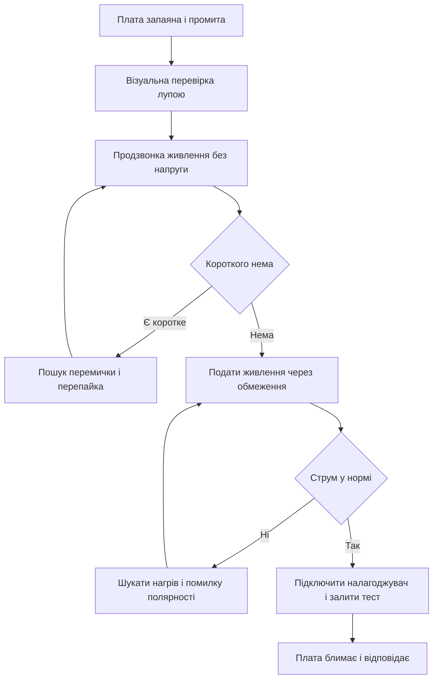

# Плата STM32 - проєктування і монтаж

![[assets/img/stm32-pcb-montazh-scheme.png|600]]
*Рис. Плата контролера: живлення і розв'язка тактування налагоджувальний роз'єм розводка та монтаж.*

> [!tip] Призначення ноти
> Дати чекліст першої плати: що має бути у схемі як розвести землю і живлення як запаяти без перемичок та як запустити з першого разу.

## 1. Призначення

Власна плата потрібна коли макетна збірка вже затісна: треба менше дротів стабільне живлення та корпус. Перша плата зазвичай проста: контролер стабілізатор кварц роз'єм налагодження та кілька датчиків.

Більшість відмов перших плат це живлення і монтаж а не прошивка. Немає розв'язки біля пінів висить скидання або коротке під корпусом. Тому схема і розводка важливіші за красу шовкографії.

Про живлення читай у матеріалі про [[02-Zhivlennya/01-Lancjugi-zhivlennya|ланцюги живлення плати]] а про виміри після монтажу у матеріалі про [[17-Lab/01-Priladi|вимірювальні прилади]].

## 2. Схема мінімум для запуску

| Вузол | Що ставити | Номінали |
| --- | --- | --- |
| Розв'язка VDD | Кераміка до кожної піни живлення | 100 nF + 1 uF поруч із чипом |
| VCAP | Конденсатор на вивід ядра | 2.2 uF близько до піни |
| VDDA | Фільтр аналогового живлення | 10 Ohm + 100 nF + 1 uF |
| VBAT | Батарея або перемичка до VDD | Якщо немає батареї з'єднати з VDD |
| Скидання NRST | Підтяжка плюс кнопка плюс конденсатор | 10 kOhm до VDD 100 nF до землі |
| Завантаження BOOT0 | Резистор до землі плюс перемичка до VDD | 10 kOhm до землі |
| SWD роз'єм | SWDIO SWCLK GND NRST VDD | Крок 1.27 mm або 2.54 mm |
| Кварц HSE | Кварц плюс два конденсатори | 8 MHz плюс 18 pF за даташитом |

Без розв'язки контролер скидається при стрибках струму. Без підтяжки скидання плата стартує через раз. Без роз'єму налагодження першу прошивку нікуди заливати.

Про прошивку читай у нотатці про [[09-Proshivka/03-ST-Link-Proshivka|прошивка через ST-Link]] а плати для порівняння у нотатці про [[14-Devboards/03-Nucleo|плати Nucleo]].

```text
Мінімальна схема:
  VDD o--+--100n--+--> VDD_1
         +--100n--+--> VDD_2
         +--1u----+--> VDD_3
  VDDA o--10R--+--100n--+--> VDDA
                  +--1u--+
  VCAP o--2u2--> GND
  NRST o--10k--> VDD, кнопка --> GND, 100n --> GND
  BOOT0 o--10k--> GND, jumper --> VDD для завантажувача
  SWD: 1-VDD 2-SWDIO 3-GND 4-SWCLK 5-GND 6-NRST
  HSE: 8 MHz між OSC_IN OSC_OUT + 2 x 18 pF до GND
```

## 3. Розводка земля кварц антена

| Правило | Як робити |
| --- | --- |
| Полігон землі | Суцільний шар без розрізів під чипом і кварцом |
| Розв'язка | Конденсатори ближче ніж 3 mm до пінів живлення |
| Кварц | Близько до пінів без цифрових доріжок під ним |
| Живлення | Зірка від стабілізатора широкі доріжки |
| Аналог | Окрема гілка VDDA далі від цифрового шуму |
| Антена | Вільна зона без міді та батареї над друкованою антеною |
| Тестові точки | VDD GND SWD UART на краю для щупів |

Цифрові доріжки не ведуть під кварцом бо збивають частоту. Високошвидкісні SPI роблять короткими і поруч із землею. Щілини у полігоні латають перемичками або переходять на інший шар.

Друкована антена вимагає вільної зони за документацією на модуль. Металевий корпус або батарея поруч ріжуть дальність у рази.

## 4. Монтаж паста фен перевірка

| Крок | Дія |
| --- | --- |
| Паста | Тонкий шар через трафарет або зубочисткою на площадки |
| Встановлення | Пінцетом за корпус не гнути піни |
| Пайка феном | 320 градусів круговими рухами до блиску припою |
| Паяльником | Жало 0.5 mm припій 0.5 mm флюс гель |
| Промивка | Змити флюс спиртом і висушити |
| Візуальна | Лупа шукає перемички та непропаї |

Після пайки плату миють і сушать. Липкий флюс збирає пил і дає витік між пінами. Особливо уважно дивляться крок 0.5 mm у корпусах LQFP.

```text
Порядок монтажу:
  1. стабілізатор + конденсатори живлення
  2. контролер (перевірити ключ першої ніжки!)
  3. кварц + дрібні резистори і конденсатори
  4. роз'єм налагодження + кнопки
  5. датчики і модулі в останню чергу
  перевірка: продзвонка VDD-GND, VDD-3.3V, GND-цілісність
```

Для пошуку перемичок ставлять мультиметр у режим продзвонки та проходять сусідні піни. Опір між живленням і землею має бути кілооми а не одиниці ом.

## 5. Перший запуск чеклістом

| Крок | Очікування |
| --- | --- |
| Без чипа або без живлення продзвонити VDD GND | Немає короткого |
| Подати 3.3 V через обмеження 100 mA | Струм десятки mA напруга тримається |
| Поміряти VDD VCAP VDDA NRST | 3.3 V 1.8 V 3.3 V високий рівень |
| Підключити налагоджувач | Ядро видно ідентифікатор читається |
| Залити блималку світлодіодом | Світлодіод блимає раз на секунду |
| Перевірити тактування | HSE 8 MHz на виході або по регістрах |
| Підключити UART логи | Видно стартовий рядок прошивки |

Якщо ядро не видно перевіряють живлення скидання завантаження та підключення SWDIO SWCLK. Часта причина це переплутані SWDIO і SWCLK або висяче скидання.

Прошивка через ST-Link описана у матеріалі про [[09-Proshivka/03-ST-Link-Proshivka|прошивка через ST-Link]].

## 6. HAL код перевірки плати

```c
#include "stm32f4xx_hal.h"

void Board_SelfTest(void)
{
  HAL_GPIO_TogglePin(GPIOC, GPIO_PIN_13);
  HAL_Delay(200);
}

int Board_CheckPower(void)
{
  uint32_t vdd_mv = 3300;
  if (vdd_mv < 3000 || vdd_mv > 3600)
  {
    return -1;
  }
  if (HAL_GPIO_ReadPin(GPIOA, GPIO_PIN_0) == GPIO_PIN_RESET)
  {
    return -2;
  }
  return 0;
}

int main(void)
{
  HAL_Init();
  SystemClock_Config();
  MX_GPIO_Init();
  MX_USART1_UART_Init();

  const char *msg = "board alive\r\n";
  HAL_UART_Transmit(&huart1, (uint8_t *)msg, 13, 100);

  if (Board_CheckPower() != 0)
  {
    while (1)
    {
      HAL_GPIO_TogglePin(GPIOC, GPIO_PIN_13);
      HAL_Delay(100);
    }
  }

  while (1)
  {
    Board_SelfTest();
    HAL_UART_Transmit(&huart1, (uint8_t *)msg, 13, 100);
    HAL_Delay(1000);
  }
}
```

Тест блимає світлодіодом і шле рядок у порт. Швидке блимання означає помилку живлення або кнопки. Після цього тесту заливають робочу прошивку.

## 7. Логіка запуску у схемі



## Типові помилки

| # | Помилка | Чому погано | Як правильно |
| --- | --- | --- | --- |
| 1 | Немає розв'язки біля пінів | Скидання при передачі і плаваючі збої | 100 nF до кожної піни ближче 3 mm |
| 2 | NRST висить у повітрі | Стартує через раз ловить наведення | 10 kOhm до живлення плюс 100 nF до землі |
| 3 | BOOT0 без резистора | Випадковий вхід у завантажувач | 10 kOhm до землі плюс перемичка |
| 4 | Кварц далеко і під ним цифри | Частота гуляє обмін рветься | Кварц біля пінів чиста земля під ним |
| 5 | Полігон порізаний щілинами | Дзвін на фронтах і шум в АЦП | Суцільна земля зшивка переходами |
| 6 | Перемичка під LQFP | Коротке яке не видно оком | Лупа продзвонка фен і перепайка з флюсом |

## Офіційні джерела

- [AN2586 STM32 hardware development ST](https://www.st.com/resource/en/application_note/an2586-getting-started-with-stm32f10xxx-hardware-development--stmicroelectronics.pdf) - схема розв'язка скидання завантаження.
- [AN4728 STM32 PCB guidelines ST](https://www.st.com/resource/en/application_note/an4728-stm32f3-and-stm32g4-series-pcb-guidelines--stmicroelectronics.pdf) - розводка земля кварц аналоги.

## Див. також

- [[Home]]
- [[02-Zhivlennya/01-Lancjugi-zhivlennya|ланцюги живлення плати]]
- [[09-Proshivka/03-ST-Link-Proshivka|прошивка через ST-Link]]
- [[14-Devboards/03-Nucleo|плати Nucleo]]
- [[16-Proekti/01-Meteostantsiya|погодний вузол]]
- [[17-Lab/01-Priladi|вимірювальні прилади]]
