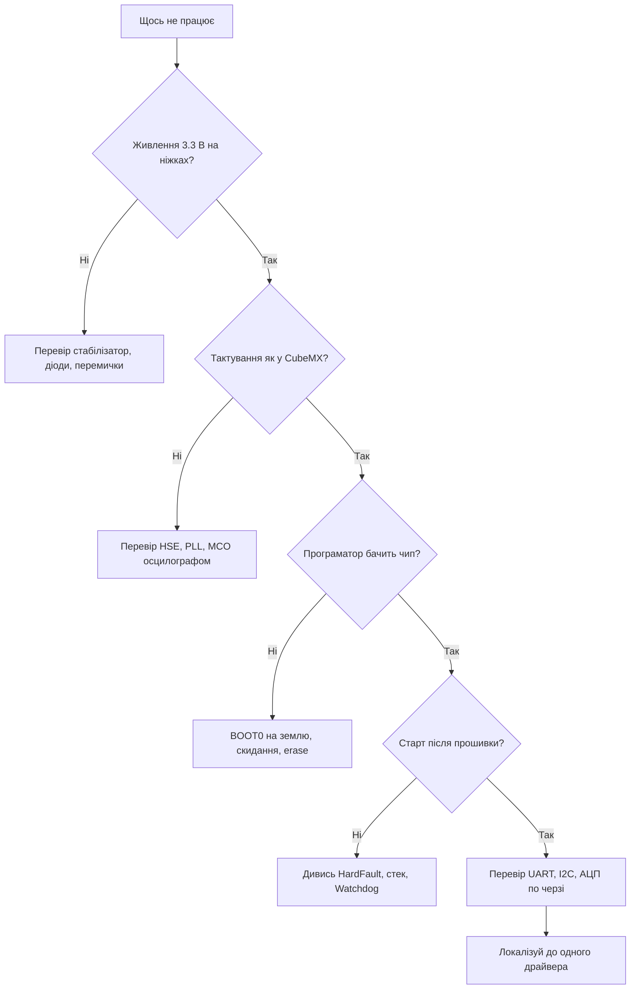
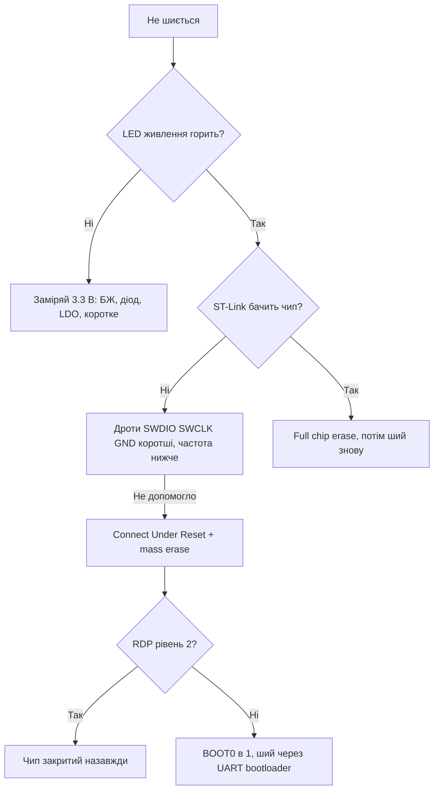
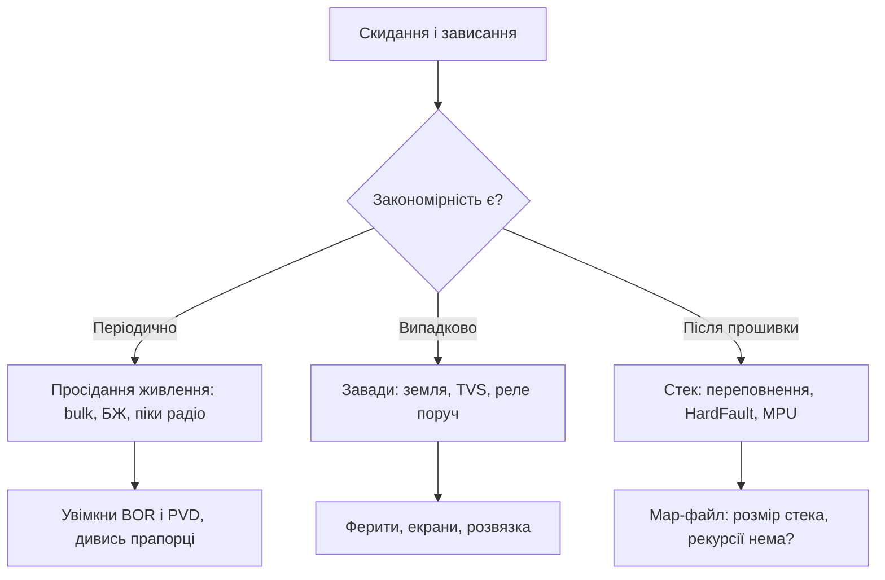
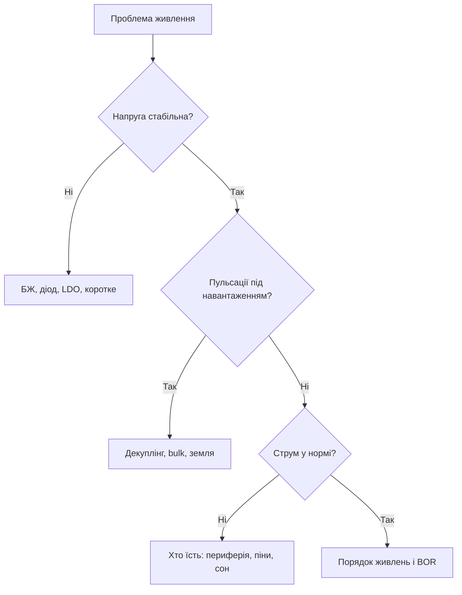

# Troubleshooting - часті питання і відповіді

![[assets/img/stm32-faq-faq-scheme.png|600]]
*Рис. Логіка пошуку несправності: живлення, тактування, прошивка, периферія, сон.*

> [!tip] Призначення нотатки
> Зібрати девʼять з десяти звернень новачків в одну таблицю: що бачимо, що найчастіше винне і яку нотатку довідника відкрити наступною.

## 1. Правило міряй не гадай

Головна помилка початківця це міняти код навмання. Правильний порядок завжди однаковий: живлення, тактування, скидання, прошивка, периферія, програма.

| Крок | Що міряємо | Чим | Норма |
| --- | --- | --- | --- |
| 1 | Напруга живлення на піні мікроконтролера | Мультиметр | 3.3 В плюс мінус 0.1 В |
| 2 | Пульсації і просідання під навантаженням | Осцилограф | Десятки мілівольт, без провалів |
| 3 | Рівень на NRST у роботі | Мультиметр | Високий рівень, короткі імпульси скидання |
| 4 | Частота кварцу і вихід PLL | Осцилограф, вивід MCO | Збігається з налаштуванням у CubeMX |
| 5 | Струм споживання у роботі і у сні | Мультиметр, шунт | Міліампери у роботі, мікроампери у сні |
| 6 | Логічні рівні на шинах | Логічний аналізатор | Чіткі фронти без сходинок |

Жоден здогад не зараховується без цифри на екрані приладу. Записуй виміри у зошит налагодження одразу.

Деталі живлення дивись у нотатці про ланцюги живлення плати, а режими пінів у нотатці про режими GPIO.

## 2. Симптом причина куди дивитись

| Симптом | Найчастіша причина | Куди дивитись |
| --- | --- | --- |
| Плата не шиється, програматор не бачить чип | Немає живлення, переплутані SWDIO і SWCLK, чип у глибокому сні | Нотатка про ST-Link, розділ живлення |
| Плата шиється, але не стартує | BOOT0 у високому рівні, забутий SystemClock, зависання у HardFault | Нотатка про CubeMX, карта Blue Pill |
| Мовчить UART, у терміналі сміття | Невірна частота тактування, переплутані прийом і передача, різна швидкість | Нотатка про UART, режими GPIO |
| Шумить АЦП, коди стрибають | Брудна аналогова земля, VDDA без фільтра, довгі дроти сенсора | Нотатка про АЦП, живлення плати |
| Не спить, струм міліампери замість мікроампер | Піни у повітрі, не вимкнена периферія, налагодчик тримає ядро | Нотатка про режими сну |
| Гальма, цикл виконується повільно | Чекання у перериваннях, float на ядрі без FPU, висока частота опитування | Порівняння чипів, класика F0 і F1 |
| Вилітає HardFault після зміни коду | Звернення за нульовим вказівником, переповнення стека, невирівняний доступ | Нотатка про CubeMX, гід по довіднику |
| Не знаходить I2C пристрій на сканері | Відсутні підтяжки, неправильна адреса, зависла шина після скидання | Нотатка про шину I2C |
| Пливе час, годинник поспішає або відстає | Внутрішній RC замість кварцу, неправильний prescaler, переповнення таймера | Нотатка про режими сну, таймери |
| Гріється стабілізатор або чип | Коротке замикання, 5 В на нетолерантному вході, перевантаження виходу | Ланцюги живлення плати |

Розшифровка рядків: прошивка описана у нотатці [[09-Proshivka/03-ST-Link-Proshivka|прошивка через ST-Link]], старт проєкту у [[09-Proshivka/01-CubeIDE-CubeMX|налаштування CubeMX]], послідовний порт у [[04-Shini/01-UART|послідовний порт UART]], шина сенсорів у [[04-Shini/03-I2C|шина I2C]], вимірювання у [[06-Analog/01-ADC|вимірювання через АЦП]], сон у [[07-Timeri-Son/03-Sleep-Stop-Standby|режими сну]].

## 3. Не шиється і не стартує

| Перевірка | Як робити | Ознака успіху |
| --- | --- | --- |
| Живлення дійшло до пінів | Міряти між VDD і VSS прямо на корпусі | 3.3 В, стабільно |
| Зʼєднання програматора | SWDIO, SWCLK, GND, NRST, при потребі 3.3 В | Короткі дроти до 20 см |
| Режим завантаження | BOOT0 на землі для роботи з флешу | Після прошивки плата стартує сама |
| Захист зчитування | Спробувати зʼєднання під скиданням, потім erase | Памʼять очищується без помилок |
| Драйвер і софт | ST-Link Upgrade, CubeProgrammer останній | Програматор видно у системі |
| Клон плати | Перевірити маркування і пайку кварцу | Рівна пайка без холодних точок |

Якщо чип заснув у Stop з вимкненим SWD, тримай скидання під час натискання Connect, потім одразу роби масове стирання.

Карту клонів дивись у [[14-Devboards/01-Blue-Pill|плата Blue Pill]], живлення у [[02-Zhivlennya/01-Lancjugi-zhivlennya|ланцюги живлення плати]], а класику чипів у [[01-Hardware/01-F0-F1-Classic|класика F0 і F1]].

## 4. Мовчить UART і не видно I2C

| Симптом | Причина | Дія |
| --- | --- | --- |
| У терміналі ієрогліфи | Baud розраховано від іншої частоти HCLK | Перевірити тактування, вивести частоту на MCO |
| Тиша у відповідь | Переплутані TX і RX, немає спільної землі | Поміняти місцями, зʼєднати GND |
| Працює лише на низькій швидкості | Довгі дроти, ємність лінії, слабкі підтяжки | Вкоротити шлейф, знизити швидкість |
| Сканер I2C нічого не знаходить | Немає підтяжок 4.7 кОм до 3.3 В | Додати резистори, перевірити живлення сенсора |
| Шина висить після помилки | Ведений тримає SDA у нулі | Девʼять імпульсів на SCL, потім скидання шини |
| Адреса не та | Зсув на біт читання запису | Прогнати сканер від 0x08 до 0x77 |

Докладні режими пінів описані у [[03-GPIO/01-GPIO-rezhimi|режими GPIO]], а стартова навігація у [[00-Start/01-Yak-koristuvatis-dovidnikom|гід по довіднику]].

## 5. Шумить АЦП і пливе час

| Проблема | Що перевірити | Норма |
| --- | --- | --- |
| Стрибають молодші біти АЦП | Фільтр VDDA, конденсатори біля пінів | 100 нФ плюс 1 мкФ прямо біля корпуса |
| Систематичне зміщення | Калібрування, опора, дільник | Калібрувати після кожної зміни посилення |
| Наводки від цифри | Трасування аналогової землі, опитування у паузі | Вимір у момент тиші, усереднення 16 проб |
| Таймер поспішає | Джерело HSI замість HSE | Кварц 8 МГц для точних інтервалів |
| Періодичне завмирання | Переповнення 16 бітного лічильника | Перейти на 32 біт або рахувати переповнення |
| Дрейф годинника реального часу | Навантаження кварцу 32 кГц | Ємності за даташитом |

Базову теорію вимірювань розкриває [[06-Analog/01-ADC|вимірювання через АЦП]], а живлення сенсора [[02-Zhivlennya/01-Lancjugi-zhivlennya|ланцюги живлення плати]].

## 6. Мінімальний приклад для повтору багу

Не надсилай весь проєкт. Виріж десять рядків, де баг видно без твого заліза.

```text
Мінімальний повтор:
1. Новий проєкт CubeMX, тільки HSE 8 МГц, UART1 115200.
2. У main лише Blink світлодіодом 1 Гц.
3. Додаєш ОДИН підозрілий рядок: виклик драйвера, переривання, DMA.
4. Якщо зламалось: це і є повтор. Якщо ні: додаєш наступний рядок.
5. Фіксуєш: частота HCLK, версія HAL, що на осцилографі, що в логах.
```

| Поле звіту | Приклад заповнення |
| --- | --- |
| Плата і чип | Саморобка на F103C8, живлення 3.3 В |
| Тактування | HSE 8 МГц, PLL на 72 МГц, MCO перевірено |
| Що очікував | UART відповідає кожну секунду |
| Що отримав | Тиша, на TX постійна одиниця |
| Що вже міряв | TX осцилографом, землю, швидкість 115200 |
| Мінімальний код | Архів з трьома файлами або вставка нижче |

Такий звіт розбирається за десять хвилин замість трьох днів листування.

Порівняння чипів для вибору швидкості дивись у [[00-Start/03-Porivnyannya-chipiv|порівняння чипів]].

## 7. Mermaid: алгоритм пошуку несправності



Іди зверху вниз і не перестрибуй. Девʼяносто відсотків багів закриваються на перших трьох ромбах.

## 8. Типові помилки новачків

| Номер | Помилка | Чим закінчується | Як правильно |
| --- | --- | --- | --- |
| 1 | Довгі дроти SWD через макетку | Випадкові обриви звʼязку | Короткий шлейф, земля поруч |
| 2 | 5 В на нетолерантний пін | Пробій входу, нагрів | Дивитись колонку FT у даташиті |
| 3 | Затримки у перериваннях | Пропуски пакетів, гальма | У перериванні лише прапорець |
| 4 | Піни у повітрі перед сном | Міліампери замість мікроампер | Всі вільні у аналоговий режим |
| 5 | Віра у маркування клона | Менше памʼяті, інший кварц | Перевірити програматором |
| 6 | Лікування конденсатором навмання | Маскування просідання | Спочатку замір струму і пульсацій |

Для першого старту заводської плати відкрий [[14-Devboards/03-Nucleo|плати Nucleo]] і [[14-Devboards/01-Blue-Pill|плата Blue Pill]], а для класики чипів [[01-Hardware/01-F0-F1-Classic|класика F0 і F1]].

## 9. Рівні діагностики: L1, L2, L3

| Рівень | Що робимо | Інструмент | Час |
| --- | --- | --- | --- |
| L1 Швидкий фікс | Живлення, дроти, BOOT0, перемички | Очі і мультиметр | 5 хвилин |
| L2 Софт і конфіг | Тактування, NVIC, DMA-канали, баги init | Дебагер і лог | Година |
| L3 Глибина | Кварци, розводка, завади, брак | Осцилограф і аналізатор | День |

```text
Правило ескалації:
  L1 не дав результату двічі — іди на L2, не крути дроти годину;
  L2 не дав результату — роби мінімальний приклад і міряй залізо (L3).
```

## 10. Дерево рішень: не шиється



## 11. Дерево рішень: працює нестабільно



Повну карту симптомів дивись в [[99-Dodatki/04-Diagnostic-Map|карті діагностики]].

## 12. FAQ живлення: просадки і пульсації

| Симптом | Причина | Що робити |
| --- | --- | --- |
| Скидання при старті радіо | Пік струму садить лінію | Bulk 10 мкФ+ біля радіо, БЖ з запасом |
| Пульсації на АЦП синхронно з ШІМ | Спільний декуплінг | Ферит і окремі конденсатори на VDDA |
| Не стартує на батареї, від USB працює | Внутрішній опір банки | Свіжа банка, короткі товсті дроти |
| Гріється LDO | Великий перепад і струм | Рахувати розсіювання, або buck |
| Провал при першій мілісекунді | Заряд вихідних ємностей | Soft-start, більше bulk на вході |
| Працює тільки з дебагером | Живлення йде від ST-Link | Перевірити своє живлення без дебагера |



## 13. FAQ радіо: не-join і поганий RSSI

| Симптом | Причина | Що робити |
| --- | --- | --- |
| BLE не рекламує | Стек не залито або FUS старий | FUS і стек з одного пакета! |
| Не конектиться | UUID немає в рекламі | Додати сервіси в пакет |
| LoRa не join | Ключі або частота | OTAA-ключі, діапазон регіону |
| Пакети губляться | Слабкий сигнал | Антена, SF вище, шлюз вище |
| Бан на сервері | Duty-cycle перевищено | Рідше пакети, нижчий SF |
| Працює на столі, в полі ні | Корпус і рука | Тест у реальних умовах |

## 14. FAQ по платах: Blue Pill, Black Pill, Nucleo

| Плата | Симптом | Причина і фікс |
| --- | --- | --- |
| Blue Pill | Не шиється по USB | Там тільки живлення! ST-Link або UART |
| Blue Pill | BOOT0 назад забули | Плата висить в bootloader - перемкнути |
| Blue Pill | Гріється LDO | Навантаження велике - окреме живлення |
| Blue Pill | Менше Flash ніж пишеться | Клон: перевірити st-info |
| Black Pill | DFU не бачиться | Кнопка BOOT0 при підключенні USB! |
| Black Pill | CDC мовчить | Дескриптори і драйвери VCP |
| Nucleo | Не бачить зовнішню плату | Перемички ST-Link зняти! |
| Nucleo | Живлення JP5 не те | U5V, E5V, VIN - вибрати своє |
| Nucleo | Вимір струму нульовий | Перемичка IDD на місці? |
| Discovery | Дисплей білий | Init-послідовність BSP, живлення підсвітки |
| Discovery | Немає звуку | I2S і підсилювач у shutdown |

## 15. HardFault-декодер: читаємо причину падіння

| Регістр | Біт | Значення |
| --- | --- | --- |
| HFSR | FORCED | Інший fault ескалювався - дивись нижче |
| HFSR | VECTTBL | Помилка читання таблиці векторів |
| CFSR.BFSR | PRECISERR | Точна помилка шини - адреса в BFAR! |
| CFSR.BFSR | IMPRECISERR | Неточна - винуватця шукати по коду |
| CFSR.UFSR | UNDEFINSTR | Невідома інструкція - битий код або стрибок |
| CFSR.UFSR | INVSTATE | Спроба ARM-режиму на Cortex-M |
| CFSR.UFSR | DIVBYZERO | Ділення на нуль (якщо пастка увімкнена) |
| CFSR.MMSR | IACCVIOL | Виконання з забороненої області (MPU!) |
| CFSR.MMSR | DACCVIOL | Доступ до забороненої області |

```c
// Мінімальний зловлювач з дампом у консоль:
void HardFault_Handler(void)
{
  print_hex("HFSR", SCB->HFSR);
  print_hex("CFSR", SCB->CFSR);
  print_hex("BFAR", SCB->BFAR);
  print_hex("MMFAR", SCB->MMFAR);
  while (1) { blink_sos(); }
}
```

```text
Розшифровка адреси падіння:
  1. Взяти адресу з BFAR або зі стека (PC на момент fault);
  2. arm-none-eabi-addr2line -e firmware.elf <адреса>;
  3. Отримати файл і рядок винуватця.
Типові винуватці: NULL-вказівник, переповнення стека, читання з вимкненої периферії.
```

## 16. Покажчик симптомів: швидкий вхід

| Симптом | Куди дивитись |
| --- | --- |
| АЦП шумить | Розділ 5 цієї ноти, VDDA-фільтр |
| Батарея сідає швидко | Режими сну, струм сну амперметром |
| Гріється чип | Коротке, LDO навпаки, прошивка з конфліктом пінів |
| Зависає випадково | Стек, завади, просідання живлення |
| Не бачить I2C-девайс | Адреса, підтяжки, зависла шина |
| Не стартує після прошивки | Тактування, WDG, векторна таблиця |
| Не шиється | Дерево 10 цієї ноти |
| Працює нестабільно | Дерево 11 цієї ноти |
| Пливе час RTC | LSE-кварц, VBAT, конденсатори |
| Радіо мовчить | FUS і стек, антена, живлення PA |
| Скидається під навантаженням | Bulk, BOR, піки струму |
| Сміття в UART | Бодрейт, земля, інверсія |
| SPI зсув бітів | CPOL і CPHA з обох боків |

## Див. також

- [[Home]]
- [[00-Start/01-Yak-koristuvatis-dovidnikom|гід по довіднику]]
- [[02-Zhivlennya/01-Lancjugi-zhivlennya|ланцюги живлення плати]]
- [[04-Shini/01-UART|послідовний порт UART]]
- [[04-Shini/03-I2C|шина I2C]]
- [[06-Analog/01-ADC|вимірювання через АЦП]]
- [[07-Timeri-Son/03-Sleep-Stop-Standby|режими сну]]
- [[09-Proshivka/03-ST-Link-Proshivka|прошивка через ST-Link]]
- [[99-Dodatki/02-Cheklisti|перевірочні списки]]
- [[99-Dodatki/03-Datasheet-Links|де брати даташити]]
