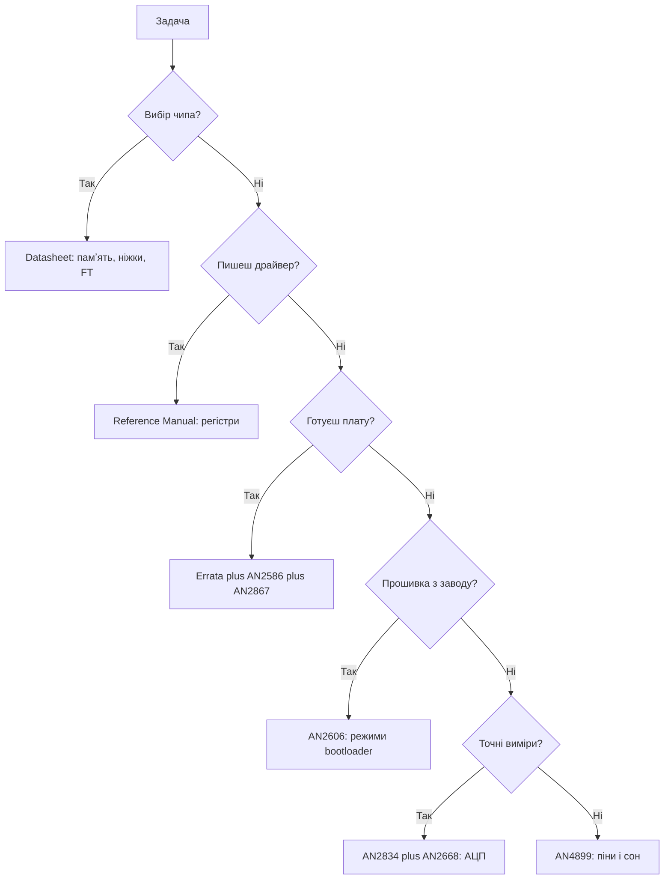

# Даташити - що читати і де брати

![[assets/img/stm32-datasheet-links-scheme.png|600]]
*Рис. Піраміда документів: даташит, reference manual, programming manual, errata, апноути.*

> [!tip] Призначення нотатки
> Пояснити, який документ за що відповідає, де лежить першоджерело і які апноути реально існують, щоб не гуглити сміття.

## 1. Ієрархія документів ST

| Документ | Що всередині | Коли відкривати |
| --- | --- | --- |
| Datasheet | Піни, корпуси, памʼять, 5 В толерантність, струми, температури | Вибір чипа і перевірка пінів |
| Reference Manual | Регістри, тактування, DMA, переривання, режими сну | Написання драйвера і налагодження |
| Programming Manual | Ядро Cortex, система переривань, інструкції, MPU | HardFault, пріоритети, асемблер |
| Errata Sheet | Помилки кремнію конкретної ревізії і обходи | До замовлення плати і перед релізом |
| Application Note AN | Готові рецепти: bootloader, кварци, АЦП, USB | Коли робиш вузол вперше |
| User Manual плати | Схема Nucleo, перемички, ST-Link на борту | Перший запуск заводської плати |

Правило одне: сумнів вирішує першоджерело на st.com, а не форум чи переказ.

## 2. Де качати щоб не зловити старе

| Джерело | Що брати | Чому |
| --- | --- | --- |
| st.com, сторінка чипа | Datasheet, Reference Manual, Errata останніх ревізій | Завжди свіже, з датою і ревізією |
| st.com, пошук за AN | Апноути у PDF з номером і датою | Немає переписаних копій |
| STM32CubeMX | Заголовки HAL і SVD опис регістрів | Збігається з твоєю версією HAL |
| STM32CubeProgrammer | Останні алгоритми прошивки | Старий софт не бачить нові чипи |
| Архів проєкту | Збережені PDF з датою скачування | Через рік доведеш, за чим розводив |

Ніколи не розводь плату за даташитом з невідомого дзеркала. Звір номер ревізії у нижньому колонтитулі.

## 3. Ключові апноути: тільки реальні номери

| Номер | Тема | Що взяти |
| --- | --- | --- |
| AN2606 | System memory boot mode, заводський завантажувач | Таблиця інтерфейсів bootloader для кожного чипа |
| AN2586 | Getting started with hardware development | Мінімум обвʼязки: живлення, скидання, кварци |
| AN2867 | Oscillator design guide | Вибір кварцу, навантаження, трасування |
| AN2834 | How to get the best ADC accuracy | VDDA, опора, земля, усереднення |
| AN2668 | Improving ADC resolution by oversampling | Передискретизація і фільтрація для бітів |
| AN4899 | GPIO hardware settings and low-power | Налаштування пінів для сну і струму |
| AN3155 | USART protocol used in bootloader | Протокол прошивки через UART |
| AN4879 | USB hardware and PCB guidelines | Розводка USB, захист, живлення |
| AN2824 | I2C optimized examples | Приклади опитування, переривань і DMA для I2C |
| AN1709 | EMC design guide | Захист від завад і статичних розрядів |

Усі номери вище існують на st.com. Якщо бачиш інший номер у блозі, перевір його пошуком на сайті виробника.

Звʼязок з довідником: bootloader у [[15-Protokoli/02-DFU-Bootloader|оновлення прошивки]], порт у [[04-Shini/01-UART|послідовний порт UART]], шина у [[04-Shini/03-I2C|шина I2C]], вимірювання у [[06-Analog/01-ADC|вимірювання через АЦП]].

## 4. Як читати даташит за двадцять хвилин

| Хвилина | Розділ | Що виписуємо |
| --- | --- | --- |
| 0-3 | Ordering information | Точний партномер, обсяг памʼяті, корпус |
| 3-7 | Pinout | Живлення, NRST, BOOT0, SWD, FT піни |
| 7-12 | Electrical characteristics | Діапазон живлення, струм піна, температури |
| 12-16 | Clock and timing | HSE, LSE, вимоги до конденсаторів |
| 16-20 | Package drawings | Посадкове місце і теплові вимоги |

Почни з класики [[01-Hardware/01-F0-F1-Classic|класика F0 і F1]] і звір з [[00-Start/03-Porivnyannya-chipiv|порівняння чипів]].

## 5. Як читати errata до замовлення плати

| Крок | Дія | Приклад |
| --- | --- | --- |
| 1 | Знайди ревізію свого чипа | Літера на корпусі і маркування |
| 2 | Відкрий errata саме під цю ревізію | Дата свіжіша за твій даташит |
| 3 | Пройдись по своїй периферії | UART, I2C, АЦП, сон, USB |
| 4 | Випиши обходи у код | Прапорець, скидання, затримка |
| 5 | Перевір вплив на плату | Інший кварц, фільтр, підтяжка |
| 6 | Збережи PDF у репозиторій | Папка docs з датою |

Найдорожча помилка це дізнатись про баг I2C після тиражу. Година з errata дешевша за перепайку.

## 6. Mermaid: який документ коли

Рухайся згори вниз. Не лізь у reference manual, поки не закрив питання корпусу і живлення.

## 7. Шпаргалка по звʼязках з довідником

| Тема довідника | Документ ST |
| --- | --- |
| Живлення плати і VDDA | Datasheet плюс AN2834 |
| Режими пінів і сон | AN4899 плюс Reference Manual GPIO |
| UART завантажувач | AN2606 плюс AN3155 |
| Шина сенсорів | AN2824 плюс Reference Manual I2C |
| АЦП і шуми | AN2834 плюс AN2668 |
| Перший запуск плати | User Manual плати плюс нотатка Nucleo |
| Прошивка програматором | Нотатка ST-Link плюс CubeProg manual |

Додатково тримай поруч [[03-GPIO/01-GPIO-rezhimi|режими GPIO]] і [[09-Proshivka/03-ST-Link-Proshivka|прошивка через ST-Link]] для швидкої звірки.

Перший запуск плати дивись у [[14-Devboards/03-Nucleo|плати Nucleo]], карту клонів у [[14-Devboards/01-Blue-Pill|плата Blue Pill]], старт проєкту у [[09-Proshivka/01-CubeIDE-CubeMX|налаштування CubeMX]].

## 8. Типові помилки читання

| Номер | Помилка | Наслідок | Як правильно |
| --- | --- | --- | --- |
| 1 | Читати стару ревізію PDF | Піни не збігаються | Звіряти дату і ревізію на st.com |
| 2 | Плутати maximum з typical | Перегрів і просідання | Проєктувати за maximum, батарею за typical |
| 3 | Ігнорувати зноску FT | 5 В палить вхід | Перевіряти колонку FT для кожного піна |
| 4 | Не відкривати errata | Баг кремнію ловить у серії | Читати errata до трасування |
| 5 | Вірити копії з форуму | Застарілі таблиці bootloader | Тільки AN2606 з сайту виробника |
| 6 | Не зберігати PDF | Через рік не довести рішення | Папка docs з датою у репозиторії |

Для старту з нуля відкрий [[00-Start/01-Yak-koristuvatis-dovidnikom|гід по довіднику]] і оновлення [[15-Protokoli/02-DFU-Bootloader|оновлення прошивки]].

## Див. також

- [[Home]]
- [[00-Start/01-Yak-koristuvatis-dovidnikom|гід по довіднику]]
- [[01-Hardware/01-F0-F1-Classic|класика F0 і F1]]
- [[04-Shini/03-I2C|шина I2C]]
- [[06-Analog/01-ADC|вимірювання через АЦП]]
- [[09-Proshivka/03-ST-Link-Proshivka|прошивка через ST-Link]]
- [[14-Devboards/01-Blue-Pill|плата Blue Pill]]
- [[99-Dodatki/01-Troubleshooting-FAQ|відповіді на часті питання]]
- [[99-Dodatki/02-Cheklisti|перевірочні списки]]
