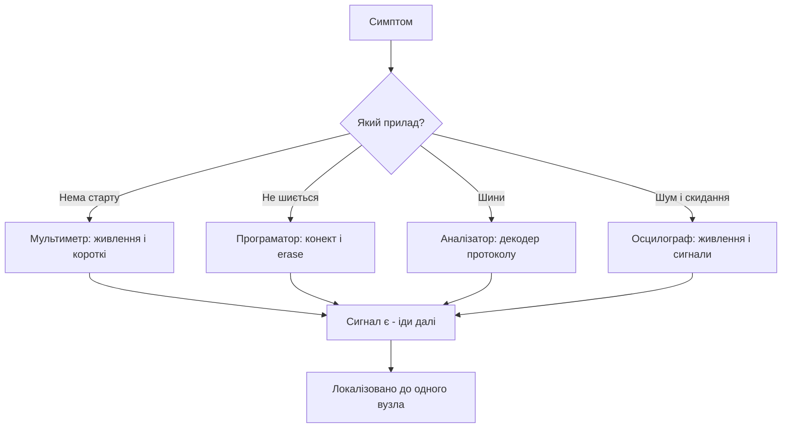

# Карта діагностики - симптом, інструмент, сигнал

![[assets/img/stm32-diag-map-scheme.png|600]]
*Рис. Від симптому до сигналу: яким приладом і що дивитись.*

> [!tip] Призначення ноти
> Дати таблицю-маршрут: симптом - яким приладом міряти - який сигнал шукати.

## 1. Як користуватись картою

Знайди свій симптом у таблиці, візьми вказаний прилад, перевір сигнал. Якщо сигналу немає - причина знайдена. Якщо є - іди далі за ланцюжком.

## 2. Живлення і старт

| Симптом | Прилад | Сигнал |
| --- | --- | --- |
| Плата мертва | Мультиметр | 3.3 В на нозі VDD чипа |
| Гріється стабілізатор | Палець і амперметр | Струм спокою: міліампери, не ампери |
| Скидання під навантаженням | Осцилограф на VDD | Просідання нижче порога BOR |
| Не стартує з кварцом | Осцилограф на OSC | Синусоїда правильної частоти |
| Плаваючий старт | Логіка NRST | Чистий високий рівень без дзвону |

## 3. Прошивка і дебаг

| Симптом | Прилад | Сигнал |
| --- | --- | --- |
| ST-Link не бачить | CubeProgrammer + дроти | SWDIO і SWCLK доходять до пінів |
| Обрив посеред запису | Коротший шлейф | Знизити частоту SWD |
| Стартує тільки з дебагером | Схема BOOT0 | Підтяжка BOOT0 на землю |
| HardFault одразу | Дебагер, регістр HFSR | Адреса вини в дизасемблері |

## 4. Цифрові шини

| Симптом | Прилад | Сигнал |
| --- | --- | --- |
| UART видає сміття | Логічний аналізатор | Бодрейт і старт-біт на лінії |
| UART мовчить | Аналізатор на TX | Чи є взагалі пересилання |
| I2C висить | Осцилограф на SCL | Лінія в нулі - слейв тримає |
| I2C NACK | Аналізатор адреси | Адреса на лінії збігається з даташитом |
| SPI зсув бітів | Аналізатор з декодером | CPOL і CPHA з обох боків однакові |
| CAN мовчить | Осцилограф диференційно | Домінантні і рецесивні рівні |

## 5. Аналог і час

| Симптом | Прилад | Сигнал |
| --- | --- | --- |
| Шум АЦП | Осцилограф на VDDA | Пульсації цифрової частини |
| Пливе вимір | Мультиметр на VREF | Опора стабільна під навантаженням |
| Не спить у Stop | Амперметр у розрив | Яка периферія не вимкнена - вимикати по черзі |
| Пливе RTC | Частотомір на LSE | 32768 Гц точно, конденсатори за даташитом |

## 6. Mermaid: маршрут діагностики



## 7. Мінімальний набір лабораторії

| Прилад | Мінімум | Навіщо |
| --- | --- | --- |
| Мультиметр | True-RMS | Напруги, струми, продзвонка |
| БЖ з обмеженням | 0-30 В, регулювання струму | Безпечне перше ввімкнення |
| Логічний аналізатор | 8 каналів, 24 МГц | UART, I2C, SPI декодери |
| Осцилограф | 2 канали, 100 МГц | Живлення, кварци, сигнали |
| ST-Link | Оригінал або клон | Прошивка і дебаг |

## 8. Радіо і силові кола

| Симптом | Прилад | Сигнал |
| --- | --- | --- |
| LoRa не чутно | Перевірка FUS і стека | Версії стека і прошивки сумісні |
| Мала дальність | Огляд антени | 50 Ом, keepout-зона, pi-ланцюг |
| Серво сіпається | Осцилограф на ШІМ | Період 20 мс, імпульс 1-2 мс стабільно |
| Реле клацає саме | Осцилограф на котушці | Викид без діода - хибні спрацьовування |
| MOSFET гріється | Замір затвора | Фронт крутий, плато Міллера коротке |

## 9. Журнал діагностики: що записати

| Поле | Навіщо |
| --- | --- |
| Симптом дослівно | Щоб повторити через місяць |
| Умови: живлення, температура, кабелі | Баг живе в умовах, не в коді |
| Що вже перевірено | Не ходити колами |
| Мінімальний приклад | Голий проєкт, де баг видно |
| Фото плати і осцилограм | Пам'ять краща за слова |

```text
Шаблон запису:
  плата: ревізія, чип, живлення;
  симптом: що і коли;
  виміри: прилад, точка, значення;
  висновок: вузол-винуватець;
  фікс: що змінено, результат.
```

## 10. Коли зупинитись і попросити допомоги

| Ознака | Дія |
| --- | --- |
| Ходиш колами третій раз | Перерва, потім мінімальний приклад з нуля |
| Підозра на брак чипа | Перепаяти на свідомо робочу плату |
| Підозра на розводку | Порівняти з Nucleo: той же код там працює? |
| Немає приладу для сигналу | Попросити вимір, а не гадати |

```text
Пакет для питання на форум:
  мінімальний код, що повторює баг;
  схема підключення проблемного вузла;
  осцилограма або лог з приладу;
  що вже перевірено за цією картою.
Без пакета — у відповідь отримаєш ті самі питання.
```

## 11. Війністорії: як це було в полі

### Кейс 1. Мовчазний UART після переїзду на G0

| Поле | Запис |
| --- | --- |
| Симптом | Консоль видає сміття після переїзду з F1 |
| Вимір | Аналізатор показав бодрейт на 12 відсотків вище |
| Причина | Шина APB інша, BRR пораховано від старої частоти |
| Фікс | Перерахунок BRR від фактичної шини, перевірка MCO |

### Кейс 2. I2C вмирає раз на добу

| Поле | Запис |
| --- | --- |
| Симптом | Датчик пропадає, лікується ресетом |
| Вимір | Осцилограф: SCL в нулі після грози поруч |
| Причина | Слейв завис посеред байта, завада від контактора |
| Фікс | TVS на лінії + програмні 9 клоків відновлення |

### Кейс 3. Батарея сіла за місяць замість років

| Поле | Запис |
| --- | --- |
| Симптом | Вузол мовчить через місяць |
| Вимір | Амперметр: 2 мА в сні замість 2 мкА |
| Причина | UART-передавач не вимкнено перед сном |
| Фікс | Вимикати периферію явно, замір сну в чекліст |

### Кейс 4. АЦП бачить сходинки

| Поле | Запис |
| --- | --- |
| Симптом | Значення стрибає кратко молодшим бітам |
| Вимір | VDDA пульсує синхронно з ШІМ |
| Причина | Спільний декуплінг цифри і аналогу |
| Фікс | Ферит і окремі конденсатори на VDDA |

### Кейс 5. Радіо чує через раз

| Поле | Запис |
| --- | --- |
| Симптом | Пакети губляться на половині дистанції |
| Вимір | RSSI на 15 дБ гірше еталонної плати |
| Причина | Мідь під chip-антеною в цій ревізії |
| Фікс | Keepout у наступній ревізії, тимчасово - зовнішня антена |

## 12. Війністорії 6-10: друга пятірка

### Кейс 6. HardFault від переповнення стека

| Поле | Запис |
| --- | --- |
| Симптом | Падає у випадкових місцях |
| Вимір | Map-файл: стек майже впритул до купи |
| Причина | Рекурсія в парсері плюс глибокі ISR |
| Фікс | Більше стека в лінкері, рекурсію прибрати |

### Кейс 7. Плата-цегла після RDP

| Поле | Запис |
| --- | --- |
| Симптом | ST-Link не бачить, erase не йде |
| Вимір | Option bytes: RDP рівень 2 |
| Причина | Клік у CubeProgrammer на дебажній платі |
| Фікс | Чип у смітник; правило - RDP 2 тільки в серії |

### Кейс 8. Згорілий пін від 5 В

| Поле | Запис |
| --- | --- |
| Симптом | Вхід завжди читає одиницю, чип гріється |
| Вимір | Колонка FT у даташиті - порожня для цього піна |
| Причина | 5 В на не-FT вхід безпосередньо |
| Фікс | Заміна чипа, дільник або MOSFET-міст |

### Кейс 9. Повільний I2C через дроти

| Поле | Запис |
| --- | --- |
| Симптом | NACK на половині транзакцій |
| Вимір | Фронти SCL розтягнуті - ємність шлейфа |
| Причина | 30 см макетних дротів на 400 кГц |
| Фікс | Коротше, нижча швидкість, сильніші підтяжки |

### Кейс 10. Сон зїдає батарею через дебагер

| Поле | Запис |
| --- | --- |
| Симптом | У сні міліампери замість мікроампер |
| Вимір | Без ST-Link - норма, з ним - ні |
| Причина | Дебагер тримає домени живлення |
| Фікс | Міряти сон тільки без підключеного дебагера |

## 13. Покажчик інструментів: що можу з тим, що є

| Маю | Можу перевірити | Не можу |
| --- | --- | --- |
| Тільки мультиметр | Живлення, короткі, струм спокою, кнопки, дільники | Таймінги, протоколи, пульсації |
| Мультиметр + ST-Link | Плюс ID чипа, регістри, пам'ять, HardFault-адресу | Швидкі сигнали |
| Плюс логічний аналізатор | UART, I2C, SPI, ШІМ-періоди, таймінги протоколів | Аналоговий шум |
| Плюс осцилограф | Все вище плюс пульсації, кварци, фронти, КСХ-орієнтири | Радіоспектр |
| Все + VNA | Узгодження антен, S11, точні 50 Ом | Сертифікаційні виміри поля |

```text
Пріоритет покупок для лабораторії:
  мультиметр -> ST-Link -> аналізатор -> осцилограф -> БЖ з обмеженням.
  Кожен наступний відкриває новий клас багів.
```

## Див. також

- [[Home]]
- [[99-Dodatki/01-Troubleshooting-FAQ|відповіді на питання]]
- [[99-Dodatki/02-Cheklisti|перевірочні списки]]
- [[17-Lab/01-Priladi|вимірювальні прилади]]
- [[09-Proshivka/03-ST-Link-Proshivka|прошивка через ST-Link]]
