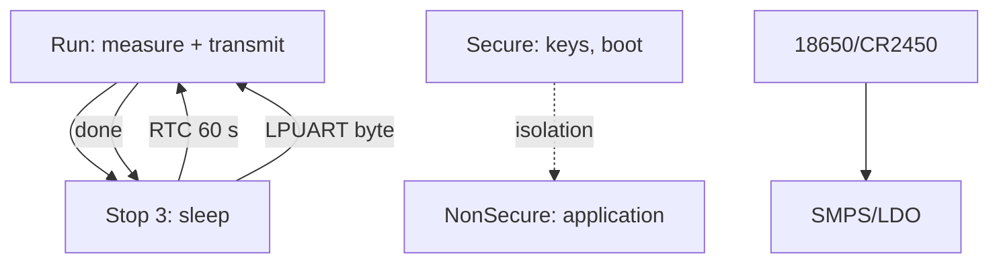

# STM32U5 in Depth - Cortex-M33, TrustZone and Ultra-Low Power

![[assets/img/stm32-u5-deep-scheme.png|600]]
*Fig. U5: M33 sleeps in Stop 3 with SRAM, wakes from LPUART/RTC, secrets live in TrustZone.*

> [!tip] What this note is
> Successor of L4 for years of battery life: M33, sub-microamp sleep, hardware security. Family: [[01-Hardware/05-L0-L4-U5.en | L0/L4/U5 overview]], power supply: [[02-Power-Supply/02-Batareyne-zhivlennya.en | Battery power supply]].

## 1. Goal

Build a node that runs for years on a battery:

- Run/Sleep/Stop0-3/Standby/Shutdown modes - what stays alive in each;
- TrustZone: secure and non-secure worlds;
- Low-power peripherals: LPUART, LPTIM, ADC - work in sleep;
- SRAM retention: how much memory we keep;
- honest microamp measurement.

| Mode | Typical current | Stays alive |
| --- | --- | --- |
| Run 160 MHz | ~20 mA | everything |
| Sleep | ~5 mA | everything, CPU stopped |
| Stop 0/1 | ~30 uA | SRAM, some peripherals |
| Stop 2/3 | ~3 uA | SRAM selectively |
| Standby | ~300 nA | RTC + backup |
| Shutdown | ~20 nA | wakeup only |

## 2. Architecture



Battery node cycle: woke up -> measured -> sent -> fell asleep. Activity is milliseconds against minutes of sleep.

## 3. Power Supply Pinout (LQFP)

| Signal | Purpose | Note |
| --- | --- | --- |
| VDD/VDDA | digital + analog | 100 nF near each |
| VLCD | LCD driver (where present) | capacitors per manual |
| VBAT | RTC + backup SRAM | battery/supercap |
| NRST | reset | button + RC |
| SMPS inductor | SMPS versions only | per ST reference |

Current measurement: IDD jumper on Nucleo (break + ammeter), or a uCurrent-like amplifier.

## 4. Stop Modes in Detail

- Stop 0: fast wakeup (~5 us), higher current;
- Stop 1: balance for most nodes;
- Stop 2/3: minimum, part of SRAM switched off selectively;
- wakeup: RTC, LPUART start bit, GPIO EXTI, I2C address;
- after Stop - clocking re-init (MSI by default!).

## 5. Working Code (C, HAL)

```c
#include "stm32u5xx_hal.h"

void sleep_stop3_rtc(uint32_t seconds) {
  HAL_SuspendTick();
  __HAL_RCC_PWR_CLK_ENABLE();
  HAL_PWREx_EnableSRAMRetention(PWR_SRAM2_FULL);
  RTC_AlarmTypeDef al = {0};
  al.AlarmTime.Seconds = seconds % 60;
  al.AlarmTime.Minutes = (seconds / 60) % 60;
  HAL_RTC_SetAlarm_IT(&hrtc, &al, RTC_FORMAT_BIN);
  HAL_PWR_EnterSTOPMode(PWR_MAINREGULATOR_ON, PWR_STOPENTRY_WFI);
  SystemClock_Config();
  HAL_ResumeTick();
}

void app_main(void) {
  sensors_read();
  radio_send();
  sleep_stop3_rtc(60);
}
```

Beginner mistake: not restoring clocks after Stop - the MCU runs but on slow MSI and everything drifts.

## 6. Working Code (MicroPython)

```python
# MicroPython: U5-вузол сну і виміру (порт під U5)
import time
import machine

adc = machine.ADC(0)
uart = machine.UART(1, baudrate=9600)
rtc = machine.RTC()

def read_mv():
    s = 0
    for _ in range(16):
        s += adc.read_u16()
    return s * 3300 // (16 * 65535)

while True:
    mv = read_mv()
    uart.write(f"BAT {mv}\r\n")
    machine.lightsleep(60000)
```

`lightsleep` keeps RAM and state - woke up and continued. `deepsleep` is deeper but restarts the program.

## 7. TrustZone in Brief

- Secure: boot, keys, crypto - untouchable;
- NonSecure: application, calls Secure via the veneer table;
- SAU/IDAU split memory and peripherals;
- for hobby-grade: enabled TZEN + Cube example;
- production: secure-boot + secure-update (see the security note).

## Common issues

| Symptom | Cause | Fix |
| --- | --- | --- |
| Milliamps of current in Stop | GPIO/peripherals not off | analog inputs to analog, disable clocks |
| Does not wake up | alarm not configured | RTC alarm + NVIC, check flags |
| Everything slow after Stop | clocks not restored | SystemClock_Config() after exit |
| TrustZone HardFault | call not via veneer | only NSC functions with attribute |
| Battery dead in a month | frequent wakeups | rarer cycle, more sleep, less TX |
| LPUART loses first byte | start-bit detect sleeps too deep | Stop 1 instead of Stop 3 for UART |

## 9. U5 Quick Cheat Sheet

- measure current with the IDD jumper;
- Stop 1 is the golden middle;
- restore clocks after sleep;
- enable TrustZone from the Cube example;
- cycle: measure -> TX -> sleep.

## 10. Related Notes

- [[01-Hardware/05-L0-L4-U5.en | L0/L4/U5 overview]] - place in the lineup.
- [[02-Power-Supply/02-Batareyne-zhivlennya.en | Battery power supply]] - current sources.
- [[07-Timers/03-Sleep-Stop-Standby.en | Sleep modes]] - sleep details.
- [[15-Protocols/06-Secure-Boot.en | Secure boot]] - production security.
- [[Home.en | Main map]] - full navigation.

## Official sources

- [STM32CubeU5 (STMicroelectronics, GitHub)](https://github.com/STMicroelectronics/STM32CubeU5) - HAL, Stop/TrustZone examples.
- [STM32F4 (ST)](https://www.st.com/en/mcus-mpus/stm32f4.html) - baseline for power comparison.
- [MQTT Specification (OASIS)](https://mqtt.org/mqtt-specification/) - node telemetry.
