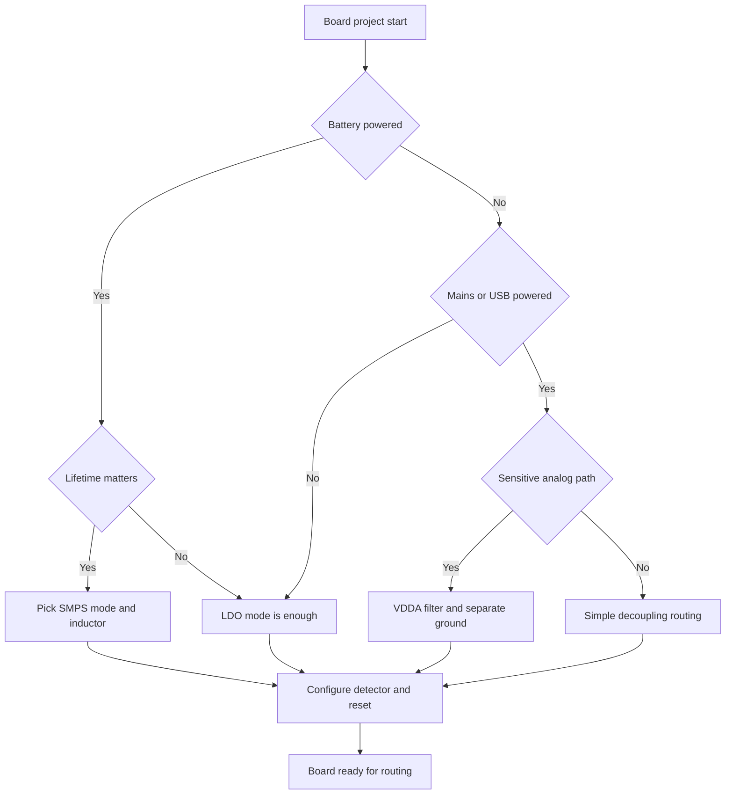

# STM32 Power Supply - Domains, Decoupling and Supervision

![[assets/img/stm32-power-rails-scheme.png|600]]
*Fig. Power domains, decoupling, sag supervision and startup order.*

> [!tip] Purpose of this note
> Give a power map of the board: which domains exist inside the chip, how to route capacitors, when to pick the built-in regulator and when to bypass it, and how to supervise sagging.

## 1. Purpose

Power supply defines core stability, analog path accuracy and correct startup after voltage is applied. This note brings together the domains inside the die, bulk capacitor requirements, the choice between the built-in regulator and an external converter, and voltage level supervision with a detector and a reset circuit.

The note helps at the board routing stage, when layer count, capacitor placement near pins, power trace width and the ground joining point are decided. Weak spots of cheap boards are covered separately, where a low-power regulator cannot hold current surges when a radio module turns on.

The material complements the description of node battery power and the description of low-consumption modes, where sleep and wakeup are covered.

## 2. Power domains inside the chip

| Domain | Purpose | Range | Comment |
| --- | --- | --- | --- |
| VDD | Core, digital logic, memories, ports | 1.71 V - 3.6 V | Main domain, powers almost all digital |
| VDDA | Analog part, ADC, DAC, comparators | 1.62 V - 3.6 V | Needs clean power without digital noise |
| VREF+ | Reference for ADC and DAC | 1.62 V - VDDA | Measurement accuracy depends on reference accuracy |
| VBAT | Real-time clock, backup registers | 1.2 V - 3.6 V | Lives on battery when main power is gone |
| VCAP | Internal core regulator output | 1.0 V - 1.2 V | Capacitor to ground only, no loads |
| VSS and VSSA | Digital and analog ground | 0 V | Joined at a single point near the chip |

Core principle: VDDA must not sit below VDD by more than a small difference, otherwise parasitic currents flow through protection diodes. In practice both domains run from one 3.3 V bus, but VDDA is routed through a separate filter.

The VREF+ reference can be internal or external. Internal suits logic and thresholds, an external precision reference is needed for accurate measurements. Without an external reference, the VREF+ pin is tied directly to VDDA; a 100 nF capacitor goes from VREF+ to ground, not in series with the circuit (series breaks DC).

The VBAT domain powers the clock and the backup area while the board is de-energized. A battery or supercapacitor is connected to it through diode isolation. Without a battery, the VBAT pin is tied to VDD through a resistor or directly, per the recommendation for the specific chip.

## 3. Decoupling: small near every pin, large near the input

| Capacitor | Where to place | Why |
| --- | --- | --- |
| 100 nF ceramic | Near every VDD and VDDA pin, as close as possible | Quenches high-frequency current spikes of the core |
| 1 uF ceramic | Next to a group of power pins | Supports middle frequencies and smooths dips |
| 4.7 uF - 10 uF | On the 3.3 V bus input near the chip | General charge reserve for pulsed loads |
| 47 uF - 100 uF | On the board input after the regulator | Quenches slow sags and inrush currents |
| Ferrite bead | Between VDD and VDDA together with a capacitor | Cuts digital noise away from analog |

The 100 nF ceramic is placed so that the trace from the pin to the capacitor and to ground is the shortest. Every extra millimeter adds inductance and reduces the benefit. Vias to the ground layer go next to the capacitor pad.

```text
Correct decoupling placement near the chip:

  3.3 V rail ----+----+----+---- VDD pin
                 |    |    |
                10u  1u  100n
                 |    |    |
  Ground layer --+----+----+---- VSS pin

  Separate analog branch:

  3.3 V rail -- ferrite -- VDDA -- 100n -- ground
                                   + 1u -- ground
```

Small ceramic is not replaced by one large electrolytic. A large capacitor has large self-inductance and does not work at tens of megahertz. So always a pair: small fast nearby, large slow a bit further.

Tantalum capacitors on the input give large capacitance in a small package, but fear overvoltage. Ceramic is more reliable, yet capacitance drifts with bias voltage. Double capacitance margin is planned in.

## 4. VCAP capacitors on flagship families

On chips with an internal core regulator, the VCAP pins need a dedicated capacitor to ground. Usually this is 2.2 uF ceramic with low series resistance. Without this capacitor the core does not start stably and random resets are possible.

| Family | VCAP note |
| --- | --- |
| F0 and F1 | No external VCAP, the core runs directly from VDD |
| F3 and F4 | VCAP pin present, a 2.2 uF capacitor to ground is needed |
| G0 and G4 | Likewise a capacitor on VCAP is needed, see the datasheet for the value |
| H5 and H7 | Several VCAP pins, each with its own capacitor, symmetric routing |

On H5 and H7 there are several VCAP pins. Each is bypassed with its own capacitor and routed with short traces to common ground. Joining VCAP pins together with a long trace is undesirable, because oscillations of the regulation loop appear.

The VCAP capacitor must not power external circuits. It is the output of the internal regulator with limited current. Any external load breaks core stability.

For details on flagship chips see [[01-Hardware/04-H5-H7.en | H5 and H7 flagships]].

## 5. Built-in regulator: LDO vs SMPS vs bypass

Modern chips have a programmable choice of core power source: linear regulator, switching converter, or direct feed from an external source.

| Mode | When to pick | Advantages | Drawbacks |
| --- | --- | --- | --- |
| LDO | Simple board, currents up to hundreds of milliamps | Minimum parts, quiet spectrum, stable startup | Heats on voltage drops, lower efficiency |
| SMPS | Battery power, long run time, large currents | High efficiency, less heating, longer battery life | Needs an inductor and careful routing, produces ripple |
| Bypass | External precision 1.2 V regulator | Cleanest core supply for sensitive measurements | Extra package on the board and a harder startup sequence |

The choice is set by joining power pins and configuration bits. A wrong combination leaves the chip unable to start or overheating. Before routing, check the power chapter of the datasheet of the specific part.

For low-consumption families the mode choice affects sleep current. For details see [[01-Hardware/05-L0-L4-U5.en | Low-power chips]] and [[07-Timers/03-Sleep-Stop-Standby | Sleep modes]].

The SMPS converter needs an external inductor of the stated value and filter capacitors. The inductor goes close to the chip, the current loop is kept minimal. No sensitive analog traces are routed under the inductor.

## 6. Supervision: PVD detector and BOR reset circuit

| Tool | What it does | How it is configured |
| --- | --- | --- |
| PVD | Programmable voltage drop detector, raises an interrupt | Threshold picked from the level table, enabled in the power block |
| BOR | Hardware reset on sag below threshold | Threshold flashed into option bytes, works without code |
| POR | Reset on power-up | Always works, holds the chip in reset until voltage is in norm |
| Internal reference source | Supply voltage check via ADC | Internal reference channel measured periodically |

The PVD detector warns the program that power is fading. The program manages to save parameters to memory, stop flash writes and move the node into a safe state. Without it, corrupted data writes are possible at the sag moment.

The BOR circuit holds the chip in reset while voltage is unstable. This protects against code execution at reduced voltage when flash reads back with errors. The BOR threshold is picked above the minimum working voltage for the given frequency.

```text
Power drop event sequence:

  Voltage falls
       |
       +--> PVD triggers --> interrupt --> save state
       |
       +--> Falls below BOR --> hardware reset
       |
       +--> Voltage rises --> exit reset --> restart from beginning
```

PVD and BOR thresholds are matched to each other. The PVD threshold goes above the BOR threshold so the program has time to save. Swapped thresholds send the chip into reset with no warning.

## 7. Power-up order and board monitoring

| Step | Action |
| --- | --- |
| 1 | Apply 5 V or battery to the board regulator input |
| 2 | Wait for a stable 3.3 V bus, power LED as indicator |
| 3 | Core starts from the internal oscillator, reset circuit holds the start |
| 4 | Program configures clocking, then enables PVD and voltage check |
| 5 | Periodic ADC check records slow battery discharge |

Test points for measuring buses with a multimeter and oscilloscope are planned on the board. A reverse-polarity protection diode and a surge suppressor go next to the power connector.

Bus monitoring via ADC is described in [[06-Analog/01-ADC | ADC measurements]]. It also shows how to measure the internal reference voltage and recalculate the supply level with no external divider.

Board firmware after assembly is flashed via the debug interface, details at [[09-Firmware/03-ST-Link-Proshivka | ST-Link flashing]].

## 8. Analog ground and single-point joining

Digital core currents have sharp edges and create spikes on ground. Joining analog ground to digital ground in several places lets these spikes flow under the ADC and adds noise to measurements.

| Principle | Explanation |
| --- | --- |
| Split polygons | Analog and digital ground run as separate areas |
| Single joining point | Polygons joined with a bridge under the chip or nearby |
| VDDA filter | Bead plus capacitors cut high frequencies |
| Short returns | ADC signals routed over analog ground with no splits |
| Shielding | Sensitive reference traces surrounded by ground on both sides |

```text
Ground topology for accurate ADC:

  +---------------- digital ground ----------------+
  |  core  ports  crystal  interfaces             |
  +----- single-point bridge under chip -----------+
  +---------------- analog ground -----------------+
     ADC  reference  filter  sensor connector
```

A split under the reference divider is not allowed. Return current seeks a detour and induces noise. A solid polygon under the analog path matters more than pretty symmetry.

## 9. Cheap board power and a weak regulator

On a popular cheap board the linear regulator often has a small current limit and weak heat removal. The board powers the chip itself and an LED, but connecting a radio module or a bright display drags the bus down.

| Symptom | Cause |
| --- | --- |
| Reset at radio start | Transmitter current spike sags the 3.3 V bus |
| Regulator heating | Large drop from 5 V to 3.3 V on a small package |
| Ripple during flash writes | Missing bulk capacitance on the bus input |
| No start from a long USB cable | Voltage drop on thin cable wires |

Fix: a separate regulator or converter for the load, thick power traces, a bulk capacitor near the radio module connector. Motors and relays always get separate power, only ground is shared.

## 10. Mermaid: power chain choice



The diagram reads top to bottom. First the energy source is decided, then analog sensitivity, then sag supervision. Skipping the last step leaves the board with no discharge warning.

## 11. Code: PVD interrupt setup

```c
#include "stm32f4xx_hal.h"

static void PVD_Config(void)
{
    __HAL_RCC_PWR_CLK_ENABLE();

    PWR_PVDTypeDef cfg;
    cfg.PVDLevel = PWR_PVDLEVEL_6;
    cfg.Mode = PWR_PVD_MODE_IT_RISING_FALLING;
    HAL_PWR_ConfigPVD(&cfg);

    HAL_NVIC_SetPriority(PVD_IRQn, 0, 0);
    HAL_NVIC_EnableIRQ(PVD_IRQn);
    HAL_PWR_EnablePVD();
}

void PVD_IRQHandler(void)
{
    HAL_PWR_PVD_IRQHandler();
}

void HAL_PWR_PVDCallback(void)
{
    if (__HAL_PWR_GET_FLAG(PWR_FLAG_PVDO) != 0U)
    {
        HAL_GPIO_WritePin(GPIOC, GPIO_PIN_13, GPIO_PIN_SET);
    }
    else
    {
        HAL_GPIO_WritePin(GPIOC, GPIO_PIN_13, GPIO_PIN_RESET);
    }
}

int main(void)
{
    HAL_Init();
    PVD_Config();
    while (1)
    {
        HAL_PWR_EnterSLEEPMode(PWR_MAINREGULATOR_ON, PWR_SLEEPENTRY_WFI);
    }
}
```

In the example the sixth-level threshold matches about 2.9 V for this family. The exact threshold is checked against the datasheet of the specific chip. The callback tells edge from slope apart: on the falling edge parameters are saved, on the rising edge work resumes.

The PVD interrupt gets high priority to make it before the reset circuit fires. The handler does not write long arrays to flash, only a short settings buffer to the backup area or external memory with a buffer.

## 12. Post-assembly check

| Check | How to do it |
| --- | --- |
| Short circuit | Ring buses before applying power, resistance not zero |
| Voltage without chip | Apply power, check 3.3 V on VDD pads |
| Consumption | Measure current in the jumper break, compare with expectation |
| Ripple | Oscilloscope on the VDD pin with core and peripherals running |
| Heating | Touch with a finger or a thermal camera after ten minutes of work |
| BOR reset | Lower power smoothly with a lab PSU, record the threshold |

If the board draws many times the calculated current, look for a pin in short circuit, an unterminated input floating in the air, or an unprogrammed port in a level fight. For sleep and wakeup details see [[07-Timers/03-Sleep-Stop-Standby | Sleep modes]].

The battery continuation of the topic with chemistries and charging is given in [[02-Power-Supply/02-Batareyne-zhivlennya.en | Node battery power]].

## Common issues

| # | Issue | Why it is bad | Fix |
| --- | --- | --- | --- |
| 1 | No 100 nF ceramic near each VDD | Current spikes give dips and random resets | Place 100 nF near every power pin |
| 2 | VCAP capacitor used as a circuit source | Internal regulator loses stability | Only the stated capacitor to ground, no loads |
| 3 | VDDA tied to a dirty digital bus with no filter | Core noise enters the ADC and spoils measurements | Bead plus capacitors and a separate trace to VDDA |
| 4 | PVD threshold below BOR threshold | Chip goes into reset with no program warning | Set the detector threshold above the reset threshold |
| 5 | Powerful radio fed from the weak board regulator | Sag during transmit restarts the chip | Separate regulator and bulk near the module |
| 6 | Grounds joined in several places around the ADC | Loop currents induce measurement noise | Single joining point under the chip |
| 7 | SMPS mode enabled with no inductor on the board | Core without power, board does not start | Route the inductor per datasheet or stay on LDO |

## Official sources

- [STM32 power overview (ST)](https://www.st.com/en/microcontrollers-microprocessors/stm32-32-bit-arm-cortex-mcus.html) - family overview, power supply and core mode documentation.
- [AN4938 Power management (ST)](https://www.st.com/resource/en/application_note/an4938-power-management-of-stm32-h5-mcus-stmicroelectronics.pdf) - power supply, VCAP, LDO and SMPS on the H5 example.
- [AN2824 PVD and BOR (ST)](https://www.st.com/resource/en/application_note/an2824-stm32-reset-and-clock-control-rcc-stmicroelectronics.pdf) - reset, voltage detector and clock control.
- [RM0008 Reference Manual STM32F1 (ST)](https://www.st.com/resource/en/reference_manual/rm0008-stm32f103xx-reference-manual-stmicroelectronics.pdf) - power domains, decoupling and supervision.

## See also

- [[Home.en]]
- [[02-Power-Supply/02-Batareyne-zhivlennya.en | Node battery power]]
- [[01-Hardware/04-H5-H7.en | H5 and H7 flagships]]
- [[01-Hardware/05-L0-L4-U5.en | Low-power chips]]
- [[06-Analog/01-ADC | ADC measurements]]
- [[07-Timers/03-Sleep-Stop-Standby | Sleep modes]]
- [[09-Firmware/03-ST-Link-Proshivka | ST-Link flashing]]
