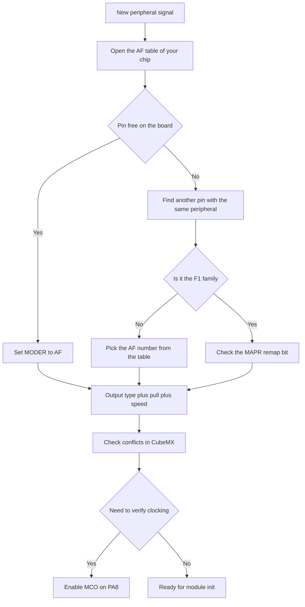

# GPIO Alternate Functions - AF Mapping

![[assets/img/stm32-af-mapping-scheme.png|600]]
*Fig. Alternate function multiplexer: one pin, sixteen AF0-AF15 options.*

> [!tip] Purpose of this note
> Teach reading AF tables from the datasheet, picking AFRL and AFHR correctly, understanding F1 vs modern families, and keeping service pins free.

## 1. Purpose

An alternate function connects a pin to inner peripherals instead of a software output. The multiplexer picks one of sixteen AF0-AF15 options, and the exact match depends on chip and package. With a wrong AF the peripheral stays silent even with perfect init code, so mapping check is the first debug step for UART, SPI, I2C and timers.

The note shows where to find AF tables, how F1 differs from F0, F4, G0 and H7, how to avoid conflicts in CubeMX, and how to free JTAG pins when outputs run short.

## 2. Where AF choice lives: AFRL and AFHR

In modern families each pin owns four function choice bits. The lower pin half 0-7 is driven by the AFRL register, the upper pin half 8-15 by the AFHR register. Pin mode must be 10 here, that is alternate function.

| Register | Pins | Bits per pin | Values |
| --- | --- | --- | --- |
| AFRL | 0-7 | 4 | AF0-AF15 for the lower half |
| AFHR | 8-15 | 4 | AF0-AF15 for the upper half |
| MODER | Same pin | 2 | Must be 10 for AF work |
| OTYPER | Same pin | 1 | Push-pull for SPI and UART TX, open-drain for I2C |
| PUPDR | Same pin | 2 | Pull per bus demand |
| OSPEEDR | Same pin | 2 | Medium for UART, high for fast SPI |

```text
Приклад розкладу для порту A:
  PA0 .. PA7  <-- AFRL: по 4 біти на кожен пін
  PA8 .. PA15 <-- AFHR: по 4 біти на кожен пін
  MODER PA2 = 10, AFRL PA2 = 0111 означає USART2 TX на F4
  Без MODER 10 мультиплексор не підключить периферію до піна
```

## 3. AF tables in the datasheet

The main table lives in the datasheet of the specific chip under pin definitions. AF0-AF15 columns show which peripheral reaches the pin. One pin can carry UART at AF7, a timer at AF1 and SPI at AF5, but only one option works at a time.

| Step | Where to look | What to find |
| --- | --- | --- |
| 1 | Datasheet, Alternate function mapping table | Row of your pin, for example PA2 |
| 2 | AF1-AF15 columns | Name of the needed peripheral |
| 3 | Reference Manual, GPIO chapter | AF number to write into AFRL or AFHR |
| 4 | CubeMX, Pinout tab | Conflict highlighting in yellow and red |
| 5 | Board, routing schematic | Whether the pin is taken by a button or LED |

There is one principle: the datasheet outweighs random internet examples. The same PA2 on F030, F401 and G070 carries different AF numbers for USART2. Copying code across families with no table check gives silence on air.

## 4. Example: USART2 on PA2 in the F4 family

On STM32F4 the USART2 transmitter reaches PA2 with function AF7. The USART2 receiver sits on PA3 also with AF7. Setup consists of GPIOA and USART2 clocking, moving PA2 and PA3 into AF mode, writing 7 into matching AFRL fields, and picking push-pull output for TX.

| Signal | Pin | AF on F4 | Output type | Pull |
| --- | --- | --- | --- | --- |
| USART2 TX | PA2 | AF7 | Push-pull | No pull |
| USART2 RX | PA3 | AF7 | Input via AF | Pull-up |
| USART1 TX | PA9 | AF7 | Push-pull | No pull |
| USART1 RX | PA10 | AF7 | Input via AF | Pull-up |
| I2C1 SCL | PB6 | AF4 | Open-drain | External up |
| I2C1 SDA | PB7 | AF4 | Open-drain | External up |
| SPI1 SCK | PA5 | AF5 | Push-pull | No pull |

The same USART2 on other families may carry another AF number. On F0 it is AF1, on G0 it is another option depending on package. So the AF number always comes from the table of your chip, not from memory.

## 5. F1 note: MAPR register instead of AFR

The F1 family has no AFRL and AFHR. Instead of a flexible multiplexer there are rigid remap options via the MAPR register in the AFIO block. Each peripheral owns one or two fixed pin sets, for example USART1 plain or remapped, SPI1 plain or remapped, JTAG full or shortened.

| Peripheral on F1 | Without remap | With remap | Register |
| --- | --- | --- | --- |
| USART1 | TX PA9 RX PA10 | TX PB6 RX PB7 | MAPR USART1_REMAP bit |
| SPI1 | PA5 PA6 PA7 | PB3 PB4 PB5 | MAPR SPI1_REMAP bit |
| I2C1 | PB6 PB7 | Same, no remap | Fixed |
| TIM2 | PA0-PA3 | PA15 PB3 PB10 PB11 partly | MAPR TIM2_REMAP bits |
| JTAG and SWD | PA13 PA14 PA15 PB3 PB4 | SWD only or all off | MAPR SWJ_CFG bits |

The consequence is simple: on F1 peripherals cannot move freely across pins. When the needed pin is taken, check whether MAPR holds a remap bit. With no remap, board routing changes or another peripheral is picked.

```text
Generation differences:
  F1 ......... AFIO MAPR, fixed pairs without or with remap
  F0 F4 G0 ... GPIO AFRL and AFHR, flexible AF0-AF15 on each pin
  H7 ......... same flexible scheme, but more AF options and speed limits
  Rule ....... F1 code with MAPR does not migrate to F4 without switching to AFRL and AFHR
```

## 6. One pin - one function

The multiplexer connects only one peripheral to a pin. Hanging USART2 TX and a TIM2 channel on PA2 at once gives a conflict: the last written function works, the first stays silent. CubeMX highlights such conflicts and blocks code generation until resolved.

| Situation | Symptom | Way out |
| --- | --- | --- |
| Two modules on one pin | One silent, other unstable | Split across different pins |
| AF right, MODER input | Silence on the line | Move MODER to 10 |
| AF right, no clocking | Pin not responding | Enable GPIO and module clocking |
| I2C with no pulls | No start, line hangs | External 4.7 kOhm resistors to power |
| SPI SCK at low speed | Dropouts at megahertz | OSPEEDR high for SCK and MOSI |

Conflicts often come from service pins: USB, crystal and debug are already taken by the board. Before AF choice, check the board schematic to avoid assigning UART to a crystal pin.

## 7. Service pins: SWD, JTAG and crystal

PA13 is SWDIO, PA14 is SWCLK. PA15, PB3 and PB4 are JTAG lines. OSC_IN and OSC_OUT are the crystal or external clocking. Without need these pins never go to buttons and LEDs, or debugging or clock stability is lost.

| Pin | Service | May it be taken |
| --- | --- | --- |
| PA13 | SWD data | No, keep for the programmer |
| PA14 | SWD clocking | No, keep for the programmer |
| PA15 PB3 PB4 | JTAG | Yes after moving to SWD and freeing via MAPR or AFIO |
| OSC_IN OSC_OUT | Crystal | No, when exact HSE is needed |
| NRST | Reset | No, reset button via capacitor only |
| BOOT0 | Boot choice | No, jumper or resistor only |

JTAG freeing on F1 goes through the SWJ_CFG bit: SWD-only mode frees PA15, PB3 and PB4 for GPIO, full disable also gives PA13 and PA14, but then NRST reset is needed for reflashing. On modern families JTAG pins are plain GPIO after reset, except PA13 and PA14 kept for SWD.

## 8. MCO output - clocking outward

MCO brings inner clocking to a pin for checks or for feeding external logic. Source can be HSI, HSE, PLL or system clocking with a divider. On F1 this is PA8, on many modern chips also PA8 with AF0 choice.

MCO setup helps verification: whether the crystal started, whether PLL reached frequency, whether sagging occurs. A frequency meter or oscilloscope on MCO shows real clocking instead of guesses. In combat firmware MCO usually turns off for economy and silence.

## 9. C code examples

```c
// HAL + CubeMX: USART2 TX PA2 RX PA3, решта робить генератор
// У CubeMX обрати PA2 і PA3 як USART2_TX і USART2_RX,
// швидкість OSPEEDR середня, RX з підтяжкою вгору.

// LL: той самий USART2 на F4 вручну, AF7
__HAL_RCC_GPIOA_CLK_ENABLE();
LL_GPIO_SetPinMode(GPIOA, LL_GPIO_PIN_2, LL_GPIO_MODE_ALTERNATE);
LL_GPIO_SetPinMode(GPIOA, LL_GPIO_PIN_3, LL_GPIO_MODE_ALTERNATE);
LL_GPIO_SetAFPin_0_7(GPIOA, LL_GPIO_PIN_2, LL_GPIO_AF_7);
LL_GPIO_SetAFPin_0_7(GPIOA, LL_GPIO_PIN_3, LL_GPIO_AF_7);
LL_GPIO_SetPinOutputType(GPIOA, LL_GPIO_PIN_2, LL_GPIO_OUTPUT_PUSHPULL);
LL_GPIO_SetPinPull(GPIOA, LL_GPIO_PIN_3, LL_GPIO_PULL_UP);

// LL: старші піни 8-15 через другу функцію
LL_GPIO_SetPinMode(GPIOB, LL_GPIO_PIN_13, LL_GPIO_MODE_ALTERNATE);
LL_GPIO_SetAFPin_8_15(GPIOB, LL_GPIO_PIN_13, LL_GPIO_AF_5);

// F1: перенос USART1 через MAPR замість AFR
__HAL_RCC_AFIO_CLK_ENABLE();
__HAL_RCC_GPIOB_CLK_ENABLE();
HAL_AFIO_REMAP_USART1_ENABLE();

// MCO на PA8: вивести системне тактування для перевірки
HAL_MCOConfig(RCC_MCO1, RCC_MCOSOURCE_PLLCLK, RCC_MCODIV_4);
```

In F1 code look for macros with REMAP, for F0, F4, G0 look for functions with AF in the name. Mixing approaches gives a compile error, which is even good because it hints to check the family.

## 10. Mermaid: conflict-free AF assignment



## 11. Post-setup check

After AF writes three things are verified: mode, function number and clocking. A logic analyzer on TX shows whether start bits exist. An oscilloscope on SCK shows whether SPI clocks exist. A multimeter on I2C lines idle must show high via pull-ups.

When silent, walk the list: GPIO and module clocking on, MODER equals 10, AF number right, no conflict with another module, pin not taken by crystal or debug. In ninety percent of cases the problem sits here, not in the library.

## Common issues

| # | Issue | Why it is bad | Fix |
| --- | --- | --- | --- |
| 1 | AF number from a random example with no datasheet | On another family the same pin carries another AF, silence on air | Open the AF table of your part number |
| 2 | AF set, but MODER stayed input | Multiplexer not connected, peripheral silent | MODER to 10 for all AF lines |
| 3 | Two modules on one pin | Conflict, only one works | Split across pins, CubeMX hints |
| 4 | I2C in push-pull mode with no pulls | Bus never releases level, no start | Open-drain plus external 4.7 kOhm |
| 5 | PA13 and PA14 taken for buttons | SWD lost, NRST erase needed | Keep SWD for the programmer |
| 6 | F1 code with MAPR moved to F4 as is | No MAPR registers, errors and silence | On F4 use AFRL and AFHR |
| 7 | Crystal pins given to GPIO with HSE | Clocking falls, UART drifts | Never take OSC with an external crystal |

## Official sources

- [STM32F401 Datasheet: Alternate function mapping table (ST)](https://www.st.com/en/microcontrollers-microprocessors/stm32f401re.html) - AF tables for each pin.
- [STM32F103 Reference Manual RM0008, AFIO MAPR (ST)](https://www.st.com/resource/en/reference_manual/rm0008-stm32f101xx-stm32f102xx-stm32f103xx-stm32f105xx-and-stm32f107xx-advanced-armbased-32bit-mcus-stmicroelectronics.pdf) - F1 remaps and JTAG freeing.
- [STM32G070 Reference Manual, GPIO and AF (ST)](https://www.st.com/en/microcontrollers-microprocessors/stm32g070rb.html) - modern AFRL and AFHR.
- [Cortex-M4 Devices Generic User Guide (ARM)](https://developer.arm.com/documentation/dui0553/latest/) - architecture and peripheral work.

## See also

- [[Home.en]]
- [[03-GPIO/01-GPIO-rezhimi.en | GPIO modes]]
- [[03-GPIO/03-EXTI-NVIC.en | EXTI interrupts]]
- [[01-Hardware/01-F0-F1-Classic.en | F0/F1 classics]]
- [[09-Firmware/01-CubeIDE-CubeMX | CubeMX setup]]
- [[09-Firmware/02-HAL-LL | HAL and LL layers]]
- [[00-Start/03-Porivnyannya-chipiv.en | Chip comparison]]
