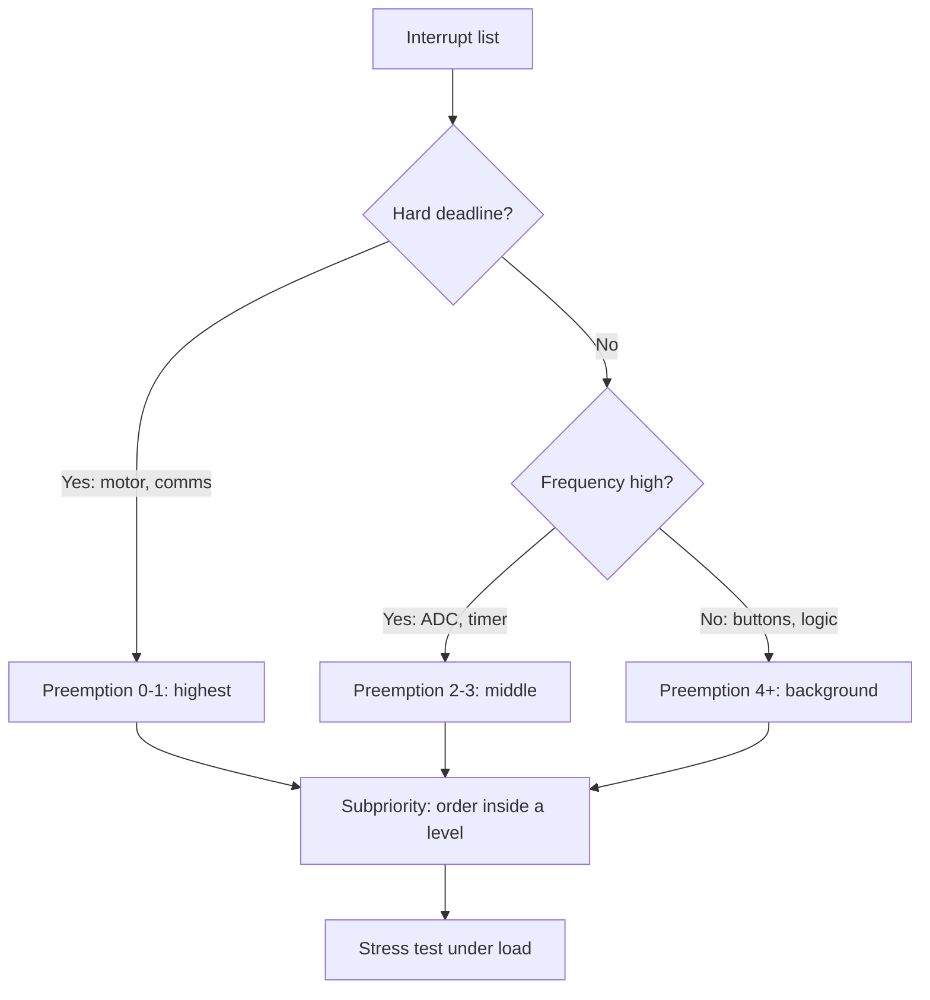

# STM32 NVIC - Priorities, Grouping and Latencies

![[assets/img/stm32-nvic-priority-scheme.png|600]]
*Fig. Who preempts whom: priority grouping and queues.*

> [!tip] Purpose of this note
> Teach interrupt priority placement so critical work makes it in time and low work never starves.

## 1. Purpose

NVIC drives all Cortex-M core interrupts: it decides which interrupt runs now, which waits, and which preempts another. Wrong priorities give lost samples, broken timings and hangs that never reproduce on the bench. Right ones give a deterministic system.

## Two priority kinds

| Kind | Role | Analogy |
| --- | --- | --- |
| Preemption | Higher preempts lower right now | Fire alarm call during a meeting |
| Subpriority (suborder) | Queue among equals while both wait | Who reached the door first |

```text
Important:
  preemption decides WHETHER to preempt.
  subpriority decides WHO is first among those waiting.
  subpriority NEVER preempts a running interrupt!
```

## Priority grouping

| Group | Preemption bits | Subpriority bits | When to take |
| --- | --- | --- | --- |
| NVIC_PRIORITYGROUP_0 | 0 (all equal!) | 4 | Nothing preempts anything - rarely needed |
| NVIC_PRIORITYGROUP_1 | 1 | 3 | Two nesting levels |
| NVIC_PRIORITYGROUP_2 | 2 | 2 | Default compromise in CubeMX |
| NVIC_PRIORITYGROUP_3 | 3 | 1 | Many levels, few queues |
| NVIC_PRIORITYGROUP_4 | 4 (all preemption!) | 0 | Hard realtime, full control |

```c
// Група задається ОДИН раз на старті:
HAL_NVIC_SetPriorityGrouping(NVIC_PRIORITYGROUP_4);
// Потім пріоритети для кожного джерела:
HAL_NVIC_SetPriority(TIM2_IRQn, 1, 0);   // preemption 1
HAL_NVIC_SetPriority(USART1_IRQn, 3, 0); // preemption 3 — нижчий
HAL_NVIC_EnableIRQ(TIM2_IRQn);
HAL_NVIC_EnableIRQ(USART1_IRQn);
```

## Table: who preempts whom

| Running | Arrived with preemption | Result |
| --- | --- | --- |
| Priority 3 | Priority 1 | Preempts: 1 first, then back to 3 |
| Priority 1 | Priority 3 | Waits: 3 runs after 1 |
| Priority 2 | Priority 2 | Waits in queue by subpriority |
| Main loop | Any | Preempts: main always lowest |

## Mermaid: system priority choice



## Latencies: where microseconds come from

| Part | Order | How to cut |
| --- | --- | --- |
| Handler entry | 12 core clocks minimum | Nothing helps - it is hardware |
| Higher waiter | Zero to milliseconds | No long code in high priorities |
| FPU context save | Tens of clocks | No float in low ISRs without need |
| HAL dispatcher | Tens to hundreds of clocks | LL in hot spots |
| Tail-chaining | 6+ clocks saved | Hardware glues neighbor ISRs itself |

```c
// Вимір затримки: пін вгору на початку ISR, вниз в кінці:
void TIM2_IRQHandler(void)
{
  LL_GPIO_SetOutputPin(GPIOA, LL_GPIO_PIN_5);  // маркер
  // ... корисна робота ...
  LL_GPIO_ResetOutputPin(GPIOA, LL_GPIO_PIN_5);
  LL_TIM_ClearFlag_UPDATE(TIM2);
}
// Ширина імпульсу на осцилографі — час ISR.
```

## FreeRTOS rules

| Principle | Explanation |
| --- | --- |
| ISRs with kernel API calls - no higher than configMAX_SYSCALL_PRIORITY | Otherwise kernel queues break |
| Top priorities - hardware without OS only | Motor PWM, emergency stop |
| Deferred processing | ISR sets a flag, task decodes |
| Priority check | FreeRTOS port asserts on wrong priorities |

## Common issues

| # | Issue | Why it is bad | Fix |
| --- | --- | --- | --- |
| 1 | All priorities default | All equal - critical waits for buttons | Place deliberately per the table above |
| 2 | Group changed mid-work | Priorities recalculated | Once at startup, never touch again |
| 3 | Long code in a high ISR | Blocks all below for milliseconds | Flag + processing in main or task |
| 4 | HAL_Delay in handler | System stands still | Never wait inside ISR |
| 5 | Subpriority as preemption | Expected preemption that never comes | Remember: a queue never preempts! |
| 6 | FreeRTOS API from a high ISR | Ruins OS inner queues | Only from priorities below threshold |
| 7 | Source flag not cleared | Endless entry into the same ISR | Clear the peripheral flag first thing |

## Official sources

- [PM0214 Cortex-M4 Programming Manual (ARM)](https://developer.arm.com/documentation/ddi0439/latest/) - NVIC, priorities, exceptions.
- [AN4989 EXTI and NVIC (ST)](https://www.st.com/resource/en/application_note/an4989.pdf) - STM32 interrupt practice.

## Priority inversion: classic scenario

| Step | What happens |
| --- | --- |
| 1 | Low ISR grabs the shared buffer |
| 2 | High ISR arrives, waits for the same buffer |
| 3 | Middle ISR spins long and never lets low free the buffer |
| 4 | High waits for middle - inversion! |

```text
Fixes:
  critical sections short with interrupts disabled;
  shared data between ISRs - only lock-free queues;
  high ISR never waits for low.
```

```c
// Коротка критична секція навколо спільного лічильника:
__disable_irq();
shared_counter++;
__enable_irq();
```

## See also

- [[Home.en]]
- [[03-GPIO/03-EXTI-NVIC.en | External interrupts]]
- [[03-GPIO/01-GPIO-rezhimi.en | Pin modes]]
- [[07-Timers/01-GPTIM-ADTIM | Timers and PWM]]
- [[09-Firmware/02-HAL-LL | Code layers]]
