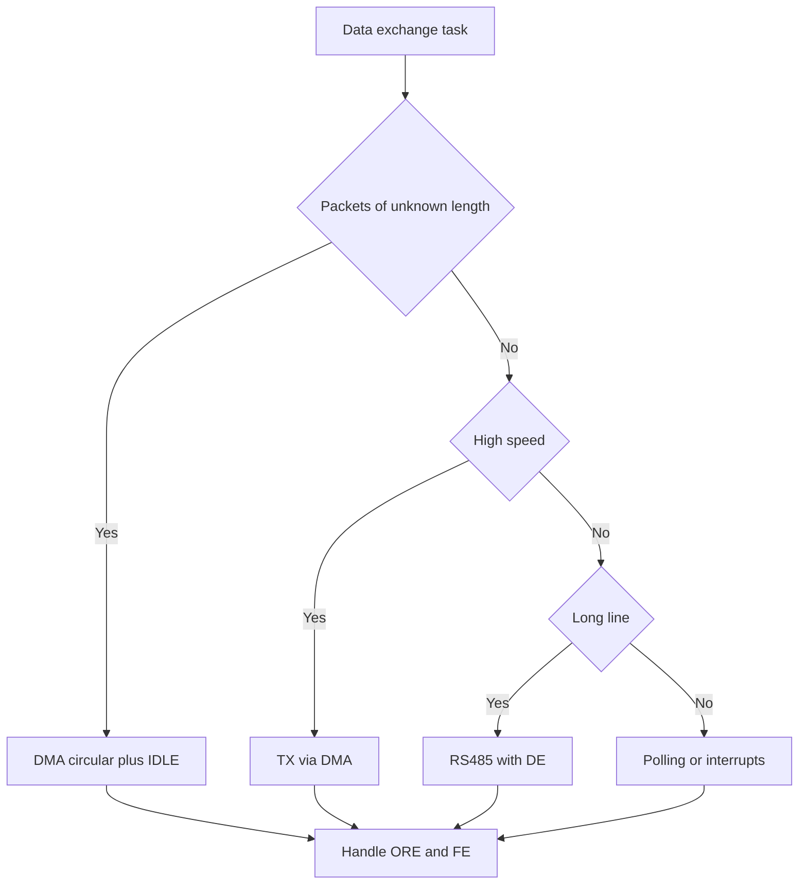

# UART on STM32 - Baud Rate, DMA-Idle and Errors

![[assets/img/stm32-uart-scheme.png|600]]
*Fig. UART: TX and RX lines, baud rate, parity, DMA reception and RS485 output.*

> [!tip] Purpose of this note
> Give the full picture of the serial port: how to calculate the baud rate, how to receive packets of unknown length via DMA, how to clear error flags, and how to move to RS485.

## 1. Purpose

UART is the basic diagnostic interface of the board: log output, terminal control, link to a GPS receiver, link to a radio modem, flashing via the factory bootloader. Two wires TX and RX plus common ground cover most exchange tasks.

In STM32 the port is called USART or UART depending on the synchronous clock output. The logic is the same: a frame with start bit, data bits, parity bit and stop bits.

## 2. Frame and Port Parameters

| Parameter | Options | Comment |
| --- | --- | --- |
| Word length | 7, 8, 9 bits | 9 bits needed for address schemes and parity without losing a bit |
| Parity | None, even, odd | Parity takes one bit of the word |
| Stop bits | 0.5, 1, 1.5, 2 | Receiver usually expects 1 stop bit |
| Order | Least significant bit first | Most significant bit first is not used here |
| Inversion | TXINV, RXINV, TXRXSWAP | Handy for non-standard levels with no external parts |
| Hardware flow control | RTS, CTS | Stops the transmitter while the receiver is busy |
| Synchronous mode | CK output only on USART | Rarely needed, almost always asynchronous exchange |

```text
Кадр 8N1 на лінії TX:
  Стан простою .......... високий рівень
  Старт-біт ............. один біт низького рівня
  Дані .................. 8 біт, молодший першим
  Стоп-біт .............. один біт високого рівня
  Наступний байт ........ пауза або одразу старт-біт
```

| 8N1 Mode | Byte Time Formula | Example at 115200 |
| --- | --- | --- |
| 1 start plus 8 data plus 1 stop | 10 clocks per speed | 10 clocks per 115200 gives about 86.8 us |
| Useful speed | 80 percent of line speed | 115200 gives about 11.5 Kbyte per second |
| Transfer of 100 bytes | 1000 clocks per speed | 100 bytes at 115200 take about 8.7 ms |

## 3. Baud Rate and the BRR Register

The baud rate is set by the BRR divider from the peripheral bus clock. An error in the bus frequency directly gives a baud rate error, so check the clock tree first.

| Field | Meaning | Where to look |
| --- | --- | --- |
| OVER8 | 0 gives oversampling by 16, 1 gives oversampling by 8 | OVER8 bit of the CR1 register |
| BRR | Integer plus fractional parts of the divider | BRR register of the USART peripheral |
| USARTDIV | Ratio of bus frequency to baud rate with oversampling | Reference manual RM, USART chapter |
| Tolerance | Receiver tolerates about 2 percent mismatch | Transmitter must stay within 1 percent |

```text
Вибір джерела тактування:
  Точний кварц HSE ...... похибка частки відсотка, довгі лінії стабільні
  Внутрішній HSI ........ зручно, але похибка помітна на морозі і спеці
  LSE плюс калібрування . для малих швидкостей і режимів сну
  PLL від HSE ........... високі швидкості, уважно з дільниками шин
```

| 72 MHz Bus, OVER16 | USARTDIV | BRR | Error |
| --- | --- | --- | --- |
| 115200 | 39.0625 | 0x271 | Near zero |
| 9600 | 468.75 | 0x1D4C | Near zero |
| 1000000 | 4.5 | 0x48 | Near zero |

| 16 MHz Bus, OVER8 | USARTDIV | Comment |
| --- | --- | --- |
| 115200 | 17.36 | Fractional part rounded, fraction-of-percent error |
| 9600 | 208.33 | Tiny error |
| 3000000 | 0.66 | Range limit, check receiver tolerance |

## 4. HAL Operation Modes

| Mode | Call | When to take |
| --- | --- | --- |
| Polling | HAL_UART_Transmit, HAL_UART_Receive | Debug, short commands, system start |
| Interrupt | HAL_UART_Transmit_IT, HAL_UART_Receive_IT | Background work without blocking the loop |
| DMA | HAL_UART_Transmit_DMA, HAL_UART_Receive_DMA | Data streams, packet reception, log output |
| Mixed | TX via DMA, RX via idle interrupt | Typical pairing for protocol tasks |

```c
UART_HandleTypeDef huart1;

int uart_init_115200(UART_HandleTypeDef *hu)
{
    hu->Instance = USART1;
    hu->Init.BaudRate = 115200;
    hu->Init.WordLength = UART_WORDLENGTH_8B;
    hu->Init.StopBits = UART_STOPBITS_1;
    hu->Init.Parity = UART_PARITY_NONE;
    hu->Init.Mode = UART_MODE_TX_RX;
    hu->Init.HwFlowCtl = UART_HWCONTROL_NONE;
    hu->Init.OverSampling = UART_OVERSAMPLING_16;
    return HAL_UART_Init(hu);
}

int uart_send_blocking(UART_HandleTypeDef *hu, const uint8_t *buf, uint16_t len)
{
    return HAL_UART_Transmit(hu, (uint8_t *)buf, len, 100);
}

int uart_send_async(UART_HandleTypeDef *hu, const uint8_t *buf, uint16_t len)
{
    return HAL_UART_Transmit_IT(hu, (uint8_t *)buf, len);
}
```

## 5. Packet Reception: DMA Circular Plus Line Idle

Packets of unknown length are easiest to receive with a DMA ring buffer. The transmitter sends a burst of bytes, then the line idles. The idle flag marks the end of the packet with no timers in code.

```text
Схема прийому:
  RX-пін ----> USART ----> DMA ----> кільцевий буфер у RAM
                  |
                  +---> прапор IDLE ---> переривання ---> розбір пакета
  CPU читає тільки готові шматки, байти не губляться на швидкості
```

```c
#define RX_BUF_LEN 256
uint8_t rx_buf[RX_BUF_LEN];
volatile uint16_t rx_old_pos = 0;

void uart_rx_dma_idle_start(UART_HandleTypeDef *hu)
{
    __HAL_UART_CLEAR_IDLEFLAG(hu);
    __HAL_UART_ENABLE_IT(hu, UART_IT_IDLE);
    HAL_UART_Receive_DMA(hu, rx_buf, RX_BUF_LEN);
}

uint16_t dma_current_pos(DMA_HandleTypeDef *hdma)
{
    return RX_BUF_LEN - (uint16_t)__HAL_DMA_GET_COUNTER(hdma);
}

void USART1_IRQHandler(void)
{
    if (__HAL_UART_GET_FLAG(&huart1, UART_FLAG_IDLE) != RESET)
    {
        __HAL_UART_CLEAR_IDLEFLAG(&huart1);
        uint16_t pos = dma_current_pos(huart1.hdmarx);
        packet_ready(rx_buf, rx_old_pos, pos);
        rx_old_pos = pos;
    }
    HAL_UART_IRQHandler(&huart1);
}
```

| Step | Action | Why |
| --- | --- | --- |
| 1 | Start HAL_UART_Receive_DMA on the whole buffer | DMA spins bytes with no core involved |
| 2 | Enable UART_IT_IDLE | End of packet gives an interrupt |
| 3 | Read the DMA counter in the handler | Learn how many bytes arrived |
| 4 | Parse the range from old position to new | Account for ring wrap over the buffer edge |
| 5 | Do not stop DMA between packets | A pause between packets loses bytes |

## 6. ORE, FE, NE Error Flags

| Flag | Cause | Effect |
| --- | --- | --- |
| ORE | New byte arrived before the old one was read | Byte lost, flag reset by reading needed |
| FE | Stop bit read as zero | Line break or foreign baud rate |
| NE | Noise on the line during strobes | Bit unstable, byte suspect |
| PE | Parity mismatch | Damage or foreign word settings |

```c
void USART1_IRQHandler_err(UART_HandleTypeDef *hu)
{
    uint32_t sr = hu->Instance->SR;
    if (sr & USART_SR_ORE)
    {
        (void)hu->Instance->DR;
        uart_stat.ore_cnt++;
    }
    if (sr & USART_SR_FE)
    {
        (void)hu->Instance->DR;
        uart_stat.fe_cnt++;
    }
    if (sr & USART_SR_NE)
    {
        (void)hu->Instance->DR;
        uart_stat.ne_cnt++;
    }
    HAL_UART_IRQHandler(hu);
}
```

| Action | Old F0 and F1 families | New G0 and H5 families |
| --- | --- | --- |
| Status read | SR register | ISR register |
| ORE reset | Read SR then read DR | Write ORECF bit in ICR |
| FE reset | Read SR then read DR | Write FECF bit in ICR |
| NE reset | Read SR then read DR | Write NECF bit in ICR |
| IDLE reset | Read SR then read DR | Write IDLECF bit in ICR |

## 7. RS485 with DE Control

A differential pair pulls the line over hundreds of meters and holds dozens of nodes. The DE pin of the transceiver sets the direction. STM32 hardware can drive DE by itself.

```text
Вузол RS485:
  TX ---> USART ---> DI драйвера
  DE ---> USART_DE ---> DE і RE драйвера
  RX <--- USART <--- RO драйвера
  A і B ---> вита пара з термінатором 120 Ом на кінцях
```

| Parameter | Meaning | Typical value |
| --- | --- | --- |
| DEAT | Delay from DE activation to first bit | 1 or 2 bit intervals |
| DEDT | Delay from last bit to DE release | 1 or 2 bit intervals |
| Terminator | Resistor between A and B at bus ends | 120 Ohm |
| Idle bias | Pull-ups of A to supply and B to ground | 680 Ohm each on the leading node |
| Speed | Depends on cable length | 115200 stable over hundreds of meters |

```c
void uart_rs485_init(UART_HandleTypeDef *hu)
{
    hu->Instance = USART2;
    hu->Init.BaudRate = 115200;
    hu->Init.WordLength = UART_WORDLENGTH_8B;
    hu->Init.StopBits = UART_STOPBITS_1;
    hu->Init.Parity = UART_PARITY_NONE;
    hu->Init.Mode = UART_MODE_TX_RX;
    HAL_UART_Init(hu);
    HAL_RS485Ex_Init(hu, UART_DE_POLARITY_HIGH, 16, 16);
}
```

## 8. LIN and Single-Wire Half-Duplex

| Mode | Pins | Application |
| --- | --- | --- |
| LIN | One TX plus one RX via transceiver | Body electronics, climate, doors |
| Half-duplex | One TXRX pin, direction inside | Single-wire sensors, connector saving |
| Single-wire | TX and RX joined outside via resistor | Debug with one probe |
| Smartcard | CK plus data per standard | Payment terminals, identification |

```c
void uart_half_duplex_init(UART_HandleTypeDef *hu)
{
    hu->Instance = USART3;
    hu->Init.BaudRate = 9600;
    hu->Init.WordLength = UART_WORDLENGTH_8B;
    hu->Init.StopBits = UART_STOPBITS_1;
    hu->Init.Parity = UART_PARITY_NONE;
    hu->Init.Mode = UART_MODE_TX_RX;
    HAL_UART_Init(hu);
    HAL_HalfDuplex_Init(hu);
}
```

## 9. FIFO in G0 and H5 Families

| Property | Without FIFO | With FIFO |
| --- | --- | --- |
| Depth | One byte of data register | 8 or 16 byte queue |
| Interrupt threshold | Every byte wakes the core | 1/4, 1/2, 3/4 threshold wakes rarely |
| Losses at speed | ORE on handler delay | Queue smooths handler jitter |
| DMA | Request per byte | Burst request per threshold |

```text
Налаштування порогів:
  RXFIFO на 1/2 ......... баланс між затримкою і числом переривань
  TXFIFO на 1/4 ......... підкачка не чекає повного спорожнення
  Таймаут приймача ...... добирає хвіст пакета коротший за поріг
```

## 10. printf Output via _write

| Step | Action |
| --- | --- |
| 1 | Enable the TX pin in CubeMX and generate init code |
| 2 | Add _write that sends the buffer via HAL_UART_Transmit |
| 3 | Pick a small format buffer to avoid stuffing the stack |
| 4 | On fast output move to ring buffer plus DMA |

```c
int _write(int file, char *ptr, int len)
{
    (void)file;
    HAL_UART_Transmit(&huart1, (uint8_t *)ptr, (uint16_t)len, 100);
    return len;
}
```

```c
void ll_usart_putc(USART_TypeDef *u, char c)
{
    while ((u->SR & USART_SR_TXE) == 0) { }
    u->DR = (uint16_t)c;
}

void ll_usart_puts(USART_TypeDef *u, const char *s)
{
    while (*s)
    {
        ll_usart_putc(u, *s);
        s++;
    }
}
```

## 11. Hardware Flow Control and VCP on Nucleo

| Signal | Direction | Purpose |
| --- | --- | --- |
| RTS | Output of our port | Tells partner we are ready to receive |
| CTS | Input of our port | Partner allows us to transmit |
| DTR and DSR | Virtual port service lines | Board reset via terminal |

```text
Nucleo VCP через ST-Link:
  USART2 TX (PA2) ---> ST-Link ---> USB CDC ---> термінал на ПК
  USART2 RX (PA3) <--- ST-Link <--- USB CDC <--- клавіатура ПК
  Окремий перетворювач не потрібен, бодрейт ставить термінал
```

| Task | Setup |
| --- | --- |
| Loss-free logs at 115200 | VCP is enough, RTS and CTS not needed |
| Stream at 1 Mbaud and above | Enable RTS and CTS, else losses follow |
| Exact baud rate | HSE or calibrated HSI, check BRR error |

## Mermaid: UART Mode Choice



## Common Issues

| # | Issue | Why it is bad | Fix |
| --- | --- | --- | --- |
| 1 | Baud rate calculated from wrong bus frequency | Real speed drifts, receiver gives FE | Check the clock tree and the USARTDIV field |
| 2 | OVER8 confused with OVER16 | Error twice larger than expected | Set the OVER8 bit the same in math and in CR1 |
| 3 | ORE flag never cleared | Port stalls, data stands still | Read status then data, or write ORECF |
| 4 | DMA stopped between packets | Bytes at the start of the next packet lost | Keep the ring running and read the counter |
| 5 | DE released right after the last byte | Frame tail cut on the line | Set DEAT and DEDT to 1 or 2 bit intervals |
| 6 | printf sends straight from interrupt | Millisecond block breaks real time | Ring buffer plus TX via DMA |
| 7 | No common ground with partner | Floating zero gives garbage instead of bytes | Join grounds or move to RS485 |

## Official Sources

- [USART manual in RM0008 for STM32F1 (ST)](https://www.st.com/resource/en/reference_manual/rm0008-stm32f101xx-stm32f102xx-stm32f103xx-stm32f105xx-and-stm32f107xx-advanced-armbased-32bit-mcus-stmicroelectronics.pdf) - frames, BRR, ORE and FE flags.
- [USART manual in RM0444 for STM32G0 (ST)](https://www.st.com/resource/en/reference_manual/rm0444-stm32g0x1-advanced-armbased-32bit-mcus-stmicroelectronics.pdf) - FIFO, DEAT and DEDT, reset via ICR.

## See also

- [[Home.en]]
- [[04-Interfaces/02-SPI.en | SPI bus]]
- [[04-Interfaces/03-I2C.en | I2C bus]]
- [[09-Firmware/01-CubeIDE-CubeMX | CubeMX setup]]
- [[09-Firmware/02-HAL-LL | HAL and LL layers]]
- [[03-GPIO/02-AF-maping.en | Alternate function mapping]]
- [[09-Firmware/03-ST-Link-Proshivka | Flashing via ST-Link]]
