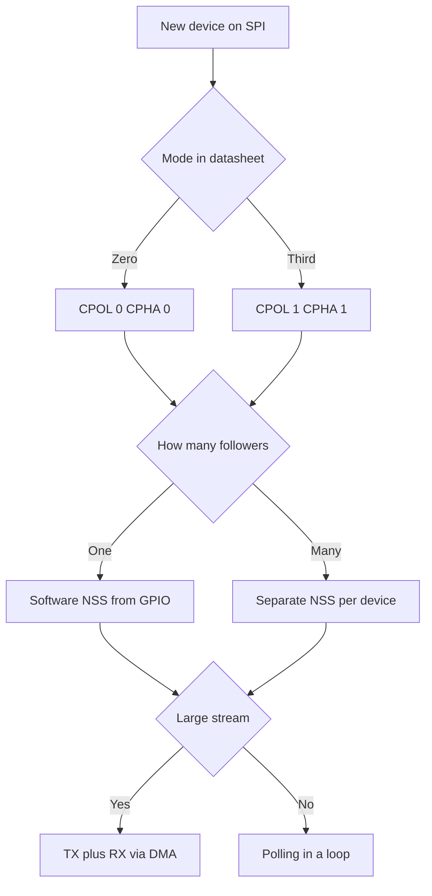

# SPI on STM32 - Modes, NSS and DMA

![[assets/img/stm32-spi-scheme.png|600]]
*Fig. SPI: SCK, MOSI, MISO lines, slave selection, clock polarity and phase.*

> [!tip] Purpose of this note
> Teach confident SPI driving: pick the mode, never confuse the edge, hold chip select, pump frames via DMA, and connect a display and flash with no magic.

## 1. Purpose

SPI is the fastest short bus of the board: display, flash memory, ADC, radio module, SD card. One leader generates SCK clocks, the MOSI output carries data from the leader, the MISO input returns data from the follower.

Speed is limited only by signal integrity and trace length. Tens of megabits per second come easy on the board, a ribbon cable needs care.

## 2. Lines and Roles

| Line | Direction from leader | Purpose |
| --- | --- | --- |
| SCK | Output | Clocks, data read on rising or falling edge |
| MOSI | Output | Data from leader to follower |
| MISO | Input | Data from follower to leader |
| NSS | Output per follower | Selects the active follower with low level |
| DC | Output for display | Command or data in the graphics controller |
| WP and HOLD | Flash memory service lines | Write protect and exchange pause |

```text
Зірка з трьома веденими:
  SCK ---> усім веденим паралельно
  MOSI --> усім веденим паралельно
  MISO <-- усі ведені через три стани, активний тільки вибраний
  NSS0 ---> тільки флеш, NSS1 ---> тільки дисплей, NSS2 ---> тільки АЦП
```

| Board setup | Topology | Comment |
| --- | --- | --- |
| One follower | One NSS | Simplest, display or flash |
| Several followers | Separate NSS per device | Leader picks whom to talk to |
| Daisy chain | Output of one into input of another | Rare, LED shift registers |
| STM32 followers | One chip leader, second follower | Tests and bridges between boards |

## 3. Four CPOL and CPHA Modes

| Mode | CPOL | CPHA | Data strobe |
| --- | --- | --- | --- |
| Mode 0 | 0 | 0 | Leading edge captures, trailing edge prepares |
| Mode 1 | 0 | 1 | Trailing edge captures, leading edge prepares |
| Mode 2 | 1 | 0 | Leading edge captures with idle high |
| Mode 3 | 1 | 1 | Trailing edge captures with idle high |

```text
Полярність простим словами:
  CPOL 0 ............... SCK у простої низький, імпульси вгору
  CPOL 1 ............... SCK у простої високий, імпульси вниз
  CPHA 0 ............... вибірка по першому фронту після NSS
  CPHA 1 ............... вибірка по другому фронту, перший готує дані
```

| Device | Typical mode | Source |
| --- | --- | --- |
| W25Q flash | Mode 0 or 3 | Memory datasheet, both work |
| ST7735 display | Mode 0 | Controller datasheet |
| SD card | Mode 0 | Card specification |
| MCP3208 ADC | Mode 0 or 3 | Converter datasheet |
| NRF24 radio module | Mode 0 | Module datasheet |

## 4. Leader and Follower

| Role | SCK | NSS | Trait |
| --- | --- | --- | --- |
| Leader | Generates | Drives | Sets speed with bus divider |
| Follower | Receives | Listens | Prepares data in advance of the edge |

```text
Кадр обміну:
  NSS падає вниз ........ ведений прокидається і готує перший біт
  8 тактів SCK .......... біти йдуть в обидва боки одночасно
  NSS росте вгору ....... транзакція завершена, шина вільна
  Пауза між кадрами ..... ведений встигає обробити байт
```

| Parameter | Leader STM32 | Follower STM32 |
| --- | --- | --- |
| Divider | BR in CR1, powers of two | Not used |
| Hardware NSS | NSS output drives selection | NSS input resets the state machine |
| Software NSS | GPIO pin pulled by code | Code watches the edge |
| Speed | Up to half the bus frequency | Stable up to a quarter of bus frequency |

## 5. Hardware NSS Versus Software NSS

| Option | Pros | Cons |
| --- | --- | --- |
| Hardware NSS | Clean edges with no code jitter | Takes the stock pin, less flexible |
| Software NSS | Any GPIO pin per device | Code must hold pauses between frames |
| Pulse between frames | Follower tells transactions apart | Pause in SCK clocks needed |

```c
void spi_nss_gpio_pulse(GPIO_TypeDef *port, uint16_t pin)
{
    port->BSRR = (uint32_t)pin << 16;
    for (volatile int i = 0; i < 8; i++) { }
    port->BSRR = pin;
}

uint8_t spi_xfer_byte_poll(SPI_TypeDef *s, uint8_t out)
{
    while ((s->SR & SPI_SR_TXE) == 0) { }
    s->DR = out;
    while ((s->SR & SPI_SR_RXNE) == 0) { }
    return (uint8_t)s->DR;
}
```

| NSS Mistake | Symptom | Fix |
| --- | --- | --- |
| NSS twitches inside a byte | Follower tears the frame in half | Hold low for the whole frame |
| No pause between frames | Follower glues two frames into one | NSS pulse up between transactions |
| Two followers active together | MISO conflict, garbage on the bus | Check the idle level of every NSS |

## 6. Speed Divider

| BR | Divider | 72 MHz bus | 16 MHz bus |
| --- | --- | --- | --- |
| 000 | 2 | 36 MHz | 8 MHz |
| 001 | 4 | 18 MHz | 4 MHz |
| 010 | 8 | 9 MHz | 2 MHz |
| 011 | 16 | 4.5 MHz | 1 MHz |
| 100 | 32 | 2.25 MHz | 500 kHz |
| 101 | 64 | 1.125 MHz | 250 kHz |
| 110 | 128 | 562 kHz | 125 kHz |
| 111 | 256 | 281 kHz | 62 kHz |

```text
Вибір швидкості:
  Флеш читання ........... максимум з даташиту, часто 80 МГц і вище
  Дисплей ST7735 ......... 15 або 30 МГц по коротких доріжках
  Довгий шлейф ........... почати з 1 МГц і піднімати покроково
  Перша розмова .......... 500 кГц щоб виключити цілісність сигналу
```

## 7. Full Duplex with DMA

The main SPI trait: every clock pushes a bit in both directions. Reception runs even when only transmission is needed. The TX DMA channel and the RX DMA channel work as a pair.

```text
Потік через DMA:
  RAM ---> DMA TX ---> SPI DR ---> MOSI ---> пристрій
  MISO ---> SPI DR ---> DMA RX ---> RAM
  Два канали стартують разом, кінець дає спільне переривання
```

```c
SPI_HandleTypeDef hspi1;
uint8_t spi_tx[256];
uint8_t spi_rx[256];

int spi_dma_xfer(SPI_HandleTypeDef *hs, uint16_t len)
{
    return HAL_SPI_TransmitReceive_DMA(hs, spi_tx, spi_rx, len);
}

void DMA1_Channel2_IRQHandler_dma(void)
{
    HAL_DMA_IRQHandler(hspi1.hdmatx);
}

void DMA1_Channel3_IRQHandler_dma(void)
{
    HAL_DMA_IRQHandler(hspi1.hdmarx);
}

void HAL_SPI_TxRxCpltCallback(SPI_HandleTypeDef *hs)
{
    (void)hs;
    spi_ready = 1;
}
```

| Scenario | DMA setup | Comment |
| --- | --- | --- |
| Transmit only | TX channel memory-to-device, RX channel to dummy | Received bytes ignored |
| Receive only | TX sends 0xFF dummy, RX packs into buffer | Clocks needed for reading |
| Exchange | Both channels into ring buffers | Display and flash at speed |
| End | TC flag after the last byte | Raise NSS after TC, not earlier |

## 8. ST7735 Display: DC Pin

| Signal | Level | Byte meaning |
| --- | --- | --- |
| DC low | Command | Controller reads the byte as instruction |
| DC high | Data | Controller writes the byte into frame memory |
| RESET | Low pulse | Hardware reset of the controller |
| BL | Backlight | Brightness via PWM |

```c
void st7735_cmd(SPI_HandleTypeDef *hs, uint8_t cmd)
{
    HAL_GPIO_WritePin(DC_PORT, DC_PIN, GPIO_PIN_RESET);
    HAL_SPI_Transmit(hs, &cmd, 1, 10);
}

void st7735_data(SPI_HandleTypeDef *hs, const uint8_t *buf, uint16_t len)
{
    HAL_GPIO_WritePin(DC_PORT, DC_PIN, GPIO_PIN_SET);
    HAL_SPI_Transmit_DMA(hs, (uint8_t *)buf, len);
}

void st7735_window(SPI_HandleTypeDef *hs, uint8_t x0, uint8_t y0, uint8_t x1, uint8_t y1)
{
    uint8_t tmp[4];
    st7735_cmd(hs, 0x2A);
    tmp[0] = 0; tmp[1] = x0; tmp[2] = 0; tmp[3] = x1;
    st7735_data(hs, tmp, 4);
    st7735_cmd(hs, 0x2B);
    tmp[1] = y0; tmp[3] = y1;
    st7735_data(hs, tmp, 4);
    st7735_cmd(hs, 0x2C);
}
```

```text
Кадр на весь екран 128 на 160:
  Вікно CASET і RASET ... задати прямокутник
  Команда RAMWR ......... далі тільки дані
  DC вгору .............. потік пікселів через DMA
  16 біт на піксель ..... 40960 байт на кадр
```

## 9. W25Q Flash: Commands and Pages

| Command | Code | Purpose |
| --- | --- | --- |
| READ | 0x03 | Read from random address |
| FAST READ | 0x0B | Fast read with dummy byte |
| PAGE PROGRAM | 0x02 | Write up to 256 bytes within a page |
| SECTOR ERASE | 0x20 | Erase a 4 Kbyte sector |
| READ STATUS | 0x05 | BUSY bit shows busy state |
| WRITE ENABLE | 0x06 | Write permit before programming |

```c
uint8_t w25q_status(SPI_HandleTypeDef *hs)
{
    uint8_t cmd = 0x05;
    uint8_t st = 0;
    HAL_GPIO_WritePin(NSS_PORT, NSS_PIN, GPIO_PIN_RESET);
    HAL_SPI_Transmit(hs, &cmd, 1, 10);
    HAL_SPI_Receive(hs, &st, 1, 10);
    HAL_GPIO_WritePin(NSS_PORT, NSS_PIN, GPIO_PIN_SET);
    return st;
}

void w25q_wait_ready(SPI_HandleTypeDef *hs)
{
    while (w25q_status(hs) & 0x01) { }
}

void w25q_page_program(SPI_HandleTypeDef *hs, uint32_t addr, const uint8_t *buf, uint16_t len)
{
    uint8_t hdr[4];
    uint8_t we = 0x06;
    hdr[0] = 0x02;
    hdr[1] = (uint8_t)(addr >> 16);
    hdr[2] = (uint8_t)(addr >> 8);
    hdr[3] = (uint8_t)addr;
    HAL_GPIO_WritePin(NSS_PORT, NSS_PIN, GPIO_PIN_RESET);
    HAL_SPI_Transmit(hs, &we, 1, 10);
    HAL_GPIO_WritePin(NSS_PORT, NSS_PIN, GPIO_PIN_SET);
    HAL_GPIO_WritePin(NSS_PORT, NSS_PIN, GPIO_PIN_RESET);
    HAL_SPI_Transmit(hs, hdr, 4, 10);
    HAL_SPI_Transmit(hs, (uint8_t *)buf, len, 100);
    HAL_GPIO_WritePin(NSS_PORT, NSS_PIN, GPIO_PIN_SET);
    w25q_wait_ready(hs);
}
```

| Page rule | Why |
| --- | --- |
| Write never crosses a 256 byte border | Controller wraps the address inside the page |
| Erase the sector before writing | A bit can only go down, erase brings it up |
| Wait out BUSY to the end | A new command while busy is ignored |
| 3 byte address on smaller chips | Larger sizes enable 4 byte mode |

## 10. Three Wires and TI Mode

| Option | Lines | When to take |
| --- | --- | --- |
| Four wires | SCK, MOSI, MISO, NSS | Full duplex, standard |
| Three wires | SCK, shared data, NSS | Pin saving, half-duplex |
| One direction | SCK, MOSI, NSS with no MISO | Display with no readback |
| TI mode | Frame pulse instead of NSS | Compatibility with TI controllers |

```c
void ll_spi_master_init(SPI_TypeDef *s)
{
    s->CR1 = SPI_CR1_MSTR | SPI_CR1_SSM | SPI_CR1_SSI | SPI_CR1_BR_0 | SPI_CR1_SPE;
}

uint8_t ll_spi_xfer(SPI_TypeDef *s, uint8_t out)
{
    while ((s->SR & SPI_SR_TXE) == 0) { }
    s->DR = out;
    while ((s->SR & SPI_SR_RXNE) == 0) { }
    return (uint8_t)s->DR;
}
```

## 11. CRC and Signal Integrity

| Tool | What it gives |
| --- | --- |
| Hardware CRC | Polynomial checks frame integrity |
| Short traces | Less ringing on SCK edges |
| Series resistors | Damp overshoot on long lines |
| Ground next to SCK | Return current never wanders the board |

```text
Діагностика шлейфа:
  Почати з 500 кГц ...... чисті прямокутники на осцилографі
  Підняти до 4 МГц ...... перевірити дзвін на фронтах
  Підняти до максимуму .. перевірити помилки читання флеш
  Додати 33 Ом у SCK .... якщо дзвін більше десяти відсотків живлення
```

## Mermaid: SPI Setup Choice



## Common Issues

| # | Issue | Why it is bad | Fix |
| --- | --- | --- | --- |
| 1 | Mode 1 instead of mode 0 | Bits shifted by half a clock, garbage | Check CPOL and CPHA against the device datasheet |
| 2 | NSS raised before the TC flag | Last byte cut off | Wait for TC, then raise NSS |
| 3 | Only the TX DMA channel started | Receive buffer overflows with OVR flag | Always start the TX and RX pair together |
| 4 | Write across a flash page border | Data wraps to the page start | Split writes at 256 byte borders |
| 5 | Display DC never switched | Command drawn as pixels | DC down for command, DC up for data |
| 6 | Full speed at once on a cable | Ringing breaks strobing | Start at 500 kHz and climb step by step |
| 7 | Two NSS active at once | MISO conflict, output overheating | Hold every NSS high except one |

## Official Sources

- [SPI manual in RM0008 for STM32F1 (ST)](https://www.st.com/resource/en/reference_manual/rm0008-stm32f101xx-stm32f102xx-stm32f103xx-stm32f105xx-and-stm32f107xx-advanced-armbased-32bit-mcus-stmicroelectronics.pdf) - modes, divider, TXE and RXNE flags.
- [AN5546 SPI displays on STM32 (ST)](https://www.st.com/resource/en/application_note/an5546-spi-display-on-stm32-mcus-stmicroelectronics.pdf) - graphics controller practice over SPI.
- [W25Q128 datasheet (Winbond)](https://www.winbond.com/resource-files/w25q128jv_revg.pdf) - commands, pages, timing diagrams.

## See also

- [[Home.en]]
- [[04-Interfaces/01-UART.en | UART serial port]]
- [[04-Interfaces/03-I2C.en | I2C bus]]
- [[09-Firmware/01-CubeIDE-CubeMX | CubeMX setup]]
- [[09-Firmware/02-HAL-LL | HAL and LL layers]]
- [[03-GPIO/01-GPIO-rezhimi.en | GPIO modes]]
- [[03-GPIO/02-AF-maping.en | Alternate function mapping]]
