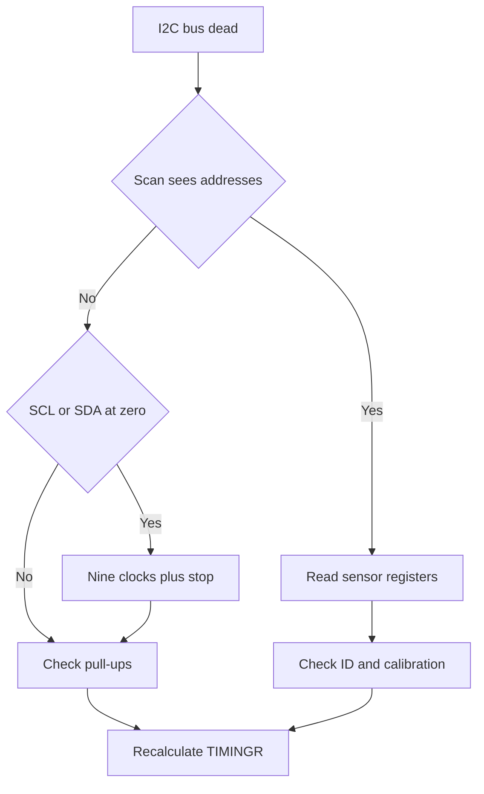

# I2C on STM32 - Timings, Hangs and Pull-ups

![[assets/img/stm32-i2c-scheme.png|600]]
*Fig. I2C: SCL and SDA lines, pull-ups to supply, follower addresses.*

> [!tip] Purpose of this note
> Collect two-wire bus practice: calculate pull-ups, set timings, find a sensor by scanning, survive a hung bus, and read sensors with no dance.

## 1. Purpose

I2C joins slow sensors and chips with two wires: SCL clocks and SDA data. Dozens of followers live on one bus, each with an address. The leader starts exchange with a start condition and ends it with a stop condition.

An open-drain bus cannot pull the level up by itself, so both lines are pulled with resistors to the supply. Any member can pull the line down, only the resistor can release it up.

## 2. Bus Physics and Levels

| Element | Value | Comment |
| --- | --- | --- |
| Lines | SCL and SDA | Bidirectional, open-drain |
| Pull-ups | 2.2 kOhm or 4.7 kOhm | Lower resistance gives steeper edges |
| Capacitance | Sum of traces, pins and packages | Main enemy of fast edges |
| Levels | Low up to 30 percent of supply | High from 70 percent of supply |
| Sink current | 3 mA per standard | Limits the minimum pull-up resistance |

```text
Шина у простої:
  VDD --- Rp ---+--- SCL --- усі пристрої паралельно
                |
  VDD --- Rp ---+--- SDA --- усі пристрої паралельно
  Активний рівень нуль тягне транзистор, одиницю дає резистор
```

| Speed mode | Bit rate | Allowed capacitance |
| --- | --- | --- |
| Standard | 100 kHz | Up to 400 pF |
| Fast | 400 kHz | Up to 400 pF |
| Fast plus | 1 MHz | Up to 550 pF |
| High-speed | 3.4 MHz | Up to 100 pF |

## 3. 7 and 10 Bit Addressing

| Format | Address byte | Range |
| --- | --- | --- |
| 7 bit | 7 address bits plus read or write bit | 8 to 119 for users |
| 10 bit | Two bytes with prefix | Rare devices, bridges and multiplexers |
| Reserved | 0 and 127 | Broadcast and service calls |
| Conflict | Two devices with one address | Change jumpers or split across buses |

```text
Кадр запису одного байта:
  СТАРТ -> адреса плюс 0 -> ACK -> байт даних -> ACK -> СТОП
Кадр читання одного байта:
  СТАРТ -> адреса плюс 1 -> ACK -> байт даних -> NACK -> СТОП
```

| Bit | Who drives | Meaning |
| --- | --- | --- |
| ACK | Receiver pulls SDA down | Byte accepted |
| NACK | Receiver releases SDA | End of read or error |
| START | Leader drops SDA while SCL is high | Transaction start |
| STOP | Leader raises SDA while SCL is high | Transaction end |
| Repeated start | Leader gives start with no stop | Register read without losing the bus |

## 4. TIMINGR Register and the CubeMX Calculator

On modern families the TIMINGR register sets timings: prescaler, data delays and filters. CubeMX has a calculator for the exact peripheral bus frequency.

| TIMINGR field | Meaning | What it affects |
| --- | --- | --- |
| PRESC | Input clock divider | Base quantum of every delay |
| SCLL | Low period of SCL | Clock period |
| SCLH | High period of SCL | Clock period |
| SDADEL | Data delay after SCL fall | SDA hold against races |
| SCLDEL | Start delay after the edge | Setup time before the strobe |
| DNF | Digital filter | Cuts short noise spikes |

```text
Порядок налаштування:
  Ввести частоту шини у калькулятор CubeMX
  Вибрати 100 кГц або 400 кГц або 1 МГц
  Забрати згенероване значення TIMINGR
  Перевірити осцилографом фронти і рівні
  Додати аналоговий фільтр при шумному живленні
```

| 16 MHz bus | TIMINGR | Mode |
| --- | --- | --- |
| Standard 100 kHz | 0x00503D58 | Check value, refine with calculator |
| Fast 400 kHz | 0x00300B29 | Check value, refine with calculator |
| Fast plus 1 MHz | 0x0010040D | Short bus with small pull-ups only |

## 5. Clock Stretching by Follower

| Situation | Behavior |
| --- | --- |
| Follower too slow | Holds SCL low after 8 bits |
| Leader waits | Generates no next clock while SCL is low |
| ADC thinking | Millisecond stretch during conversion |
| Software follower | Stretch for interrupt handling time |

```text
Осцилограма розтягування:
  SCL мав піти вгору .... але ведений тримає нуль
  Ведучий чекає ......... пауза без таймауту
  Ведений відпускає ..... SCL росте через резистор
  Обмін продовжується ... наступний біт по плану
```

| Rule | Why |
| --- | --- |
| Never set timeout shorter than the datasheet | Follower gets time to release SCL |
| Never ignore BUSY | Bus busy with previous transaction |
| Never tear with stop mid-stretch | Follower left in undefined state |

## 6. ACK, NACK and Bus Scanning

```c
int i2c_scan(I2C_HandleTypeDef *hi, uint8_t *found, int max_n)
{
    int n = 0;
    for (uint8_t a = 8; a < 120; a++)
    {
        if (HAL_I2C_IsDeviceReady(hi, (uint16_t)(a << 1), 2, 10) == HAL_OK)
        {
            if (n < max_n)
            {
                found[n] = a;
            }
            n++;
        }
    }
    return n;
}
```

| Address | Device | Comment |
| --- | --- | --- |
| 0x76 or 0x77 | BMP280 pressure | Selected with SDO jumper |
| 0x40 or 0x41 | INA219 current | Selected with A0 and A1 jumpers |
| 0x68 or 0x69 | MPU6050 gyroscope | Selected with AD0 level |
| 0x3C or 0x3D | SSD1306 OLED | Selected with DC level |
| 0x50 to 0x57 | 24Cxx EEPROM | Three address bits with jumpers |

```c
int i2c_mem_read(I2C_HandleTypeDef *hi, uint8_t dev, uint8_t reg, uint8_t *buf, uint16_t len)
{
    return HAL_I2C_Mem_Read(hi, (uint16_t)(dev << 1), reg, I2C_MEMADD_SIZE_8BIT, buf, len, 100);
}

int i2c_mem_write(I2C_HandleTypeDef *hi, uint8_t dev, uint8_t reg, const uint8_t *buf, uint16_t len)
{
    return HAL_I2C_Mem_Write(hi, (uint16_t)(dev << 1), reg, I2C_MEMADD_SIZE_8BIT, (uint8_t *)buf, len, 100);
}
```

## 7. HAL Modes: Polling, Interrupt, DMA

| Mode | Call | When to take |
| --- | --- | --- |
| Blocking | HAL_I2C_Master_Transmit, HAL_I2C_Master_Receive | Short sensor registers |
| Non-blocking | HAL_I2C_Master_Transmit_IT, HAL_I2C_Master_Receive_IT | Background polling with no loop pauses |
| DMA | HAL_I2C_Master_Transmit_DMA, HAL_I2C_Master_Receive_DMA | Long arrays from EEPROM or display |
| Memory | HAL_I2C_Mem_Read, HAL_I2C_Mem_Write | Register devices with inner address |

```c
volatile int i2c_done = 0;

void HAL_I2C_MasterRxCpltCallback(I2C_HandleTypeDef *hi)
{
    (void)hi;
    i2c_done = 1;
}

int bmp280_start_read(I2C_HandleTypeDef *hi)
{
    static uint8_t raw[6];
    i2c_done = 0;
    int rc = HAL_I2C_Mem_Read_DMA(hi, (uint16_t)(0x76 << 1), 0xF7, I2C_MEMADD_SIZE_8BIT, raw, 6);
    return rc;
}
```

## 8. Bus Hang and Nine-Clock Recovery

| Symptom | Cause |
| --- | --- |
| SCL stuck at zero | Follower hung mid-stretch |
| SDA stuck at zero | Follower waits for 9th clock and holds ACK |
| BUSY never clears | Peripheral sees an unfinished start |
| NACK on a known address | Device never left reset |

```text
Відновлення шини:
  Перемкнути SCL і SDA у GPIO з відкритим стоком
  Тримати SDA відпущеною вгору через підтяжку
  Видати 9 тактів SCL з паузою 5 мкс
  Видати СТОП: SDA вниз при високому SCL потім вгору
  Повернути піни в альтернативну функцію I2C
```

```c
void i2c_bus_recover(GPIO_TypeDef *scl_p, uint16_t scl_n, GPIO_TypeDef *sda_p, uint16_t sda_n)
{
    for (int i = 0; i < 9; i++)
    {
        scl_p->BSRR = (uint32_t)scl_n << 16;
        for (volatile int d = 0; d < 200; d++) { }
        scl_p->BSRR = scl_n;
        for (volatile int d = 0; d < 200; d++) { }
    }
    sda_p->BSRR = (uint32_t)sda_n << 16;
    for (volatile int d = 0; d < 200; d++) { }
    scl_p->BSRR = scl_n;
    for (volatile int d = 0; d < 200; d++) { }
    sda_p->BSRR = sda_n;
}
```

| Step | Action | Why |
| --- | --- | --- |
| 1 | Nine SCL clocks | Follower clocks out the byte and releases SDA |
| 2 | Stop condition | Resets the state machines of every listener |
| 3 | Software I2C reset | Clears the BUSY flag of the peripheral |
| 4 | Repeat scan | Check that devices answer |

## 9. Pull-up Math

| Parameter | Formula | Example |
| --- | --- | --- |
| Resistance minimum | Supply divided by 3 mA | 3.3 V gives 1.1 kOhm |
| Resistance maximum | Edge time divided by 0.8473 and capacitance | 300 ns and 100 pF give about 3.5 kOhm |
| Standard | Between minimum and maximum | 2.2 kOhm or 4.7 kOhm |
| Fast plus | Tougher edge limit | 1 kOhm or 2.2 kOhm on a short bus |

```text
Вибір на пальцях:
  Два датчики на платі ...... 4.7 кОм, фронти круті
  Півметра шлейфа ........... 2.2 кОм, ємність помітно гальмує
  Метр і більше ............. 1.5 кОм і швидкість 100 кГц
  Десять пристроїв .......... рахувати сумарну ємність пінів
```

| Pull-up mistake | Symptom |
| --- | --- |
| Resistance too large | Slow edges, NACK at speed |
| Resistance too small | Drain overheating, low zero too high |
| Pull-up only inside the chip | Weak current, long bus dead |
| Two pull-up pairs in parallel | Total resistance halved, check current |

## 10. BMP280 and INA219 Sensors

| BMP280 step | Action |
| --- | --- |
| 1 | Read ID at address 0xD0, expect 0x58 |
| 2 | Read calibration from 0x88, 24 bytes long |
| 3 | Write configuration into 0xF4 and 0xF5 |
| 4 | Read 6 bytes from 0xF7, then run compensation math |

```c
int bmp280_id(I2C_HandleTypeDef *hi, uint8_t *id)
{
    return HAL_I2C_Mem_Read(hi, (uint16_t)(0x76 << 1), 0xD0, I2C_MEMADD_SIZE_8BIT, id, 1, 100);
}

int ina219_bus_mv(I2C_HandleTypeDef *hi, uint8_t dev, int *mv)
{
    uint8_t raw[2];
    int rc = HAL_I2C_Mem_Read(hi, (uint16_t)(dev << 1), 0x02, I2C_MEMADD_SIZE_8BIT, raw, 2, 100);
    if (rc != HAL_OK)
    {
        return rc;
    }
    uint16_t v = (uint16_t)((raw[0] << 8) | raw[1]);
    *mv = (int)((v >> 3) * 4);
    return HAL_OK;
}
```

| INA219 register | Address | Purpose |
| --- | --- | --- |
| Configuration | 0x00 | Ranges and averaging |
| Shunt | 0x01 | Voltage across the shunt |
| Bus | 0x02 | Supply bus voltage |
| Power | 0x03 | Current times voltage product |
| Current | 0x04 | Result after calibration |
| Calibration | 0x05 | Factor for the exact shunt |

## 11. Five Volts and Level Shifting

| Situation | Fix |
| --- | --- |
| 5 V sensor with no tolerance | Bidirectional MOSFET translator |
| STM32 pin 5 V tolerant | Direct link with pull-up to 3.3 V allowed |
| Two buses of different voltages | Translator with two supplies in the middle |
| Long line in noise | Shielded cable and smaller pull-ups |

```text
Транслятор на транзисторі:
  Затвор на 3.3 В ...... обидва боки бачать свій високий рівень
  Витік на бік 3.3 В ... стік на бік 5 В
  Два канали ........... окремо SCL і SDA
  PCA9306 .............. готовий корпус замість розсипухи
```

## 12. SMBus and Multi-Leader

| SMBus property | Difference from I2C |
| --- | --- |
| 35 ms timeout | Hung follower resets |
| 10 kHz minimum speed | Hang control always on |
| PEC checksum | CRC byte at packet end |
| ALERT signal | Follower asks for service |

| Two-leader arbitration | Behavior |
| --- | --- |
| Both gave start | Whoever released SDA first loses |
| Loss with no error | Loser becomes follower and listens |
| Same addresses | Arbitration runs to the first different bit |
| Clock sync | Shared SCL via wired AND |

```text
Другий ведучий на шині:
  Перевірити BUSY перед стартом
  Програш арбітражу обробити повтором пізніше
  Не тримати SCL силою проти іншого ведучого
```

## 13. Fast Plus 1 MHz

| Condition | Value |
| --- | --- |
| Bus capacitance | Below 550 pF |
| Pull-ups | 1 kOhm or 2.2 kOhm |
| Filters | Digital filter minimal |
| Drivers | Steep edges with no ringing |

```text
Перехід з 400 кГц на 1 МГц:
  Заміряти ємність або оцінити довжину шлейфа
  Зменшити підтяжки і перевірити струм стоку
  Перерахувати TIMINGR у CubeMX
  Прогнати сканування і довге читання без NACK
```

## Mermaid: I2C Bus Diagnostics



## Common Issues

| # | Issue | Why it is bad | Fix |
| --- | --- | --- | --- |
| 1 | No external pull-ups | Lines float in the air, start invisible | Place 2.2 kOhm or 4.7 kOhm to supply |
| 2 | TIMINGR from a foreign example | Period mismatches the bus frequency | Calculate in CubeMX for your frequency |
| 3 | NACK after address ignored | Code waits for data from a silent device | Check HAL_OK and retry or reset |
| 4 | Write across an EEPROM page border | Bytes wrap to the page start | Split writes at datasheet page borders |
| 5 | Stretch mistaken for a hang | Needless reset tears a working transaction | Wait for SCL release per datasheet |
| 6 | 5 V on a non-tolerant pin | Input breakdown and die wear | Check the FT column and place a translator |
| 7 | Two pull-up sets in parallel | Drain current exceeded, zero too high | Keep one pair of the calculated value |

## Official Sources

- [I2C manual in RM0444 for STM32G0 (ST)](https://www.st.com/resource/en/reference_manual/rm0444-stm32g0x1-advanced-armbased-32bit-mcus-stmicroelectronics.pdf) - TIMINGR, filters, flags and reset.
- [AN2824 I2C optimized examples (ST)](https://www.st.com/resource/en/application_note/an2824-stm32f10xxx-ic-optimized-examples-stmicroelectronics.pdf) - peripheral setup examples and typical pairings.
- [UM10204 I2C bus specification (NXP)](https://www.nxp.com/docs/en/user-guide/UM10204.pdf) - levels, capacitance, arbitration and speed modes.

## See also

- [[Home.en]]
- [[04-Interfaces/01-UART.en | UART serial port]]
- [[04-Interfaces/02-SPI.en | SPI bus]]
- [[09-Firmware/01-CubeIDE-CubeMX | CubeMX setup]]
- [[09-Firmware/02-HAL-LL | HAL and LL layers]]
- [[03-GPIO/01-GPIO-rezhimi.en | GPIO modes]]
- [[09-Firmware/03-ST-Link-Proshivka | Flashing via ST-Link]]
