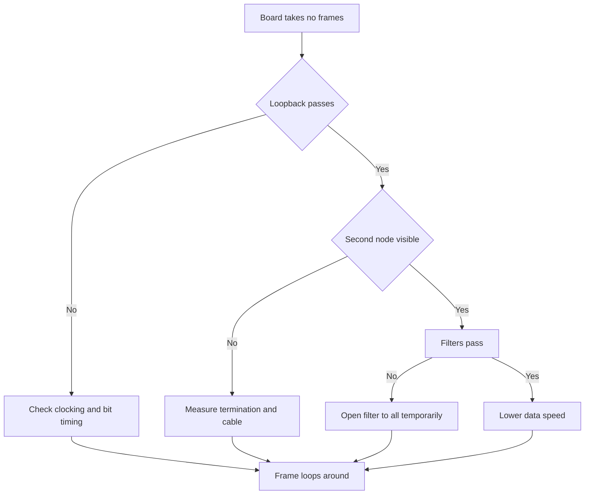

# FDCAN on STM32 - Bit Timing, Filters and Transceiver

![[assets/img/stm32-fdcan-scheme.png|600]]
*Fig. FDCAN node: controller, transceiver, twisted pair and termination at line ends.*

> [!tip] Purpose of this note
> Give a working map of the CAN bus on STM32: when classic CAN is enough, when CAN FD is needed, how to calculate bit timing, how to set filters, and how to keep the transceiver alive.

## 1. Purpose

The CAN bus joins dozens of nodes with two wires and lives in noise, vibration and supply jumps. One node transmits, the rest listen, non-destructive arbitration decides who speaks first. Messages are short, with a checksum, every receiver acknowledges reception.

Classic CAN carries up to eight data bytes at up to one megabit. CAN FD keeps the same arbitration but speeds the data field up to eight megabits and extends it to sixty-four bytes. FDCAN on STM32 handles both modes, so one codebase works with old and new networks.

This note closes the full cycle: speed choice, timing math, identifier filters, transceiver and termination, launch via HAL, loopback check.

## 2. Classic CAN Versus CAN FD

| Parameter | Classic CAN | CAN FD |
| --- | --- | --- |
| Data maximum per frame | Eight bytes | Sixty-four bytes |
| Arbitration speed | Up to one megabit | Up to one megabit, usually slow |
| Data field speed | Same as arbitration | Up to eight megabits, separate setting |
| Identifier length | Standard eleven bits or extended twenty-nine bits | Same, plus high-speed flag |
| STM32 controller | bxCAN in F1, F4, F072 | FDCAN in G0, G4, H5, H7, U5 |
| Compatibility | Reads classic frames only | Receives classic, sends both formats |
| When to take | Sensors, buttons, simple actuator nodes | Flashing over the bus, telemetry, long packets |

```text
Логіка вибору формату:
  Мережа зі старих вузлів ......... тільки classic CAN
  Потрібні пакети понад 8 байт .... CAN FD з classic арбітражем
  Прошивка вузлів через шину ...... CAN FD, великий кадр економить час
  Довга лінія понад 500 метрів .... classic CAN на низькій швидкості
```

The CAN FD idea is simple: arbitration slow and solid, data fast. A node wins the bus at low speed, then switches high for the data field, and counts the checksum and acknowledge carefully again. Old nodes see the frame start but cannot read the fast data field, so keep a mixed network in classic mode.

## 3. Bit Timing and Sample Point

A bit interval is built from time quanta. One quantum equals the controller clock period divided by the prescaler. Segments follow one by one: sync, line and transceiver propagation, phase one, phase two. The controller reads the line level at the sample point between phase one and phase two.

| Segment | Purpose | Typical value |
| --- | --- | --- |
| Sync | One quantum, bit edge | Always one quantum |
| Propagation | Covers line and transceiver delay | Two to eight quanta, grows with line length |
| Phase one | Before the sample point | Tuned to the target point |
| Phase two | After the sample point | Tuned to the target point |
| Sample point | Bit read moment | Normal range seventy-five to eighty-seven percent |
| Resync | Jump width on desync | One or two quanta of margin |

```text
Структура одного біта на лінії:

  | SYNC |   PROP   |  PHASE1  |  PHASE2  |
  |  1   | 1..8 tq  | 1..8 tq  | 1..8 tq  |
  ^старт                ^ читання тут
                   sample point 75-87 відсотків

  Приклад 500 кбіт на 80 МГц:
    prescaler 4, 1 tq дорівнює 50 нс
    40 tq на біт дають рівно 500 кбіт
    SYNC 1 + PROP 8 + PHASE1 19 + PHASE2 12
    точка семплування близько 80 відсотків
```

The length rule is simple: a longer line wants slower arbitration and a larger propagation segment. One megabit lives to about forty meters, five hundred kilobits to one hundred meters, one hundred twenty-five kilobits pulls several hundred meters. Also slow the CAN FD data field on a long line, or reflections will eat the fast bits.

## 4. Receive Filters

With no filters every frame wakes the CPU. With filters the hardware sorts wanted identifiers into buffers by itself and drops garbage silently. FDCAN keeps separate lists for standard and extended identifiers.

| Filter mode | How it works | When to take |
| --- | --- | --- |
| Mask and range | Passes an identifier group by pattern | Sensor row with neighbor addresses |
| Exact list | Passes only listed identifiers | Gateway that needs five exact nodes |
| Reject the rest | Drops everything unmatched | Typical node, silence in interrupts |
| Receive into FIFO zero | First receive channel | Main control data |
| Receive into FIFO one | Second receive channel | Diagnostics apart from control |
| Standard ID | Eleven bits, short arbitration | New compact networks |
| Extended ID | Twenty-nine bits, long arbitration | Compatibility with truck hardware |

```text
Приклад мислення фільтром:
  Хочу тільки ID 0x100 .. 0x10F:
    маска пропускає старші біти, молодші ігнорує
  Хочу ID 0x100, 0x200, 0x7DF точно:
    список з трьох записів, решта відхиляється
  Хочу все для налагодження:
    відкрити один фільтр на весь діапазон тимчасово
```

Count a mask from the wanted group: shared bits fixed with ones in the mask, different bits left open with zeros for any value. An exact-entry list reads simpler, but each entry takes message memory, so cover dozens of addresses with one mask.

## 5. bxCAN Versus FDCAN

| Parameter | bxCAN | FDCAN |
| --- | --- | --- |
| Generation | Classic module in F1 and F4 | Modern module in G0, G4, H5, H7, U5 |
| Format | Classic CAN only | Classic CAN plus CAN FD |
| Message store | Three transmit mailboxes | MRAM area with queues and lists |
| Receive | Two FIFO buffers of three frames | Two FIFO buffers, tuned depth |
| Filters | Banks in pairs, shared by two modules | Separate lists, free buffer assignment |
| Data speed | One for the whole frame | Separate for arbitration and data |
| Debug | Simple, most examples | Richer, but wants careful manual reading |
| Choice | Old board or ready bxCAN library | New project, speed margin needed |

The main practical difference is memory: a bxCAN mailbox holds one message and waits to free, while an FDCAN queue takes several messages in a row. So bxCAN drops frames in a dense stream, and FDCAN with the right queue depth swallows bursts with no CPU involved.

## 6. Transceiver and Line Termination

The controller speaks logic levels, the line speaks voltage difference. The transceiver converts one into the other and takes electrostatic hits. Never join two controllers directly with no transceiver, the first spike burns them.

| Element | Choice | Note |
| --- | --- | --- |
| Classic transceiver | TJA1051 or similar at five volts | Cheap, proven, enough for classic CAN |
| FD transceiver | TJA1441 or similar with speed margin | Holds steep edges of the fast data field |
| Transceiver supply | Five volts separate, ground shared | Three volt logic via level shifting |
| Termination | One hundred twenty Ohm at each line end | Two resistors in parallel give sixty Ohm across wires |
| Topology | One long line, short stubs | A star with long rays gives reflections |
| Twisted pair | CANH plus CANL together | Cuts emission and pickup |
| Protection | TVS diodes on the line as needed | Mandatory in a car and outdoors |

```text
Правильна лінія з двох вузлів:

   ВУЗОЛ А                          ВУЗОЛ Б
  +--------+                      +--------+
  | STM32  |                      | STM32  |
  | FDCAN  |                      | FDCAN  |
  | TX RX  |                      | TX RX  |
  +---+----+                      +---+----+
      | TX RX                         | TX RX
  +---+----+                      +---+----+
  | TJA14xx|                      | TJA14xx|
  | H L    |                      |    H L |
  +---+----+                      +---+----+
      | CANH =========================== CANH |
      | CANL =========================== CANL |
     120 Ом на початку             120 Ом у кінці

  Помилка новачка: резистори на кожному вузлі посередині.
  Правильно: тільки два резистори, тільки на кінцях.
```

Health check is simple: power off the whole network and measure resistance between CANH and CANL. Two correct terminators read about sixty Ohm. One hundred twenty Ohm means one resistor lost, forty Ohm or less means spare resistors on middle nodes.

## 7. Typical Arbitration Speeds

| Arbitration | FD data | Length | Application |
| --- | --- | --- | --- |
| Five hundred kbit | Two megabit | Up to one hundred meters | Cars, test stands |
| Two hundred fifty kbit | One megabit | Up to two hundred meters | Industrial controllers |
| One hundred twenty-five kbit | Five hundred kbit | Up to five hundred meters | Long shop lines |
| One megabit | Four megabit | Up to forty meters | Short fast stand |
| Twenty kbit | Never speed up | Up to a kilometer | Slow telemetry |

Always pick the CAN FD data speed after a line check: the scope must show clean rectangles at high speed. Ringing on edges means bad termination or star topology, then lower the data speed or relay the cable.

## 8. FDCAN HAL Practice

```c
FDCAN_HandleTypeDef hfdcan1;
FDCAN_TxHeaderTypeDef txHeader;
uint8_t txData[8] = {1, 2, 3, 4, 5, 6, 7, 8};

void can_start(void)
{
  HAL_FDCAN_Start(&hfdcan1);
  HAL_FDCAN_ActivateNotification(&hfdcan1, FDCAN_IT_RX_FIFO0_NEW_MESSAGE, 0);
}

void can_send_basic(void)
{
  txHeader.Identifier = 0x100;
  txHeader.IdType = FDCAN_STANDARD_ID;
  txHeader.TxFrameType = FDCAN_DATA_FRAME;
  txHeader.DataLength = FDCAN_DLC_BYTES_8;
  txHeader.ErrorStateIndicator = FDCAN_ESI_ACTIVE;
  txHeader.BitRateSwitch = FDCAN_BRS_OFF;
  txHeader.FDFormat = FDCAN_CLASSIC_CAN;
  txHeader.TxEventFifoControl = FDCAN_NO_TX_EVENTS;
  txHeader.MessageMarker = 0;
  HAL_FDCAN_AddMessageToTxFifoQ(&hfdcan1, &txHeader, txData);
}

void HAL_FDCAN_RxFifo0Callback(FDCAN_HandleTypeDef *hfdcan, uint32_t RxFifo0ITs)
{
  FDCAN_RxHeaderTypeDef rxHeader;
  uint8_t rxData[64];
  if ((RxFifo0ITs & FDCAN_IT_RX_FIFO0_NEW_MESSAGE) != 0)
  {
    HAL_FDCAN_GetRxMessage(hfdcan, FDCAN_RX_FIFO0, &rxHeader, rxData);
  }
}
```

| CubeMX step | What to press |
| --- | --- |
| Enable FDCAN1 | Connectivity, FDCAN mode with no FD first |
| Set clocking | Check the input frequency, tune prescaler to target speed |
| Set a filter | One standard mask filter for the wanted group |
| Enable interrupts | RX FIFO zero, new message |
| Generate code | Check the start function and callback |

## 9. Loopback Test with No Transceiver

```c
void can_loopback_check(void)
{
  hfdcan1.Init.FrameFormat = FDCAN_FRAME_CLASSIC;
  hfdcan1.Init.Mode = FDCAN_MODE_EXTERNAL_LOOPBACK;
  HAL_FDCAN_Init(&hfdcan1);
  HAL_FDCAN_Start(&hfdcan1);
  can_send_basic();
}
```

| Step | Action |
| --- | --- |
| One | Switch the module to external loopback, no transceiver needed |
| Two | Send a frame to yourself and wait for the receive callback |
| Three | Callback arrived means timings and code are right |
| Four | Switch to normal mode and connect the transceiver |
| Five | Silence with transceiver means suspect cable and termination |

Inner loopback checks only the digital core inside the chip. Outer loopback drives the signal through the pins, so it catches pinout mistakes. A full two-node line is checked with a counter exchange: one counts up, the other echoes, drops show at once.

## 10. Mermaid: Debug Path



## 11. Node Supply and Layout

Feed the transceiver from five volts with a separate ceramic capacitor near the package. Join controller and transceiver ground with a short trace with no splits. Route CANH and CANL as an equal-length pair, away from switching converters. Ground the cable shield at one point to avoid a loop.

## Common Issues

| # | Issue | Why it is bad | Fix |
| --- | --- | --- | --- |
| 1 | Terminators on every node | Spare resistors pull levels down, frames break | Only two one hundred twenty Ohm resistors at ends |
| 2 | Sample point at random | Bits read on the slope, errors grow | Hold the point within seventy-five to eighty-seven percent |
| 3 | Filter closed the wanted IDs | Node silent, code looks right | First open receive to all, then narrow |
| 4 | Star instead of a line | Reflections spoil the fast data field | One backbone, stubs shorter than thirty centimeters |
| 5 | CAN FD in an old network | Old nodes pour errors | Hold a mixed network in classic mode |
| 6 | Direct join with no transceiver | Different levels and spikes kill pins | Always a transceiver between controller and line |
| 7 | Shared crystal with no recount | Bus speed drifts after clock tree change | Recount timing after every clock tree change |

## Official Sources

- [FDCAN description STM32G4 (ST)](https://www.st.com/en/microcontrollers-microprocessors/stm32g4-series.html) - controller, modes, examples.
- [AN5348 FDCAN configuration (ST)](https://www.st.com/resource/en/application_note/an5348-fdcan-configuration-stmicroelectronics.pdf) - bit timing and filters.
- [TJA1441 transceiver datasheet (ST partner)](https://www.st.com/en/interfaces-and-transceivers/can-transceivers.html) - transceiver and line needs.

## See also

- [[Home.en]]
- [[01-Hardware/03-G0-G4.en | Modern G0 and G4]]
- [[09-Firmware/01-CubeIDE-CubeMX | CubeMX setup]]
- [[09-Firmware/02-HAL-LL | HAL and LL layers]]
- [[03-GPIO/01-GPIO-rezhimi.en | GPIO modes]]
- [[04-Interfaces/05-USB.en | USB port]]
- [[04-Interfaces/06-SDMMC-QUADSPI.en | Cards and external flash]]
