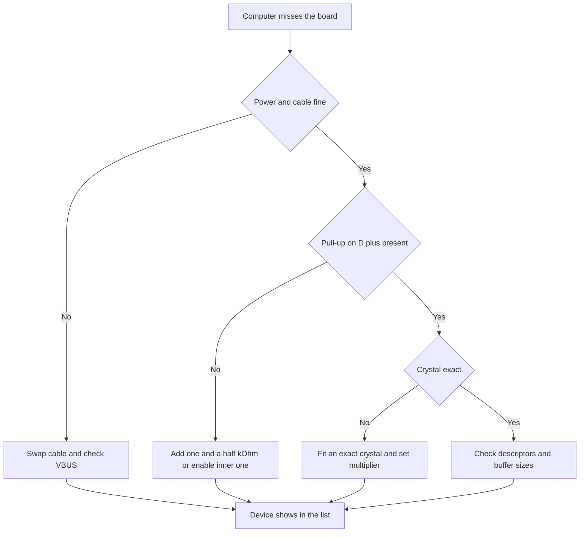

# USB on STM32 - Classes, Descriptors and DFU

![[assets/img/stm32-usb-scheme.png|600]]
*Fig. USB device: connector, protection, pull-up, controller and classes in firmware.*

> [!tip] Purpose of this note
> Explain USB as a system: line physics, descriptors, endpoints, memory difference on F1 and F4, CDC, HID, MSC, DFU classes, and flashing via BOOT0.

## 1. Purpose

The USB port on STM32 turns the microcontroller into a device the computer reads: virtual COM port, keyboard, flash drive, or firmware loader. The computer acts as host, the microcontroller answers as device, so the poll initiative always sits with the host.

Small chips give Full Speed twelve megabits with no external parts, bigger ones add High Speed four hundred eighty megabits via external physics. The USBD middleware in CubeMX closes the protocol routine, descriptors, endpoints and application logic stay with the developer.

This note walks from connector to class: line and power, descriptors, endpoints and memory, device classes, DFU mode, typical schematics and debug.

## 2. Full Speed Versus High Speed

| Parameter | Full Speed device | High Speed device |
| --- | --- | --- |
| Speed | Twelve megabits | Four hundred eighty megabits |
| Physics | Built into the die | External physics chip via ULPI |
| Example chips | F072, F103 with USB, G4, L4 | F4 with OTG HS, H7, U5 with HS |
| Connector | USB-C or micro-B as device | USB-C with role swap or micro-AB for OTG |
| Crystal | Exact, tolerance better than a quarter percent | Exact, plus clean physics supply |
| Application | Virtual port, HID, debug | Audio, camera, fast flash drive |
| Complexity | Minimum parts | Separate supply and fast bus routing |

```text
Вибір швидкості простий:
  Термінал, датчики, HID ......... Full Speed, вбудована фізика
  Аудіо потік, відео, диск ........ High Speed, зовнішня фізика
  Живлення від батареї ............ Full Speed з suspend
  Невідомо що буде завтра ......... Чип з обома контролерами
```

Built-in physics holds a pair of resistors and capacitors around the connector. External physics wants careful layout: short equal-length ULPI traces, solid ground, separate regulator. Saving on physics supply turns into random dropouts at high speed.

## 3. Line: Pull-up, Power, Protection

| Element | Value | Note |
| --- | --- | --- |
| Pull-up on D plus | One and a half kOhm to three volts | Full Speed device signal to host |
| Power detect | Divider from VBUS to sensing input | Controller knows the cable is in |
| ESD protection | Special pack on D plus and D minus | Kills static from fingers and connector |
| Common ground | Thick short trace | With no ground packets break even on the desk |
| Capacitors | Ceramic near connector and near chip | Smooth spikes at plug-in |
| Cable length | Up to five meters at Full Speed | Longer cable wants an active extender |
| Bus power | Five volts, up to five hundred milliamps | Heavy loads fed separately |

```text
Мінімальна обвязка пристрою Full Speed:

  USB РОЗЄМ                    STM32
  VBUS ----+---- дільник -----> PA9 sensing
            |
  D+ -------+----+----------------> USB_DP
            |    |
           1.5к ESD-збірка
            |    |
  D- ------------+---------------> USB_DM
            |
  GND -------+----+----------------> GND

  Підтяжка 1.5 кОм піднімає D+ і каже хосту:
  я пристрій Full Speed, опитуй мене.
```

The classic mistake: hang the pull-up straight on five volts and exceed the input limit. Right way: pull-up to three volts or the built-in controlled pull-up of the die, driven by firmware. A controlled pull-up allows software reconnect for repeat enumeration with no cable pull.

## 4. Descriptors: Device Passport

The host knows nothing about the device until it reads the descriptors. These are tables in microcontroller memory that tell who you are, how many interfaces you hold, and where to send data. One wrong descriptor length stops enumeration.

| Descriptor | What it tells | Typical content |
| --- | --- | --- |
| Device | The whole product | Class, vendor, product, serial number |
| Configuration | Work mode | Interface count, bus powering |
| Interface | Function | CDC, HID, MSC, audio class |
| Endpoint | Exchange channel | Number, direction, type, packet size |
| String | Human text | Vendor and product names |
| HID report | Report format | HID class only, buttons and axes |
| DFU | Loader | USB flashing capability flag |

```text
Ієрархія дескрипторів зверху вниз:

  ПРИСТРІЙ (один)
   └─ КОНФІГУРАЦІЯ (одна активна)
       ├─ ІНТЕРФЕЙС керування (CDC control)
       │    └─ ЕНДПОІНТ вхідний переривань
       ├─ ІНТЕРФЕЙС даних (CDC data)
       │    ├─ ЕНДПОІНТ вихідний bulk
       │    └─ ЕНДПОІНТ вхідний bulk
       └─ ІНТЕРФЕЙС HID (кнопки)
            └─ ЕНДПОІНТ вхідний переривань
```

Take vendor and product IDs from the test pool or buy official ones. Build the serial number from the unique die code, then every board gets its own number and the host never mixes two equal devices.

## 5. Device Classes

| Class | What the computer sees | Application |
| --- | --- | --- |
| CDC | Virtual COM port | Terminal, logs, commands, flashing via terminal |
| HID | Keyboard, mouse, joystick | Buttons, encoders, pedals, no drivers needed |
| MSC | Removable disk | Flash drive on a memory card, configs as text files |
| DFU | Firmware loader | Flashing via USB with no programmer |
| Audio | Microphone or speaker | Headset, noise meter, synth |
| Composite | Port plus HID together | Terminal and buttons in one case |

A composite device suits a test stand: one cable gives a command terminal and HID buttons for control. Pay with harder descriptors, so start with one class and add the second after the first runs stable.

## 6. Endpoints and Memory: F1 Versus F4

| Parameter | F1 series | F4 and newer series |
| --- | --- | --- |
| Packet memory | Separate PMA memory, half a kilobyte | FIFO in RAM, free split |
| Split | Endpoint sizes counted by hand | Stack splits FIFO between endpoints itself |
| Typical mistake | Buffer overlap, silent stillness | Too little room for a large bulk packet |
| Endpoint zero | Control, enumeration, mandatory | Same, control always zero |
| Bulk | Large data with no time promise | Terminal, flash drive, flashing |
| Interrupt | Small reports on time | HID reports, CDC line state |
| Isochronous | Limited, newer chips better for sound | Audio stream with promised speed |

```text
Розрахунок PMA на F1 роблять на папері:

  EP0 керування .... 64 байти прийом + 64 байти передача
  EP1 bulk CDC ..... 64 + 64 байти
  EP2 переривань ... 16 байти вхідні
  РАЗОМ ............ влізти у 512 байтів PMA!

  Помилка: два bulk по 256 байтів на F1.
  Наслідок: буфери наклались, перелік падає.
  Лікування: bulk по 64 байти, цього досить для CDC.
```

The memory rule: endpoint zero first, then large bulk, the rest for interrupts. Check every size change with repeat enumeration on the computer. A device manager yellow mark almost always means a descriptor mistake or buffer overlap.

## 7. USBD Middleware in CubeMX

| Step | Action |
| --- | --- |
| One | Enable the USB device and USBD middleware |
| Two | Pick a class: CDC, HID, MSC or DFU |
| Three | Check clocking: exactness and physics supply |
| Four | Set vendor, product, serial strings |
| Five | Generate code and find receive and transmit callbacks |
| Six | Add application logic on top of the generated frame |

Split generated code into system and application parts: never touch system files by hand, write your logic in the marked places. A CubeMX update overwrites system files, so edits there get lost. Keep your code apart and call it from generated callbacks.

## 8. CDC Example: Print via Virtual Port

```c
extern USBD_HandleTypeDef hUsbDeviceFS;
uint8_t cdcBuf[64];

void cdc_print(const char *text)
{
  uint32_t len = 0;
  while (text[len] != 0 && len < sizeof(cdcBuf))
  {
    cdcBuf[len] = (uint8_t)text[len];
    len++;
  }
  CDC_Transmit_FS(cdcBuf, (uint16_t)len);
}

void cdc_echo_received(uint8_t *data, uint32_t len)
{
  CDC_Transmit_FS(data, (uint16_t)len);
}
```

| Reception | Note |
| --- | --- |
| Non-blocking call | Transmit queues, control returns at once |
| Buffer alive to the end | Never rewrite the array while the stack sends it |
| Large text in parts | Cut into sixty-four byte packets |
| Receive via callback | New bytes arrive in the callback, copy only there |

```c
void cdc_periodic_log(void)
{
  static uint32_t lastTick = 0;
  if (HAL_GetTick() - lastTick > 1000)
  {
    lastTick = HAL_GetTick();
    cdc_print("heartbeat: плата жива\r\n");
  }
}
```

A once-per-second print checks the whole path: stack, cable, virtual port driver. If heartbeat flows but commands never land, the fault is in receive parsing, not in USB.

## 9. DFU Flashing via BOOT0

| Step | Action |
| --- | --- |
| One | Set BOOT0 to one, press reset |
| Two | Plug USB, computer sees a DFU device |
| Three | Open CubeProgrammer and pick the firmware file |
| Four | Write, verify, return BOOT0 to zero |
| Five | Press reset, board starts the new firmware |

The factory loader in system memory always handles DFU on chips with USB. Your own DFU in application firmware allows updates with no jumpers: the device restarts into loader mode on command by itself. Both paths want stable power, a mid-write break is cured only by repeat flashing.

## 10. OTG on F105, F107 and F4

| Mode | Note |
| --- | --- |
| Device | Microcontroller answers the host, typical case |
| Host | Microcontroller polls a flash drive or keyboard itself |
| OTG | Cable and protocol talks set the role |
| Host power | Board gives five volts on VBUS, power switch needed |
| Connector | Micro-AB or USB-C with orientation detect |

Take host on a microcontroller for standalone tasks: write logs to a flash drive with no computer, read a keyboard directly. The host stack is heavier than the device stack, so start from a ready MSC host example and add your logic on top.

## 11. Mermaid: Why It Never Enumerates



## 12. Board Layout

Place the connector at the board edge, the ESD pack right behind it, route D plus and D minus as an equal-length pair with no sharp corners. Hold solid ground under the pair, route no fast digital signals nearby. A ceramic capacitor near the controller and a ferrite on supply cut ringing that the host reads as packet errors.

## Common Issues

| # | Issue | Why it is bad | Fix |
| --- | --- | --- | --- |
| 1 | PMA buffers overlap on F1 | Enumeration falls with no clear cause | Count every endpoint on paper and fit half a kilobyte |
| 2 | Pull-up to five volts | Input limit exceeded, wear | Pull-up to three volts or inner controlled one |
| 3 | No power detect | Device misses the cable plug | Divider from VBUS to sensing input |
| 4 | Loose inner oscillator | Host drops the link on long packets | Exact crystal or frame-locked trim |
| 5 | Blocking print in interrupt | Hangs and missed packets | Copy to buffer, send in background |
| 6 | Long market cable | Speed falls and dropouts | Short quality cable up to five meters |
| 7 | No ESD protection | First static kills the port | Protection pack right behind the connector |

## Official Sources

- [USB on STM32 overview (ST)](https://www.st.com/en/interfaces-and-transceivers/usb.html) - controllers, physics, classes.
- [AN4879 USB hardware design (ST)](https://www.st.com/resource/en/application_note/an4879-usb-hardware-and-pcb-guidelines-using-stm32-mcus-stmicroelectronics.pdf) - connectors, protection, routing.
- [STM32Cube USB device library (ST)](https://www.st.com/en/embedded-software/stsw-stm32121.html) - USBD middleware and class examples.

## See also

- [[Home.en]]
- [[09-Firmware/01-CubeIDE-CubeMX | CubeMX setup]]
- [[09-Firmware/02-HAL-LL | HAL and LL layers]]
- [[09-Firmware/03-ST-Link-Proshivka | Flashing via ST-Link]]
- [[03-GPIO/01-GPIO-rezhimi.en | GPIO modes]]
- [[04-Interfaces/04-FDCAN.en | FDCAN bus]]
- [[04-Interfaces/06-SDMMC-QUADSPI.en | Cards and external flash]]
