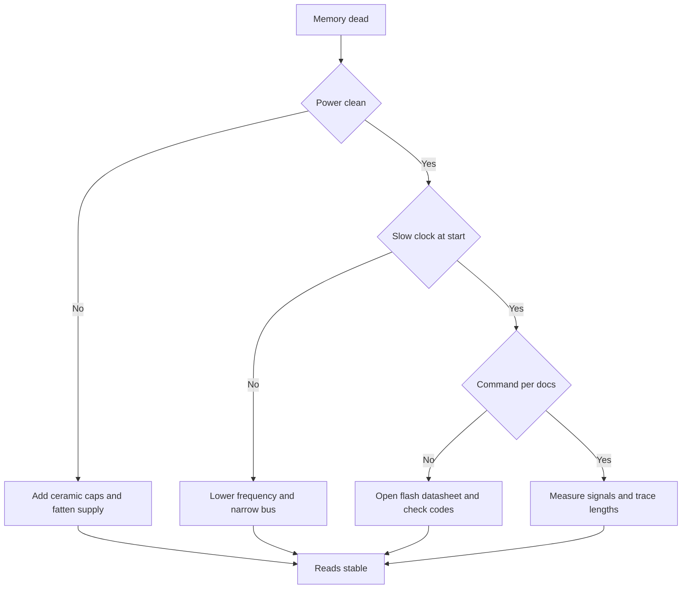

# SDMMC and QUADSPI - Memory Cards and XIP

![[assets/img/stm32-sdmmc-qspi-scheme.png|600]]
*Fig. Memory card via SDMMC and external flash via QUADSPI: buses, power and execute-in-place.*

> [!tip] Purpose of this note
> Split two external memories into places: card via SDMMC for files and logs, flash via QUADSPI for code and resources with execute-in-place.

## 1. Purpose

Inner flash fits the code but never fits logs, maps, fonts and sound. A memory card gives gigabytes for a file system the computer also reads. External flash gives tens of megabytes for code and resources, and the CPU runs code straight from it with no copy to RAM.

SDMMC talks to the card over a parallel bus of one or four bits at a high clock. QUADSPI talks to the flash serially over one, two or four bits, and in memory mode maps it into the CPU address window. Both blocks handle direct memory access, so the CPU never drags bytes by hand.

This note covers both paths: card bus and clocking, file system via CubeMX, flash modes, execute-in-place, programmer loader, and signal integrity.

## 2. SDMMC: Bus and Clocking

| Parameter | Value | Note |
| --- | --- | --- |
| Bus width | One or four data bits | Four bits give four times the speed |
| Lines | Clock, command, data zero to three | Plus card power and ground |
| Clocking | Up to fifty megahertz in fast mode | Start slow for init |
| Card detect | Separate presence input | Board knows the card is in |
| Write protect | Write permit input | Locks erase with the socket switch |
| Power | Three volts, current with margin | A power dip hits the file system |
| Pull-ups | On command and data | With no pull-ups the line floats |

```text
Підключення карти до SDMMC:

  STM32                        microSD ГНІЗДО
  SDMMC_CK  -----------------> CLK
  SDMMC_CMD -----------------> CMD
  SDMMC_D0  -----------------> DAT0
  SDMMC_D1  -----------------> DAT1
  SDMMC_D2  -----------------> DAT2
  SDMMC_D3  -----------------> DAT3
  3V3       --> живлення карти
  GND       --> земля карти
  PC8 детект <-- CD (card detect)
  PC9 захист <-- WP (write protect)

  Починати завжди з шини 1 біт і низького такту.
  Ширину 4 біти вмикати після успішної ініціалізації.
```

Init wants a slow clock near four hundred kilohertz. After the card answers, the controller raises frequency and widens the bus. A jump straight to maximum with no steps ends in card silence, above all with cheap samples.

## 3. FATFS via CubeMX

| Step | Action |
| --- | --- |
| One | Enable SDMMC and FATFS middleware |
| Two | Pick card detect and write protect per schematic |
| Three | Enable DMA for reads and writes |
| Four | Generate code and mount the volume at start |
| Five | Write and read files with plain calls |

```c
FATFS fs;
FIL logFile;
UINT written;

void sd_start(void)
{
  f_mount(&fs, "", 1);
  f_open(&logFile, "log.txt", FA_OPEN_APPEND | FA_WRITE);
  f_write(&logFile, "start\r\n", 7, &written);
  f_sync(&logFile);
}

void sd_log_line(const char *line)
{
  UINT n = 0;
  while (line[n] != 0) { n++; }
  f_write(&logFile, line, n, &written);
  f_sync(&logFile);
}
```

| File rule | Note |
| --- | --- |
| Sync after write | With no sync a power cut loses last data |
| One open file for writing | Less chance to hurt the table |
| Short Latin names | Long names with spaces break compatibility |
| Remove card via button | Software unmount before pull-out |
| Free space check | Glance at the remainder before a long log |

The computer formats the file system as FAT32 with a sane cluster size. The controller never reads exotic formats. Take a card for logs with a cycle margin, a cheap card dies in months of per-second writes.

## 4. Reads and Writes with DMA

| Mode | Pro | Con |
| --- | --- | --- |
| Polling | Simple for debug | CPU hangs in the loop |
| Interrupt | Non-blocking, simple logic | Every block pulls the CPU |
| DMA | CPU free during exchange | Watch the buffer and cache |

```c
uint8_t sdBuf[512];

void sd_read_block_dma(void)
{
  HAL_SD_ReadBlocks_DMA(&hsd1, sdBuf, 0, 1);
}

void HAL_SD_RxCpltCallback(SD_HandleTypeDef *hsd)
{
  (void)hsd;
  /* блок у памяті, можна розбирати */
}
```

Hold the DMA buffer aligned and never touch it before the done callback. On cache cores clean and drop the buffer area per cache rules, or the CPU sees stale data. Split long runs into five hundred twelve byte blocks, show progress with an LED.

## 5. QUADSPI and OCTOSPI: Flash Modes

| Mode | Lines per clock | Speed | When to take |
| --- | --- | --- | --- |
| Plain serial | One bit | Base | Debug, fit with any flash |
| Dual | Two bits | Doubled | Speed and simplicity middle ground |
| Quad | Four bits | Four times higher | Pictures, sound, fast boot |
| Octal OCTOSPI | Eight bits | Maximum | Senior H5 and H7 chips, large resources |
| Double data rate | Double on rise and fall | Even higher | Only with a flash that knows the mode |

A typical W25Q128 flash holds sixty-four megabits in a hand-solder package and speaks every mode up to quad. Take read, write and erase commands from its docs byte by byte, command-code guesswork ends in chip silence.

## 6. Memory-Mapped: Running Code from Outside

In mapped mode the controller sends the read command, address and waits by itself, and the flash returns bytes like plain memory. The CPU points entry into the external memory window and runs code with no copy. The only gap to inner flash is latency, hidden by cache.

| Step | Action |
| --- | --- |
| One | Init QUADSPI in indirect mode and check the flash ID |
| Two | Set the fast read command per flash docs |
| Three | Switch the controller to mapped mode |
| Four | Check reads of the address memory window |
| Five | Move the vector table or resources outside |

```c
void qspi_memory_mapped(void)
{
  QSPI_CommandTypeDef cmd;
  QSPI_MemoryMappedTypeDef mmap;
  cmd.Instruction = 0xEB;
  cmd.AddressSize = QSPI_ADDRESS_24_BITS;
  cmd.AlternateByteMode = QSPI_ALTERNATE_BYTES_NONE;
  cmd.DummyCycles = 6;
  cmd.InstructionMode = QSPI_INSTRUCTION_1_LINE;
  cmd.AddressMode = QSPI_ADDRESS_4_LINES;
  cmd.DataMode = QSPI_DATA_4_LINES;
  mmap.TimeOutActivation = QSPI_TIMEOUT_COUNTER_DISABLE;
  HAL_QSPI_MemoryMapped(&hqspi, &cmd, &mmap);
}
```

Take the read wait count from the flash table for the exact frequency. Too few waits give garbage at a high clock, too many waits just slow the read. Change controller frequency and waits only as a pair per docs.

## 7. W25Q128 Example

| Operation | Command code | Note |
| --- | --- | --- |
| Read ID | 0x9F | Link check, first board test |
| Fast read | 0xEB in quad mode | Main data and code read |
| Write permit | 0x06 before every write | With no permit the write is ignored |
| Page write | 0x32 in quad mode | Up to two hundred fifty-six bytes at once |
| Sector erase | 0x20 per four kilobytes | Erase the sector before writing |
| Status | 0x05 read the busy flag | Wait for ready after write |

```c
uint8_t qspi_read_id(void)
{
  QSPI_CommandTypeDef cmd;
  uint8_t id[3] = {0};
  cmd.Instruction = 0x9F;
  cmd.DataMode = QSPI_DATA_1_LINE;
  cmd.NbData = 3;
  HAL_QSPI_Command(&hqspi, &cmd, 100);
  HAL_QSPI_Receive(&hqspi, id, 100);
  return id[0];
}
```

```text
Послідовність запису сторінки:

  1. Прочитати стан, дочекатись готовності.
  2. Надіслати дозвіл запису 0x06.
  3. Надіслати команду запису, адресу і дані.
  4. Чекати прапорець готовності командою 0x05.
  5. Перечитати і порівняти, що записалось.
```

Erase takes tens of milliseconds, page write hundreds of microseconds. Blocking waits in a loop pass at start, in work mode poll status in background. A power-cut mid-write leaves the sector half-erased, so mirror important data in two sectors.

## 8. External Loader for CubeProgrammer

| Step | Action |
| --- | --- |
| One | Build a loader project for your board |
| Two | Name flash type, size and read command |
| Three | Drop the file into the programmer folder |
| Four | Flash external flash with the plain write button |

With no loader of your own the programmer sees only inner memory and honestly says the outside address never exists. A loader teaches the programmer to speak to the exact flash on the exact board, so keep it in the repo next to the schematic.

## 9. FMC Versus OCTOSPI Choice

| Parameter | FMC | OCTOSPI |
| --- | --- | --- |
| Memory type | Parallel, many pins | Serial, few pins |
| Speed | Higher on a parallel bus | Enough for code and pictures |
| Board | Hard, palm-wide bus | Simple, six to eight traces |
| Chip package | Big package with full bus needed | Mid package enough |
| When to take | External RAM, display | External flash for code and resources |

A display with a large frame and external RAM ask for a parallel bus. Flash for code and pictures lives on serial with no comfort lost. Both together give a fast frame from parallel memory and pictures from serial flash.

## 10. Integrity: Short Level Traces

| Rule | Note |
| --- | --- |
| Short traces | Long antennas catch noise and ring |
| Equal length | Data line skew inside tolerance |
| Solid ground under the bus | Return current flows straight under signal |
| Supply with ceramic caps | Capacitor near every memory chip |
| No sharp corners | Smooth bends radiate less |
| Clock away from analog inputs | Clock ringing lifts measure noise |

```text
Трасування QUADSPI зверху:

  MCU --коротко--> FLASH
  CLK окремо від IO0..IO3
  під шиною суцільна земля
  кераміка 100 нФ біля живлення флешки

  SDMMC трасують так само:
  CLK окремо, дані разом,
  детект і захист будь-де.
```

Integrity check is simple: a large file read from the card and the firmware checksum in flash must match one hundred times out of one hundred. Random splits mean power or length faults, not code mistakes.

## 11. Mermaid: What Stalls



## 12. Card and Flash Supply

A memory card eats in gulps: microamps idle, tens of milliamps writing. A weak regulator sags supply right at write time, so place an electrolytic and ceramic near the socket. Flash is calmer but also loves clean power and short ground. A shared ferrite at the memory supply input cuts digital-part noise.

## Common Issues

| # | Issue | Why it is bad | Fix |
| --- | --- | --- | --- |
| 1 | Fast clock at once | Card never answers, silence on the bus | Start slow, speed up after init |
| 2 | No card detect | Board writes into the void and spoils state | Poll the presence input, mount only with card |
| 3 | Read waits at random | Garbage instead of code at high frequency | Take waits from the flash table for your frequency |
| 4 | Write with no sector erase | Old bits stay, data broken | Erase sector, write pages, read back |
| 5 | DMA buffer touched early | Half the block new, half old | Wait for the done callback, hold buffer aligned |
| 6 | Long uneven traces | Ringing and crosstalk | Short level traces over solid ground |
| 7 | No loader of your own | Programmer misses external flash | Build an external loader for your board and flash |

## Official Sources

- [SDMMC overview STM32 (ST)](https://www.st.com/en/interfaces-and-transceivers/secure-digital.html) - card controllers and bus modes.
- [AN5122 QUADSPI on STM32 (ST)](https://www.st.com/resource/en/application_note/an5122-quadspi-memory-interface-on-stm32-microcontrollers-stmicroelectronics.pdf) - modes, mapping, examples.
- [W25Q128 datasheet reference (ST partner)](https://www.st.com/en/memory.html) - flash commands and read wait tables.

## See also

- [[Home.en]]
- [[01-Hardware/03-G0-G4.en | Modern G0 and G4]]
- [[09-Firmware/01-CubeIDE-CubeMX | CubeMX setup]]
- [[09-Firmware/02-HAL-LL | HAL and LL layers]]
- [[03-GPIO/01-GPIO-rezhimi.en | GPIO modes]]
- [[04-Interfaces/04-FDCAN.en | FDCAN bus]]
- [[04-Interfaces/05-USB.en | USB port]]
