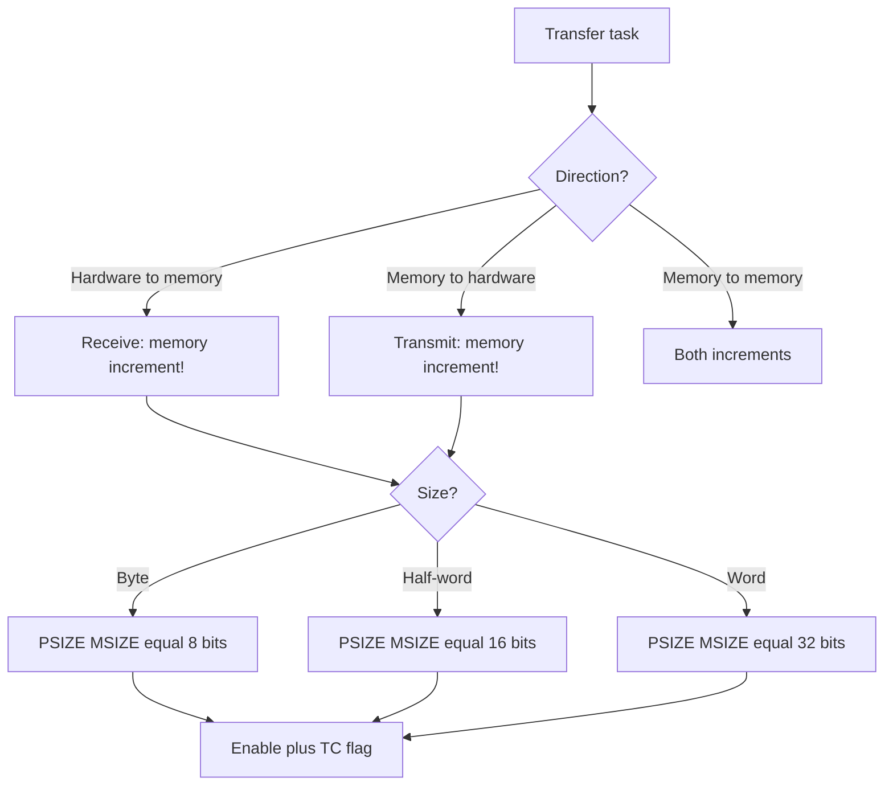

# DMA on STM32 - Modes, Streams and Traps

![[assets/img/stm32-dma-deepdive-scheme.png|600]]
*Fig. DMA modes: where data flows with no core involved.*

> [!tip] Purpose of this note
> Teach DMA setup so hardware swaps data with no core: streams, modes, FIFO, and typical traps.

## 1. Purpose

DMA (direct memory access) copies data between hardware and memory while the core counts useful work. With no DMA every UART byte or ADC sample would want an interrupt. With DMA the core gets a ready buffer and one flag. The price: correct setup of direction, sizes, increments, and alignment.

## Controller Operation Modes

| Mode | Behavior | When to take |
| --- | --- | --- |
| Normal | Stops after N transfers | One-shot packets, frame output to display |
| Circular | Restarts from the top by itself | Streams: ADC scan, UART receive, sound |
| Double buffer | Two buffers take turns | Gap-free streams: read one while the other fills |
| Peripheral-to-peripheral | Memory never touched | Bridge between peripherals, rare case |

```text
Логіка вибору:
  один пакет іноді ............ Normal
  потік без пауз ............... Circular
  потік + обробка без гонок .... Double buffer
  міст SPI-в-UART ............... Peripheral-to-peripheral
```

## Streams, Channels and Arbitration

| Concept | Core | Practice |
| --- | --- | --- |
| Stream | Free-standing copy channel | One stream - one job |
| Channel | Stream tie to hardware | Table in the Reference Manual! |
| Priority | Who first on conflict | Audio above logs, critical above all |
| Arbitration | Round-robin inside a level | Two streams of one level share the bus fairly |

> Pick the channel from the DMA request table of the exact chip. A wrong channel number means silence with no compile error at all.

## Mermaid: Transfer Setup



## Circular with Half Buffer

```c
// Прийом UART в кільцевий буфер, обробка половинами:
#define BUF_SZ 256
uint8_t rx_buf[BUF_SZ];
HAL_UART_Receive_DMA(&huart1, rx_buf, BUF_SZ);

void HAL_UART_RxHalfCpltCallback(UART_HandleTypeDef *huart)
{
  process_half(rx_buf, BUF_SZ / 2);   // перша половина готова
}

void HAL_UART_RxCpltCallback(UART_HandleTypeDef *huart)
{
  process_half(rx_buf + BUF_SZ / 2, BUF_SZ / 2);  // друга готова
}
```

| Rule | Note |
| --- | --- |
| Handling shorter than half a period | Else the second half wipes the first |
| Both Half and Full flags | Else half the data is missed |
| Aligned buffer | Wrong alignment breaks burst |

## FIFO and Burst Transfers

| Parameter | Options | Practice |
| --- | --- | --- |
| FIFO | Off or 1/4, 1/2, 3/4, full threshold | Enable for burst, else direct mode |
| Burst | Single or INCR4/8/16 | Burst runs faster but wants alignment |
| FIFO threshold | When to flush to the bus | Larger burst means higher threshold |

```text
Прямий режим: кожен запит периферії одразу йде в шину.
Режим FIFO: накопичує до порога, потім летить пакетом.
Правило: burst довжиною N вимагає адресу, кратну N словам.
```

## Pairing with Timer and ADC

```c
// АЦП сканує канали по тригеру таймера, DMA збирає:
HAL_ADC_Start_DMA(&hadc1, (uint32_t*)adc_buf, CH_NUM);
HAL_TIM_Base_Start(&htim2);   // тригер для АЦП
```

| Link | Role |
| --- | --- |
| Timer | Sets the exact measure period |
| ADC | Converts on trigger with no core |
| DMA | Packs results into memory |
| Core | Wakes on the ready flag |

## Cache on H7: Main DMA Trap

| Topic | Practice |
| --- | --- |
| D-Cache | Core sees cache, DMA sees memory - desync! |
| Before transmit | Clean the buffer cache so DMA takes fresh data |
| After receive | Invalidate the cache so the core reads new data |
| Alignment | Buffer multiple of the 32 byte cache line |

```c
// Приклад для буфера прийому на H7:
SCB_InvalidateDCache_by_Addr((uint32_t*)rx_buf, sizeof(rx_buf));
HAL_UART_Receive_DMA(&huart1, rx_buf, sizeof(rx_buf));
```

## Common Issues

| # | Issue | Why it is bad | Fix |
| --- | --- | --- | --- |
| 1 | Wrong stream channel | Silence with no errors | DMA request table from the Reference Manual |
| 2 | Memory increment forgotten | Writes into one cell | Enable MINC for buffers |
| 3 | Wrong data size | Half the bytes or garbage | PSIZE and MSIZE fit to register width |
| 4 | Handling longer than half buffer | Data overwritten | Short handling or double buffer |
| 5 | DMA plus D-Cache with no clean | Old data back and forth | Clean before TX, invalidate after RX |
| 6 | Two streams on one channel | Request conflict | One request - one stream |
| 7 | TC flag never cleared | Repeat firing | Clear the flag in the handler |

## Official Sources

- [AN4031 Using DMA controller (ST)](https://www.st.com/resource/en/application_note/an4031.pdf) - modes, FIFO, burst.
- [AN4666 DMA tutorial (ST)](https://www.st.com/resource/en/application_note/an4666.pdf) - setup examples.

## See also

- [[Home.en]]
- [[04-Interfaces/01-UART.en | Serial port]]
- [[04-Interfaces/02-SPI.en | Exchange bus]]
- [[06-Analog/01-ADC | Signal measurement]]
- [[07-Timers/01-GPTIM-ADTIM | Timers and PWM]]
- [[09-Firmware/02-HAL-LL | Code layers]]
