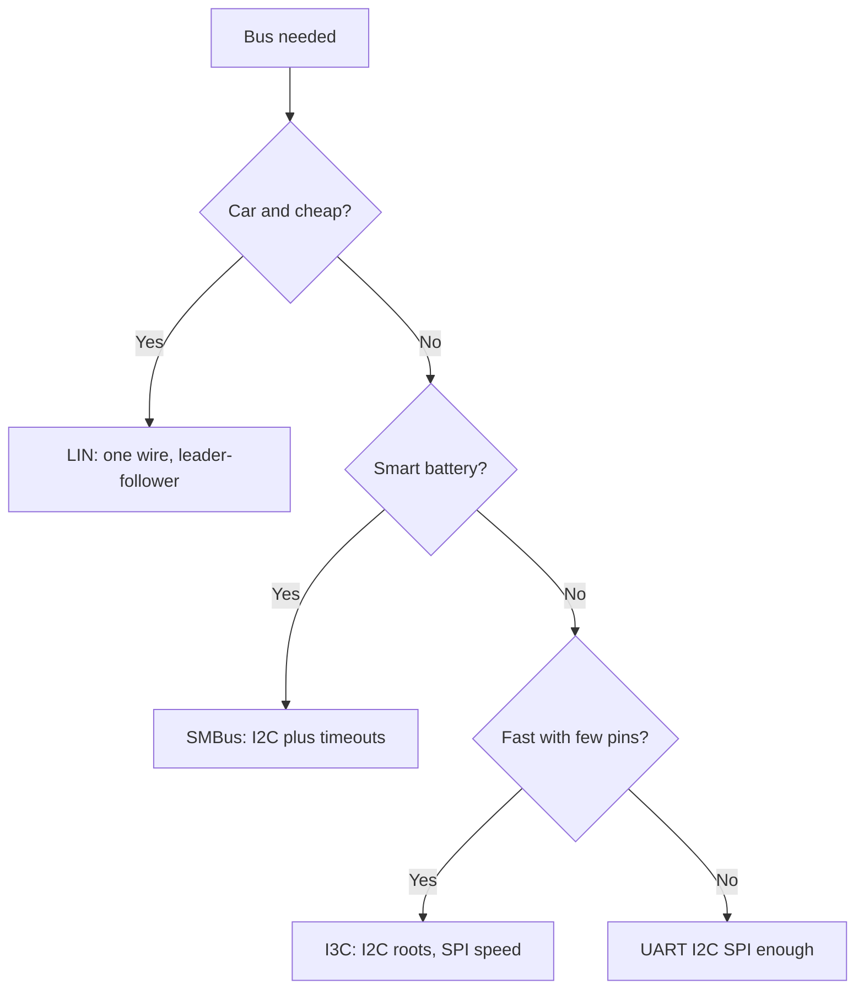

# LIN, SMBus and I3C - Second-Level Buses

![[assets/img/stm32-lin-smbus-i3c-scheme.png|600]]
*Fig. When plain buses run short: which one is for what.*

> [!tip] Purpose of this note
> Teach niche bus choice: LIN for cheap cars, SMBus for batteries, I3C for speed.

## 1. Purpose

UART, I2C and SPI cover ninety percent of jobs. The rest is LIN (cheap car nodes), SMBus (smart batteries) and I3C (fast sensors with I2C roots). Each holds a trap that gets it mixed with a plain bus.

## LIN over UART

| Topic | Practice |
| --- | --- |
| Physics | One wire plus ground, TJA1021 transceiver |
| Break | Long zero of 13 plus bits - frame start! |
| Speed | Up to 20 kbit, enough for buttons and climate |
| Leader-follower | Leader sends header, follower answers |

```c
// Break засобами UART: шлемо нуль на низькій швидкості:
HAL_LIN_SendBreak(&huart1);   // апаратний break, де підтримується
```

## Mermaid: Niche Bus Choice



## SMBus: I2C with Character

| Difference | Core |
| --- | --- |
| Timeouts | Hung follower resets on time! |
| PEC byte | CRC of every packet |
| Alert line | Follower calls the leader itself |
| Levels | Stricter thresholds than plain I2C |

| Topic | Practice |
| --- | --- |
| STM32 hardware | SMBus mode switched on apart! |
| Battery chips | Read BQ packs per SBS spec |
| Mixing | Plain I2C device on an SMBus line - take care |

## I3C: I2C Heir

| Topic | Practice |
| --- | --- |
| Speed | Megahertz instead of hundreds of kilohertz |
| Compatibility | Old I2C devices work on the bus |
| In-band interrupts | Follower signals with no spare pins |
| Dynamic addresses | Leader hands addresses itself |

```text
Коли брати I3C:
  швидкий IMU з потоком даних;
  мало ніг, багато датчиків;
  чип підтримує (нові H5 і U5!).
Коли не брати:
  всі датчики старі I2C — виграшу нуль.
```

## Comparison Table

| Bus | Wires | Speed | Leader | For what |
| --- | --- | --- | --- | --- |
| LIN | 1 + GND | Up to 20 kbit | One | Car buttons, climate |
| SMBus | 2 | Up to 100 kHz | One + alert | Batteries, monitoring |
| I3C | 2 | Up to MHz | One | Fast sensors |
| CAN | 2 diff. | Up to 8 Mbit | All equal | Car power, industry |

## Common Issues

| # | Issue | Why it is bad | Fix |
| --- | --- | --- | --- |
| 1 | LIN with no transceiver | Levels wrong, no long reach | TJA1021 or analog |
| 2 | Break as a plain byte | Followers miss the start | Hardware break of 13 plus bits! |
| 3 | SMBus as plain I2C | Timeouts fire | Switch SMBus mode on |
| 4 | PEC ignored | Broken battery packets | Check CRC always |
| 5 | I3C with old devices | Speed dreams | Gain only with I3C followers |
| 6 | Alert wired nowhere | Polling in a loop | Route to EXTI! |
| 7 | One bus for all | Speed conflict | Fast and slow apart |

## Official Sources

- [LIN standards (LIN Consortium)](https://lin-cia.org/standards/) - frames, break, timings.
- [SMBus Specification (SBS Forum)](https://smbus.org/specs/) - timeouts, PEC, alert.
- [I3C Basic Specification (MIPI)](https://www.mipi.org/specifications/i3c-sensor-specification) - modes, addresses.
- [TJA1021 transceiver search (findchips)](https://findchips.com/search/TJA1021) - datasheets and stock.

## LIN Frame Byte by Byte

| Field | Content |
| --- | --- |
| Break | 13 plus zeros - hear all! |
| Sync | Speed sync byte |
| ID | Follower address plus check |
| Data | 2-8 bytes of payload |
| CRC | Classic or extended |

```text
Ритм шини:
  майстер шле заголовок кожні N мілісекунд;
  слейв відповідає тільки на свій ID;
  тиша між кадрами — норма, не баг.
```

## PMBus: Power Control

| Topic | Practice |
| --- | --- |
| Base | SMBus with power commands |
| Vout and Iout | Converter voltage and current readback |
| Commands | Enable, limits, faults |
| When | Digital PSU with monitoring |

## Case: Smart Battery over SMBus

| Step | Action |
| --- | --- |
| 1 | Find the SBS chip of the battery on the bus by scanning |
| 2 | Read capacity, current, temperature |
| 3 | Subscribe to alert for faults |
| 4 | Check the PEC of every packet! |

```c
// Читання ємності батареї (SBS-команда):
HAL_SMBUS_Master_Receive(&hsmbus1, BAT_ADDR, buf, 2, 100);
// buf — відсотки, але тільки з коректним PEC!
```

## See also

- [[Home.en]]
- [[04-Interfaces/01-UART.en | Serial port]]
- [[04-Interfaces/03-I2C.en | Exchange bus]]
- [[04-Interfaces/04-FDCAN.en | Car bus]]
- [[02-Power-Supply/02-Batareyne-zhivlennya.en | Battery power]]
