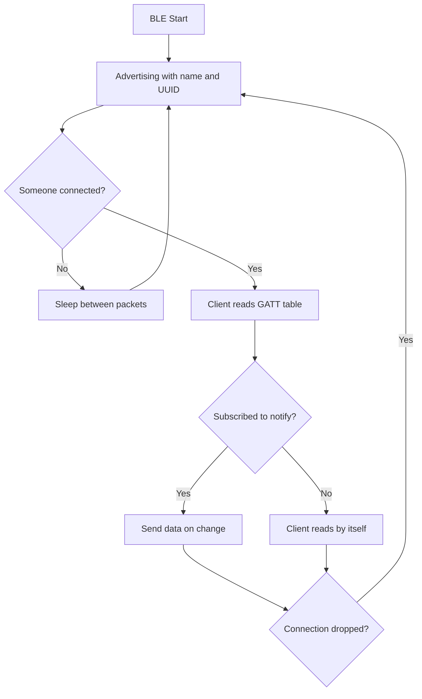

# BLE on STM32WB - Services, Connections and Profiles

![[assets/img/stm32-ble-wb-scheme.png|600]]
*Fig. Packet path: advertising, connection, GATT exchange.*

> [!tip] Purpose of this note
> Learn how to bring up a BLE peripheral on the WB55: advertising, custom services, stable connection and low current.

## 1. Purpose

The STM32WB55 holds the full BLE stack on the M0+ radio core, while your code on the M4 only describes data. A typical node: a sensor measures, puts the value into a characteristic, a phone or gateway picks it up. Understanding the GATT model removes the magic: everything comes down to an attribute table.

## Roles and Topology

| Role | Behavior | Example |
| --- | --- | --- |
| Peripheral | Advertises itself, waits for connection | Sensor, beacon, remote |
| Central | Scans and connects | Phone, gateway |
| Broadcaster | Only transmits, no connections | Temperature beacon |
| Observer | Only listens | Beacon logger |

```text
Typical pair:
  sensor-peripheral ..advertising.. phone-central ..connection.. exchange.
  One central holds several peripherals at the same time.
```

## Advertising: Business Card on Air

| Parameter | Value | Practice |
| --- | --- | --- |
| Interval | 20 ms - 10 s | More often - found faster, more current |
| Type | Connectable / non-connectable | A beacon needs no connection |
| Data | Name, flags, service UUIDs | 31 bytes maximum! |
| TX power | -20..+6 dBm | Minimum that reaches far enough |

## Mermaid: From Advertising to Data



## GATT: Table of Everything

| Level | Role | Example |
| --- | --- | --- |
| Profile | Whole scenario | Environment sensor |
| Service | Data group | Temperature and humidity |
| Characteristic | Single value | Temperature float |
| Descriptor | Setting | CCCD: notify permission |

| Operation | Direction | When |
| --- | --- | --- |
| Read | Client reads | Rare data |
| Write | Client writes | Commands to node |
| Notify | Server sends by itself | Measurement stream |
| Indicate | Notify with confirmation | Important events |

## Radio Stack Firmware

| Step | Action |
| --- | --- |
| 1 | CubeProgrammer: update FUS to latest |
| 2 | Flash BLE stack for the task (full or light) |
| 3 | Check versions: FUS and stack must be compatible! |
| 4 | Only then flash your own M4 firmware |

> FUS and stack mismatch means silent radio with a live M4. Always suspect this place first.

## Connection Power Consumption

| Parameter | Effect |
| --- | --- |
| Connection interval | Larger - less current, larger delay |
| Slave latency | Skipped events - longer sleep |
| TX power | Minimum for the distance |
| Advertising in sleep | Rarer - longer battery life |

```text
Reference:
  beacon once per second .. years from a coin cell;
  100 ms connection ...... weeks from a coin cell;
  15 ms connection ....... days, but instant response.
```

## Common Issues

| # | Issue | Why bad | Fix |
| --- | --- | --- | --- |
| 1 | Old FUS + new stack | Radio silent | Update both from one package |
| 2 | 20 ms advertising always | Battery melts | 1 s is enough for a beacon |
| 3 | UUID missing in advertising | Phone cannot filter | Declare services in the packet |
| 4 | Notify without CCCD | Client gets nothing | Check subscription explicitly |
| 5 | TX at maximum | Current and heat | Minimum for the distance |
| 6 | All logic in stack callbacks | Radio core hangs | Short callback, work in main |
| 7 | No disconnect handling | Node hangs without advertising | On disconnect - back to advertising |

## Official Sources

- [STM32WB BLE stack guide (ST)](https://www.st.com/en/microcontrollers-microprocessors/stm32wb-series.html) - stacks, FUS, examples.
- [Bluetooth Core Specification (Bluetooth SIG)](https://www.bluetooth.com/specifications/specs/) - GATT, roles, profiles.

## Pairing and Connection Security

| Level | What it gives | When needed |
| --- | --- | --- |
| Just Works | Encryption without confirmation | Sensors without screen |
| Passkey | PIN on both sides | Access control |
| OOB | Key outside the air | Maximum protection |
| Bonding | Remembers the key | To avoid pairing every time |

```text
Practice:
  characteristics with commands - only over an encrypted connection;
  store bonding keys in Flash, otherwise they vanish on reflash;
  beacons without connections need no pairing at all.
```

## Throughput: Honest Numbers

| Mode | Realistic | Limit |
| --- | --- | --- |
| 1M PHY notify | Tens of kB/s | Connection interval and MTU |
| 2M PHY notify | Up to a hundred kB/s | Both sides must support 2M |
| DLE extension | Larger packets | Negotiate MTU explicitly |

> BLE is not for video streaming. Enough for files and logs, no longer enough for audio.

## See Also

- [[Home.en]]
- [[EN/01-Hardware/06-WB-WL.en|wireless chips]]
- [[07-Timers/03-Sleep-Stop-Standby|sleep modes]]
- [[EN/02-Power-Supply/02-Battery-Power.en|battery power]]
- [[EN/05-Radio/02-LoRaWAN-WL.en|long-range network]]
