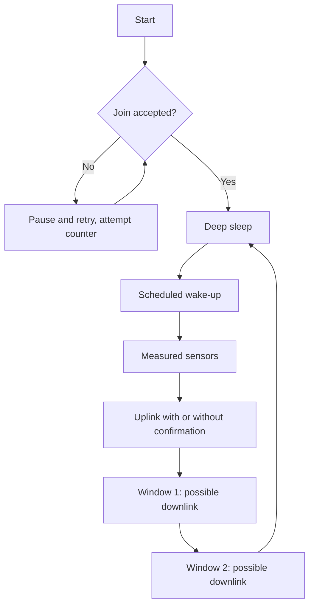

# LoRaWAN on STM32WL - Classes, OTAA and Duty-Cycle

![[assets/img/stm32-lorawan-wl-scheme.png|600]]
*Fig. Packet path: node, gateway, server, your application.*

> [!tip] Purpose of this note
> Learn how to connect a WL node to the network: join, classes, SF and legal pauses on air.

## 1. Purpose

LoRaWAN means kilometers of range at the price of bytes per day. A node sleeps, wakes up, sends a short packet through gateways to a server. The STM32WL holds the radio on a separate core, your M4 only prepares data. Understanding classes and duty-cycle separates a legal network from a jammer bothering the neighbors.

## Network Architecture

| Link | Role |
| --- | --- |
| Node (your WL) | Measures and sends uplink |
| Gateway | Listens to the air, forwards to the internet |
| Network server | Deduplication, ADR, security |
| Application server | Your data and downlink commands |

```text
A node does NOT connect to a gateway directly:
  transmits on air - all nearby gateways hear it;
  the server removes duplicates;
  the answer comes through ONE gateway.
```

## OTAA Against ABP

| Parameter | OTAA | ABP |
| --- | --- | --- |
| Join | Join procedure at start | Keys flashed in, starts at once |
| Security | Fresh session keys every time | Same keys for years |
| Convenience | Slower start, less hassle | Fast, but keys by hand |
| Recommendation | By default | Only for tests |

## Device Classes

| Class | Receive windows | Current | When |
| --- | --- | --- | --- |
| A | Two short ones after uplink | Minimum | Sensors, 99 percent of tasks |
| B | Scheduled slots on beacons | Medium | Control with seconds of delay |
| C | Listens all the time | Maximum | Only from mains, not battery! |

## Mermaid: Class A Node Life Cycle



## SF, Bandwidth and Time on Air

| SF | Speed | Range | 20-byte packet time |
| --- | --- | --- | --- |
| SF7 | Fast | City blocks | Tens of ms |
| SF9 | Medium | Whole city | Hundreds of ms |
| SF12 | Slow | Field and forest | Seconds! |

> ADR (adaptive data rate) lets the server lower your SF when the signal is good. Do not turn it off without a reason - it saves battery for everyone.

## Duty-Cycle: Law, Not Advice

| Band | Airtime limit | Consequence |
| --- | --- | --- |
| 868 MHz Europe | 1 percent | 1 s packet - 99 s pause! |
| Exceeding | You jam neighbors | Fines and server ban |
| TTN fair use | 30 s of air per day | More - only your own network |

```text
Practice:
  sensor every 10 minutes SF9 - inside the limit;
  tracker every 10 seconds SF12 - outside the law, cut SF or send rarer;
  confirming every packet doubles airtime - confirm important ones.
```

## Common Issues

| # | Issue | Why bad | Fix |
| --- | --- | --- | --- |
| 1 | ABP keys in repository | Anyone can clone the node | OTAA or secrets outside git |
| 2 | SF12 with frequent packets | Duty-cycle violation | ADR on, interval per table |
| 3 | Class C on battery | Weeks instead of years | Class A for autonomous nodes |
| 4 | 433 antenna instead of 868 | Minus tens of dB | Antenna for your own band! |
| 5 | Downlink every cycle | Server throttles, air clogged | Downlink only for commands |
| 6 | Join in a loop without pauses | Clogs the air on weak signal | Exponential pause between attempts |
| 7 | Single gateway in a basement | Nodes cannot be heard | Gateway higher, antenna outside |

## Official Sources

- [LoRaWAN Specification (LoRa Alliance)](https://lora-alliance.org/resource-hub/lorawan-specification-v101/) - classes, OTAA, frames.
- [STM32WL LoRaWAN stack (ST)](https://www.st.com/en/microcontrollers-microprocessors/stm32wl-series.html) - end-node examples.

## Payload: Save Every Byte

| Rule | Explanation |
| --- | --- |
| Send raw numbers, not text | Temperature as int16, not a string! |
| Decoder on server | Server converts bytes into values |
| Port separates types | Port 1 - measurements, port 2 - service |

```c
// Приклад пакування: температура і вологість в 4 байти:
int16_t t = (int16_t)(temp_c * 100);
uint16_t h = (uint16_t)(hum_pct * 100);
payload[0] = t >> 8; payload[1] = t & 0xFF;
payload[2] = h >> 8; payload[3] = h & 0xFF;
```

## Link Budget: Will the Signal Reach

| Parameter | Reference |
| --- | --- |
| Node power | Up to +22 dBm, but watch regional EIRP! |
| SF12 sensitivity | Minus 130+ dBm |
| City losses | Tens of dB per building |
| Weather margin | Minimum 10 dB above minimum |

```text
Rough check:
  open field line of sight .. tens of km;
  city from a window ........ kilometers;
  basement and elevator ..... do not try without an external antenna.
```

## Private Network: Own Gateway and Server

| Topic | Practice |
| --- | --- |
| Own gateway | Single-channel for tests, full one for work |
| Server | ChirpStack locally or in the cloud |
| Frequencies | Own plan per region, no conflicts |
| No fair use | Limited only by law, not by server |

```text
Private network minimum:
  gateway with an outdoor antenna;
  server with a packet decoder;
  two test nodes for coverage check.
```

## Roaming and Interference: What to Expect in a City

| Factor | Effect |
| --- | --- |
| Dense networks | Collisions, repeats, battery drain |
| Metal and basements | Dead zones even nearby |
| Weather | Rain adds little loss on sub-GHz |

## See Also

- [[Home.en]]
- [[EN/05-Radio/01-BLE-WB.en|short-range radio]]
- [[EN/01-Hardware/06-WB-WL.en|wireless chips]]
- [[07-Timers/03-Sleep-Stop-Standby|sleep modes]]
- [[12-Comm-Modules/01-NRF24-LoRa|radio over SPI]]
- [[EN/05-Radio/04-LoRa-P2P.en|direct link]]
