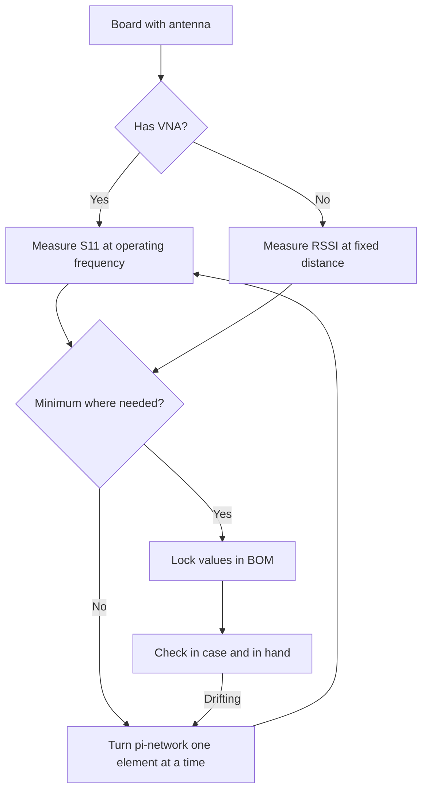

# 50 Ohm Antenna - Matching, Keepout and Certification

![[assets/img/stm32-antena-50ohm-scheme.png|600]]
*Fig. From pin to air: matching network, trace, antenna.*

> [!tip] Purpose of this note
> Learn how to bring radio to the air without losses: matching, layout, measurement and documents.

## 1. Purpose

A radio chip with a bad antenna is an expensive heat generator. Between the pin and the air stand a matching network, a trace and the antenna itself. Every link steals decibels if made blindly. This note gives the minimum so that a node hears and is heard.

## Path Links

| Link | Requirement |
| --- | --- |
| Chip pin | Pi-network: two capacitors and one inductor |
| Trace | 50 Ohm, short, over solid ground |
| Connector (if any) | Quality one, tightened, no adapter chains |
| Antenna | For its own band: 2.4 GHz or sub-GHz, not vice versa! |

```text
Typical pi-network:
  pin -> shunt-capacitor -> series-inductor -> shunt-capacitor -> antenna.
  Values are tuned for the specific board by measurement, not by guess!
```

## Antenna Types

| Type | Advantages | Drawbacks |
| --- | --- | --- |
| PCB trace | Free, repeatable | Takes space, sensitive to case |
| Chip antenna | Small, documented | Demands keepout and matching |
| External whip | Range and simplicity | Price, size, vandalism |
| Printed on case | Integration | Only with measurement and experience |

## Keepout: Emptiness Around

| Rule | Explanation |
| --- | --- |
| Under chip antenna - no copper | No polygons, no traces, no ground! |
| Case away from metal | Battery and shield nearby kill the pattern |
| Orientation | Antenna at board edge, protruding past outline |
| User hand | Test in hand, not only on the desk |

## Mermaid: Antenna Tuning



## Measurement Without a Lab

| Method | How to do it |
| --- | --- |
| RSSI at distance | Two nodes, fixed distance, log level before and after change |
| Field range | Line of sight, count delivery ratio |
| TX current | Sag at maximum - bad VSWR heats the stage |
| Comparison with reference | Same firmware on Nucleo with known antenna |

## Certification: What to Budget

| Question | Answer |
| --- | --- |
| Module with shield | Simpler tests: module already certified |
| Custom path from zero | Full emission test cycle |
| Antenna change | Recheck almost certainly |
| Firmware changes power | Retest, because spectrum changed |
| Documents | RED for Europe, FCC for USA - time and money |

## Common Issues

| # | Issue | Why bad | Fix |
| --- | --- | --- | --- |
| 1 | 433 antenna on 868 | Minus tens of dB at once | Antenna marking and datasheet! |
| 2 | Copper under chip antenna | Resonance drifts | Keepout per antenna datasheet |
| 3 | Pi values by guess | Mismatch guaranteed | S11 measurement or at least RSSI |
| 4 | 50 Ohm trace by guess | Reflection on every bend | Width calculator for your stack! |
| 5 | Metal case | Shield instead of antenna | External antenna or window |
| 6 | Test on desk only | Everything differs in hand | Check in real grip |
| 7 | Certification at the end | Board rework | Budget from first revision |

## Case and Antenna: Compatibility

| Case | Consequence | Way out |
| --- | --- | --- |
| Plastic | Almost no effect | Check resonance shift |
| Metal | Shields fully | External antenna through connector |
| Moisture and dirt | Matching drifts | Sealing and S11 margin |

## Official Sources

- [AN5128 Antenna design (ST)](https://www.st.com/resource/en/application_note/an5128.pdf) - PCB antennas and matching.
- [ETSI EN 300 220 (ETSI)](https://www.etsi.org/committee/ERM) - European sub-GHz band requirements.

## 50 Ohm Trace: How to Compute Width

| Stack parameter | Where to get it |
| --- | --- |
| Dielectric thickness | From board vendor (standard 1.6 mm two-layer) |
| Dielectric constant | FR4 roughly 4.2-4.6 |
| Copper thickness | 35 um (1 ounce) by default |
| Calculator | Online microstrip calculator for your stack! |

```text
Practice:
  computed the width - held it along the whole length;
  bends only as 45 degree arcs, no sharp corners;
  ground under the trace solid, no slots or crossings;
  length minimal: every millimeter steals at gigahertz.
```

## Pi-Network Tuning Step by Step

| Step | Action |
| --- | --- |
| 1 | Solder middle values from ST reference design |
| 2 | Measure S11 or RSSI - write down the base |
| 3 | Change ONE element at a time (series inductor) |
| 4 | Find the minimum, then trim with shunts |
| 5 | Lock values and part numbers in BOM |

> Do not change two elements at once - you will not know what helped.

## Radiation Pattern: Where It Shines

| Topic | Practice |
| --- | --- |
| Whip vertical | Donut around - good for field |
| PCB trace | Maximum perpendicular to board |
| Node on wall | Check the back side - there is a hole! |
| Two nodes | Orient identically during tests |

```text
Pattern check without a chamber:
  fix the transmitter, walk the receiver in a circle;
  log RSSI every 30 degrees;
  hole deeper than 20 dB - turn the antenna or add a second one.
```

## Moisture and Dirt on Antenna: Resonance Drift

| Factor | Effect |
| --- | --- |
| Rain on PCB antenna | Resonance drifts down |
| Ice | Even stronger, plus losses |
| Dust over time | Slow drift |
| Protection | Varnish and cover with S11 margin |

## See Also

- [[Home.en]]
- [[EN/05-Radio/01-BLE-WB.en|short-range radio]]
- [[EN/05-Radio/02-LoRaWAN-WL.en|long-range network]]
- [[EN/01-Hardware/06-WB-WL.en|wireless chips]]
- [[17-Lab/03-Hardware-Design-Guidelines|board circuit design]]
