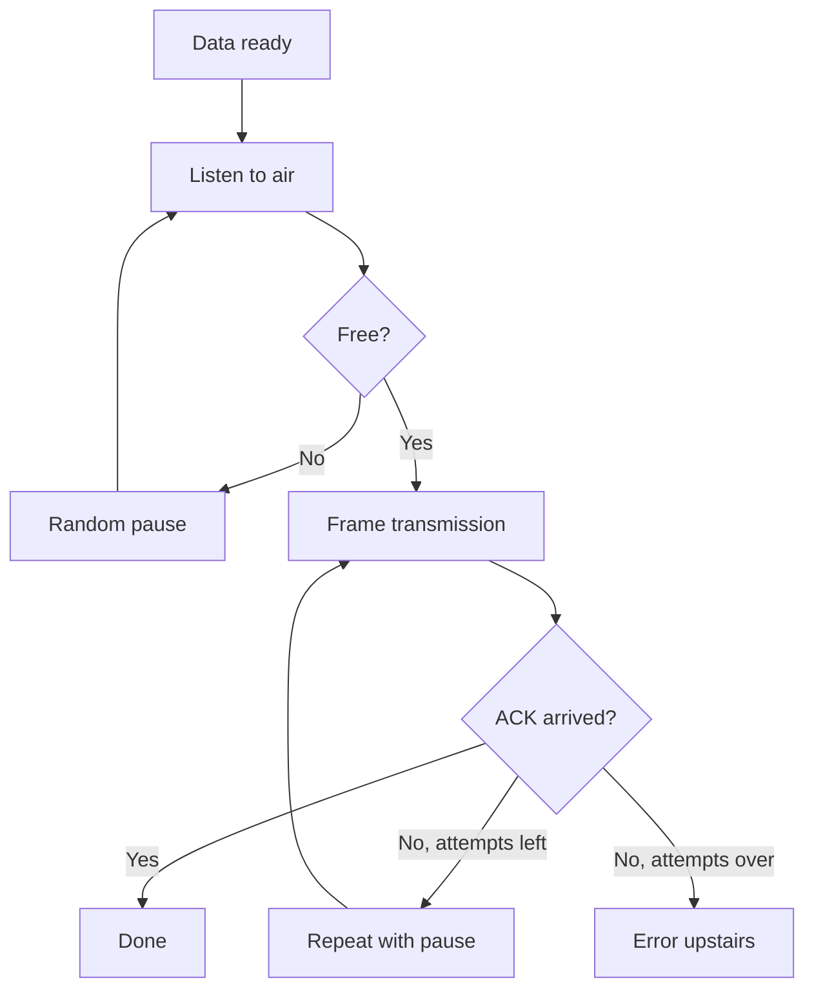

# LoRa P2P - Direct Link Without Network

![[assets/img/stm32-lora-p2p-scheme.png|600]]
*Fig. Two levels: identical parameters, own protocol.*

> [!tip] Purpose of this note
> Learn how to connect two nodes directly: shared parameters, own frame, acknowledgements and range limits.

## 1. Purpose

P2P means LoRa without servers or gateways: remote and actuator, two sensors, beacon and receiver. It works where there is no network coverage: field, forest, basement. The price of simplicity is your own protocol: addressing, repeats and collisions are on you.

## 2. P2P Against LoRaWAN: When to Use What

| Criterion | P2P | LoRaWAN |
| --- | --- | --- |
| Infrastructure | Zero | Gateways and server |
| Delay | Milliseconds-seconds | Seconds-windows |
| Two-way | Free | Downlink limited |
| Scale | Tens of nodes | Thousands |
| Law | Same duty-cycle! | Same |

## 3. Parameter Quad: Identical on Both Sides

| Parameter | Choice | Consequence |
| --- | --- | --- |
| Frequency | Same, own channel | Different - deafness |
| SF | Same | Different - cannot hear! |
| Bandwidth | Same | 125 kHz by default |
| Coding rate | Same | 4/5 to start |

| Extra | Value |
| --- | --- |
| Sync word | Own, NOT the network one! |
| Preamble | Same length |
| Power | Same for test symmetry |

## 4. Own Frame: Minimum of Fields

| Field | Why |
| --- | --- |
| Receiver address | Who reads |
| Sender address | Who sent |
| Counter | Duplicates from repeats |
| Type | Data, ACK, command |
| Data | Useful payload |
| CRC | Integrity (hardware can do it!) |

## Mermaid: Transmission With Acknowledgement



## 5. Code: P2P Node Skeleton

```c
// Налаштування радіо (обидва боки однаково!):
radio_set_freq(868000000);
radio_set_sf(9);
radio_set_bw(125000);
radio_set_cr(5);
radio_set_syncword(PRIVATE_SYNC);  // не WAN!

// Передача з повтором:
for (int i = 0; i < 3; i++) {
  radio_send(frame, len);
  if (wait_ack(2000)) break;
  random_delay();   // рознести повтори!
}
```

## 6. Range: Honest Numbers

| Conditions | SF7 | SF9 | SF12 |
| --- | --- | --- | --- |
| Line of sight | Kilometers | Tens of km | Tens of km |
| City | Blocks | Kilometers | Kilometers+ |
| Forest | Hundreds of meters | Kilometers | Kilometers |
| Indoors | Rooms | Floor | Building |

| Rule | Explanation |
| --- | --- |
| Antennas higher | Every meter of height means range |
| Test both ways | Asymmetry happens! |
| 10 dB margin | Weather and interference |

## 7. Repeater With One Node

| Topic | Practice |
| --- | --- |
| Received - forwarded | Hop counter against loops! |
| Two channels | Receive and transmit separated |
| Power supply | Relay from mains, not battery |
| Delay | Every hop adds seconds |

## Common Issues

| # | Issue | Why bad | Fix |
| --- | --- | --- | --- |
| 1 | Different SF on sides | Total deafness | Single parameter table! |
| 2 | Network sync word | Foreign packets leak in | Own private one |
| 3 | No air listen | Collisions with yourself | LBT before every TX |
| 4 | Repeats without pause | Clogs the air | Random pause! |
| 5 | No counter | Duplicates look like new data | Counter + window |
| 6 | Duty-cycle ignored | Outside the law | Pauses per band |
| 7 | One-way test | Reverse is worse | Both directions! |

## Official Sources

- [SX126x datasheet (Semtech)](https://www.semtech.com/products/wireless-rf/lora-connect/sx1262) - registers, parameters, CAD.
- [AN1200 LoRa modulation (Semtech)](https://www.semtech.com/design-support) - SF, sensitivity, budget.

## CAD and Encryption: Two Hardware Bonuses

| Topic | Practice |
| --- | --- |
| CAD detector | Hardware hears the preamble without receiving the packet! |
| Wake on CAD | Slept, heard, received - microamps at idle |
| AES block | Frame cipher without code on M4 |
| Keys | Same on both sides, not in git! |

```text
Frugal receiver:
  cycle: sleep -> CAD for milliseconds -> silence, back to sleep;
  preamble present - full receive and processing.
```

## See Also

- [[Home.en]]
- [[EN/05-Radio/02-LoRaWAN-WL.en|long-range network]]
- [[EN/05-Radio/03-Antenna-50ohm.en|antenna matching]]
- [[EN/01-Hardware/06-WB-WL.en|wireless chips]]
- [[12-Comm-Modules/01-NRF24-LoRa|radio over SPI]]
