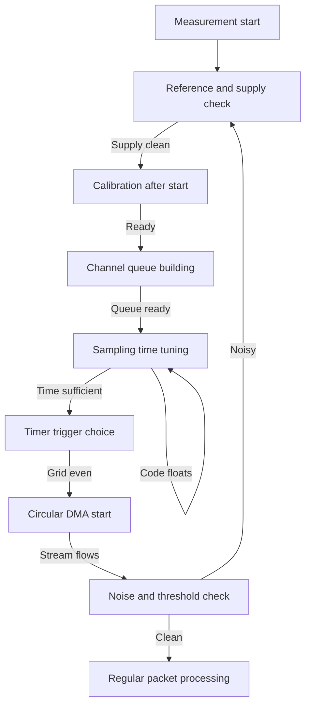

# STM32 ADC - Channels, Calibration and DMA

![[assets/img/stm32-adc-scheme.png|600]]
*Fig. ADC diagram: signal source, sampling time, channels, trigger, DMA and reference.*

> [!tip] Purpose of this note
> Give the full picture of measurement through the built-in converter: how to pick sampling time for source impedance, how to build the channel queue, when to calibrate, how to run continuous acquisition over DMA and how not to ruin accuracy with supply noise.
> This note covers typical tasks from reading a potentiometer to synchronous motor current measurement together with PWM.

## 1. Purpose

An analog to digital converter turns input voltage into a digital code that the program works with. In most families this is twelve-bit successive approximation at up to several million samples per second. One module serves many inputs in turn, so correct queue setup defines both polling speed and accuracy.

This note serves everyone who measures battery voltage, knob position, temperature, current or sound. It explains where error in lower bits comes from, why the first measurement after power-up can be wrong, why short sampling time must not be set on a high-impedance divider and how to make data land in memory by itself without core involvement.

Separate attention goes to the link with timer and direct memory access. This link gives an even grid of measurements in time, which matters for filters, regulators and motor control. Software polling in a loop cannot give such evenness.

## 2. Successive Approximation Principle

A successive approximation converter compares input voltage against the voltage of an internal digital to analog node, starting from the most significant bit. First the internal sampling capacitor charges, then the switch opens and the bit-by-bit weighting process starts. So a full cycle has two phases: sampling and conversion.

| Phase | What happens | What it affects |
| --- | --- | --- |
| Sampling | Capacitor charges to source voltage | Accuracy on high source impedance |
| Hold | Switch opens, voltage frozen | Conversion start |
| Weighting | Comparison from most to least significant bit | Conversion time and noise |
| Save | Code written into data register | Ready flag moment |

```text
One measurement cycle in time:
  Source --Rout--> [switch] --Uin--> [Csample] --frozen--> [comparator + DAC] --> code
  |<-- sampling time -->|<-- bit weighting time -->|
  Longer sampling time is needed when source impedance is large.
  Short time fits only a low-impedance source.
```

Conversion time depends on resolution. Lower resolution gives a faster result because fewer bits need weighting. Full twelve bit needs the most clocks, eight bit finishes faster. This helps when speed matters more than fine signal detail.

## 3. Resolution and Sampling Time for Source Impedance

Resolution defines the least significant bit step. With a two point three volt reference the twelve-bit step is about half a millivolt. If board noise exceeds the step, lower bits will flicker. Then either clean power and ground, or deliberately lower resolution, or turn on averaging.

| Resolution | Step at three volt reference | When to pick |
| --- | --- | --- |
| Twelve bit | About zero point seven millivolts | Battery, sensors, precise measurements |
| Ten bit | About two point nine millivolts | Fast loops, rough knobs |
| Eight bit | About eleven point seven millivolts | Thresholds, detectors, indication |
| Six bit | About forty six point nine millivolts | Very fast level comparison |

Sampling time is set in converter clock cycles. The internal capacitor must charge through the source output impedance. A divider of tens of kiloohms demands hundreds of sampling cycles, while an op-amp follower with small output impedance allows minimum time.

| Signal source | Source impedance | Recommended sampling time |
| --- | --- | --- |
| Op-amp follower | Tens of ohms | Minimum or small |
| Battery divider of ten kiloohms | Tens of kiloohms | Medium |
| Hundred kiloohm divider | Hundred kiloohms | Large, hundreds of cycles |
| Thermistor without buffer | Tens of kiloohms plus nonlinearity | Large plus averaging |
| Internal temperature sensor | Medium impedance | Per datasheet table |

The practical rule is simple: if the code floats at constant voltage, first increase sampling time instead of hunting for a software bug. Second, place a capacitor of tens of nanofarads near the input so the charge source is close.

## 4. Channel Queue and Scan Mode

One converter has many inputs but a single conversion core. Channels are measured in turn according to the regular group list. Scan mode walks the whole list in one start, continuous mode repeats the pass automatically.

| Term | Meaning | Example |
| --- | --- | --- |
| Channel | Physical input or internal source | Input zero, input five, temperature sensor |
| Rank in queue | Measurement order in a pass | First rank, second rank, third rank |
| Regular group | Main queue for background measurements | Battery plus temperature in a loop |
| Injected group | Out-of-turn measurement on event | Current at PWM switch open moment |
| Pass length | Number of ranks in list | Four channels per pass |

```text
Regular group queue of four inputs:
  Trigger --> [channel 0] --> [channel 5] --> [temperature] --> [reference] --> DMA --> pause
  Next trigger starts a new pass from channel zero.
  Rank order defines data order in the memory buffer.
```

Every channel can have its own sampling time. This is handy: a fast buffered channel gets short time, while a high-impedance divider gets long time inside one pass. There is no need to slow the whole pass for one slow input.

Internal channels also take ranks: temperature sensor, internal reference, battery voltage through divider. Their sampling time comes from vendor recommendations, usually large.

## 5. Calibration at Start

Calibration removes zero offset of comparator and amplifier. Without it first measurements carry a systematic error of several least significant bits. Calibration runs once after power-up and reference settling, before the first conversions.

```c
void adc_calibrate_once(ADC_HandleTypeDef *hadc)
{
    /* Калібрування лише у зупиненому стані, до старту */
    if (HAL_ADCEx_Calibration_Start(hadc, ADC_SINGLE_ENDED) != HAL_OK)
    {
        /* Тут варто засвітити помилку і зупинити старт */
        Error_Handler();
    }
}
```

The correct start sequence looks like this: enable clocking, configure resolution and queue, wait for converter voltage regulator readiness, run calibration, only then allow conversions. Skipping the regulator wait gives an unstable calibration result.

After reference voltage change or large die temperature change, calibration should be repeated. In precise products it is repeated periodically in pauses between measurements.

## 6. Acquisition Over Direct Memory Access

Software reading of every result in an interrupt loads the core and gives an uneven grid in time. A circular direct access buffer solves both problems: data lands in memory by itself, while the program reads ready packets.

```c
#define ADC_BUF_LEN  64U
static uint16_t adc_buf[ADC_BUF_LEN];

void adc_scan_dma_start(ADC_HandleTypeDef *hadc)
{
    /* Неперервний прохід черги з кільцевим буфером */
    HAL_ADC_Start_DMA(hadc, (uint32_t *)adc_buf, ADC_BUF_LEN);
}

void HAL_ADC_ConvHalfCpltCallback(ADC_HandleTypeDef *hadc)
{
    (void)hadc;
    /* Перша половина готова: можна фільтрувати, друга пишеться */
}

void HAL_ADC_ConvCpltCallback(ADC_HandleTypeDef *hadc)
{
    (void)hadc;
    /* Друга половина готова: обробити і повернутися */
}
```

| Setting | Value for scan | Why so |
| --- | --- | --- |
| Operation mode | Circular | Stream without stops or restarts |
| Data size | Half word | Converter code is sixteen bit |
| Memory increment | On | Every measurement into its own cell |
| Peripheral increment | Off | Data register address is one |
| Priority | Medium or high | Not to lose samples on fast stream |

The low-level variant gives the same result without extra wrapping. Below is ready flag polling and direct code read through the register structure.

```c
uint16_t adc_read_polling_ll(void)
{
    LL_ADC_REG_StartConversionSWStart(ADC1);
    while (LL_ADC_IsActiveFlag_EOC(ADC1) == 0UL)
    {
        /* Чекаємо прапорець кінця перетворення */
    }
    LL_ADC_ClearFlag_EOC(ADC1);
    return (uint16_t)LL_ADC_REG_ReadConversionData32(ADC1);
}
```

Double buffer rule: while direct access writes one half, the program processes the other. Never read the half that the controller writes right now, because data will be torn.

## 7. Oversampling to Sixteen Bit

Hardware oversampling accumulates many fast measurements and outputs an averaged result with larger bit depth. Twelve starting bits can become up to sixteen bit at the cost of time. This trades speed for cleanliness.

| Averaging ratio | Added bits | Price |
| --- | --- | --- |
| No averaging | Zero | Maximum speed |
| Sixteen measurements | Up to two bits | Sixteen times slower |
| Two hundred fifty six measurements | Up to four bits | Visible delay, clean signal |
| Shift right | Result alignment | Code scale preserved |

Averaging removes random noise but not systematic offset or nonlinearity. If the reference drifts with temperature, the averaged code drifts too. So first clean power and calibration, then averaging.

## 8. Reference and Power Supply

Converter accuracy equals its reference accuracy. The external reference pin sets the top of scale: maximum code matches the voltage on this pin. The internal reference buffer in modern families gives stable levels without external parts.

| Reference option | When to take | Note |
| --- | --- | --- |
| External precise reference | Battery measurement, sensors | Best stability, separate chip |
| Supply as reference | Cheap knobs, thresholds | Drifts with supply, unfit for precise tasks |
| Internal buffer | Compact boards with no space | Programmable level, needs stabilization capacitor |
| Internal measured reference | Scale calibration in software | Reference channel in queue gives correction |

The analog supply domain is sensitive to digital noise. A ferrite bead between digital and analog supply, separate one hundred nanofarad capacitors near every supply pin and a solid ground polygon under the converter cut lower-bit flicker several times over.

```text
Clean analog supply on board:
  3V3 digital --FB-- VDDA --+--100n-- analog ground
                            +--1u --- analog ground
  VREF+ ------+-----------100n-- analog ground
  Digital and analog ground meet at one point near the supply connector.
  Keep PWM traces and switching converters away from ADC inputs.
```

The capacitor on the reference input is mandatory. Without it any current surge at weighting moment makes a spike on the reference and an error in the code.

## 9. Threshold Watchdog

The analog watchdog watches the selected channel without core involvement and raises an out-of-range flag. This is a hardware level comparator over the converter: upper and lower thresholds are set as codes.

| Watchdog setting | Meaning | Example |
| --- | --- | --- |
| Single channel watched | Battery control | Over-maximum wakes the task |
| All channels watched | General supervision | Any excursion gives a signal |
| Upper threshold | Code to trip upward | Voltage above norm |
| Lower threshold | Code to trip downward | Discharge or sensor break |
| Interrupt or event | Reaction without polling | Wake from sleep on event |

The watchdog saves energy: the core sleeps, the converter measures periodically, the watchdog wakes only on fault. Without it the core would have to wake for every measurement.

## 10. Timer Trigger Together With PWM

Software start gives jitter of tens of microseconds because it depends on interrupts and buses. A hardware timer trigger gives an exact grid: every timer event pulse starts a queue pass. For motor control the measurement ties to the PWM pulse middle where current is calm.

| Trigger source | Measurement period | Application |
| --- | --- | --- |
| Software start | When called | Debug, single measurements |
| Timer with millisecond period | Exactly one millisecond | Filters, regulators, logging |
| PWM update event | Pulse middle | Motor current without switching spikes |
| Injected trigger | Switch open moment | Instant phase current |

```text
PWM sync for a motor:
  PWM:  _--_--_--_--_--_--_--_--_--_--_
  Current has spikes on switch edges.
  Measure: ...........^...........^......
  Trigger goes into the quiet pulse middle, away from edges.
```

Trigger debug follows this order: first software start to prove queue and DMA are right, then timer trigger with a slow period, then speed up to working rate. Turning on a fast trigger at once makes it hard to see where the bug is.

## 11. Dual-Module Interleaving

Senior families have two or three converters with a joint operation mode. In interleaved mode they start with a time shift and double the sampling rate for one input. This gets about six million samples where one module gives three.

| Joint mode | Result | When needed |
| --- | --- | --- |
| Independent modules | Two separate streams | Different sensors with no link |
| Interleave on one input | Doubled rate | Fast transient |
| Simultaneous start of different inputs | Synchronous pair | Current and voltage at one moment |

Interleaving demands careful board layout: two modules share one input, so both see any ringing on the trace. Short trace, ground nearby and a capacitor near the input are mandatory.

## 12. Mermaid: Setup Path



## Common Issues

| # | Issue | Why bad | Fix |
| --- | --- | --- | --- |
| 1 | Short sampling time on hundred kiloohm divider | Capacitor has no time to charge, code low and noisy | Set hundreds of sampling cycles and a capacitor near input |
| 2 | Skipped calibration after power-up | Systematic offset of several bits on all channels | Call calibration before first start and wait for regulator readiness |
| 3 | Board supply as reference for precise measurements | Code floats with digital load | Separate precise reference or internal buffer with capacitor |
| 4 | DMA buffer read without half split | Program reads cells the controller writes right now | Process the ready half on interrupt, leave the other alone |
| 5 | Software start for current regulator | Time jitter gives speed and current noise | Timer trigger, for motor into PWM pulse middle |
| 6 | Ignored switching node noise near inputs | Edge spikes ruin lower bits | Ferrite on supply, ground polygon, PWM traces away from inputs |

## Official Sources

- [STM32 ADC application guide (ST)](https://www.st.com/resource/en/application_note/an2834-how-to-get-the-best-adc-accuracy-in-stm32-microcontrollers--stmicroelectronics.pdf) - accuracy, noise, board layout and calibration.
- [ADC in RM0316 for STM32F3 (ST)](https://www.st.com/resource/en/reference_manual/rm0316-stm32f303xbcde-stm32f303x68-stm32f328x8-stm32f358xc-stm32f398xe-advanced-armbased-mcus-stmicroelectronics.pdf) - scan modes, watchdog, module interleaving.
- [ADC in RM0440 for STM32G4 (ST)](https://www.st.com/resource/en/reference_manual/rm0440-stm32g4-series-advanced-armbased-32bit-mcus-stmicroelectronics.pdf) - oversampling, reference buffer, timer link.

## See Also

- [[Home.en]]
- [[EN/01-Hardware/02-F3-F4.en|analog F3 and F4]]
- [[EN/01-Hardware/03-G0-G4.en|G4 analog]]
- [[09-Firmware/02-HAL-LL|HAL and LL layers]]
- [[EN/03-GPIO/01-GPIO-Modes.en|GPIO modes]]
- [[EN/06-Analog/02-DAC.en|generation over DAC]]
- [[EN/06-Analog/03-COMP-OPAMP.en|comparators and op-amps]]
- [[EN/06-Analog/04-DFSDM.en|sigma-delta filter]]
