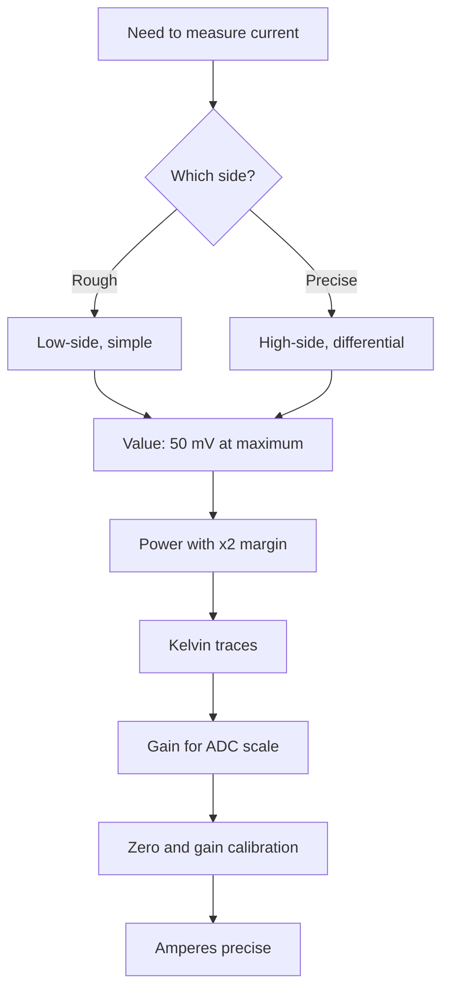

# Shunt and Op-Amp - Precise Current Measurement

![[assets/img/stm32-shunt-opamp-scheme.png|600]]
*Fig. Millivolts into amperes: shunt, gain, calibration.*

> [!tip] Purpose of this note
> Learn how to measure current precisely: pick a shunt, connect it in Kelvin style, amplify and calibrate.

## 1. Purpose

Ohm law turns current into voltage: a small resistor in a circuit break gives millivolts proportional to amperes. The internal op-amp lifts them to ADC level with no external chip. The price of precision is the right value, Kelvin traces and zero calibration.

## 2. High-Side Against Low-Side

| Circuit | Advantages | Drawbacks |
| --- | --- | --- |
| Low-side (in ground) | Simple, op-amp near zero | Ground broken, noise, not for precision |
| High-side (in plus) | Ground intact | Common-mode signal near supply! |
| Differential | Precise everywhere | Two sense wires, layout care |

```text
Rule:
  toys and rough jobs ... low-side;
  battery, motor, money ... high-side with differential input.
```

## 3. Shunt Math: Three Numbers

| Parameter | Formula | Example |
| --- | --- | --- |
| Value | Vmax / Imax | 50 mV / 10 A = 5 mOhm |
| Power | I squared x R with x2 margin! | 100 x 0.005 = 0.5 W, take 1 W |
| Accuracy | 1 percent minimum, 0.5 percent better | Cheap 5 percent lies with heat |

| Topic | Practice |
| --- | --- |
| Temperature coefficient | Manganin shunts drift less |
| Self-heating | Large current heats - correction or margin |
| Inductance | Non-inductive for PWM loops! |

## 4. Kelvin: Sense Apart From Power

| Rule | Explanation |
| --- | --- |
| Power traces | Thick, carry amperes |
| Sense traces | Thin, from shunt pads themselves, almost no current |
| Pick point | Inside the pads, not outside! |
| Sense pair | Close together, equal length |

```text
Beginner mistake:
  sense from power traces past the shunt;
  trace drops add to the shunt;
  measurement lies by percents and drifts with heat.
```

## Mermaid: Current Channel Design



## 5. Gain With Internal Op-Amp

| Topic | Practice |
| --- | --- |
| PGA mode | Programmable gain x2-x64 |
| Full scale | 50 mV x 64 is about 3.2 V - fits ADC! |
| Zero offset | Calibration at start mandatory |
| Bandwidth | Op-amp is not for megahertz - average PWM |

```c
// Ланцюжок виміру: ОУ шунта в АЦП з тригером:
OPAMP_PGA_Init(gain);              // підсилення під шкалу
ADC_Calibrate();                   // нуль при старті
TIM_Trigger_ADC();                 // вимір у тихий момент ШІМ!
```

## 6. PWM Sync: Measure in Silence

| Topic | Practice |
| --- | --- |
| Problem | Switches ring at commutation moment |
| Solution | ADC trigger in pulse middle |
| Averaging | 8-16 measurements per period |
| RC filter | Small one at input against ringing |

## 7. Calibration: Zero and Gain

| Step | Action |
| --- | --- |
| 1 | Zero current - record offset |
| 2 | Reference current - record gain |
| 3 | Store in node EEPROM |
| 4 | Check once a year |

## Common Issues

| # | Issue | Why bad | Fix |
| --- | --- | --- | --- |
| 1 | Sense from power traces | Trace drops in measurement | Kelvin from pads! |
| 2 | Shunt with no power margin | Overheat and drift | I squared R x2 minimum |
| 3 | Inductive shunt in PWM | Spikes on edges | Non-inductive! |
| 4 | No zero calibration | Offset at small currents | Zero on every start |
| 5 | Measurement at commutation moment | Ringing instead of current | Trigger in quiet moment |
| 6 | Low-side breaks ground | Noise everywhere | High-side for precise jobs |
| 7 | Cheap 5 percent shunt | Lies with heat | 1 percent or better |

## Input Protection: Overvoltage and ESD

| Threat | Protection |
| --- | --- |
| Surge on inductive switch-off | TVS on shunt line |
| Static during assembly | Series resistors + diodes to supply |
| Battery reverse polarity | Diode or reverse polarity switch |
| Sense trace break | Pull-up so input never floats |

## 10 A Channel Example: Assembly

| Element | Value |
| --- | --- |
| Shunt | 5 mOhm, 1 W, 1 percent, non-inductive |
| Signal | 50 mV at 10 A |
| PGA | x64 gives 3.2 V to ADC |
| Resolution | 10 A / 4096 is about 2.4 mA per least bit |

## Official Sources

- [AN4834 Current sensing (ST)](https://www.st.com/resource/en/application_note/an4834.pdf) - shunts, op-amps, sync.
- [INA18x datasheets (TI)](https://www.ti.com/lit/ds/symlink/ina180.pdf) - high-side practice (for external stages).

## See Also

- [[Home.en]]
- [[EN/06-Analog/03-COMP-OPAMP.en|comparators and op-amps]]
- [[EN/06-Analog/01-ADC.en|signal measurement]]
- [[10-Sensors/04-INA219-HX711|current and weight]]
- [[EN/01-Hardware/03-G0-G4.en|G4 analog]]
- [[16-Projects/03-Energomonitor|energy metering]]
