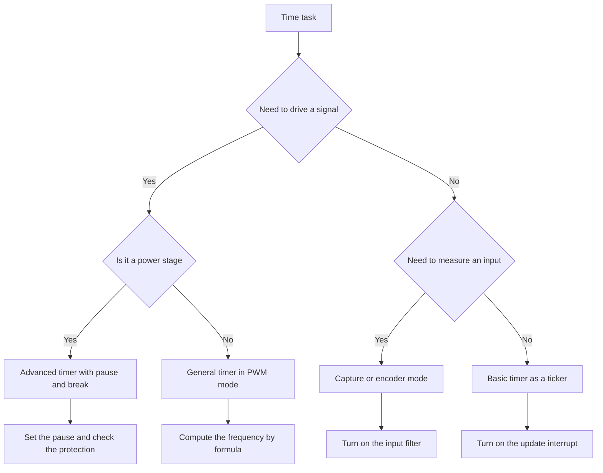

# STM32 Timers - PWM, Capture and Protection

![[assets/img/stm32-gptim-adtim-scheme.png|600]]
*Fig. Timer diagram: counter with prescaler, compare and capture channels, complementary outputs with a pause.*

> [!tip] Purpose of this note
> Give a working map of timers: which timer to pick, how to compute the frequency, how to get clean PWM, how to measure frequency, how to stop the bridge on a fault.

## 1. Purpose

A timer in STM32 is a hardware counter clocked from the bus that can count, compare, capture edge times and generate signals without the core. The basic scenario is a periodic interrupt, harder ones are PWM for a motor, pulse length measurement, encoder pulse counting, emergency shutdown of the power stage.

The main idea is simple: there is a bus clock, a prescaler that divides it, an auto-reload register that sets the period, and channels that compare the counter against a threshold. Changing three registers gives any frequency and any duty cycle. The core only sets the numbers, then hardware does the rest.

## 2. Timer types

| Type | Examples | Width | Channels | Used for |
| --- | --- | --- | --- | --- |
| Basic | TIM6, TIM7 | 16 bit | No pins | DAC clock, ADC trigger, time base |
| General | TIM2, TIM3, TIM4, TIM5 | 16 or 32 bit | Up to 4 channels | PWM, capture, encoder, pulse counter |
| Advanced | TIM1, TIM8, TIM20 | 16 bit | Up to 4 channels plus inverted | Motor control, dead time, break stop |
| Special | HRTIM on high-end parts | High resolution | Many outputs | Switching converters with exact phase shift |

Basic timers have no pins to the outside. They live inside the die and fit well as a system ticker or a trigger source. Do not hang PWM on them, because there is physically nowhere to bring the signal out.

General timers are the workhorses. TIM2 and TIM5 are 32 bit on many families, so they can count very long intervals without overflow. The rest are usually 16 bit. Four channels are enough for a three-phase bridge with a current sensor or for four servo drives.

Advanced timers add complementary outputs, programmable dead time and a break input. They are picked for inverters, converters and any power electronics where the price of a mistake is burnt transistors.

## 3. Prescaler and period

| Register | Full name | What it sets |
| --- | --- | --- |
| PSC | Prescaler | How many times to divide the bus clock |
| ARR | Auto-reload | Value after which the counter restarts from zero |
| CNT | Counter | Current value, runs on its own |
| CCR | Compare register | Channel trip threshold |

The overflow frequency follows one formula. The bus clock is divided by the product of the prescaler plus one and the period plus one. Plus one appears because the registers count from zero.

```text
Формула частоти таймера:
  Такт шини ................................. 84 МГц
  PSC ........................................ 83
  ARR ........................................ 999
  Частота оновлення = 84 МГц / ((83 + 1) x (999 + 1))
                     = 84 000 000 / (84 x 1000)
                     = 1000 Гц
  Пояснення:
    PSC ділить такт до 1 МГц тіку лічильника
    ARR задає 1000 тіків на період
    Разом маємо рівно 1 кГц
```

Practical rule: first pick a convenient counter tick via PSC, for example 1 MHz for microsecond accuracy, then set the needed period via ARR. This approach simplifies duty cycle and pulse length math.

| Target PWM frequency | Counter tick | ARR | Comment |
| --- | --- | --- | --- |
| 50 Hz for servos | 1 MHz | 19999 | 20 ms period, 1 us step |
| 1 kHz for a heater | 1 MHz | 999 | 1 ms period |
| 20 kHz for a motor | 1 MHz | 49 | 50 us period, above the audible range |
| 100 kHz for a converter | 10 MHz | 99 | Needs a fast bus clock |

## 4. PWM and duty cycle

PWM is a square wave of fixed frequency whose high-level time varies. The ratio of pulse time to period is called duty cycle. The compare register sets the switching point inside the period.

| Channel mode | Output behavior | Application |
| --- | --- | --- |
| Active high | High while the counter is below the threshold | LEDs, heaters, switches |
| Active low | Opposite | Inverted driver logic |
| Edge-aligned | Sawtooth up | Simple PWM, most tasks |
| Center-aligned | Triangle up and down | Quiet motor, less noise |

Duty cycle via the compare register is direct. Zero gives a constant low level, a value equal to the period gives almost one hundred percent, half the period gives a square wave. A change on the fly updates at the overflow moment, so the signal does not twitch.

## 5. Complementary outputs and dead time

A power leg of two transistors needs two antiphase signals with a pause between them. The pause lets the high-side switch close before the low-side opens. Without the pause there is shoot-through current and the switches heat up or burn out.

| Parameter | Where it is set | Typical value |
| --- | --- | --- |
| Dead time | Pause register of the advanced timer | From 100 ns to 2 us |
| Polarity | Channel polarity bits | Active high for both |
| Output enable | Main output switch | Turned on after setup |
| Fault source | Break input | External pin or comparator |

Dead time setup depends on switch speed. Slow field transistors with large gate charge need a longer pause. Fast switches with a driver allow a shorter pause and lower losses. Start with a microsecond and shrink it under an oscilloscope.

## 6. Input capture

Capture mode latches the counter value at the input edge moment. The difference of two captures gives the signal period, and the difference of rise and fall gives the pulse width. The core does not poll the pin, hardware puts the time stamp on its own.

| Measurement task | Channel setup | What we compute |
| --- | --- | --- |
| Signal frequency | One channel on rising edge, interrupt | Time stamp difference between edges |
| Pulse width | Two channels, rise and fall | Difference between rise and fall |
| Duty cycle | Channel pair with restart | Width to period ratio |
| Shaft speed | Encoder mode | Pulse count over time |

The input filter removes contact bounce and short spikes. The input prescaler lets you measure very fast signals by skipping every second or every fourth edge. Without a filter the measurement on long wires will jump.

## 7. Encoder mode

A quadrature encoder gives two sequences with a phase shift. A timer in encoder mode counts up or down depending on the edge order. No interrupt per pulse is needed, the counter tracks the shaft position on its own.

| Encoder signal | Where to feed | Setup |
| --- | --- | --- |
| Phase A | First channel | Input without inversion |
| Phase B | Second channel | Input without inversion |
| Zero mark | Separate input | Counter reset once per turn |

Resolution multiplies by four, because both edges of both phases are counted. A 500-line encoder gives 2000 counts per turn. Counter overflow must be handled in software by adding turns into an upper-bits variable.

## 8. Break input and link to the comparator

The break input moves the power outputs to a safe state at once with no program involved. The source can be an external pin or an internal signal from a comparator that watches the current. This is the most important link of the timer to the analog part for bridge protection.

| Fault source | Reaction | How to return |
| --- | --- | --- |
| External pin | Outputs go dark at once | Re-enable after analysis |
| Current comparator | Same, even faster | Check the threshold and the filter |
| Software request | Same, for test | Clear the flag and turn on again |

For thresholds and hysteresis see the note on [[EN/06-Analog/03-COMP-OPAMP.en|comparators and op-amps]]. A correct comparator threshold is the line between false trips and a burnt bridge. A filter on the break input removes short spikes from switch commutation.

## 9. One-pulse mode

One-pulse mode gives one pulse of set length in response to a trigger. Uses are ultrasonic range finders, thyristor firing, strobes, exact delays. The core sets the delay and the length, then hardware plays it back on its own with tick accuracy.

## 10. Links between timers

One timer can start another via internal triggers. The leader gives an update or compare signal, the follower starts, stops or resets. This builds cascades: one sets the burst rate, another shapes inside the burst.

| Link | Leader | Follower | Result |
| --- | --- | --- | --- |
| ADC start | Timer update | Analog converter | Measurement exactly at the needed PWM moment |
| Pulse burst | Slow timer | Fast timer | Pulse series with a pause |
| Phase shift | First channel | Second timer | Two signals with an exact delay |

For measurement at the needed moment see [[EN/06-Analog/01-ADC.en|measurement via ADC]]. Sync with the ADC lets you measure current in the middle of a pulse when transients have died out.

## 11. Bus clock doubling trap

If the bus prescaler differs from one, timers get a doubled clock. This is a classic trap: the configurator shows 84 MHz, but the timer ticks from 168 MHz. The frequency formula breaks exactly by half, the motor whistles at the wrong frequency.

```text
Карта тактування таймерів:
  SYSCLK .................... 168 МГц
  AHB без дільника ........... 168 МГц
  APB1 з дільником 4 ......... 42 МГц на шині
  TIM на APB1 ................ 84 МГц (подвоєння!)
  APB2 з дільником 2 ......... 84 МГц на шині
  TIM на APB2 ................ 168 МГц (подвоєння!)
  Висновок: дивись саме такт TIM, а не такт APB.
```

The check is simple: open the clock tree in the configurator and find the numbers for the timers. Or blink an LED with a one-second period and measure with a stopwatch. A twofold error is visible at once.

## 12. High-resolution timer for converters

For low-end families plain timers are enough. For resonant converters and exact power sources pick chips with a hardware high-resolution block. For that block see [[EN/01-Hardware/03-G0-G4.en|G4 analog and HRTIM]]. The rule is simple: if you need a step below a nanosecond or many phases with a shift, that block is it.

## 13. Code examples

```c
TIM_HandleTypeDef htim1;

void pwm_start_example(void)
{
    HAL_TIM_PWM_Start(&htim1, TIM_CHANNEL_1);
    HAL_TIMEx_PWMN_Start(&htim1, TIM_CHANNEL_1);
    __HAL_TIM_SET_COMPARE(&htim1, TIM_CHANNEL_1, 500);
}

void input_capture_example(void)
{
    HAL_TIM_IC_Start_IT(&htim1, TIM_CHANNEL_1);
    HAL_TIM_IC_Start_IT(&htim1, TIM_CHANNEL_2);
}

void encoder_start_example(void)
{
    HAL_TIM_Encoder_Start(&htim3, TIM_CHANNEL_ALL);
}

void break_config_example(void)
{
    TIM_BreakDeadTimeConfigTypeDef cfg = {0};
    cfg.DeadTime = 100;
    cfg.BreakState = TIM_BREAK_ENABLE;
    cfg.BreakPolarity = TIM_BREAKPOLARITY_HIGH;
    cfg.AutomaticOutput = TIM_AUTOMATICOUTPUT_ENABLE;
    HAL_TIMEx_ConfigBreakDeadTime(&htim1, &cfg);
    __HAL_TIM_MOE_ENABLE(&htim1);
}
```

The lower level gives full control with no extra cost. Register calls are handy in interrupts where every tick counts. For level choice see [[EN/09-Firmware/02-HAL-LL.en|HAL and LL layers]].

```c
void ll_pwm_example(void)
{
    LL_TIM_EnableCounter(TIM2);
    LL_TIM_CC_EnableChannel(TIM2, LL_TIM_CHANNEL_CH1);
    LL_TIM_OC_SetCompareCH1(TIM2, 250);
    LL_TIM_EnableIT_CC1(TIM2);
}

void ll_capture_irq(void)
{
    if (LL_TIM_IsActiveFlag_CC1(TIM2))
    {
        LL_TIM_ClearFlag_CC1(TIM2);
    }
}
```

Pin setup for channels goes via alternate functions. For the mapping table see [[EN/03-GPIO/02-AF-maping.en|alternate function mapping]]. Without the correct function number the pin stays silent.

## 14. Mode selection chart



## 15. Step-by-step checkout

```text
Перший запуск ШІМ:
  1. Вистав такт шини і запиши число TIM.
  2. Порахуй PSC і ARR під потрібну частоту.
  3. Вибери канал і номер функції на піні.
  4. Запусти з малою шпаруватістю і глянь осцилографом.
  5. Додай інверсний вихід і мертвий час.
  6. Подай тестовий стоп і перевір гасіння.
  7. Підключи компаратор струму до входу зупину.
```

## Common issues

| # | Issue | Why it is bad | Correct way |
| --- | --- | --- | --- |
| 1 | Frequency off by half from doubling | Divided bus gives timers a double clock | Look at the TIM clock itself in the clock tree |
| 2 | PWM start without output enable | Advanced timer stays silent without the main switch | Turn on the main output after setup |
| 3 | Zero dead time on a bridge | Shoot-through current heats the switches | Start from 1 us and shrink by oscilloscope |
| 4 | Capture without a filter on long wires | Random trips and jumping measurement | Turn on the digital input filter |
| 5 | Period change without buffering | Signal twitch in the middle of a period | Enable shadow registers and update on overflow |
| 6 | Pin without an alternate function | Silence on the pin with a live timer | Set the function number from the mapping table |

## Official sources

- [TIM cookbook AN4013 ST](https://www.st.com/resource/en/application_note/an4013-stm32-crossseries-timer-overview--stmicroelectronics.pdf) - timer overview across series with examples.
- [General purpose timer cookbook AN4776 ST](https://www.st.com/resource/en/application_note/an4776-generalpurpose-timer-cookbook-for-stm32-microcontrollers--stmicroelectronics.pdf) - PWM, capture and encoder modes.
- [Advanced motor control timers ST](https://www.st.com/en/microcontrollers-microprocessors/stm32-32-bit-arm-cortex-mcus.html) - chip choice with advanced timers.

## See also

- [[Home.en]]
- [[EN/07-Timers/02-LPTIM-RTC-WDT.en|time and watchdog timers]]
- [[EN/07-Timers/03-Sleep-Stop-Standby.en|sleep modes]]
- [[EN/03-GPIO/02-AF-maping.en|alternate function mapping]]
- [[EN/06-Analog/03-COMP-OPAMP.en|comparators and op-amps]]
- [[EN/06-Analog/01-ADC.en|measurement via ADC]]
- [[EN/09-Firmware/02-HAL-LL.en|HAL and LL layers]]
- [[EN/01-Hardware/03-G0-G4.en|G4 analog and HRTIM]]
- [[EN/09-Firmware/01-CubeIDE-CubeMX.en|CubeMX setup]]
