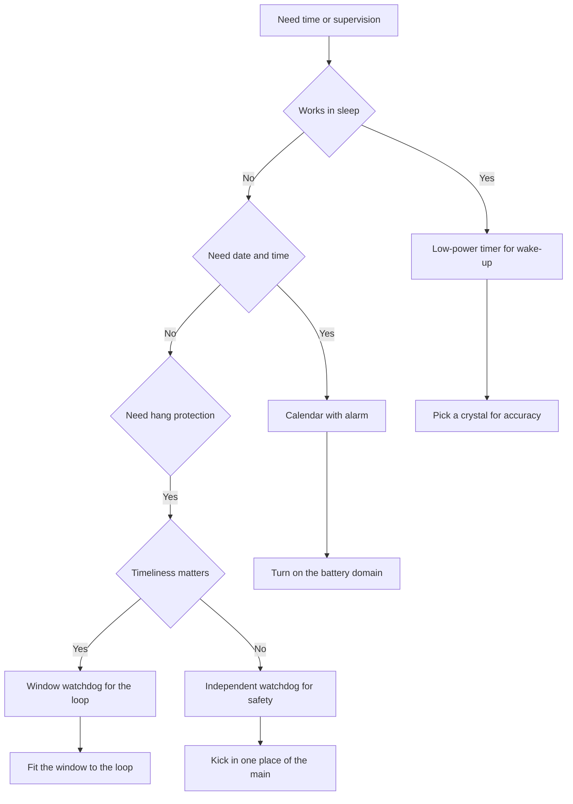

# LPTIM, RTC and WDT - Time and Supervision

![[assets/img/stm32-lptim-rtc-wdt-scheme.png|600]]
*Fig. Time supervision diagram: low-power timer, calendar with alarms, two watchdog timers.*

> [!tip] Purpose of this note
> Explain three independent things: who wakes the die from sleep, who keeps the calendar, who restarts the board on a hang.

## 1. Purpose

Plain timers stop in deep sleep together with the main clocking. So battery tasks get a separate trio. A low-power timer ticks from a slow oscillator and can wake the core on schedule. The real-time clock keeps date and time for years from a cell. Watchdog timers restart the board if the program stops kicking them.

The split logic is simple: the low-power timer is an alarm for periodic measurements, the calendar keeps event time and stamps for the log, the watchdogs insure against hangs. All three work apart from the main code and survive where a plain timer already sleeps.

## 2. Trio overview

| Block | Clocking | Runs in sleep | Task |
| --- | --- | --- | --- |
| LPTIM | Slow oscillators or external input | Yes | Periodic wake-up, pulse counter |
| RTC | Slow oscillator, battery domain | Yes | Date, time, alarms, event stamps |
| IWDG | Own slow oscillator | Yes | Restart on a hang anywhere |
| WWDG | Core bus | No, only in run | Timeliness control in a window |

A chip can hold several low-power timers. One is set for wake-up, another counts flow-meter pulses in sleep. The calendar is one, but with two alarms and time stamps. There are two watchdogs with different philosophies, they can be turned on together.

## 3. Low-power timer in sleep

| Clock source | Accuracy | When to take |
| --- | --- | --- |
| External 32 kHz crystal | High, seconds per day | Exact measurement schedule |
| Internal slow oscillator | Low, drifts with temperature | Rough interval with no crystal |
| External input | Depends on the sensor | Pulse counter with no core |

The main advantage is work in core-stop mode when fast oscillators are already off. The timer keeps counting from a slow source and gives a wake-up interrupt. The core wakes, measures, sleeps again. Average current drops to microamps.

| LPTIM mode | What it does | Example |
| --- | --- | --- |
| One-shot | Counts once and stops | Wake up in 10 seconds |
| Periodic | Restarts on its own | Sensor poll every second |
| Counter | Counts external edges | Water meter in sleep |
| PWM | Gives a slow signal | Beacon blink with no core |

## 4. Calendar and alarms

The calendar keeps seconds, minutes, hours, day, month and year with leap years. Two alarms can wake at a set time or by mask, for example every minute or daily at six. The time stamp latches the moment of an external event with sub-second accuracy.

| Feature | Setup | Why |
| --- | --- | --- |
| Current time | Date and time in binary-decimal format | Event log with real stamps |
| Alarm A | Time plus day mask | Daily node wake-up |
| Alarm B | Another time | Backup schedule or test |
| Event stamp | Edge on a special input | Latch the case-open moment |
| Tamper | Input integrity control | Erase keys on intrusion |

```text
Структура календаря:
  Час ....................... 12:34:56
  Дата ...................... 01.10.2026, четвер
  Будильник А ............... щодня о 06:00, будить зі сну
  Будильник Б ............... щогодини, короткий вимір
  Мітка часу ................ фронт на вході, зберігається окремо
  Захист .................... втручання стирає резервні регістри
```

## 5. Crystal against the internal oscillator

| Source | Frequency | Accuracy | Consumption | Comment |
| --- | --- | --- | --- | --- |
| External crystal | 32.768 kHz | About 20 parts per million | Microwatts | Stable schedule for years |
| Internal oscillator | About 32 kHz | Drifts by percent | Even less | Fits only rough intervals |
| Backup input | Depends on the board | Depends | Zero | Outside signal as a reference |

The 32.768 kHz crystal is binary convenience: division by two to the fifteenth power gives exactly one second. So a calendar with a crystal runs true, while with the internal oscillator it can run off by minutes per day. For a billing counter or timekeeping this is not acceptable.

Calendar calibration trims the rate by adding or removing fractions of a second. On the board the real crystal frequency is measured with a counter and the correction is written to the smoothing register. After that the daily error drops to seconds. Temperature drift stays, but for home tasks it is fine.

| Calibration step | Action |
| --- | --- |
| 1 | Bring the calibration signal out to a pin |
| 2 | Measure the frequency with an exact meter |
| 3 | Compute the deviation from nominal |
| 4 | Write the correction to the register |
| 5 | Check the rate over a day |

## 6. Independent watchdog

The independent watchdog is fed from its own oscillator and does not depend on core buses. If the program stops refreshing the counter, the watchdog restarts the die. This is the last line of defense against hangs in an endless loop or a wrong interrupt.

| Parameter | Value | Explanation |
| --- | --- | --- |
| Clock | Own slow oscillator | Works even if the main clock fails |
| Period | From milliseconds to tens of seconds | Set by prescaler and threshold |
| Refresh | Key sequence write | Kicking in time means live code |
| Start | Software or hardware from options | Hardware starts on its own after reset |

The refresh rule is simple: kick the watchdog in one place of the main loop, not in every interrupt. Then a hang of any branch leads to a restart. Kicking from a timer interrupt masks a main-loop hang, because the interrupt can live while the main is already stuck.

## 7. Window watchdog

The window watchdog watches not only the refresh fact but the timeliness. Early is bad too, like late. A kick too early, while the previous frame is not yet handled, gives a reset. This catches code spinning in a wrong short loop instead of full work.

| Difference | Independent | Window |
| --- | --- | --- |
| Clock | Own oscillator | Core bus |
| Window | None, only an upper bound | Has a lower and an upper bound |
| Early refresh | Allowed | Causes a reset |
| Application | Hangs anywhere | Supercycle period control |

Typical setup: supercycle period 100 ms, the window allows kicks from 50 to 90 ms. The kick goes at the cycle end after all tasks. If a task is late, there is a late refresh and a reset. If the code breaks into a short loop, there is an early refresh and a reset too.

```text
Вікно оновлення:
  Старт циклу ............... 0 мс
  Заборонена зона ............ 0 - 50 мс, гладити рано не можна
  Дозволена зона ............. 50 - 90 мс, гладити тут
  Крайня межа ................ 100 мс, далі скидання
  Висновок: погладив у кінці роботи, отже встиг.
```

## 8. Stopping watchdogs for debug

At a halt breakpoint the core stands while watchdogs keep ticking. Without special setup the board keeps restarting under debug and never lets you walk the code. The way out is a freeze bit in the debug block.

| Debug block | What it freezes | Where it turns on |
| --- | --- | --- |
| Core on pause | Core halt | Breakpoint in the environment |
| Independent watchdog | Watchdog count | Halt bit in the freeze register |
| Window watchdog | Watchdog count | Separate bit of the same register |
| Low-power timers | Time count | Halt bits for each |

In the configurator these are debug-halt flags. For the environment see [[EN/09-Firmware/01-CubeIDE-CubeMX.en|CubeMX setup]]. In shipping firmware the freeze stays, it does no harm, and the developer rests. Only check that the watchdogs really work with no debugger attached.

## 9. Backup domain and the cell

The calendar, part of the settings and backup registers live in a separate domain with own power. When main power is gone, the domain moves to the cell and keeps the time. Backup registers hold counters and keys.

| Domain part | Power | What it keeps |
| --- | --- | --- |
| Calendar | Main or cell | Time runs with no break |
| Backup registers | Same | Counters, flags, keys |
| Source setting | Same | Crystal or oscillator choice |
| Write protection | Always | Blocks accidental time change |

The cell is usually a three-volt lithium element or a supercapacitor. Domain current is single microamps, so the element lasts years. On a board with no cell the time resets on every power-off, fine for tests but not for metering.

## 10. Code examples

```c
LPTIM_HandleTypeDef hlptim1;
RTC_HandleTypeDef hrtc;
IWDG_HandleTypeDef hiwdg;
WWDG_HandleTypeDef hwwdg;

void lptim_wakeup_example(void)
{
    HAL_LPTIM_TimeOut_Start_IT(&hlptim1, 32768, 32768);
}

void rtc_alarm_example(void)
{
    RTC_AlarmTypeDef alarm = {0};
    alarm.AlarmTime.Hours = 6;
    alarm.AlarmTime.Minutes = 0;
    alarm.Alarm = RTC_ALARM_A;
    HAL_RTC_SetAlarm_IT(&hrtc, &alarm, RTC_FORMAT_BIN);
}

void iwdg_example(void)
{
    HAL_IWDG_Init(&hiwdg);
    HAL_IWDG_Refresh(&hiwdg);
}

void wwdg_example(void)
{
    HAL_WWDG_Init(&hwwdg);
    HAL_WWDG_Refresh(&hwwdg);
}

void backup_example(void)
{
    HAL_PWR_EnableBkUpAccess();
    HAL_RTCEx_BKUPWrite(&hrtc, RTC_BKP_DR1, 0xCAFE);
}
```

The lower level gives shorter calls for wake-up. For layers see [[EN/09-Firmware/02-HAL-LL.en|HAL and LL layers]].

```c
void ll_lptim_example(void)
{
    LL_LPTIM_Enable(LPTIM1);
    LL_LPTIM_StartCounter(LPTIM1, LL_LPTIM_OPERATING_MODE_ONESHOT);
}

void ll_rtc_example(void)
{
    LL_RTC_EnableIT_ALRA(RTC);
}
```

## 11. Supervision selection chart



## 12. Step-by-step checkout

```text
Перший запуск трійці:
  1. Запусти календар від внутрішнього генератора і виведи час у порт.
  2. Постав будильник на хвилину вперед і дочекайся переривання.
  3. Перемкни на кварц і поміряй точність за годину.
  4. Налаштуй малопотужний таймер на 10 секунд і зайди у сон.
  5. Увімкни незалежного сторожа і навмисно прибери оновлення.
  6. Перевір перезапуск і причину скидання у регістрі.
  7. Додай віконний сторож і перевір раннє оновлення.
  8. Увімкни заморожування при налагодженні.
```

## Common issues

| # | Issue | Why it is bad | Correct way |
| --- | --- | --- | --- |
| 1 | Calendar with no cell in metering | Time resets on power-off | Fit a power element and check the domain |
| 2 | Internal oscillator for exact metering | Error of minutes per day | Crystal only plus calibration |
| 3 | Kicking the watchdog from an interrupt | Masks a main-loop hang | Kick in one place of the main loop |
| 4 | No freeze under debug | Board restarts at a breakpoint | Turn on halt bits in the debug block |
| 5 | Window watchdog with no window | Early refreshes are not caught | Compute the window for the real loop |
| 6 | Backup domain protection not lifted | Time write silently ignored | Allow access before setup |

## Official sources

- [RTC cookbook AN4759 ST](https://www.st.com/resource/en/application_note/an4759-using-the-hardware-realtime-clock-rtc-and-the-tamper-management-unit-tamp-with-stm32-microcontrollers--stmicroelectronics.pdf) - calendar, alarms and protection.
- [IWDG and WWDG ST](https://www.st.com/en/microcontrollers-microprocessors/stm32-32-bit-arm-cortex-mcus.html) - watchdog choice for the task.
- [LPTIM cookbook AN4861 ST](https://www.st.com/resource/en/application_note/an4861-introduction-to-the-lowpower-timer-lptim--stmicroelectronics.pdf) - low-power timers and sleep.

## See also

- [[Home.en]]
- [[EN/07-Timers/01-GPTIM-ADTIM.en|timers and PWM]]
- [[EN/07-Timers/03-Sleep-Stop-Standby.en|sleep modes]]
- [[EN/09-Firmware/01-CubeIDE-CubeMX.en|CubeMX setup]]
- [[EN/09-Firmware/02-HAL-LL.en|HAL and LL layers]]
- [[EN/03-GPIO/03-EXTI-NVIC.en|EXTI interrupts]]
