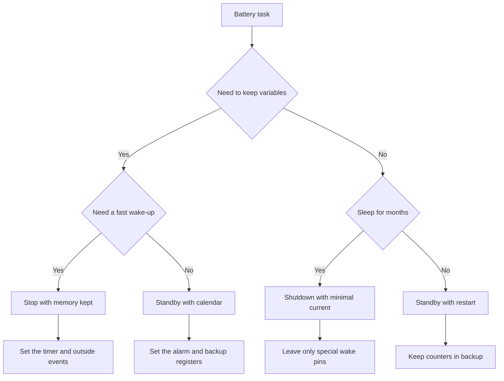

# STM32 Sleep Modes - Stop, Standby and Currents

![[assets/img/stm32-sleep-modes-scheme.png|600]]
*Fig. Sleep diagram: core halted, part of memory alive, an outside event or the calendar wakes.*

> [!tip] Purpose of this note
> Teach how to pick the deepest sleep you can, compute the average current and measure real consumption instead of trusting the datasheet alone.

## 1. Purpose

A battery node sleeps almost all the time and wakes for milliseconds to measure and transmit. The gap between active milliamps and sleepy microamps gives years of work from a cell. Sleep modes differ in what stays alive: core, memory, oscillators, peripherals.

The deepest-mode rule is simple: take the most saving mode that can still wake in time and keep the needed data. If you need fast wake-up and saved variables, that is stop. If a restart once per hour is fine, that is standby with the calendar. If the node sleeps for months, that is shutdown with minimal current.

## 2. Mode table

| Mode | Core | Memory | Oscillators | Typical current | Wake-up |
| --- | --- | --- | --- | --- | --- |
| Sleep | Stands, peripherals alive | Saved | All alive | Milliamps | Any interrupt |
| Stop0 | Stands | Saved | Fast ones off | Tens of microamps | Outside signal, calendar, small timer |
| Stop1 | Stands | Saved | Even less alive | Single microamps | Same, a bit longer start |
| Stop2 | Stands | Saved, part off | Minimum | Fractions of a microamp | Limited source set |
| Standby | Off | Lost except backup | Slow ones only | Hundreds of nanoamps | Reset, calendar, outside pins |
| Shutdown | Off | Lost | Almost nothing | Tens of nanoamps | Only special pins |

Exact numbers depend on the family, voltage and temperature. The table gives orders of size for orientation. For the datasheet see the consumption chapter of your chip at your voltage. At plus eighty degrees leakage currents grow severalfold.

| Criterion | Sleep | Stop | Standby |
| --- | --- | --- | --- |
| Variable keep | Yes | Yes | No, only backup registers |
| Start speed | Instant | Microseconds | Like after a reset |
| Peripherals alive | Yes | Partly | No |
| Debug | Simple | Needs care | Hard, start from zero |

## 3. Deepest-mode rule

| Scenario | Mode | Why |
| --- | --- | --- |
| Button poll with instant reaction | Sleep | Reaction in ticks, current below active |
| Sensor measurement every second | Stop with a small timer | Variables alive, fast start |
| Transmission once per hour | Stop or Standby with calendar | Long sleep, calendar wakes |
| Beacon once per day | Standby | Minimal current, start from zero is fine |
| Season storage | Shutdown | Near zero, only a special pin wakes |

The beginner mistake is sitting in Sleep for years and wondering at a dead battery. Sleep saves only the core halt, while all peripherals and oscillators eat as before. For a battery node Stop must become the base, and Sleep only a pause between exchange bursts.

## 4. Wake-up sources

| Source | Wakes from which mode | Setup |
| --- | --- | --- |
| Outside pin | All but the deepest | Edge via the interrupt controller |
| Calendar with alarm | Stop and Standby | Time and mask, battery domain |
| Low-power timer | Stop | Period from a slow oscillator |
| Comparator | Stop | Event threshold with no core |
| Data on the bus | Sleep and partly Stop | Address match with no core |

For outside interrupts see [[EN/03-GPIO/03-EXTI-NVIC.en|EXTI interrupts]]. For the calendar and the small timer see [[EN/07-Timers/02-LPTIM-RTC-WDT.en|time and watchdog timers]]. The link is simple: by day we sleep in Stop, the calendar and the timer wake on schedule, the outside pin wakes on event.

```text
Карта пробудження:
  Сплячий вузол .................. Stop2, струм частки мікроампера
  Щосекунди ....................... малий таймер будить, вимір, назад у сон
  Щогодини ........................ календар будить, передача, назад у сон
  Тривога ......................... зовнішній пін будить одразу
  Розряд .......................... компаратор будить при просіданні живлення
```

## 5. Average current and the battery

Average current is a weighed sum: active current times the activity share plus sleep current times the sleep share. The battery lasts capacity divided by average current, corrected for self-discharge and temperature.

```text
Формула середнього струму:
  Активний струм ................ 20 мА
  Тривалість активності .......... 10 мс
  Період ......................... 10 с
  Сонний струм ................... 2 мкА
  Середній = (20 мА x 0.01 с + 0.002 мА x 9.99 с) / 10 с
            = (0.2 + 0.01998) / 10
            = 0.022 мА = 22 мкА
  Батарея 1000 мАг / 0.022 мА = 45454 годин = 5.2 року
  Мінус саморозряд і холод, реально близько 3 років.
```

| Example parameter | Value |
| --- | --- |
| Active current with radio | 20 mA for 10 ms |
| Sensor measurement | 3 mA for 2 ms |
| Sleep in Stop2 | 1.5 uA the rest of the time |
| Loop period | 60 seconds |
| Cell capacity | 2400 mAh |
| Life estimate | Over 7 years by formula, 4-5 in reality |

Tips for an honest math: measure real currents, not ad numbers. Add cell self-discharge of about two percent per year. In the cold capacity halves. Radio peak currents sag the voltage, a support capacitor is needed.

## 6. Why the debugger keeps you awake

An attached debugger holds debug-port power and blocks oscillator shutdown. The die looks asleep, but the current is milliamps. This is normal behavior in development, not a chip defect.

| Symptom | Cause | Action |
| --- | --- | --- |
| Milliamps in sleep | Live debug port | Drop the debugger and measure again |
| No entry to deep sleep | Sleep-deny bits | Check peripheral-keep registers |
| Wakes at once | Hanging flag | Clear flags before entry to sleep |
| No start after sleep | Oscillator not set | Pick the start source after wake-up |

Measure rule: flash the measure firmware with no debugger, power via an ammeter, a reset button for start. The configurator has a sleep-behavior option, for details see [[EN/09-Firmware/01-CubeIDE-CubeMX.en|CubeMX setup]]. A field measurement is always with no debug cable.

## 7. Measuring real sleep with an ammeter

| Step | Action | Why |
| --- | --- | --- |
| 1 | Find the current-measure jumper on the board | Power break for the meter |
| 2 | Drop the jumper and turn on the milliameter | See the active current |
| 3 | Start the sleep-wake loop | Check the logic |
| 4 | Switch the meter to microamps | See the sleep current |
| 5 | Drop the debugger and the LEDs | Remove extra consumption |
| 6 | Write three numbers: active, sleep, average | Feed the battery formula |

On dev boards there is a measure jumper next to the indication. Drop the cap, connect the meter, see the real core current with no extra eaters. Power LEDs eat more than a sleeping die, drop them or count them apart.

```text
Порядок виміру на платі:
  Живлення плати ................. USB або зовнішні 5 В
  Перемичка струму ................ зняти, туди щупи приладу
  Межа приладу .................... спочатку мА, потім мкА
  Прошивка ........................ блим раз на 5 с, решта сон
  Очікувано ....................... пік 20 мА, сон 2 мкА
  Якщо сон 2 мА ................... винен налагоджувач або світлодіод
```

## 8. Core-free collection

New families bring autonomous collection: peripherals gather measurements to memory on their own, the core sleeps. The analog converter on a small-timer trigger stacks samples via direct access, the core wakes only to take the ready packet. For triggers see [[EN/06-Analog/01-ADC.en|measurement via ADC]].

| Stage | Who works | Core |
| --- | --- | --- |
| Trigger | Small timer | Sleeps |
| Measurement | Converter | Sleeps |
| Move | Direct access | Sleeps |
| Packet ready | Interrupt | Wakes |

For timer notes one thing matters: the small timer becomes the heart of such collection, because it lives in sleep. A plain timer does not fit, it stops with the fast oscillators.

## 9. Code examples

```c
void sleep_example(void)
{
    HAL_SuspendTick();
    HAL_PWR_EnterSLEEPMode(PWR_MAINREGULATOR_ON, PWR_SLEEPENTRY_WFI);
    HAL_ResumeTick();
}

void stop_example(void)
{
    HAL_SuspendTick();
    HAL_PWR_EnterSTOPMode(PWR_LOWPOWERREGULATOR_ON, PWR_STOPENTRY_WFI);
    SystemClock_Config();
    HAL_ResumeTick();
}

void standby_example(void)
{
    HAL_PWR_EnableWakeUpPin(PWR_WAKEUP_PIN1);
    HAL_PWR_EnterSTANDBYMode();
}

void stop2_example(void)
{
    HAL_PWREx_EnterSTOP2Mode(PWR_STOPENTRY_WFI);
    SystemClock_Config();
}
```

Before sleep entry kill the extras: turn LEDs off, move pins to a safe state, clear flags. For pin setup see [[EN/03-GPIO/02-AF-maping.en|alternate function mapping]]. After a Stop wake-up the fast oscillators must be set again, because they were off.

```c
void prepare_sleep_example(void)
{
    __HAL_PWR_CLEAR_FLAG(PWR_FLAG_WU);
    HAL_RTCEx_DeactivateWakeUpTimer(&hrtc);
    HAL_RTCEx_SetWakeUpTimer_IT(&hrtc, 10, RTC_WAKEUPCLOCK_CK_SPRE_16BITS);
    HAL_PWR_EnterSTOPMode(PWR_LOWPOWERREGULATOR_ON, PWR_STOPENTRY_WFI);
}
```

## 10. Sleep selection chart



## 11. Step-by-step checkout

```text
Перший батарейний цикл:
  1. Блимай у активі і міряй 20 мА.
  2. Зайди у сон на 5 секунд і міряй мікроампери.
  3. Додай пробудження від малого таймера.
  4. Додай пробудження від календаря.
  5. Додай кнопку як зовнішнє пробудження.
  6. Відключи налагоджувач і переміряй сон.
  7. Порахуй середній струм і життя батареї.
  8. Залиш на ніч і звір прогноз з фактом.
```

## Common issues

| # | Issue | Why it is bad | Correct way |
| --- | --- | --- | --- |
| 1 | Sleep measure with the debugger on | Milliamps instead of microamps | Measure with no debug cable |
| 2 | LEDs and pull-ups on the board | Eat more than a sleeping die | Remove or count apart |
| 3 | Wake flags not cleared | Instant false wake-up | Clear all flags before entry |
| 4 | Clocking not restored after Stop | Core runs on a slow oscillator | Call clock setup after exit |
| 5 | Data in plain memory before Standby | Data is lost | Keep critical data in backup registers |
| 6 | Polling instead of wake-up | Core never sleeps, battery dies | Sleep in Stop, wake by timer and events |

## Official sources

- [Low power modes AN4621 ST](https://www.st.com/resource/en/application_note/an4621-stm32l0-and-stm32l4-power-modes--stmicroelectronics.pdf) - sleep modes and currents.
- [Getting started with low power ST](https://www.st.com/en/microcontrollers-microprocessors/stm32-ultra-low-power-mcus.html) - family choice for a battery node.

## See also

- [[Home.en]]
- [[EN/07-Timers/01-GPTIM-ADTIM.en|timers and PWM]]
- [[EN/07-Timers/02-LPTIM-RTC-WDT.en|time and watchdog timers]]
- [[EN/03-GPIO/03-EXTI-NVIC.en|EXTI interrupts]]
- [[EN/09-Firmware/01-CubeIDE-CubeMX.en|CubeMX setup]]
- [[EN/06-Analog/01-ADC.en|measurement via ADC]]
