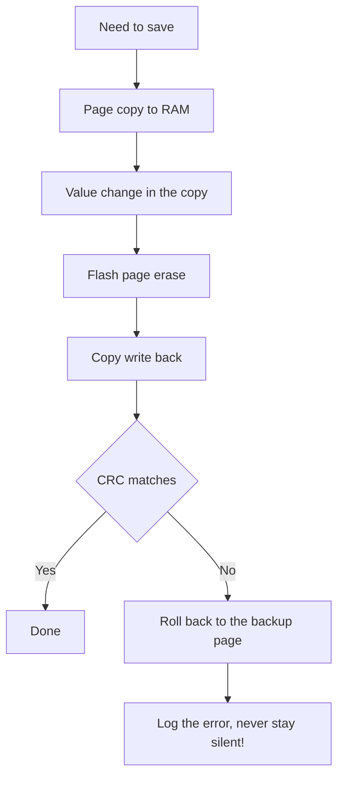

# Flash and OTP - Pages, Wear and EEPROM Emulation

![[assets/img/stm32-flash-otp-scheme.png|600]]
*Fig. Flash rules: erase by pages, write by words, OTP is once and forever.*

> [!tip] Purpose of this note
> Teach how to keep settings and counters in internal memory so it lasts years.

## 1. Purpose

Internal Flash holds code and can hold data: calibration, counters, settings. But Flash erases in whole pages and wears out after thousands of cycles. Understanding pages, leveling and the OTP zone tells a solid product from a brick in a year.

## Flash organization

| Parameter | Value | Practice |
| --- | --- | --- |
| Erase | Only by pages or sectors | A byte cannot be erased! |
| Write | Bits only from 1 to 0 | Erase the page before a write |
| Page size | 1-2 KB (F0/F1/G0) to 128 KB (H7) | Per your chip datasheet! |
| Wear | About 10 thousand cycles | A per-second counter kills a page |
| Dual bank (H7/G4) | Two banks for seamless update | Write one, run from the other |

```text
Цикл запису параметра:
  прочитай сторінку в RAM -> зміни значення -> зітри сторінку -> запиши назад.
  Живлення пропало посередині — сторінка бита. Тому подвійний буфер!
```

## Where to keep data

| Option | When |
| --- | --- |
| Last Flash page | Rare settings, version, calibration |
| Two pages in turn | Frequent writes: one active, one prepared |
| Backup registers | Bytes that live from VBAT |
| External EEPROM | Very frequent writes and hot swap |

## Mermaid: safe parameter write



## OTP zone: once and forever

| Topic | Practice |
| --- | --- |
| Purpose | Serials, keys, factory calibration |
| Property | A written bit never comes back! |
| Strategy | Write only verified data, read twice before a write |
| Protection | RDP closes reads together with Flash |

## EEPROM emulation from ST

| Part | Role |
| --- | --- |
| Two pages | Active and receiving, swap places |
| Wear-leveling | Writes spread out, wear divides |
| Virtual addresses | Your variables, the library maps on its own |
| Page full | Cleanup and move when full |

```c
// Логіка використання емуляції:
EE_Init();                          // старт, пошук активної сторінки
EE_WriteVariable(VIRT_ADDR, value); // запис змінної
EE_ReadVariable(VIRT_ADDR, &value); // читання змінної
```

## Wear: count before you buy

| Scenario | Math |
| --- | --- |
| Settings once per day | 10 thousand cycles is tens of years |
| Per-second counter | The page dies in hours! |
| Counter in RAM plus hourly write | Years with no trouble |

```text
Правило:
  часте — у RAM, рідкісне — у Flash;
  між ними — бекап при просіданні живлення (PVD!).
```

## Common issues

| # | Issue | Why it is bad | Correct way |
| --- | --- | --- | --- |
| 1 | Write with no erase | Old zeros never turn ones | Erase before a write |
| 2 | Per-second counter in Flash | Wear in days | RAM plus rare backup |
| 3 | One page with no backup | Power fault loses all | Two pages with CRC |
| 4 | OTP written during debug | Irreversible damage | OTP only in the final! |
| 5 | Erasing code instead of data | Brick | Check page addresses with the linker! |
| 6 | Interrupts during a write | Flash timings are strict | Write with interrupts off or from RAM |
| 7 | No CRC check | A broken page reads silently | CRC after every write |

## Memory map and linker: whose data is where

| Area | What lies there |
| --- | --- |
| Flash start | Vector table, then code |
| Flash end | Your data pages - addresses in the linker file! |
| RAM | Stack, heap, DMA buffers |
| CCM-RAM | Hot ISR code and data |
| Backup domain | Counters and flags that live from VBAT |

> Reserve data pages in the linker file, or the linker will put code there.

## Official sources

- [AN4894 EEPROM emulation (ST)](https://www.st.com/resource/en/application_note/an4894.pdf) - two pages, wear-leveling.
- [PM0223 Flash programming manual (ST)](https://www.st.com/resource/en/programming_manual/pm0223.pdf) - Flash operations.

## Read-while-write and dual bank

| Topic | Practice |
| --- | --- |
| Single-bank chips | During erase code stands - interrupts stay silent! |
| Code from RAM | Copy critical functions to RAM for the write time |
| Dual bank | Write the inactive one, flip with a bit |
| Swap with no brick | Flip only after CRC of the new bank |

```text
Безшовне оновлення на двобанковому:
  працюєш з банку 1 -> пишеш новий код у банк 2;
  перевіряєш CRC банку 2 -> перемикаєш біт SWAP;
  ресет — старт вже з нового банку.
```

## Wear test: how to check the margin

| Step | Action |
| --- | --- |
| 1 | Cycle counter in a separate variable |
| 2 | Fast run on the bench |
| 3 | CRC check after every thousand |
| 4 | Years-of-work extrapolation |

```text
Прискорений тест:
  писати в циклі без пауз добу;
  рахувати цикли і помилки CRC;
  поділити паспортний знос на виміряний темп.
```

## Data protection during firmware update

| Topic | Practice |
| --- | --- |
| Data apart from code | Firmware never touches data pages! |
| Structure version | Migrate on mismatch |
| Backup before erase | RAM copy on mass erase |

## See also

- [[Home.en]]
- [[EN/02-Power-Supply/01-Lancjugi-zhivlennya.en|power supply rails]]
- [[15-Protocols/02-DFU-Bootloader|firmware update]]
- [[15-Protocols/03-Bezpeka|product protection]]
- [[EN/08-Memory/02-Zovnishni-Loadery.en|external loaders]]
- [[EN/08-Memory/03-Filesystem-LittleFS.en|filesystems]]
