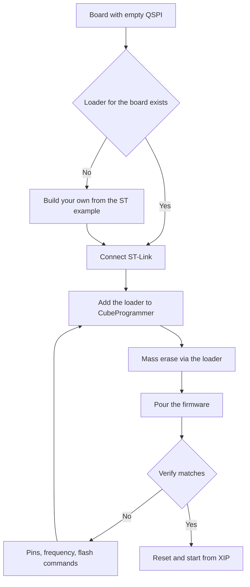

# External Loaders - QSPI Flashing via CubeProgrammer

![[assets/img/stm32-ext-loader-scheme.png|600]]
*Fig. Loader middleman: inits QSPI, pours data, verifies.*

> [!tip] Purpose of this note
> Teach how to flash outer flash: what a loader is, where to take a ready one and how to write your own.

## 1. Purpose

CubeProgrammer out of the box knows only internal Flash. Outer QSPI is a dark forest to it until you hand it a loader: a small program that can init your QSPI and write your flash chip. Without a loader, boards with XIP and outside resources do not flash at all.

## What the loader does

| Function | Why |
| --- | --- |
| Init | Sets QSPI and the flash chip itself |
| Write | Writes data pages |
| Read | Reads back for verify |
| Erase | Erases sectors before a write |
| MassErase | Cleans all for the first flashing |

```text
Ланцюжок прошивки плати з QSPI:
  CubeProgrammer -> заливає лоадер в RAM -> лоадер init QSPI;
  дані течуть через лоадер у флеш -> verify читанням назад.
```

## Where to take a ready one

| Source | When it is enough |
| --- | --- |
| CubeProgrammer package | Popular Nucleo and Discovery boards |
| ST repository | Ready loaders for eval boards |
| Board vendor | Own loader for own routing |
| Own from an example | Unique flash or odd pins |

> QSPI pins in the loader must match your board. A foreign loader with other pins is silence.

## Own loader: skeleton

| Step | Action |
| --- | --- |
| 1 | Take a loader example from the ST package |
| 2 | Write your QSPI pins and clocking |
| 3 | Write your flash commands (ID, erase, page program) |
| 4 | Build it, lay it next to the project |
| 5 | Plug it into CubeProgrammer and check verify |

```c
// Логіка Init всередині лоадера (спрощено):
QSPI_Init(pins_from_board);     // піни ТВОЄЇ плати!
QSPI_ResetMemory(flash_cmd);    // скидання флеші
QSPI_EnableMemoryMapped();      // перевірка читання ID
```

## Your flash parameters

| Parameter | Where to take |
| --- | --- |
| Chip ID | Datasheet, RDID command |
| Erase sector size | 4 KB typical, verify! |
| Write page size | 256 bytes typical |
| Dummy cycles | By frequency, from the datasheet |
| Quad enable bit | Status register, turns on once |

## Mermaid: first flashing of a QSPI board



## XIP after flashing

| Topic | Practice |
| --- | --- |
| Memory-mapped mode | Code runs straight from QSPI |
| Cache on | Or drag on every instruction |
| Vector table | VTOR points at the image start in QSPI |
| H750 with no internal | Only works this way at all! |

## Common issues

| # | Issue | Why it is bad | Correct way |
| --- | --- | --- | --- |
| 1 | Foreign loader with other pins | Silence, flash not seen | Your board pins! |
| 2 | Wrong flash commands | Wrong erase, bent write | Datasheet of that chip |
| 3 | Frequency above the flash limit | Broken data on verify | Lower the QSPI prescaler |
| 4 | No quad enable | Writes slowly in single | Bit in the status register |
| 5 | Verify skipped | Broken firmware takes weeks to find | Verify always! |
| 6 | Loader not in the repo | A new person never flashes the board | Loader next to the project in git |
| 7 | Erasing internal instead of outer | Wrong thing wiped | Check the target before erase |

## Official sources

- [UM2237 CubeProgrammer manual (ST)](https://www.st.com/en/development-tools/stm32cubeprog.html) - external loaders, verify.
- [AN4760 QSPI usage (ST)](https://www.st.com/resource/en/application_note/an4760.pdf) - modes, commands, XIP.

## Debug via loader: how to tell what is wrong

| Symptom | Cause | Check |
| --- | --- | --- |
| Init falls at once | Pins or clocking | Ring the QSPI lines, lower the frequency |
| Write runs, verify broken | Frequency or dummy cycles | Manual ID read via the debugger |
| Works on one board, not another | Flash spread | Check the ID of every board! |
| No start after reset | VTOR or option bytes | Vector points at the QSPI address |

```text
Швидка діагностика вручну:
  підключитись дебагером, зупинити ядро;
  прочитати ID флеші через SFR QSPI;
  ID правильний — копати команди і частоту;
  ID сміття — копати піни і живлення флеші.
```

## Loader versioning in a team

| Rule | Explanation |
| --- | --- |
| Loader in git next to the project | Or a new person never flashes the board |
| Name with the board revision | Loader for that routing! |
| Mismatch checklist | QSPI pin change means a new loader at once |

## Dual-bank and loader: how they get along

| Topic | Practice |
| --- | --- |
| Loader writes the inactive bank | Active one runs, nobody stands |
| Flip after verify | SWAP bit only on a whole image |
| Rollback | Old bank stays until the new one is proven |

## Big image flashing time

| Volume | Landmark |
| --- | --- |
| 1 MB over SWD | Minutes, not seconds |
| Speedup | Higher SWD frequency if wires are short |
| Block check | Verify in parts on breaks |

```text
Якщо ллється годину:
  перевірити частоту SWD і довжину шлейфа;
  розбити на менші образи (ресурси окремо від коду);
  ресурси шити один раз, код — часто.
```

## See also

- [[Home.en]]
- [[EN/08-Memory/01-Flash-OTP-EEPROM.en|internal memory]]
- [[EN/04-Interfaces/06-SDMMC-QUADSPI.en|cards and outer flash]]
- [[EN/09-Firmware/03-ST-Link-Proshivka.en|flashing via ST-Link]]
- [[15-Protocols/02-DFU-Bootloader|firmware update]]
