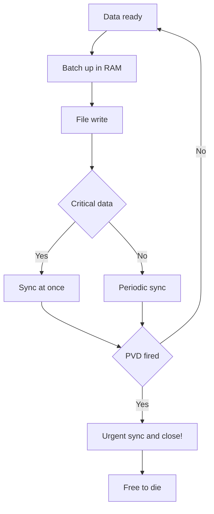

# Filesystems - LittleFS and FATFS in Practice

![[assets/img/stm32-filesystem-scheme.png|600]]
*Fig. From byte to file: buffer, sync, wear leveling.*

> [!tip] Purpose of this note
> Teach how to keep files on flash so they survive a power fault and never kill the media in a year.

## 1. Purpose

Bare Flash pages are bricks with no house. A filesystem gives names, folders and atomicity: either fully written or as if never written. LittleFS for internal and QSPI, FATFS for cards a computer reads. The choice is by media, not by taste.

## LittleFS against FATFS

| Criterion | LittleFS | FATFS |
| --- | --- | --- |
| Media | Internal Flash, QSPI | SD cards, USB sticks |
| Power fault | Tough by design | Needs careful sync! |
| Wear-leveling | Built in | None - relies on the card |
| PC reads | No, only own format | Yes, everywhere |
| RAM | Kilobytes | Tens of kilobytes |

```text
Правило:
  лог всередині виробу .... LittleFS;
  файли для людини ........ FATFS на карті.
```

## Geometry: what to know about the media

| Parameter | From where |
| --- | --- |
| Read block size | Flash datasheet |
| Write page size | 256 bytes typical |
| Erase sector size | 4 KB typical |
| Wear | Tens of thousands of cycles |

> A wrong geometry in config is silent corruption in months. Check with the datasheet!

## Mermaid: safe write



## PVD saves the last write

```c
// Переривання просідання: дописати і закритись:
void PVD_IRQHandler(void)
{
  emergency_sync_all();   // швидко, без malloc!
  close_files();
  enter_standby();        // вмерти красиво
}
```

| Rule | Explanation |
| --- | --- |
| Capacitor holds milliseconds | Enough for a batch sync |
| No malloc in the handler | Heap in an emergency is luxury |
| Sag test | Pull the power during a write! |

## Wear-leveling: how not to kill the media

| Trick | Effect |
| --- | --- |
| Write in batches | Fewer erase cycles |
| File rotation | Wear spreads out |
| No per-second writes | RAM buffer plus rare flush |
| Free space margin | 20 percent free for leveling! |

## Common issues

| # | Issue | Why it is bad | Correct way |
| --- | --- | --- | --- |
| 1 | Byte-size writes | Wear in months | Batches via a buffer! |
| 2 | No sync before sleep | Torn file | Sync always before sleep |
| 3 | Wrong geometry | Silent corruption | Flash datasheet! |
| 4 | No PVD backup | Last data lost | Emergency sync |
| 5 | FATFS with no sync at all | Card unreadable | Periodic sync |
| 6 | Media packed full | Nowhere to level wear | 20 percent margin |
| 7 | malloc in an emergency | Hang in PVD | Static only! |

## Official sources

- [LittleFS design (ARM)](https://github.com/littlefs-project/littlefs) - COW, wear-leveling, geometry.
- [FatFs module (ChaN)](http://elm-chan.org/fsw/ff/00index_e.html) - config, sync, media.

## Mount and first start

| Step | Action |
| --- | --- |
| 1 | Try to mount the existing one |
| 2 | Fail means format with geometry |
| 3 | Service files and version creation |
| 4 | Read-back check |

```c
// Логіка старту сховища:
if (mount_fs() != FS_OK) {
  format_fs();        // чиста флеш або бита
  create_defaults();  // версія, конфіг за замовчуванням
}
```

## Format version and migration

| Topic | Practice |
| --- | --- |
| Version in the root | Number that grows with firmware |
| Old version | Migrate at start, never silently! |
| Backup before migrate | Copy of old files nearby |
| Failed migration | Roll back and run read-only |

## Storage debug

| Symptom | Where to look |
| --- | --- |
| Mount falls | Geometry, flash power, QSPI frequency |
| Torn files | Sync, PVD, capacitor |
| Slow writes | Bigger batches, less sync |
| Wear in a year | Write rate, free margin |

## See also

- [[Home.en]]
- [[EN/08-Memory/01-Flash-OTP-EEPROM.en|internal memory]]
- [[EN/08-Memory/02-Zovnishni-Loadery.en|external loaders]]
- [[EN/04-Interfaces/06-SDMMC-QUADSPI.en|memory cards]]
- [[16-Projects/05-USB-Logger|data logger]]
